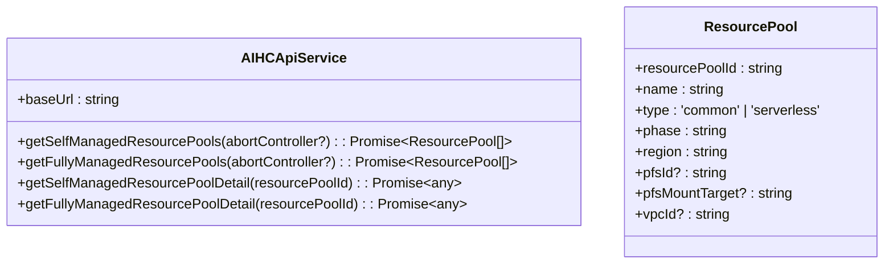
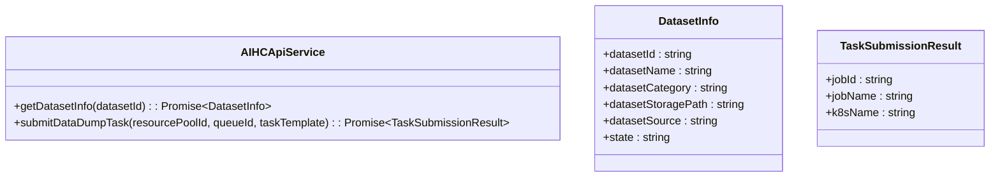
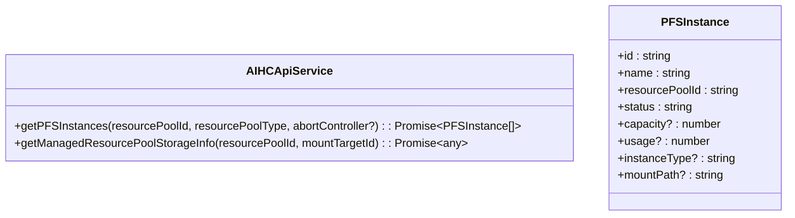

# API参考

<cite>
**Referenced Files in This Document **   
- [manifest.json](file://src/manifest.json)
- [aihcApi.ts](file://src/services/aihcApi.ts)
- [chromeApi.ts](file://src/utils/chromeApi.ts)
- [index.ts](file://src/background/index.ts)
</cite>

## 目录
1. [Chrome扩展API权限](#chrome扩展api权限)
2. [内部消息通信系统](#内部消息通信系统)
3. [百度云AIHC API封装](#百度云aihc-api封装)
4. [调用示例与错误处理](#调用示例与错误处理)

## Chrome扩展API权限

项目在`manifest.json`中声明了以下Chrome扩展API权限，这些权限允许扩展与浏览器进行交互并访问特定功能。

```json
{
  "permissions": ["storage", "activeTab", "tabs", "sidePanel", "notifications"]
}
```

- `storage`: 用于持久化存储用户配置和任务数据。通过`chrome.storage.sync`同步跨设备的凭证信息（如AK/SK），通过`chrome.storage.local`存储本地任务列表和临时数据。
- `activeTab`: 允许扩展在当前活动标签页上执行操作，如注入内容脚本或获取页面信息。
- `tabs`: 提供对浏览器标签页的控制能力，包括创建新标签页、查询标签页状态等。
- `sidePanel`: 启用侧边栏功能，允许扩展在浏览器侧边显示UI界面，提升用户体验。
- `notifications`: 支持向用户发送桌面通知，用于任务完成提醒或错误提示。

此外，`manifest.json`文件还配置了`side_panel.default_path`指向`popup/index.html`，定义了侧边栏的默认入口页面，并通过`background.service_worker`指定后台服务工作线程。

**Section sources**
- [manifest.json](file://src/manifest.json#L30-L31)

## 内部消息通信系统

扩展采用基于`chrome.runtime.sendMessage`和`chrome.runtime.onMessage`的异步消息通信机制，在不同上下文环境（如后台脚本、弹出窗口、内容脚本）之间传递数据和指令。

### 消息协议设计

消息通信遵循统一的数据格式：
```typescript
{
  action: string,        // 操作类型
  data?: any             // 附加数据
}
```

#### 主要消息类型

| 消息动作 | 发送方 | 接收方 | 数据结构 | 描述 |
|---------|--------|--------|----------|------|
| `getCredentials` | popup/content | background | 无 | 获取用户配置的API凭证 |
| `createTask` | popup | background | `{type, dataSource, priority}` | 创建新的处理任务 |
| `getTasks` | popup | background | 无 | 获取所有任务列表 |
| `cancelTask` | popup | background | `{taskId}` | 取消指定ID的任务 |
| `openSidePanel` | content | background | 无 | 请求打开侧边栏 |
| `closeSidePanel` | content | background | 无 | 请求关闭侧边栏 |
| `updateSidebarState` | background | content | `{state}` | 更新侧边栏UI状态 |
| `FILL_DATASET_FORM` | background | content | 表单数据 | 填充页面表单 |

### 通信模式

- **请求-响应模式**：大多数消息采用异步请求-响应模式，发送方调用`sendMessage`并返回`true`以启用异步响应，接收方通过`sendResponse`回调函数返回结果。
- **广播模式**：后台脚本可通过`chrome.tabs.query`获取所有标签页，然后使用`chrome.tabs.sendMessage`向多个内容脚本广播状态更新。
- **错误处理**：所有消息处理均包含异常捕获逻辑，当发生`chrome.runtime.lastError`时，会静默处理错误并返回`null`或错误信息，避免中断主流程。

**Section sources**
- [chromeApi.ts](file://src/utils/chromeApi.ts#L15-L120)
- [index.ts](file://src/background/index.ts#L78-L165)

## 百度云AIHC API封装

`aihcApi.ts`文件封装了与百度云AIHC平台交互的所有HTTP端点，提供类型安全的异步方法调用。

### 封装的API端点

#### 资源池管理



**Diagram sources **
- [aihcApi.ts](file://src/services/aihcApi.ts#L2-L20)
- [aihcApi.ts](file://src/services/aihcApi.ts#L24-L150)

- **获取自运维资源池列表**
  - HTTP方法: `GET`
  - 请求路径: `/api/aihc/aihc-service/v3/resourcepools`
  - 参数: 分页参数、排序条件、资源池类型过滤
  - 返回值: `Promise<ResourcePool[]>`，仅返回`running`状态的资源池

- **获取全托管资源池列表**
  - HTTP方法: `GET`
  - 请求路径: `/api/aihc/aihc-service/v2/serverless/resourcePool`
  - 参数: 分页参数、关键字搜索
  - 返回值: `Promise<ResourcePool[]>`，映射为统一的`ResourcePool`接口

#### 队列管理

```mermaid
classDiagram
class AIHCApiService {
+getSelfManagedQueues(resourcePoolId, abortController?) : Promise~Queue[]~
+getFullyManagedQueues(abortController?) : Promise~Queue[]~
}
class Queue {
+queueId : string
+queueName : string
+resourcePoolId : string
+phase : string
+opened : boolean
+remaining? : { cpuCores?, memoryGi?, milliCPUcores? }
}
```

**Diagram sources **
- [aihcApi.ts](file://src/services/aihcApi.ts#L152-L240)
- [aihcApi.ts](file://src/services/aihcApi.ts#L21-L31)

- **获取自运维队列列表**
  - HTTP方法: `GET`
  - 请求路径: `/api/aihc/aihc-service/v3/queues`
  - 参数: `resourcePoolId`
  - 返回值: `Promise<Queue[]>`，仅返回开启状态的队列

- **获取全托管队列列表**
  - HTTP方法: `GET`
  - 请求路径: `/api/aihc/aihc-service/v2/serverless/resourceQueue`
  - 参数: 分页参数
  - 返回值: `Promise<Queue[]>`，从嵌套的`children`数组中提取可选队列

#### 数据集与任务管理



**Diagram sources **
- [aihcApi.ts](file://src/services/aihcApi.ts#L242-L320)
- [aihcApi.ts](file://src/services/aihcApi.ts#L32-L41)
- [aihcApi.ts](file://src/services/aihcApi.ts#L43-L49)

- **获取数据集信息**
  - HTTP方法: `GET`
  - 请求路径: `/api/aihc/data/v1/dataset/{datasetId}`
  - 参数: `datasetId`
  - 返回值: `Promise<DatasetInfo>`，包含数据集的基本元信息

- **提交数据转储任务**
  - HTTP方法: `POST`
  - 请求路径: `/api/cce/ai-service/v1/cluster/{clusterId}/aijobv3`
  - 参数: `resourcePoolId`, `queueId`, `taskTemplate`（JSON对象）
  - 返回值: `Promise<TaskSubmissionResult>`，包含作业ID等结果信息

#### 存储实例管理



**Diagram sources **
- [aihcApi.ts](file://src/services/aihcApi.ts#L322-L480)
- [aihcApi.ts](file://src/services/aihcApi.ts#L51-L58)

- **获取PFS实例列表**
  - 实现逻辑: 根据资源池类型（自运维/全托管）采用不同的API调用策略
  - 自运维: 从资源池详情中提取`bindingStorages`
  - 全托管: 先获取`pfsMountTarget`，再调用专用存储信息接口
  - 返回值: `Promise<PFSInstance[]>`，仅返回运行中的实例

## 调用示例与错误处理

### 调用示例

```typescript
// 初始化API服务
const api = aihcApiService;

// 获取所有可用资源池
try {
  const pools = await api.getSelfManagedResourcePools();
  console.log('可用资源池:', pools);
} catch (error) {
  if (error.message === 'REQUEST_CANCELLED') {
    console.log('请求被取消');
  } else {
    console.error('获取资源池失败:', error);
  }
}

// 提交数据转储任务
const taskTemplate = {
  /* 构建任务模板 */
};
try {
  const result = await api.submitDataDumpTask(
    'pool-123',
    'queue-456',
    taskTemplate
  );
  console.log('任务提交成功:', result);
} catch (error) {
  console.error('任务提交失败:', error);
}
```

### 错误处理建议

1. **网络请求取消**：所有支持`AbortController`的方法都应正确处理`AbortError`，抛出自定义`REQUEST_CANCELLED`错误以便调用方区分正常失败和主动取消。
2. **API响应验证**：检查`response.ok`和业务层`success`字段，确保双重验证。
3. **静默降级**：对于非关键性错误（如`chrome.runtime.lastError`），采用静默处理策略，避免污染控制台日志。
4. **网络连接检测**：捕获`TypeError`类型的fetch错误，提示用户检查网络连接。
5. **超时处理**：虽然代码未显式实现，但建议在实际使用中为所有API调用添加超时机制，防止长时间挂起。

**Section sources**
- [aihcApi.ts](file://src/services/aihcApi.ts#L24-L480)