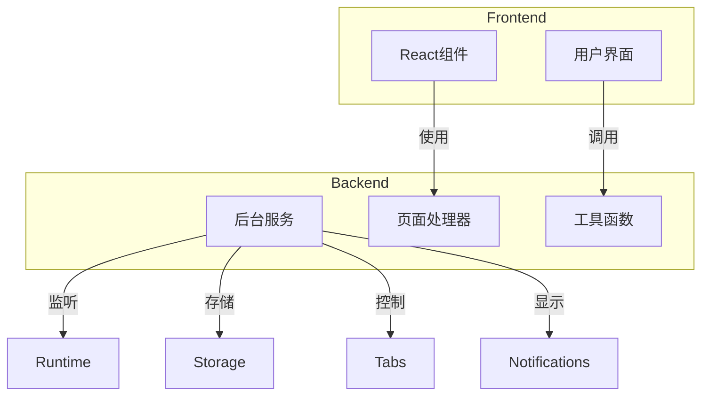
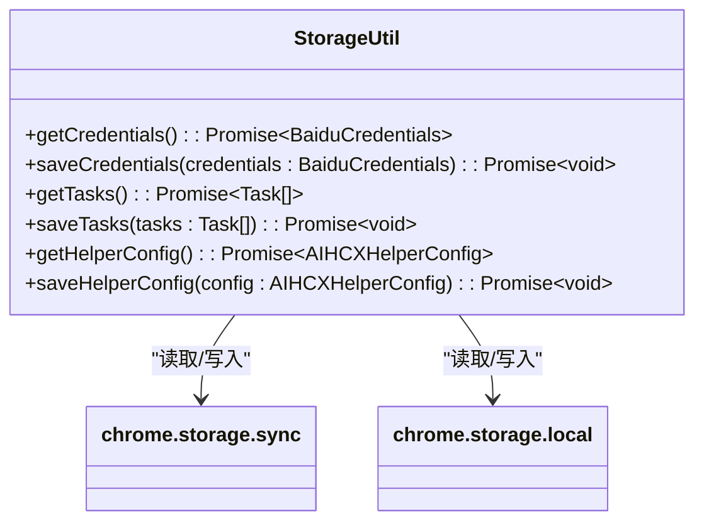
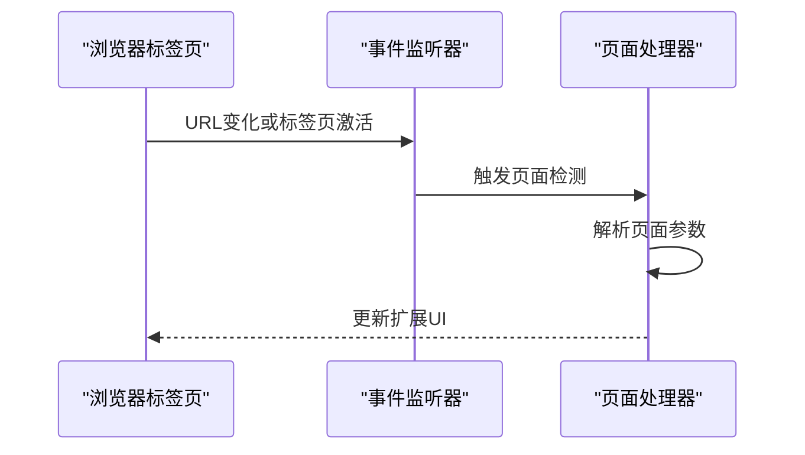
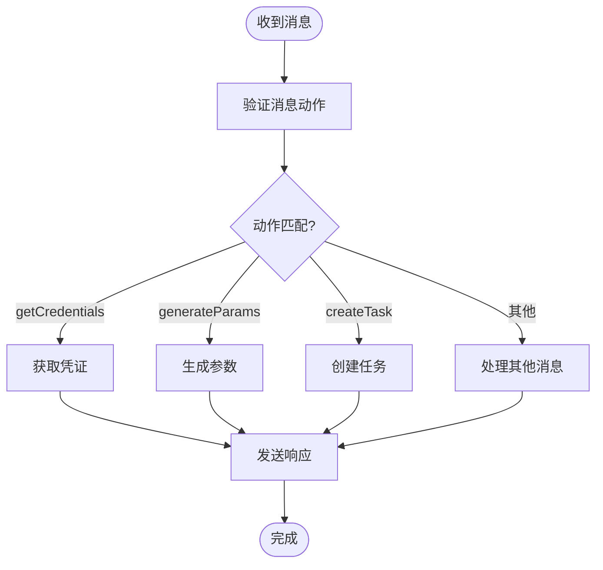
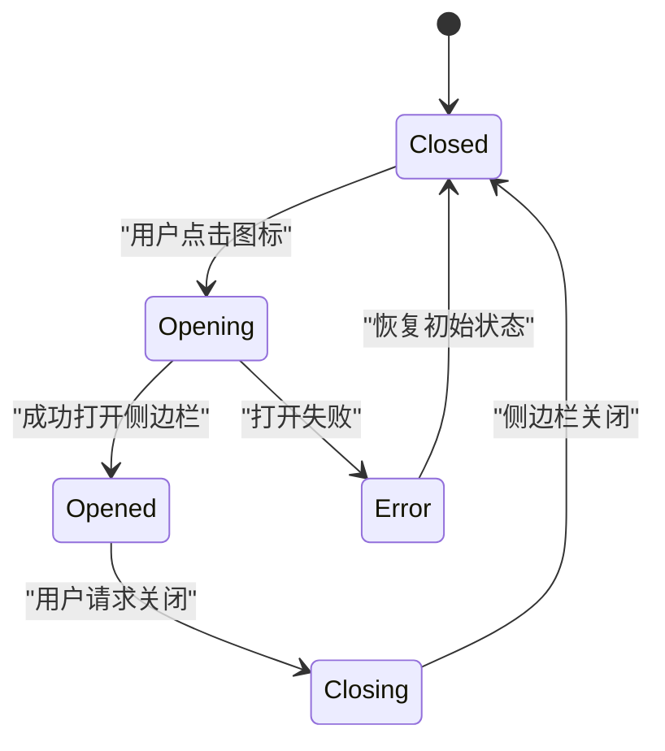

# Chrome扩展API权限

<cite>
**Referenced Files in This Document **  
- [manifest.json](file://src/manifest.json)
- [index.ts](file://src/background/index.ts)
- [chromeApi.ts](file://src/utils/chromeApi.ts)
- [PopupContainer.tsx](file://src/components/PopupContainer.tsx)
- [PageHandlerManager.ts](file://src/handlers/PageHandlerManager.ts)
- [BaseHandler.ts](file://src/handlers/BaseHandler.ts)
</cite>

## 目录
1. [简介](#简介)
2. [项目结构分析](#项目结构分析)
3. [核心权限详解](#核心权限详解)
4. [权限使用示例与最佳实践](#权限使用示例与最佳实践)
5. [安全考虑](#安全考虑)
6. [结论](#结论)

## 简介

本文档详细说明了AIHC助手Chrome扩展在`manifest.json`中声明的全部API权限，包括`storage`、`tabs`、`runtime`、`sidePanel`、`notifications`和`activeTab`。这些权限是扩展实现其核心功能的基础，如侧边栏集成、配置持久化和页面上下文管理。通过深入分析源代码，本文档将解释每个权限的具体用途，并提供实际使用示例和最佳实践建议。

## 项目结构分析

该项目是一个基于TypeScript构建的Chrome扩展，采用模块化设计，主要分为以下几个部分：

- `background`: 包含后台服务工作线程，处理消息监听和长期运行的任务。
- `components`: React组件集合，用于构建用户界面。
- `content`: 内容脚本，注入到目标网页中执行。
- `handlers`: 页面处理器，负责解析不同页面的数据。
- `options`: 扩展选项页面。
- `popup`: 弹出窗口界面。
- `services`: 业务逻辑服务。
- `utils`: 工具函数和API包装器。

这种清晰的分层架构有助于维护和扩展，同时也明确了各部分对Chrome API的依赖关系。

**Diagram sources **
- [manifest.json](file://src/manifest.json)
- [index.ts](file://src/background/index.ts)

**Section sources**
- [manifest.json](file://src/manifest.json)
- [project_structure](file://.)

## 核心权限详解

### storage权限

`storage`权限允许扩展使用`chrome.storage` API来持久化保存数据。该权限分为`sync`和`local`两种类型，分别对应同步存储和本地存储。

在本项目中，`storage`权限被广泛用于保存用户凭证、任务列表和辅助配置等重要信息。例如，在`background/index.ts`中，扩展初始化时会设置默认的辅助配置；而在`utils/chromeApi.ts`中，则提供了对`chrome.storage` API的封装，简化了数据读写操作。

**Diagram sources **
- [chromeApi.ts](file://src/utils/chromeApi.ts#L0-L31)
- [index.ts](file://src/background/index.ts#L408-L471)

**Section sources**
- [chromeApi.ts](file://src/utils/chromeApi.ts)
- [index.ts](file://src/background/index.ts)

### tabs权限

`tabs`权限使扩展能够获取标签页信息、创建新标签页以及监听标签页事件。这对于需要与当前浏览上下文交互的功能至关重要。

在AIHC助手中，`tabs`权限主要用于检测当前活动标签页的变化，以便及时更新扩展的状态。`PopupContainer.tsx`中的`detectAndUpdatePage`函数利用`chrome.tabs.onUpdated`和`chrome.tabs.onActivated`事件监听器来监控页面切换和URL变更，确保扩展能正确响应用户的操作。

**Diagram sources **
- [PopupContainer.tsx](file://src/components/PopupContainer.tsx#L398-L458)
- [pageDetection.ts](file://src/utils/pageDetection.ts)

**Section sources**
- [PopupContainer.tsx](file://src/components/PopupContainer.tsx)
- [pageDetection.ts](file://src/utils/pageDetection.ts)

### runtime权限

`runtime`权限提供了对扩展生命周期的控制能力，包括发送消息、打开选项页面和管理扩展本身。它是连接扩展各个部分的桥梁。

本项目充分利用了`runtime`权限的消息传递机制。`background/index.ts`中的`chrome.runtime.onMessage.addListener`监听来自弹出窗口和内容脚本的消息，并根据消息类型执行相应操作，如获取凭证、生成参数或创建任务。此外，还实现了打开侧边栏和更新侧边栏状态等功能。

**Diagram sources **
- [index.ts](file://src/background/index.ts#L60-L150)
- [chromeApi.ts](file://src/utils/chromeApi.ts#L33-L47)

**Section sources**
- [index.ts](file://src/background/index.ts)
- [chromeApi.ts](file://src/utils/chromeApi.ts)

### sidePanel权限

`sidePanel`权限允许扩展在浏览器侧边栏中显示内容，为用户提供便捷的访问入口。这是现代Chrome扩展推荐的UI展示方式之一。

AIHC助手通过`manifest.json`中的`side_panel`字段指定了侧边栏的默认路径，并在`background/index.ts`中注册了图标点击事件处理器。当用户点击扩展图标时，会调用`chrome.sidePanel.open`方法打开侧边栏，提供一个独立于当前网页的工作空间。

**Diagram sources **
- [manifest.json](file://src/manifest.json)
- [index.ts](file://src/background/index.ts#L20-L35)

**Section sources**
- [manifest.json](file://src/manifest.json)
- [index.ts](file://src/background/index.ts)

### notifications权限

`notifications`权限允许扩展向用户显示桌面通知，即使浏览器不在前台也能传达重要信息。

虽然在提供的代码片段中没有直接看到通知的实现，但考虑到扩展可能需要提醒用户任务完成或出现错误，这一权限为未来的功能扩展预留了可能性。开发者可以结合`chrome.notifications.create` API，在适当的时候向用户推送通知。

### activeTab权限

`activeTab`权限是一种更安全的替代方案，相比广泛的`<all_urls>`权限，它只在用户明确与扩展交互时授予对当前活动标签页的有限访问权。

在AIHC助手中，`activeTab`权限配合`content_scripts`的`matches`规则，确保只有在百度智能云控制台页面（`console.bce.baidu.com`）才会注入内容脚本。这既保证了功能的正常运作，又最大限度地减少了对用户隐私的影响。

## 权限使用示例与最佳实践

### 最小权限原则

遵循最小权限原则是Chrome扩展开发的最佳实践。AIHC助手仅申请了实现功能所必需的权限，避免过度索取。例如，使用`activeTab`而非`tabs`配合`<all_urls>`，有效限制了对非相关页面的访问。

### 权限与功能映射

建立清晰的权限与功能映射关系有助于理解和维护代码。下表总结了各权限的主要用途：

| 权限 | 主要用途 | 关键文件 |
| --- | --- | --- |
| storage | 配置持久化、任务管理 | chromeApi.ts, index.ts |
| tabs | 页面上下文感知、动态更新 | PopupContainer.tsx, pageDetection.ts |
| runtime | 跨组件通信、生命周期管理 | index.ts, chromeApi.ts |
| sidePanel | 提供独立UI空间 | manifest.json, index.ts |
| notifications | 用户提醒（预留） | - |
| activeTab | 安全的内容脚本注入 | manifest.json, content/index.js |

### 错误处理与用户体验

良好的错误处理机制对于提升用户体验至关重要。在调用Chrome API时，应始终检查`chrome.runtime.lastError`并妥善处理异常情况。例如，在尝试打开侧边栏失败时，不仅要在控制台记录错误，还应向用户反馈具体原因。

## 安全考虑

### 数据保护

由于扩展涉及存储用户的AK/SK凭证，必须采取严格的安全措施。建议使用`chrome.storage.sync`进行加密存储，并定期提醒用户检查账户安全。同时，避免在日志中输出敏感信息。

### 权限审查

定期审查manifest中声明的权限，移除不再使用的权限。对于新增权限，需经过充分的风险评估，并在发布说明中向用户解释变更原因。

### 沙箱环境

尽可能将不可信的内容放入沙箱环境中执行，减少潜在的安全威胁。对于从网络加载的资源，应实施严格的CSP策略。

## 结论

AIHC助手Chrome扩展合理地使用了多种API权限来实现其丰富的功能。通过对`storage`、`tabs`、`runtime`、`sidePanel`、`notifications`和`activeTab`权限的深入分析，我们了解了它们如何协同工作以提供无缝的用户体验。遵循最小权限原则、建立清晰的权限映射关系以及实施健全的安全措施，是开发高质量Chrome扩展的关键。未来可进一步探索`notifications`权限的实际应用，增强用户互动性。