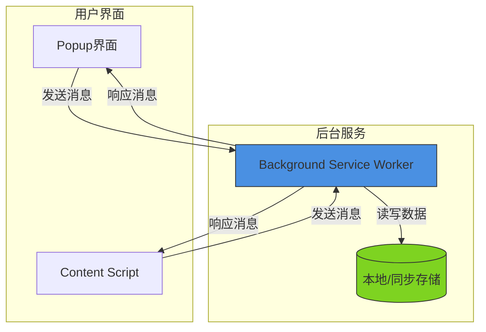
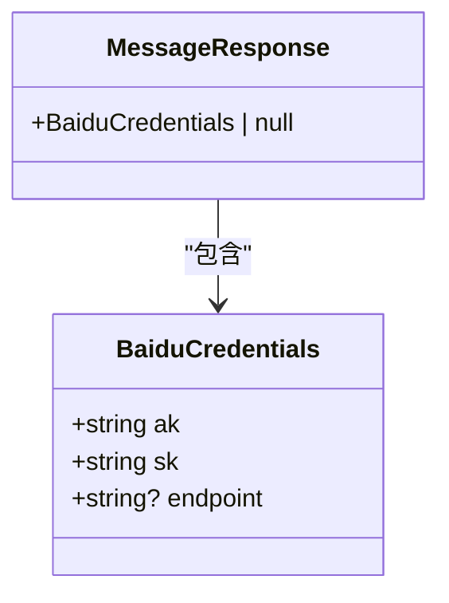
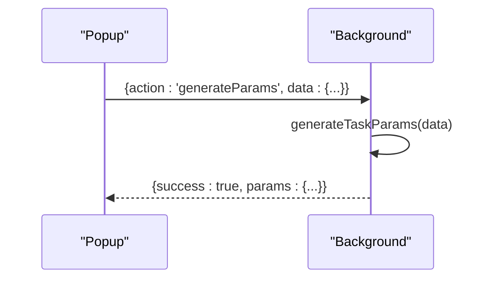
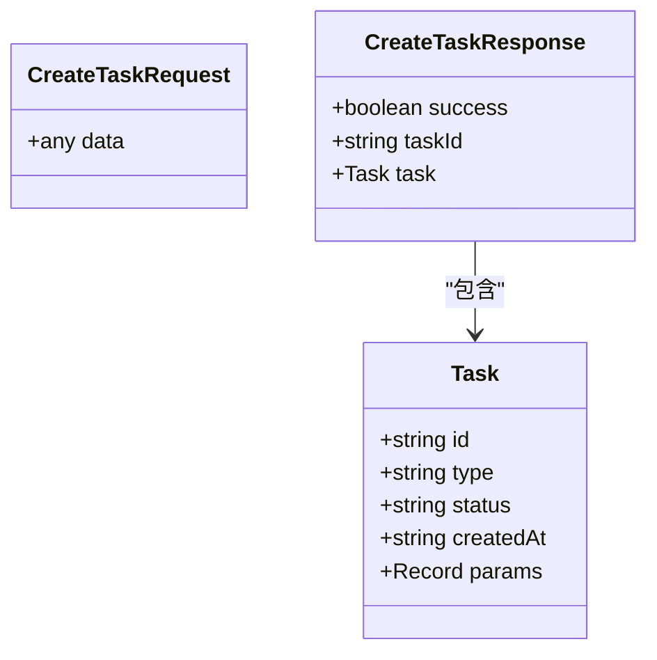
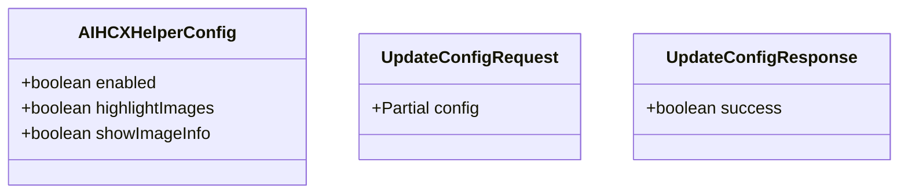
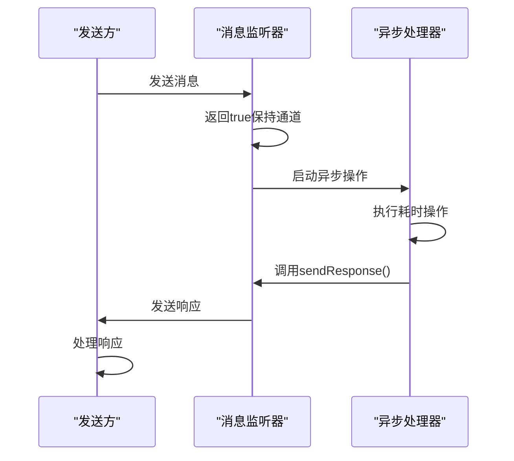
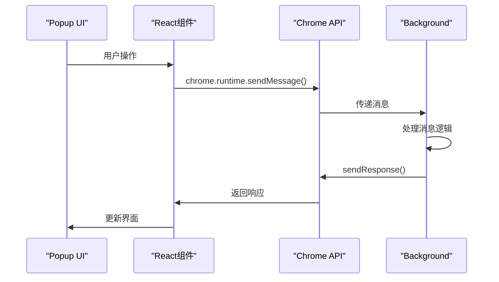
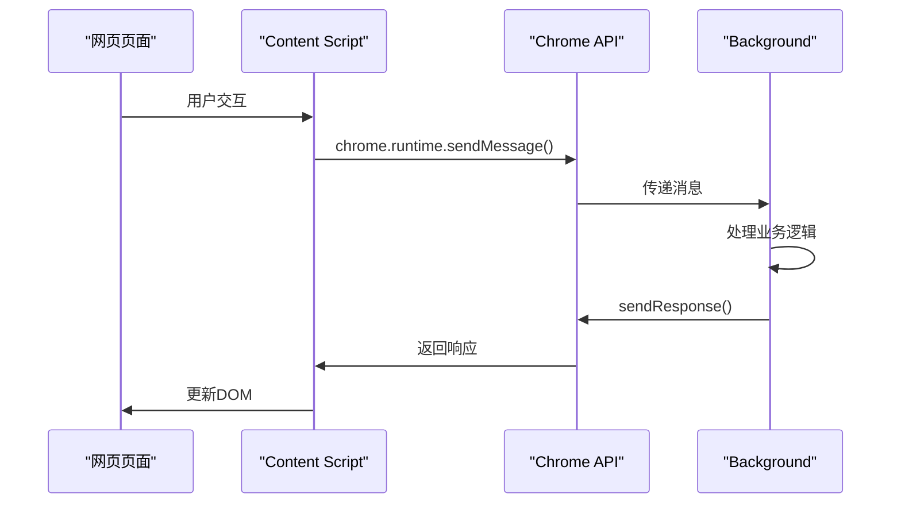
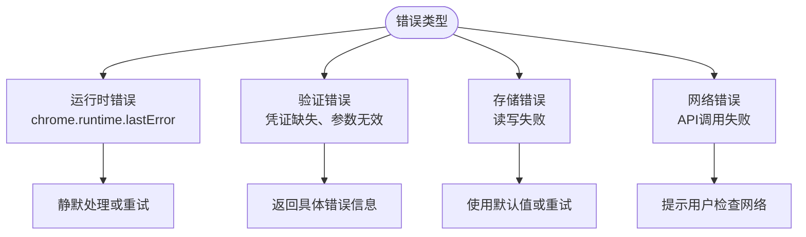
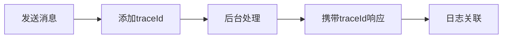

# 内部消息通信系统

<cite>
**本文档引用的文件**
- [index.ts](file://src/background/index.ts)
- [index.ts](file://src/content/index.ts)
- [chromeApi.ts](file://src/utils/chromeApi.ts)
</cite>

## 目录
1. [简介](#简介)
2. [消息通信架构](#消息通信架构)
3. [核心消息类型分析](#核心消息类型分析)
4. [异步响应机制原理](#异步响应机制原理)
5. [消息流转过程](#消息流转过程)
6. [错误处理策略](#错误处理策略)
7. [调试技巧](#调试技巧)
8. [总结](#总结)

## 简介
AIHCX扩展采用基于Chrome运行时的消息传递系统，实现popup、content script和background service worker之间的跨上下文通信。本系统通过`chrome.runtime.onMessage`监听器处理各类操作请求，支持从凭证获取到任务创建等多种功能。

**Section sources**
- [index.ts](file://src/background/index.ts#L1-L50)

## 消息通信架构
系统采用中心化消息路由模式，background service worker作为消息中枢，接收来自不同上下文的消息并分发处理。



**Diagram sources**
- [index.ts](file://src/background/index.ts#L67-L207)
- [index.ts](file://src/content/index.ts#L534-L559)

**Section sources**
- [index.ts](file://src/background/index.ts#L67-L207)

## 核心消息类型分析
### 凭证管理消息
处理API凭证的获取与验证操作。

**getCredentials消息**
- **Action类型**: getCredentials
- **发送方**: popup, content script
- **接收方**: background
- **数据结构**: 无参数
- **响应格式**: BaiduCredentials对象或null



**Section sources**
- [index.ts](file://src/background/index.ts#L283-L297)
- [chromeApi.ts](file://src/utils/chromeApi.ts#L76-L86)

### 任务参数生成消息
处理任务参数的生成与预处理。

**generateParams消息**
- **Action类型**: generateParams
- **发送方**: popup
- **接收方**: background
- **数据结构**: { data: any }
- **响应格式**: { success: boolean, params: any }



**Section sources**
- [index.ts](file://src/background/index.ts#L398-L406)

### 任务创建消息
处理新任务的创建与持久化。

**createTask消息**
- **Action类型**: createTask
- **发送方**: popup, content script
- **接收方**: background
- **数据结构**: { data: TaskData }
- **响应格式**: { success: boolean, taskId: string, task: Task }



**Section sources**
- [index.ts](file://src/background/index.ts#L409-L452)

### 辅助配置消息
处理用户辅助功能配置的读写操作。

**updateHelperConfig消息**
- **Action类型**: updateHelperConfig
- **发送方**: popup
- **接收方**: background
- **数据结构**: { config: Partial<AIHCXHelperConfig> }
- **响应格式**: { success: boolean }



**Section sources**
- [index.ts](file://src/background/index.ts#L322-L333)

## 异步响应机制原理
系统采用异步消息响应模式，通过返回`true`指示需要异步响应，确保长时间运行的操作能够正确返回结果。

### 实现原理
当消息监听器返回`true`时，Chrome会保持消息通道开放，允许在异步操作完成后调用`sendResponse`回调函数。



### 关键代码模式
```typescript
chrome.runtime.onMessage.addListener((message, _sender, sendResponse) => {
  if (message.action === 'asyncOperation') {
    asyncOperation().then(sendResponse);
    return true; // 指示异步响应
  }
});
```

**Section sources**
- [index.ts](file://src/background/index.ts#L67-L207)

## 消息流转过程
### 从Popup到Background
展示popup界面发起消息请求的完整流程。



**Section sources**
- [index.ts](file://src/background/index.ts#L67-L207)

### 从Content Script到Background
展示内容脚本与后台服务的交互流程。



**Section sources**
- [index.ts](file://src/content/index.ts#L534-L559)

## 错误处理策略
系统采用多层次错误处理机制，确保消息通信的可靠性。

### 错误分类


### 错误响应格式
统一的错误响应结构便于前端处理：

```json
{
  "success": false,
  "error": "错误描述信息"
}
```

**Section sources**
- [index.ts](file://src/background/index.ts#L409-L452)
- [index.ts](file://src/background/index.ts#L474-L512)

## 调试技巧
### 日志记录
在关键位置添加详细的日志输出：

```typescript
console.log('收到消息:', message);
console.error('处理失败:', error);
```

### 消息追踪
为每条消息添加唯一标识便于追踪：



### 开发者工具使用
1. 打开Chrome扩展管理页面
2. 查看background service worker的控制台
3. 监控runtime消息传递
4. 检查存储数据变化

**Section sources**
- [index.ts](file://src/background/index.ts#L67-L207)
- [index.ts](file://src/content/index.ts#L534-L559)

## 总结
AIHCX扩展的消息通信系统采用标准化的请求-响应模式，通过background service worker集中处理各类操作。系统支持异步响应机制，能够处理耗时操作，并提供了完善的错误处理和调试支持。

**Section sources**
- [index.ts](file://src/background/index.ts#L1-L513)
- [index.ts](file://src/content/index.ts#L1-L938)