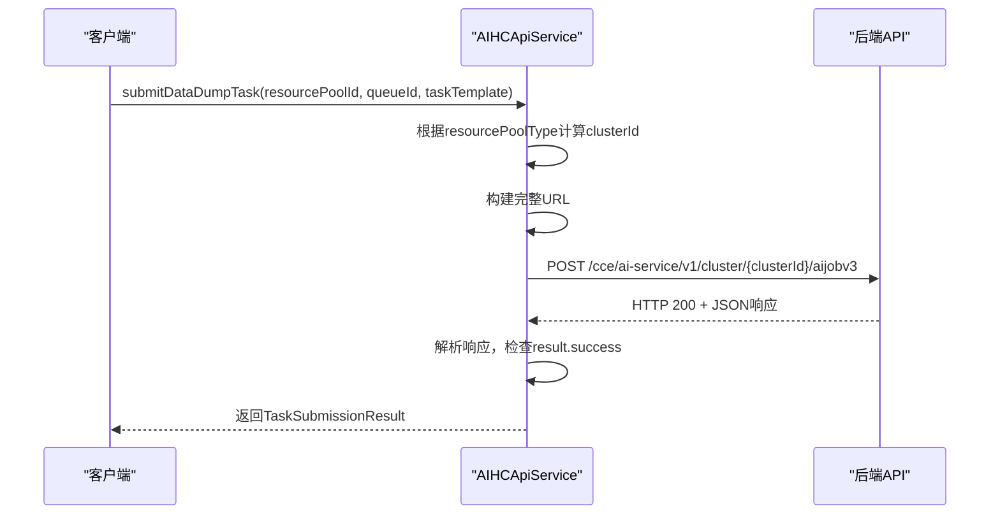
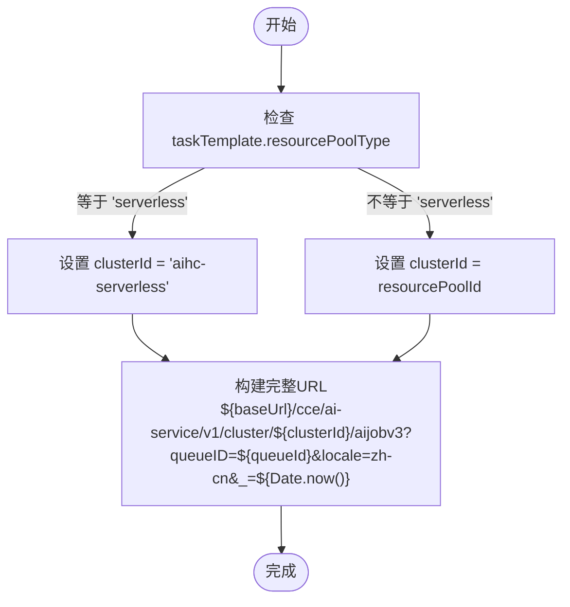

<cite>
**本文档中引用的文件**
- [aihcApi.ts](file://src/services/aihcApi.ts)
- [index.ts](file://src/types/index.ts)
- [PopupContainer.tsx](file://src/components/PopupContainer.tsx)
- [DataDumpForm.tsx](file://src/components/DataDumpForm.tsx)
</cite>

## 目录
1. [任务提交API](#任务提交api)
2. [submitDataDumpTask方法工作机制](#submitdatadumptask方法工作机制)
3. [请求URL动态生成逻辑](#请求url动态生成逻辑)
4. [请求头与请求体结构](#请求头与请求体结构)
5. [返回对象字段说明](#返回对象字段说明)
6. [后端服务路由机制](#后端服务路由机制)
7. [典型taskTemplate JSON示例](#典型tasktemplate-json示例)
8. [常见提交失败原因及排查](#常见提交失败原因及排查)

## 任务提交API

本技术文档深入解析`submitDataDumpTask`方法的工作机制，涵盖其POST请求的目标URL动态生成逻辑、必要的请求头设置、`taskTemplate`请求体的结构要求，以及`TaskSubmissionResult`返回对象的详细说明。同时分析了基于`resourcePoolType`的后端服务路由机制和跨集群调度的处理方式，并提供了典型的`taskTemplate` JSON配置示例。

**Section sources**
- [aihcApi.ts](file://src/services/aihcApi.ts#L290-L326)
- [index.ts](file://src/types/index.ts#L84-L133)

## submitDataDumpTask方法工作机制

`submitDataDumpTask`是负责向AIHC平台提交数据转储任务的核心异步方法。该方法封装了完整的HTTP通信逻辑，通过POST请求将任务定义发送至后端API。其主要工作流程包括：根据资源池类型确定目标集群ID、构建完整的API URL、设置标准的JSON请求头、序列化任务模板并发送请求。在接收到响应后，方法会进行状态码和业务成功标志的双重校验，确保只有成功的响应才会被解析并返回结果。若请求过程中发生任何网络或业务错误，该方法会捕获异常并将其重新抛出，以便上层调用者进行错误处理。



**Diagram sources**
- [aihcApi.ts](file://src/services/aihcApi.ts#L290-L326)

**Section sources**
- [aihcApi.ts](file://src/services/aihcApi.ts#L290-L326)

## 请求URL动态生成逻辑

`submitDataDumpTask`方法的关键特性之一是其能够根据`serverless`类型的判断来动态生成目标URL。该逻辑通过检查传入的`taskTemplate`对象中的`resourcePoolType`字段来实现：

*   **全托管（Serverless）资源池**: 当`taskTemplate.resourcePoolType`的值为`'serverless'`时，`clusterId`会被硬编码为`'aihc-serverless'`。
*   **自运维（Normal）资源池**: 对于非`serverless`类型的资源池，`clusterId`直接使用传入的`resourcePoolId`参数。

最终的API URL由基础URL、固定的路径`/cce/ai-service/v1/cluster/`、动态生成的`clusterId`、后续的API端点`/aijobv3`以及包含`queueID`和时间戳的查询参数共同构成。这种设计实现了对不同部署模式（自运维 vs 全托管）的统一API接口访问。



**Diagram sources**
- [aihcApi.ts](file://src/services/aihcApi.ts#L292-L295)

**Section sources**
- [aihcApi.ts](file://src/services/aihcApi.ts#L292-L295)

## 请求头与请求体结构

### 请求头 (Headers)
提交任务的POST请求必须包含以下请求头：
*   `Content-Type: application/json`: 明确指定请求体为JSON格式，这是后端API正确解析数据所必需的。

### 请求体 (Body) - taskTemplate 结构
请求体是一个符合`DataDumpTaskTemplate`接口的复杂JSON对象。其核心结构如下表所示：

| 字段 | 类型 | 必需 | 描述 |
| :--- | :--- | :--- | :--- |
| `name` | string | 是 | 任务的唯一名称，通常由前缀和时间戳组成。 |
| `queue` | string | 是 | 指定任务提交到的队列ID。 |
| `resourcePoolType` | string | 是 | 资源池类型，决定路由，取值为`normal`或`serverless`。 |
| `jobFramework` | string | 是 | 作业框架，对于数据转储任务通常为`pytorch`。 |
| `command` | string | 是 | 任务执行的Shell命令。 |
| `pfsId` | string | 是 | PFS存储实例的ID，用于挂载存储。 |
| `vpcId` | string | 是 | VPC网络的ID。 |
| `priority` | string | 否 | 任务优先级，如`normal`。 |
| `datasource` | array | 否 | 数据源数组，定义挂载卷。 |
| `jobSpec` | object | 否 | 详细的作业规格，包含镜像、资源等。 |

**Section sources**
- [index.ts](file://src/types/index.ts#L84-L133)
- [aihcApi.ts](file://src/services/aihcApi.ts#L290-L326)

## 返回对象字段说明

`submitDataDumpTask`方法成功执行后，会返回一个`TaskSubmissionResult`对象，该对象包含三个关键字段，用于标识和追踪已提交的任务：

*   **`jobId`**: 这是任务在AIHC系统中的全局唯一标识符。它是最重要的字段，可用于后续查询任务状态、日志或进行其他管理操作。
*   **`jobName`**: 与请求体中`taskTemplate.name`字段对应的用户可读的任务名称。它通常遵循特定的命名约定（如`data-dump-{resourcePoolId}-{timestamp}`），便于在控制台中识别。
*   **`k8sName`**: 该任务在底层Kubernetes集群中的实际Pod或Job资源的名称。此名称由系统生成，主要用于与Kubernetes原生工具进行交互或在更深层次进行故障排查。

这三个字段共同构成了任务的“身份证明”，其中`jobId`是外部系统集成的主要引用键。

```mermaid
classDiagram
class TaskSubmissionResult {
+string jobId
+string jobName
+string k8sName
}
note right of TaskSubmissionResult
表示成功提交数据转储任务后的返回结果。
包含用于追踪和管理任务的关键标识符。
end note
```

**Diagram sources**
- [aihcApi.ts](file://src/services/aihcApi.ts#L45-L49)

**Section sources**
- [aihcApi.ts](file://src/services/aihcApi.ts#L45-L49)

## 后端服务路由机制

内部的路由机制完全依赖于`resourcePoolType`字段的值。当`submitDataDumpTask`方法被调用时，它会立即检查`taskTemplate.resourcePoolType`：

1.  **全托管（Serverless）场景**: 如果值为`'serverless'`，则无论传入的`resourcePoolId`是什么，都会将`clusterId`设置为`'aihc-serverless'`。这意味着所有全托管任务都会被定向到一个名为`aihc-serverless`的、专门处理无服务器工作负载的逻辑集群。这简化了跨多个物理集群的调度复杂性，对用户透明。
2.  **自运维（Normal）场景**: 如果值不为`'serverless'`（即`'normal'`），则`clusterId`直接使用`resourcePoolId`。这表示任务将被精确地提交到用户所选择的具体自运维资源池所对应的Kubernetes集群中。

这种基于`resourcePoolType`的简单而有效的路由策略，使得前端可以使用同一个API方法来处理两种截然不同的后端架构，极大地提升了代码的复用性和系统的可维护性。

**Section sources**
- [aihcApi.ts](file://src/services/aihcApi.ts#L292-L295)

## 典型taskTemplate JSON示例

以下是一个完整的`taskTemplate` JSON示例，涵盖了计算资源配置、镜像设置和挂载卷等关键参数：

```json
{
  "tensorboard": {
    "enable": false,
    "logPath": "",
    "serviceType": "LoadBalancer"
  },
  "autoCreatePVC": true,
  "priority": "normal",
  "isCustomDelete": false,
  "retentionPeriod": "",
  "retentionUnit": "d",
  "isPolicy": false,
  "cpromId": "",
  "selectedRowKeys": [],
  "pfsId": "pfs-abc123",
  "imageType": "ccr",
  "runningTimeoutStopTimeUnit": "0d",
  "visibleScope": 1,
  "resourcePoolType": "normal",
  "jobFramework": "pytorch",
  "name": "data-dump-pool-xyz-1712345678",
  "command": "echo \"开始数据转储...\" && sleep 30 && echo \"转储完成\"",
  "enabledHangDetection": false,
  "unconditionalFaultToleranceLimit": 0,
  "enableReplace": false,
  "queue": "queue-def456",
  "vpcId": "vpc-f0pp0jbzip3c",
  "datasource": [
    {
      "type": "emptydir",
      "name": "devshm",
      "mountPath": "/dev/shm",
      "options": {}
    },
    {
      "type": "pfs",
      "name": "pfs-abc123",
      "sourcePath": "/dataset/data",
      "mountPath": "/mnt/dataset",
      "options": {}
    }
  ],
  "jobSpec": {
    "Master": {
      "image": "registry.baidubce.com/cce-ai-native/pytorch",
      "tag": "2.0-cuda11.7",
      "replicas": 1,
      "env": {
        "ENV_VAR_1": "value1"
      },
      "resource": {
        "cpu": 4,
        "memory": 16,
        "nvidia.com/gpu": 1
      },
      "restartPolicy": "Never"
    }
  },
  "faultTolerance": false,
  "jobDistributed": false,
  "labels": {},
  "annotations": {},
  "workloadType": "single"
}
```

**Section sources**
- [DataDumpForm.tsx](file://src/components/DataDumpForm.tsx#L326-L366)
- [index.ts](file://src/types/index.ts#L84-L133)

## 常见提交失败原因及排查

### 常见失败原因
1.  **配额不足**: 所选队列没有足够的CPU、内存或GPU资源来满足`taskTemplate`中声明的需求。
2.  **参数校验错误**: `taskTemplate`中存在缺失的必填字段（如`name`, `queue`）、无效的字段值（如不存在的`pfsId`）或格式错误的JSON。
3.  **网络或认证问题**: API请求因网络中断而失败，或用户的凭证已过期。
4.  **资源池/队列不可用**: 指定的`resourcePoolId`或`queueId`不存在，或其状态不是`running`/`ready`。
5.  **权限不足**: 当前用户没有在指定资源池和队列上创建任务的权限。

### 排查步骤
1.  **检查返回的错误信息**: 首先查看API响应中的具体错误消息，它通常会明确指出问题所在（如`"配额不足"`或`"参数校验失败"`）。
2.  **验证输入参数**: 确认`resourcePoolId`、`queueId`、`pfsId`等ID是否正确且有效。检查`taskTemplate`的JSON结构是否完整。
3.  **确认资源可用性**: 登录控制台，检查目标资源池和队列的状态是否为`running`，并查看其剩余配额。
4.  **审查任务模板**: 对照`DataDumpTaskTemplate`接口定义，逐项检查`taskTemplate`中的每个字段。
5.  **重试与联系支持