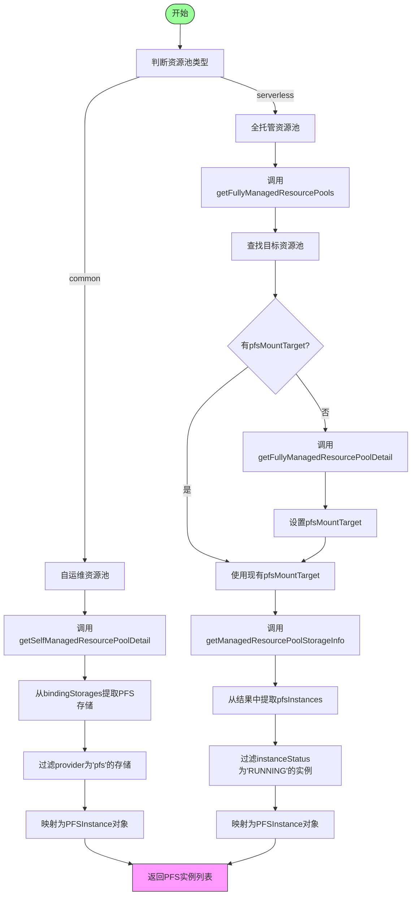
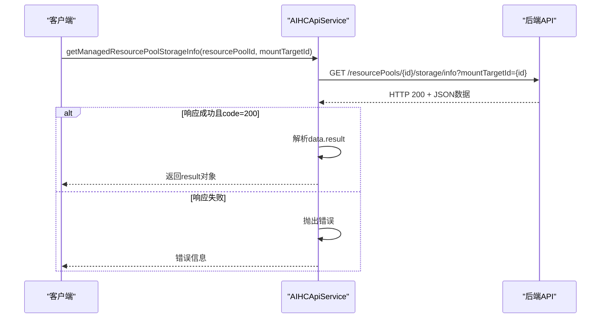
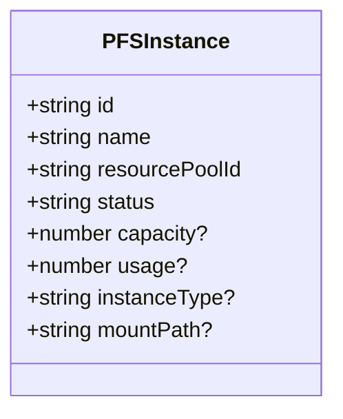

# 存储系统API

<cite>
**本文档引用的文件**
- [aihcApi.ts](file://src/services/aihcApi.ts)
</cite>

## 目录
1. [简介](#简介)
2. [核心方法分析](#核心方法分析)
3. [PFS实例模型](#pfs实例模型)
4. [错误处理与调试](#错误处理与调试)

## 简介
本文档详细说明了存储系统集成API中的两个关键方法：`getPFSInstances`和`getManagedResourcePoolStorageInfo`。这些方法提供了一个统一的接口，用于获取不同类型资源池（自运维/common和全托管/serverless）的PFS（Parallel File System）实例列表。文档将深入解析其内部逻辑、数据模型和错误处理机制。

## 核心方法分析

### getPFSInstances 方法
该方法是获取PFS实例的核心入口，根据资源池类型采用不同的实现路径。

**Diagram sources**
- [aihcApi.ts](file://src/services/aihcApi.ts#L429-L554)

**Section sources**
- [aihcApi.ts](file://src/services/aihcApi.ts#L429-L554)

#### 自运维资源池 (common) 逻辑
当资源池类型为`common`时，方法直接通过`getSelfManagedResourcePoolDetail` API 获取资源池详情，并从 `bindingStorages` 字段中解析出PFS实例信息：
1. 调用 `getSelfManagedResourcePoolDetail(resourcePoolId)` 获取资源池详情。
2. 检查资源池状态是否为 `running`。
3. 从 `bindingStorages` 数组中筛选出 `provider` 为 `'pfs'` 的存储项。
4. 将每个匹配的存储项映射为一个 `PFSInstance` 对象。

#### 全托管资源池 (serverless) 逻辑
当资源池类型为`serverless`时，流程更为复杂，需要级联调用多个API：
1. **获取挂载目标 (Mount Target)**:
   - 首先调用 `getFullyManagedResourcePools()` 列表API，尝试从中获取 `pfsMountTarget`。
   - 如果列表API未返回 `pfsMountTarget`，则回退到调用 `getFullyManagedResourcePoolDetail(resourcePoolId)` 详情API进行获取。
2. **获取存储信息**:
   - 使用上一步获得的 `pfsMountTarget` ID，调用 `getManagedResourcePoolStorageInfo(resourcePoolId, pfsMountTarget)` 专用API。
3. **提取并处理PFS实例**:
   - 从API响应的 `result.pfsInstances` 数组中提取原始实例列表。
   - 过滤掉非 `RUNNING` 状态的实例。
   - 将每个实例映射为标准的 `PFSInstance` 对象。

**Section sources**
- [aihcApi.ts](file://src/services/aihcApi.ts#L429-L554)

### getManagedResourcePoolStorageInfo 方法
此方法是专为全托管资源池设计的，用于获取包含PFS实例在内的详细存储信息。

**Diagram sources**
- [aihcApi.ts](file://src/services/aihcApi.ts#L387-L426)

**Section sources**
- [aihcApi.ts](file://src/services/aihcApi.ts#L387-L426)

该方法构造特定的URL并发起HTTP请求，其主要职责包括：
- 构造带有 `resourcePoolId` 和 `mountTargetId` 参数的API请求。
- 处理HTTP响应，检查 `response.ok` 状态。
- 解析JSON响应体，验证业务层面的 `code` 是否为200。
- 在发生网络连接错误（如fetch失败）时，抛出自定义的用户友好错误信息“网络连接失败，请检查网络连接”。

## PFS实例模型
`PFSInstance` 接口定义了返回的PFS实例对象的所有属性。

**Diagram sources**
- [aihcApi.ts](file://src/services/aihcApi.ts#L25-L34)

**Section sources**
- [aihcApi.ts](file://src/services/aihcApi.ts#L25-L34)

### 属性说明
- **id**: PFS实例的唯一标识符（例如：`pfs-7xWeAt`）。
- **name**: PFS实例的名称，通常基于ID生成（例如：`PFS-pfs-7xWeAt`）。
- **resourcePoolId**: 关联的资源池ID。
- **status**: 实例状态，在当前实现中固定为`ready`。
- **capacity**: （可选）PFS实例的总容量（单位：GB）。
- **usage**: （可选）PFS实例的已使用容量（单位：GB）。
- **instanceType**: （可选）PFS实例的规格型号（例如：`pfsL1`）。
- **mountPath**: （可选）PFS实例的挂载路径。

## 错误处理与调试

### 错误传播机制
API服务实现了分层的错误处理：
- **网络层错误**: 当 `fetch` 调用因网络问题失败时，会捕获 `TypeError` 并转换为更清晰的中文错误信息“网络连接失败，请检查网络连接”。
- **HTTP协议错误**: 对于非2xx的HTTP响应码，会抛出包含状态码和原始错误文本的错误。
- **业务逻辑错误**: 对于API返回但业务失败的情况（如 `code !== 200`），会抛出包含具体错误消息的异常。
- **请求取消**: 支持通过 `AbortController` 取消请求，此时会抛出 `REQUEST_CANCELLED` 错误。

### 调试建议
为了便于排查问题，代码中嵌入了详细的日志输出，建议在调试时关注以下关键中间结果：
1. **API调用顺序**: 观察控制台日志，确认 `getPFSInstances` 是否按预期调用了 `getFullyManagedResourcePools` 或 `getFullyManagedResourcePoolDetail` 来获取 `pfsMountTarget`。
2. **关键中间值**:
   - `pfsMountTarget` 的值是否正确获取。
   - `getManagedResourcePoolStorageInfo` 的响应数据结构，特别是 `result.pfsInstances` 数组的内容和长度。
   - 每个PFS实例的 `instanceStatus`，以确认为何某些实例被过滤。
3. **状态检查**: 确保资源池本身的状态为 `running`，否则方法会提前返回空数组。

**Section sources**
- [aihcApi.ts](file://src/services/aihcApi.ts#L429-L554)