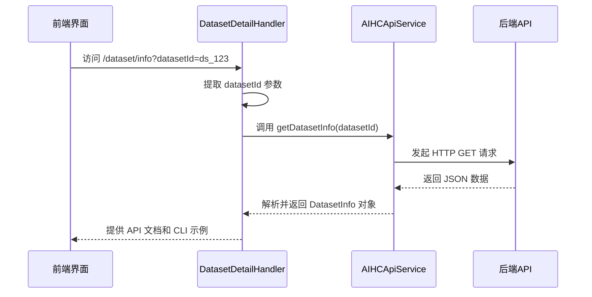
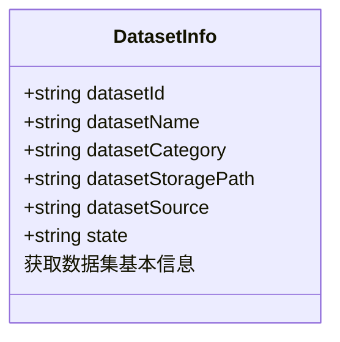
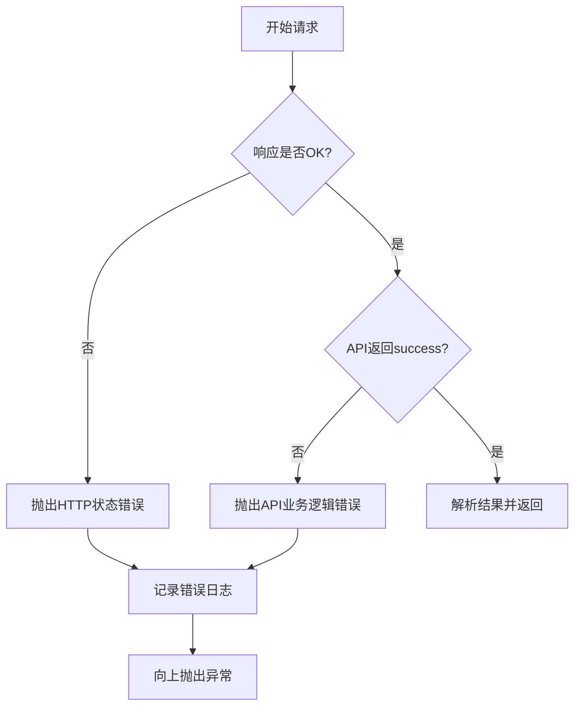
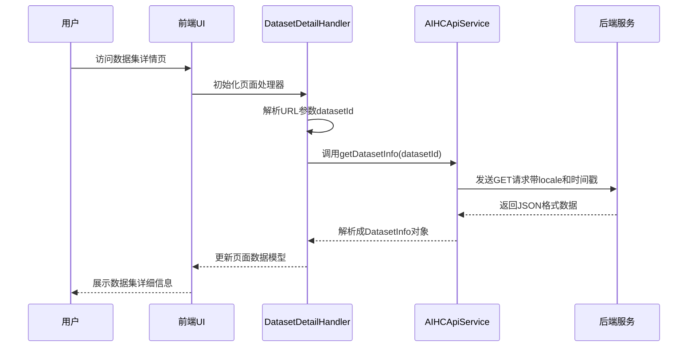

# 数据集管理API

<cite>
**Referenced Files in This Document **  
- [DatasetDetailHandler.ts](file://src/handlers/pages/DatasetDetailHandler.ts)
- [aihcApi.ts](file://src/services/aihcApi.ts)
- [BaseHandler.ts](file://src/handlers/BaseHandler.ts)
</cite>

## 目录
1. [简介](#简介)
2. [核心功能实现](#核心功能实现)
3. [接口详细说明](#接口详细说明)
4. [返回对象结构](#返回对象结构)
5. [错误处理机制](#错误处理机制)
6. [调用链路分析](#调用链路分析)
7. [性能优化建议](#性能优化建议)

## 简介
本文档旨在提供数据集管理相关API的完整参考，重点聚焦于`getDatasetInfo`方法的功能实现。该接口为前端应用提供了获取特定数据集详细信息的核心能力，支持通过RESTful风格的GET请求访问指定数据集资源。

**Section sources**
- [DatasetDetailHandler.ts](file://src/handlers/pages/DatasetDetailHandler.ts#L7-L22)

## 核心功能实现

### 接口定义与路由
`getDatasetInfo`方法实现了对数据集详情的异步获取功能，其对应的RESTful API端点遵循路径模式`/{datasetId}`。当用户访问数据集详情页面时，系统会解析URL参数中的`datasetId`，并以此作为唯一标识发起数据查询。



**Diagram sources **
- [DatasetDetailHandler.ts](file://src/handlers/pages/DatasetDetailHandler.ts#L7-L22)
- [aihcApi.ts](file://src/services/aihcApi.ts#L262-L288)

**Section sources**
- [DatasetDetailHandler.ts](file://src/handlers/pages/DatasetDetailHandler.ts#L7-L22)
- [aihcApi.ts](file://src/services/aihcApi.ts#L262-L288)

## 接口详细说明

### 请求配置
- **HTTP方法**: GET
- **请求路径**: `/aihc/data/v1/dataset/{datasetId}`
- **必需参数**: 
  - `locale=zh-cn`: 指定语言环境为中文
  - `_=${Date.now()}`: 时间戳防缓存机制，确保每次请求都从服务器获取最新数据

### 请求示例
```typescript
const url = `${this.baseUrl}/aihc/data/v1/dataset/${datasetId}?locale=zh-cn&_=${Date.now()}`;
```

**Section sources**
- [aihcApi.ts](file://src/services/aihcApi.ts#L262-L264)

## 返回对象结构

### DatasetInfo 接口定义
`getDatasetInfo`方法返回一个符合`DatasetInfo`接口规范的对象，包含以下字段：

| 字段名 | 类型 | 描述 |
|--------|------|------|
| datasetId | string | 数据集唯一标识符 |
| datasetName | string | 数据集名称 |
| datasetCategory | string | 数据集分类体系 |
| datasetStoragePath | string | 数据集在存储系统中的路径 |
| datasetSource | string | 数据集来源类型（如：上传、导入、生成等） |
| state | string | 数据集生命周期状态（如：active, inactive, deleted） |



**Diagram sources **
- [aihcApi.ts](file://src/services/aihcApi.ts#L36-L43)

**Section sources**
- [aihcApi.ts](file://src/services/aihcApi.ts#L36-L43)

## 错误处理机制

### 异常捕获与处理
`getDatasetInfo`方法实现了完整的错误处理流程，能够识别并响应多种异常情况：



**Diagram sources **
- [aihcApi.ts](file://src/services/aihcApi.ts#L265-L287)

### 常见错误场景
- **404 资源不存在**: 当提供的`datasetId`在系统中找不到对应数据集时触发
- **500 服务端异常**: 后端服务内部错误或数据库连接失败等情况
- **网络连接失败**: 客户端无法与服务器建立连接

所有错误都会被正确捕获并通过控制台输出详细的错误信息，便于调试和问题定位。

**Section sources**
- [aihcApi.ts](file://src/services/aihcApi.ts#L265-L287)

## 调用链路分析

### 完整调用流程
从用户操作到后台服务响应的全过程如下：



**Diagram sources **
- [DatasetDetailHandler.ts](file://src/handlers/pages/DatasetDetailHandler.ts#L7-L22)
- [aihcApi.ts](file://src/services/aihcApi.ts#L262-L288)

**Section sources**
- [DatasetDetailHandler.ts](file://src/handlers/pages/DatasetDetailHandler.ts#L7-L22)
- [aihcApi.ts](file://src/services/aihcApi.ts#L262-L288)

## 性能优化建议

### 前端数据缓存策略
尽管API本身采用了时间戳防缓存机制来保证数据新鲜度，但在实际应用中，建议在前端实现适当的缓存策略以提升用户体验：

1. **内存缓存**: 在单次会话期间缓存已获取的数据集信息
2. **合理设置缓存时效**: 根据业务需求设定合理的缓存过期时间（如5分钟）
3. **条件刷新**: 仅在用户主动刷新或执行相关操作时才强制重新获取数据

这种混合策略既能避免频繁请求带来的性能开销，又能保证数据的相对实时性。

**Section sources**
- [aihcApi.ts](file://src/services/aihcApi.ts#L262-L288)