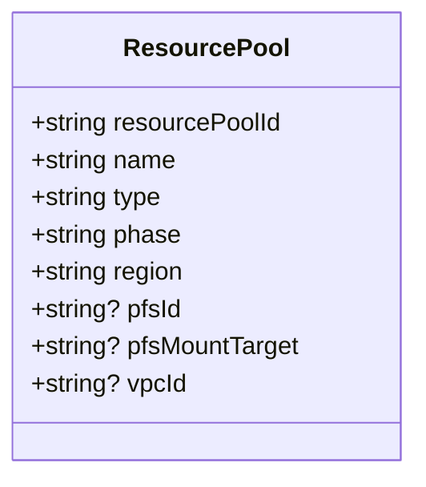
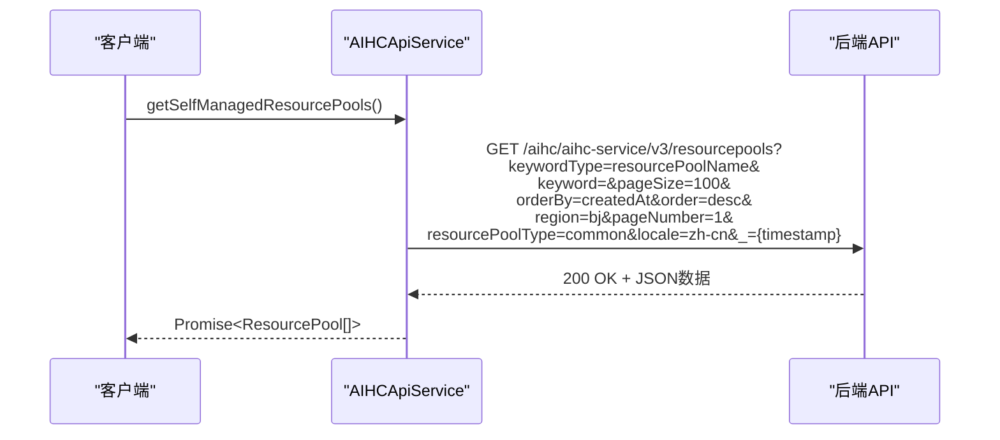
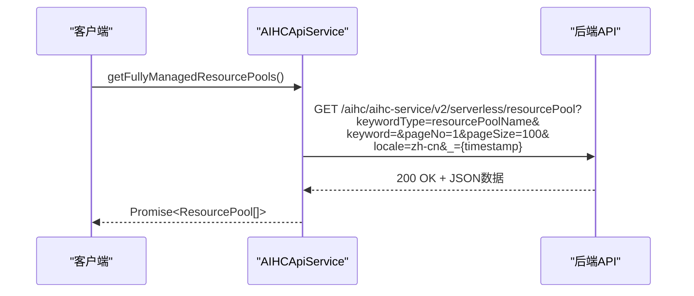
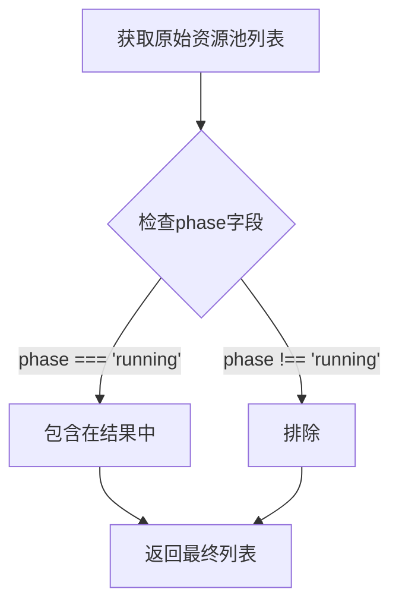
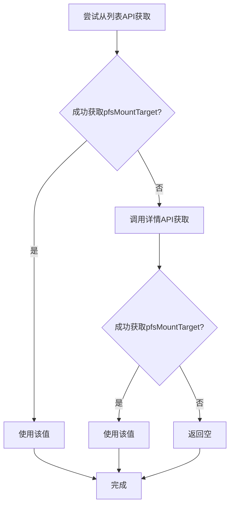
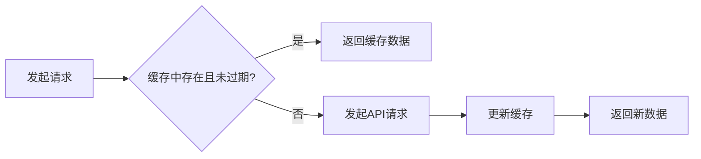

# 资源池管理API

<cite>
**Referenced Files in This Document**   
- [aihcApi.ts](file://src/services/aihcApi.ts)
- [ResourcePoolListHandler.ts](file://src/handlers/pages/ResourcePoolListHandler.ts)
- [ResourcePoolDetailHandler.ts](file://src/handlers/pages/ResourcePoolDetailHandler.ts)
- [resourcePools.ts](file://src/utils/resourcePools.ts)
</cite>

## 目录
1. [简介](#简介)
2. [核心API方法](#核心api方法)
3. [资源池数据结构](#资源池数据结构)
4. [HTTP请求详情](#http请求详情)
5. [认证机制](#认证机制)
6. [响应数据结构](#响应数据结构)
7. [状态过滤逻辑](#状态过滤逻辑)
8. [全托管资源池PFS挂载点策略](#全托管资源池pfs挂载点策略)
9. [调用示例](#调用示例)
10. [性能优化建议](#性能优化建议)

## 简介

本文档详细说明了资源池管理API的核心功能，包括获取自运维和全托管资源池列表及详情的方法。这些API为用户提供了一种程序化方式来查询和管理AIHC平台上的计算资源池。

**Section sources**
- [aihcApi.ts](file://src/services/aihcApi.ts#L55-L384)

## 核心API方法

资源池管理API提供了四个主要方法用于获取不同类型的资源池信息：

- `getSelfManagedResourcePools`: 获取自运维资源池列表
- `getFullyManagedResourcePools`: 获取全托管资源池列表
- `getSelfManagedResourcePoolDetail`: 获取自运维资源池详情
- `getFullyManagedResourcePoolDetail`: 获取全托管资源池详情

这些方法封装了底层HTTP请求的复杂性，提供了一个简洁的Promise-based接口供上层应用使用。

**Section sources**
- [aihcApi.ts](file://src/services/aihcApi.ts#L55-L384)

## 资源池数据结构



**Diagram sources**
- [aihcApi.ts](file://src/services/aihcApi.ts#L1-L20)

`ResourcePool` 接口定义了资源池的核心属性：

- **resourcePoolId**: 资源池的唯一标识符
- **name**: 资源池的名称
- **type**: 资源池类型，'common'表示自运维，'serverless'表示全托管
- **phase**: 资源池当前状态（如running）
- **region**: 资源池所在区域
- **pfsId**: 关联的PFS存储实例ID
- **pfsMountTarget**: PFS挂载目标ID
- **vpcId**: 关联的VPC网络ID

**Section sources**
- [aihcApi.ts](file://src/services/aihcApi.ts#L1-L20)

## HTTP请求详情

### 自运维资源池列表请求



**Diagram sources**
- [aihcApi.ts](file://src/services/aihcApi.ts#L55-L93)

### 全托管资源池列表请求



**Diagram sources**
- [aihcApi.ts](file://src/services/aihcApi.ts#L96-L162)

### 查询参数说明

| 参数 | 类型 | 必需 | 描述 |
|------|------|-------|------|
| keywordType | string | 否 | 搜索关键字类型，固定为"resourcePoolName" |
| keyword | string | 否 | 搜索关键词，空字符串表示不筛选 |
| pageSize | number | 是 | 每页返回数量，固定为100 |
| pageNo/pageNumber | number | 是 | 页码，从1开始 |
| orderBy | string | 否 | 排序字段，如"createdAt" |
| order | string | 否 | 排序顺序，"desc"表示降序 |
| region | string | 否 | 区域标识，如"bj"表示北京 |
| resourcePoolType | string | 是 | 资源池类型，"common"或"dedicatedV2" |
| locale | string | 是 | 本地化语言，"zh-cn"表示中文 |
| _ | number | 是 | 时间戳，用于防止缓存 |

**Section sources**
- [aihcApi.ts](file://src/services/aihcApi.ts#L55-L162)

## 认证机制

API请求通过浏览器的默认认证机制进行身份验证。所有请求都包含必要的认证头信息，由底层框架自动处理。开发者无需手动管理认证令牌。

对于直接调用REST API的情况，需要使用AK/SK签名机制，如`DescribeResourcePools`函数所示，通过`getSignature`工具生成正确的Authorization头。

**Section sources**
- [aihcApi.ts](file://src/services/aihcApi.ts#L55-L384)
- [resourcePools.ts](file://src/utils/resourcePools.ts#L1-L63)

## 响应数据结构

### 成功响应示例

```json
{
  "success": true,
  "result": {
    "resourcePools": [
      {
        "resourcePoolId": "rp-abc123",
        "name": "生产环境资源池",
        "type": "common",
        "phase": "running",
        "region": "bj",
        "vpcId": "vpc-xyz789",
        "pfsId": "pfs-7xWeAt",
        "pfsMountTarget": "pfs-7xWeAt"
      }
    ]
  }
}
```

### 错误响应示例

```json
{
  "success": false,
  "message": "资源池不存在"
}
```

### 异常处理

当API调用失败时，会抛出相应的错误对象：

- 网络错误：抛出原生JavaScript Error
- HTTP错误：包含状态码信息的Error
- 取消请求：特殊错误"REQUEST_CANCELLED"
- API业务错误：包含具体错误信息的Error

**Section sources**
- [aihcApi.ts](file://src/services/aihcApi.ts#L55-L384)

## 状态过滤逻辑

所有资源池列表API都会在客户端进行状态过滤，只返回处于"running"状态的资源池。



**Diagram sources**
- [aihcApi.ts](file://src/services/aihcApi.ts#L75-L76)
- [aihcApi.ts](file://src/services/aihcApi.ts#L125-L128)

这种过滤逻辑确保用户只能看到可用的、正在运行的资源池，避免了对已停止或创建中的资源池进行操作的可能性。

**Section sources**
- [aihcApi.ts](file://src/services/aihcApi.ts#L75-L76)
- [aihcApi.ts](file://src/services/aihcApi.ts#L125-L128)

## 全托管资源池PFS挂载点策略

获取全托管资源池的PFS挂载点遵循以下优先级策略：



**Diagram sources**
- [aihcApi.ts](file://src/services/aihcApi.ts#L305-L320)

首先尝试从`getFullyManagedResourcePools`列表API中获取`pfsMountTarget`，因为该接口的数据更可靠且响应更快。如果列表API中没有该字段，则退而求其次调用`getFullyManagedResourcePoolDetail`详情API来获取。

**Section sources**
- [aihcApi.ts](file://src/services/aihcApi.ts#L305-L320)

## 调用示例

### 获取自运维资源池列表

```typescript
try {
  const pools = await aihcApiService.getSelfManagedResourcePools();
  console.log('自运维资源池:', pools);
} catch (error) {
  if (error.message === 'REQUEST_CANCELLED') {
    console.log('请求被取消');
  } else {
    console.error('获取资源池失败:', error);
  }
}
```

### 获取全托管资源池详情

```typescript
try {
  const detail = await aihcApiService.getFullyManagedResourcePoolDetail('rp-serverless-123');
  console.log('全托管资源池详情:', detail);
} catch (error) {
  console.error('获取详情失败:', error);
}
```

**Section sources**
- [aihcApi.ts](file://src/services/aihcApi.ts#L55-L384)

## 性能优化建议

### 缓存策略

由于资源池信息变化频率较低，建议实施客户端缓存：



可以使用内存缓存或浏览器Storage API来存储最近获取的资源池列表，设置合理的过期时间（如5分钟）。

### 错误重试机制

对于临时性网络错误，建议实现指数退避重试机制：

```typescript
async function retryOperation(operation, maxRetries = 3) {
  for (let i = 0; i < maxRetries; i++) {
    try {
      return await operation();
    } catch (error) {
      if (i === maxRetries - 1 || !isRetryableError(error)) {
        throw error;
      }
      // 指数退避
      await new Promise(resolve => setTimeout(resolve, Math.pow(2, i) * 1000));
    }
  }
}
```

### 请求取消

利用AbortController支持请求取消功能，避免不必要的网络消耗：

```typescript
const controller = new AbortController();
// 在适当的时候取消请求
// controller.abort();

const pools = await aihcApiService.getSelfManagedResourcePools(controller);
```

**Section sources**
- [aihcApi.ts](file://src/services/aihcApi.ts#L55-L384)