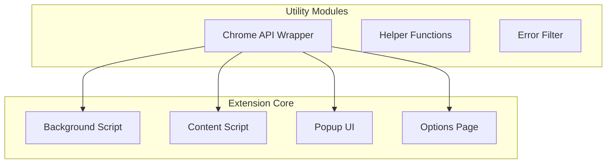
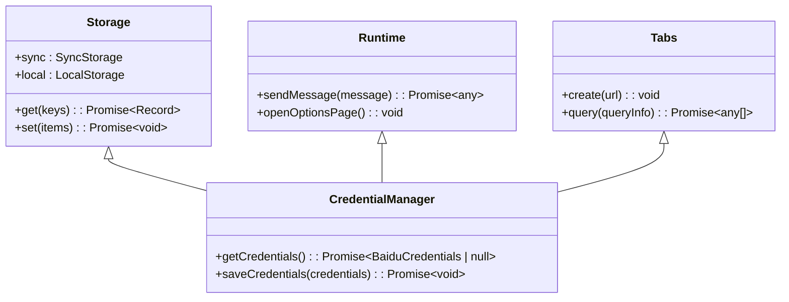
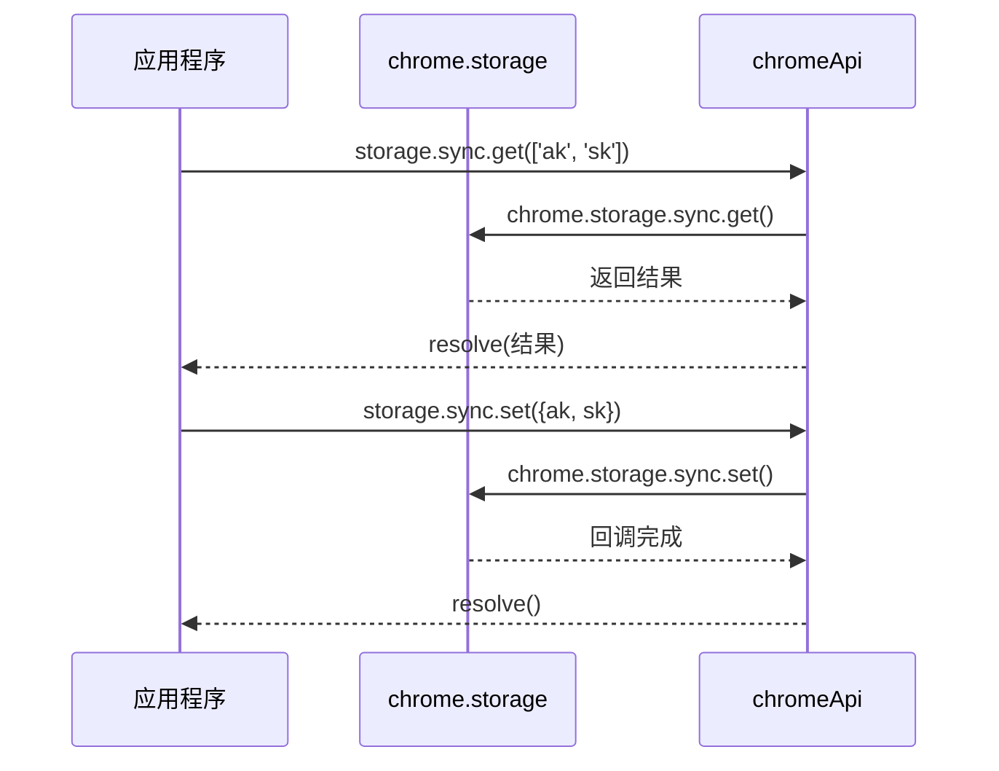
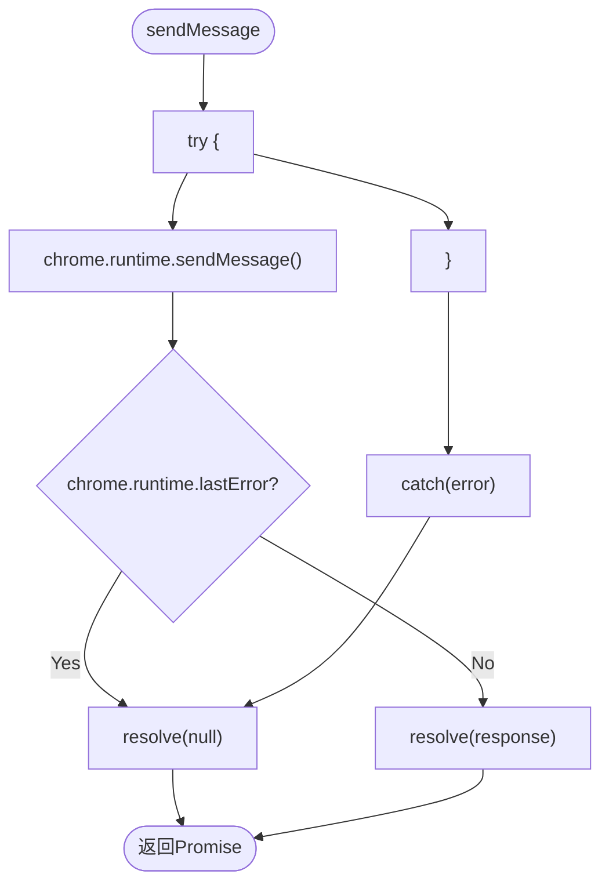
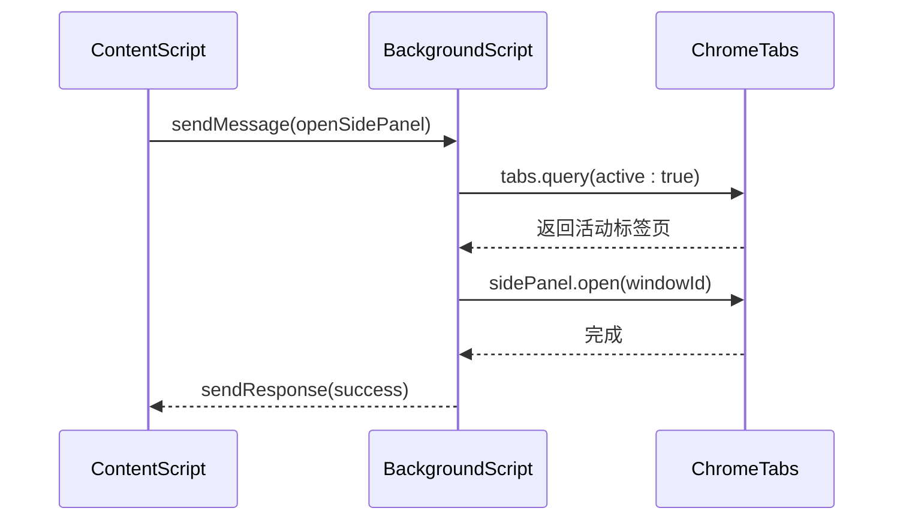
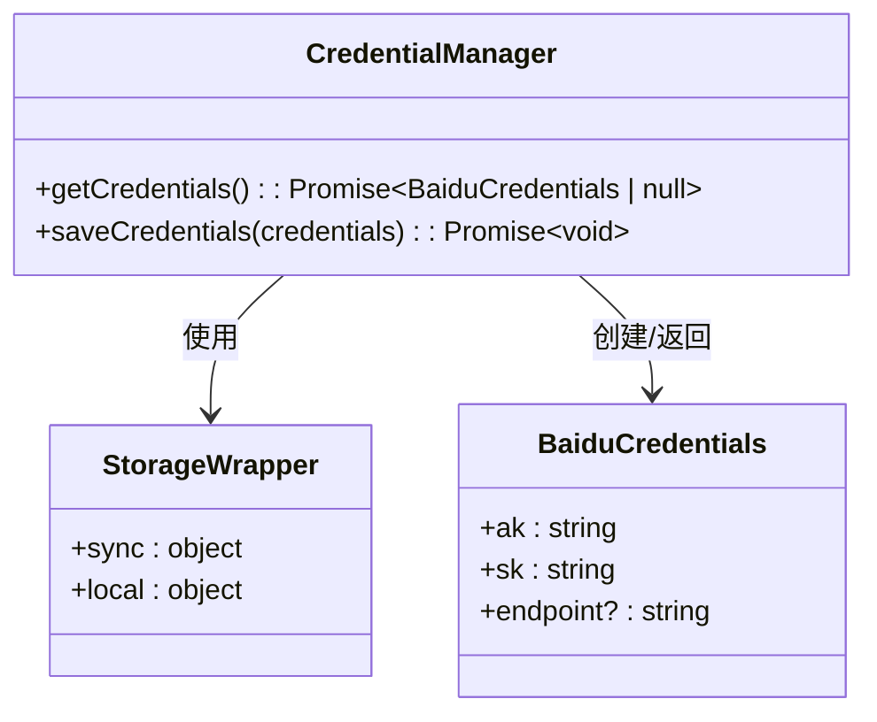
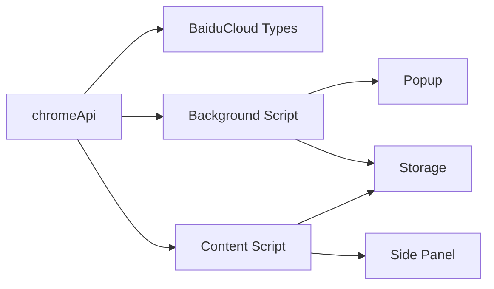

# Chrome API 封装

<cite>
**Referenced Files in This Document **   
- [chromeApi.ts](file://src/utils/chromeApi.ts)
- [index.ts](file://src/background/index.ts)
- [index.ts](file://src/content/index.ts)
- [baiducloud.d.ts](file://src/types/baiducloud.d.ts)
</cite>

## 目录
1. [简介](#简介)
2. [项目结构](#项目结构)
3. [核心组件](#核心组件)
4. [架构概述](#架构概述)
5. [详细组件分析](#详细组件分析)
6. [依赖分析](#依赖分析)
7. [性能考虑](#性能考虑)
8. [故障排除指南](#故障排除指南)
9. [结论](#结论)

## 简介
本文档详细说明了 `chromeApi` 模块如何封装原始 Chrome 扩展 API 以提升安全性与易用性。文档涵盖了 storage.sync 和 storage.local 对 Chrome 存储系统的封装机制，包括 get 和 set 方法的异步处理逻辑及错误静默策略。同时解释了 runtime.sendMessage 如何通过 Promise 包装实现安全的消息通信，并完全抑制 runtime.lastError 引发的控制台噪音。此外还描述了 tabs 模块对标签页创建与查询的封装方式，以及 getCredentials、saveCredentials 等高层函数如何基于存储 API 实现百度云凭证的安全持久化。

## 项目结构
该项目采用模块化设计，主要分为 background、content、popup、options 和 utils 等目录。其中 utils 目录下的 chromeApi.ts 文件是本文档的核心分析对象，它提供了对 Chrome 扩展 API 的高级封装。

**Diagram sources **
- [chromeApi.ts](file://src/utils/chromeApi.ts)
- [index.ts](file://src/background/index.ts)
- [index.ts](file://src/content/index.ts)

**Section sources**
- [chromeApi.ts](file://src/utils/chromeApi.ts)
- [index.ts](file://src/background/index.ts)

## 核心组件
`chromeApi` 模块提供了一组高级封装函数，用于简化 Chrome 扩展 API 的使用。这些封装不仅提升了代码的可读性和可维护性，还增强了错误处理能力和用户体验。

**Section sources**
- [chromeApi.ts](file://src/utils/chromeApi.ts)

## 架构概述
该模块采用了分层架构设计，将底层 Chrome API 调用与上层业务逻辑分离。通过 Promise 包装异步操作，实现了现代化的异步编程模式。

**Diagram sources **
- [chromeApi.ts](file://src/utils/chromeApi.ts)

## 详细组件分析

### 存储系统封装
`chromeApi` 模块对 Chrome 存储系统进行了全面封装，提供了同步和本地两种存储方式。

#### 存储API包装机制

**Diagram sources **
- [chromeApi.ts](file://src/utils/chromeApi.ts#L7-L30)

**Section sources**
- [chromeApi.ts](file://src/utils/chromeApi.ts#L7-L30)

### 运行时消息通信
runtime 模块对 Chrome 运行时 API 进行了安全封装，特别关注错误处理和控制台噪音抑制。

#### 消息发送封装

**Diagram sources **
- [chromeApi.ts](file://src/utils/chromeApi.ts#L32-L48)

**Section sources**
- [chromeApi.ts](file://src/utils/chromeApi.ts#L32-L48)

### 标签页管理
tabs 模块提供了对浏览器标签页的创建和查询功能的简洁封装。

#### 标签页操作流程

**Diagram sources **
- [chromeApi.ts](file://src/utils/chromeApi.ts#L50-L62)
- [index.ts](file://src/background/index.ts#L283-L297)

**Section sources**
- [chromeApi.ts](file://src/utils/chromeApi.ts#L50-L62)
- [index.ts](file://src/background/index.ts#L283-L297)

### 凭证管理系统
高层函数如 getCredentials 和 saveCredentials 基于存储 API 实现了百度云凭证的安全持久化。

#### 凭证管理类图

**Diagram sources **
- [chromeApi.ts](file://src/utils/chromeApi.ts#L76-L95)
- [baiducloud.d.ts](file://src/types/baiducloud.d.ts)

**Section sources**
- [chromeApi.ts](file://src/utils/chromeApi.ts#L76-L95)
- [baiducloud.d.ts](file://src/types/baiducloud.d.ts)

## 依赖分析
`chromeApi` 模块与其他组件之间存在明确的依赖关系，确保了功能的解耦和复用。

**Diagram sources **
- [chromeApi.ts](file://src/utils/chromeApi.ts)
- [index.ts](file://src/background/index.ts)
- [index.ts](file://src/content/index.ts)

**Section sources**
- [chromeApi.ts](file://src/utils/chromeApi.ts)
- [index.ts](file://src/background/index.ts)
- [index.ts](file://src/content/index.ts)

## 性能考虑
封装层引入了额外的 Promise 包装，但这种开销在现代 JavaScript 引擎中可以忽略不计。更重要的是，通过错误静默策略减少了不必要的控制台输出，从而降低了整体运行时开销。

## 故障排除指南
当遇到问题时，应首先检查相关 API 调用是否正确使用了封装函数。对于存储相关问题，确认键名拼写正确；对于消息通信问题，确保发送方和接收方都正确处理了异步响应。

**Section sources**
- [chromeApi.ts](file://src/utils/chromeApi.ts)
- [index.ts](file://src/background/index.ts)
- [index.ts](file://src/content/index.ts)

## 结论
`chromeApi` 模块成功地为原始 Chrome 扩展 API 提供了一层安全、易用的封装。通过 Promise 化异步操作、统一错误处理和提供高层业务函数，显著提升了开发效率和代码质量。这种封装模式值得在其他扩展开发中推广应用。