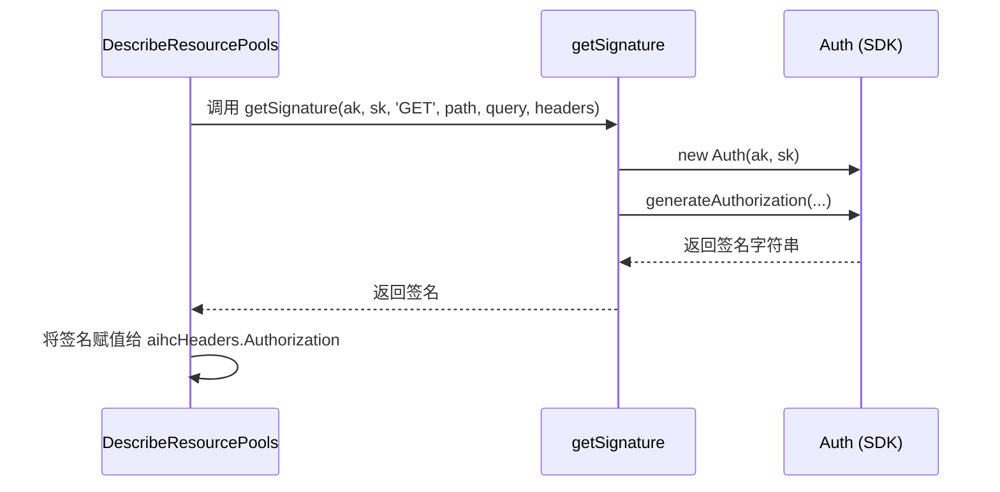
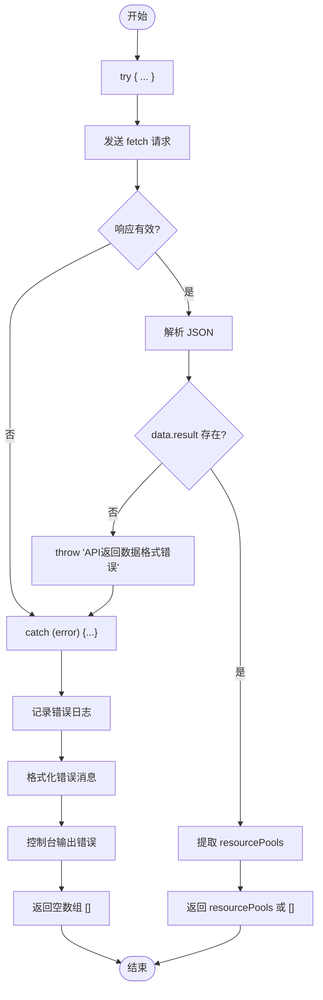

# 资源池辅助工具

<cite>
**本文档引用文件**
- [resourcePools.ts](file://src/utils/resourcePools.ts)
- [common.ts](file://src/utils/common.ts)
</cite>

## 目录
1. [简介](#简介)
2. [核心功能分析](#核心功能分析)
3. [DescribeResourcePools 函数实现](#describeresourcepools-函数实现)
4. [签名生成机制](#签名生成机制)
5. [请求构建与发送](#请求构建与发送)
6. [响应处理逻辑](#响应处理逻辑)
7. [应用场景](#应用场景)

## 简介
`resourcePools` 模块是 AIHCX 扩展中的一个核心工具模块，专门用于与百度智能云 AIHC（Artificial Intelligence High-performance Computing）平台进行交互。该模块的核心功能是通过调用远程 API 获取资源池的元数据信息，为前端界面展示和后续操作提供数据支持。

本模块主要包含 `DescribeResourcePools` 异步函数，该函数封装了完整的 HTTP 请求流程，包括参数构造、身份验证、请求发送和错误处理。它依赖于 `common.ts` 模块提供的通用工具函数，特别是用于生成百度云 SDK 签名的 `getSignature` 函数。

## 核心功能分析

### 功能概述
`DescribeResourcePools` 函数的主要职责是向 AIHC 平台发起一个 GET 请求，以获取指定区域内的所有资源池列表。该函数的设计体现了高内聚、低耦合的原则，将复杂的网络请求细节封装在内部，对外只暴露简单的参数接口。

**Section sources**
- [resourcePools.ts](file://src/utils/resourcePools.ts#L4-L59)

## DescribeResourcePools 函数实现

### 参数与初始化
`DescribeResourcePools` 是一个异步函数，接受三个必需的字符串参数：访问密钥（ak）、秘密密钥（sk）和区域（region）。函数首先会记录传入的参数，便于调试。

```mermaid
flowchart TD
A[开始] --> B[输入 ak, sk, region]
B --> C[构造主机名 aihc.{region}.baidubce.com]
C --> D[设置分页参数: pageSize=100, pageNo=1]
D --> E[设置排序规则: orderBy='createdAt', order='desc']
E --> F[构造查询参数对象]
F --> G[初始化请求头对象]
G --> H[调用 getSignature 生成授权签名]
H --> I[将签名注入 Authorization 头部]
I --> J[构建完整 URL 并发送 fetch 请求]
J --> K{响应是否成功?}
K --> |是| L[解析 JSON 响应]
K --> |否| M[捕获并处理错误]
L --> N{data.result 是否存在?}
N --> |是| O[提取 resourcePools 数组]
N --> |否| P[抛出数据格式错误]
O --> Q[返回 resourcePools 数组]
P --> R[返回空数组]
M --> R
```

**Diagram sources**
- [resourcePools.ts](file://src/utils/resourcePools.ts#L4-L59)

### 请求参数构造
函数内部定义了固定的分页和排序参数：
- **分页参数**：`pageSize` 固定为 100，`pageNo` 固定为 1，这意味着每次请求都会尝试获取前 100 个资源池。
- **排序规则**：按 `createdAt` 字段降序排列（`order='desc'`），确保最新的资源池排在最前面。

这些参数被组织成一个名为 `aihcQuery` 的 JavaScript 对象，并在发送请求前转换为 URL 查询字符串。

**Section sources**
- [resourcePools.ts](file://src/utils/resourcePools.ts#L10-L22)

## 签名生成机制

### 百度云 SDK 签名
为了通过百度云的身份验证，`DescribeResourcePools` 函数调用了 `common.ts` 模块中的 `getSignature` 函数来生成必要的授权签名。



**Diagram sources**
- [resourcePools.ts](file://src/utils/resourcePools.ts#L28-L30)
- [common.ts](file://src/utils/common.ts#L4-L16)

### getSignature 函数详解
`getSignature` 函数位于 `common.ts` 文件中，是整个认证流程的核心。它使用百度云官方 SDK 中的 `Auth` 类来生成符合要求的签名。

该函数接收以下参数：
- `ak` 和 `sk`：用户的访问凭证。
- `method`：HTTP 方法（此处为 'GET'）。
- `path`：API 的路径（即 `/api/v1/resourcepools`）。
- `query`：URL 查询参数对象。
- `headers`：请求头对象（在此场景下为空，但会被 SDK 内部填充）。

函数内部会创建一个 `Auth` 实例，并调用其 `generateAuthorization` 方法。该方法会根据百度云的签名算法，结合当前时间戳（`timestamp`）和过期时间（`expirationPeriondInSeconds`，固定为1800秒，即30分钟），生成一个唯一的、有时效性的 `Authorization` 头部值。

**Section sources**
- [common.ts](file://src/utils/common.ts#L4-L16)

## 请求构建与发送

### 主机名与端点动态拼接
函数利用传入的 `region` 参数动态构建主机名 `aihc.${region}.baidubce.com`。例如，如果 `region` 为 `bj`，则主机名为 `aihc.bj.baidubce.com`。这使得该函数能够灵活地访问不同地理区域的 AIHC 服务。

最终的请求 URL 由协议 (`https://`)、动态主机名、API 路径 (`/api/v1/resourcepools`) 和序列化后的查询参数组成。

### Fetch 请求配置
函数使用现代浏览器的 `fetch` API 发起网络请求。请求配置如下：
- **方法**：`GET`
- **头部**：包含由 `getSignature` 生成的 `Authorization` 头部。

值得注意的是，代码注释明确指出“不再设置Host头，由浏览器自动设置”，这是为了避免因手动设置 `Host` 头而可能引发的安全问题或与浏览器策略的冲突。

**Section sources**
- [resourcePools.ts](file://src/utils/resourcePools.ts#L17-L32)

## 响应处理逻辑

### 成功响应处理
当 `fetch` 请求成功且服务器返回状态码为 2xx 时，函数会执行以下步骤：
1. 将响应体解析为 JSON 格式。
2. 验证返回的 JSON 数据结构，确保 `data` 对象及其 `result` 属性存在。
3. 从 `data.result` 中提取 `resourcePools` 数组。
4. 如果 `resourcePools` 不存在，则返回一个空数组作为默认值。

### 错误处理与优雅降级
该函数实现了全面的错误处理机制，以确保在任何异常情况下都能稳定运行，不会导致调用方崩溃。



**Diagram sources**
- [resourcePools.ts](file://src/utils/resourcePools.ts#L34-L59)

错误处理涵盖了两种主要情况：
1. **HTTP 错误**：如果 `response.ok` 为 `false`，说明服务器返回了非成功的状态码（如 404, 500），此时会抛出一个包含状态码的错误。
2. **数据格式错误**：即使 HTTP 请求成功，也可能因为后端返回的数据结构不符合预期而失败。此时会检查 `data` 和 `data.result` 的存在性。

无论发生哪种错误，`catch` 块都会捕获异常，将其详细信息打印到控制台，并最终返回一个空数组 `[]`。这种“优雅降级”的设计模式保证了即使在获取资源池信息失败的情况下，应用程序的其他部分仍能正常工作，只是显示为空列表。

**Section sources**
- [resourcePools.ts](file://src/utils/resourcePools.ts#L34-L59)

## 应用场景
`DescribeResourcePools` 函数在扩展程序中有广泛的应用场景：
- **资源池列表展示**：在用户界面上列出所有可用的资源池，供用户选择。
- **任务部署前置检查**：在用户提交新的计算任务之前，先获取资源池列表，以验证目标队列（queue）是否存在。
- **系统状态监控**：定期轮询此接口，可以监控资源池的健康状况和容量变化。
- **自动化脚本**：为需要批量操作资源池的 CLI 工具或自动化脚本提供底层数据支持。

通过这个精心设计的工具函数，AIHCX 扩展能够安全、可靠地与云端服务进行通信，为用户提供强大的功能支持。