# CLI 命令生成

<cite>
**Referenced Files in This Document **   
- [common.ts](file://src/utils/common.ts)
- [TaskDetailHandler.ts](file://src/handlers/pages/TaskDetailHandler.ts)
- [CLICommandTab.tsx](file://src/components/tabs/CLICommandTab.tsx)
</cite>

## 目录
1. [简介](#简介)
2. [核心功能分析](#核心功能分析)
3. [命令构建机制详解](#命令构建机制详解)
4. [容错参数处理逻辑](#容错参数处理逻辑)
5. [长命令降级策略](#长命令降级策略)
6. [完整命令生成示例](#完整命令生成示例)
7. [优化建议](#优化建议)

## 简介
本文档深入分析 `generateCLICommand` 函数如何根据任务信息动态构建多行、带转义的 aihc CLI 命令。详细说明反斜杠续行符的使用规范及其在终端执行中的意义，解析参数顺序设计原则与条件添加逻辑，并阐述长命令的降级处理策略。

## 核心功能分析

该功能主要由两个关键组件协同工作：位于 `common.ts` 的独立工具函数和 `TaskDetailHandler` 类中的私有方法。这两个实现虽然存在差异，但共同服务于将任务配置转换为可执行的 CLI 命令的核心目标。

**Section sources**
- [common.ts](file://src/utils/common.ts#L262-L355)
- [TaskDetailHandler.ts](file://src/handlers/pages/TaskDetailHandler.ts#L196-L239)

## 命令构建机制详解

### 反斜杠续行符规范
函数采用反斜杠（`\`）作为命令行续行符，允许将一个长命令拆分为多个物理行以提高可读性。每个参数后紧跟 `\\\n` 实现跨行连接，在最终输出时形成格式化的多行命令结构。

### 参数顺序设计原则
参数按照预定义的逻辑顺序添加，确保了命令的一致性和可预测性：
1.  **基础信息**：名称、框架、镜像
2.  **资源调度**：队列（pool）、RDMA、GPU
3.  **高级特性**：BCCL、容错、主机网络
4.  **运行时配置**：优先级、副本数、环境变量、数据源
5.  **执行指令**：最终的启动命令或脚本文件

### 条件参数添加逻辑
函数实现了精细化的条件判断，仅在满足特定条件时才添加相应参数：
-   **非默认队列**：只有当 `taskInfo.queue` 存在且不等于 `'default'` 时，才会通过 `--pool` 参数指定资源池。
-   **GPU资源分配**：遍历 `taskInfo.jobSpec.resources` 数组，为每一个 GPU 资源项动态生成 `--gpu name=quantity` 参数。
-   **环境变量注入**：检查 `taskInfo.jobSpec.envs` 是否为有效数组，并确保每个环境变量具有名称和非空值，然后逐个添加 `--env "name=value"`。
-   **数据源挂载**：对 `taskInfo.datasources` 中的每一项，验证其挂载路径后，依次添加 `--ds-type`、`--ds-mountpath` 和可选的 `--ds-name` 参数，并对特殊类型 `pfsl1` 进行标准化处理。

```mermaid
flowchart TD
Start([开始构建命令]) --> BaseParams["添加基础参数\n--name, --framework, --image"]
BaseParams --> CheckQueue{"队列是否非默认?"}
CheckQueue --> |是| AddPool["添加 --pool 参数"]
CheckQueue --> |否| SkipPool
AddPool --> RDMAParam
SkipPool --> RDMAParam
RDMAParam["添加 --enable-rdma"] --> CheckGPU{"是否存在GPU资源?"}
CheckGPU --> |是| LoopGPU["遍历resources数组"]
LoopGPU --> AddGPU["添加 --gpu 参数"]
AddGPU --> MoreGPU{"还有更多资源?"}
MoreGPU --> |是| LoopGPU
MoreGPU --> |否| BCCLParam
CheckGPU --> |否| BCCLParam
BCCLParam["添加 --enable-bccl"] --> FaultTolerance
FaultTolerance["处理容错参数"] --> HostNetwork{"是否启用主机网络?"}
HostNetwork --> |是| AddHostNet["添加 --host-network"]
HostNetwork --> |否| SkipHostNet
AddHostNet --> PriorityReplicas
SkipHostNet --> PriorityReplicas
PriorityReplicas["添加 --priority 和 --replicas"] --> CheckEnv{"是否存在环境变量?"}
CheckEnv --> |是| LoopEnv["遍历envs数组"]
LoopEnv --> AddEnv["添加 --env 参数"]
AddEnv --> MoreEnv{"还有更多变量?"}
MoreEnv --> |是| LoopEnv
MoreEnv --> |否| CheckDS{"是否存在数据源?"}
CheckEnv --> |否| CheckDS
CheckDS --> |是| LoopDS["遍历datasources数组"]
LoopDS --> ProcessDS["处理数据源类型并添加\n--ds-type, --ds-mountpath, --ds-name"]
ProcessDS --> MoreDS{"还有更多数据源?"}
MoreDS --> |是| LoopDS
MoreDS --> |否| CheckCommand
CheckDS --> |否| CheckCommand
CheckCommand{"启动命令长度 < 100? "}
CheckCommand --> |是| AddInlineCmd["添加内联 --command"]
CheckCommand --> |否| AddScriptFile["添加 --script-file 提示"]
AddInlineCmd --> End([返回完整CLI命令])
AddScriptFile --> End
```



**Diagram sources **
- [common.ts](file://src/utils/common.ts#L262-L355)

**Section sources**
- [common.ts](file://src/utils/common.ts#L262-L355)

## 容错参数处理逻辑

函数对容错参数采用了分层处理机制，体现了良好的封装性。

### 主开关控制
首先通过 `--enable-fault-tolerance` 参数设置容错功能的总开关，其值直接取自 `taskInfo.faultTolerance`，若未定义则默认为 `false`。

### 详细参数拼接
当主开关开启时，函数会构造一个名为 `ftArgs` 的字符串数组来收集所有相关的子参数：
-   必填子参数 `--enable-hang-detection` 总是被加入，其值同样来自配置对象。
-   条件子参数 `--hang-detection-log-timeout-minutes` 仅在 `enabledHangDetection` 为真时才被推入数组。

最后，通过 `join(' ')` 将数组内的所有参数用空格连接成一个字符串，并用双引号包裹，作为 `--fault-tolerance-args` 的单一值传入。这种设计将复杂的嵌套配置扁平化为CLI友好的单个参数。

```mermaid
flowchart TD
StartFT[开始处理容错] --> CheckFT{"容错功能是否启用?"}
CheckFT --> |是| SetMainSwitch["设置 --enable-fault-tolerance=true"]
CheckFT --> |否| SetMainSwitchFalse["设置 --enable-fault-tolerance=false"]
SetMainSwitch --> InitArray["初始化 ftArgs 数组"]
InitArray --> AddEnableHang["添加 --enable-hang-detection"]
AddEnableHang --> CheckHang{"是否启用挂起检测?"}
CheckHang --> |是| AddTimeout["添加 --hang-detection-log-timeout-minutes"]
CheckHang --> |否| SkipTimeout
AddTimeout --> JoinArgs["将 ftArgs 数组合并为字符串"]
SkipTimeout --> JoinArgs
JoinArgs --> WrapQuotes["用双引号包裹字符串"]
WrapQuotes --> AddToCommand["添加 --fault-tolerance-args=\"...\" 到主命令"]
SetMainSwitchFalse --> AddToCommand
AddToCommand --> EndFT[完成容错参数处理]
```

**Diagram sources **
- [common.ts](file://src/utils/common.ts#L262-L355)

**Section sources**
- [common.ts](file://src/utils/common.ts#L262-L355)

## 长命令降级策略

为了应对过长的启动命令可能带来的执行风险或用户体验问题，函数实施了明确的降级策略。

### 长度阈值判断
函数通过检查 `taskInfo.jobSpec.command.length` 是否小于 100 个字符来决定处理方式。

### 内联执行 vs 脚本文件
-   **短命令 (<100字符)**：采用 `--command "$(printf "...")"` 的形式进行内联执行。`printf` 的使用可以正确处理命令字符串中的特殊字符和换行。
-   **长命令 (>=100字符)**：放弃内联执行，转而提示用户将命令保存为外部脚本文件。此时，参数变为 `--script-file ${taskInfo.name}.txt`，并在括号中附带清晰的中文提示：“启动命令过长，请保存为文件，并使用--script-file指定文件路径”。这是一种安全且用户友好的实践，避免了复杂命令在shell中解析时可能出现的问题。

**Section sources**
- [common.ts](file://src/utils/common.ts#L262-L355)

## 完整命令生成示例

结合上述机制，一个典型的任务配置将生成如下结构的CLI命令：

```
aihc job create --name my-task \
    --framework PyTorchJob \
    --image registry.baidubce.com/aihc-aiak/aiak-megatron:tag \
    --pool gpu-pool \
    --enable-rdma=true \
    --gpu baidu.com/a800_80g_cgpu=8 \
    --enable-bccl=false \
    --enable-fault-tolerance=true \
    --fault-tolerance-args="--enable-hang-detection=true --hang-detection-log-timeout-minutes=10" \
    --priority normal \
    --replicas 1 \
    --env "CUDA_VISIBLE_DEVICES=0" \
    --env "LOG_LEVEL=DEBUG" \
    --ds-type pfs \
    --ds-mountpath /mnt/data \
    --ds-name pfs-data \
    --command "$(printf 'python train.py --epochs 10')"
```

此示例涵盖了GPU分配、环境变量注入、数据源挂载等关键环节，展示了函数如何整合各项配置。

## 优化建议

尽管当前实现已较为完善，但仍有一些潜在的优化空间：

1.  **参数排序一致性**：注意到 `common.ts` 中的 `generateCLICommand` 使用了 `\\\n` 换行，而 `TaskDetailHandler` 中的方法使用了 `\n`。应统一换行风格，推荐使用 `\\\n` 以保证在不同上下文中的显示一致性。
2.  **错误提示友好性**：对于长命令的降级提示，可以进一步优化。例如，不仅提示用户保存为文件，还可以提供一个“一键生成脚本”按钮，或者直接在UI中展示完整的命令内容供复制。
3.  **数据源类型映射**：目前对 `pfsl1` 到 `pfs` 的映射是硬编码的。可以考虑将其提取为一个映射表，便于未来扩展支持更多别名。
4.  **默认值管理**：部分参数的默认值（如 `normal`, `1`）散落在代码各处。可以集中到一个配置对象中，方便维护和国际化。

**Section sources**
- [common.ts](file://src/utils/common.ts#L262-L355)
- [TaskDetailHandler.ts](file://src/handlers/pages/TaskDetailHandler.ts#L196-L239)