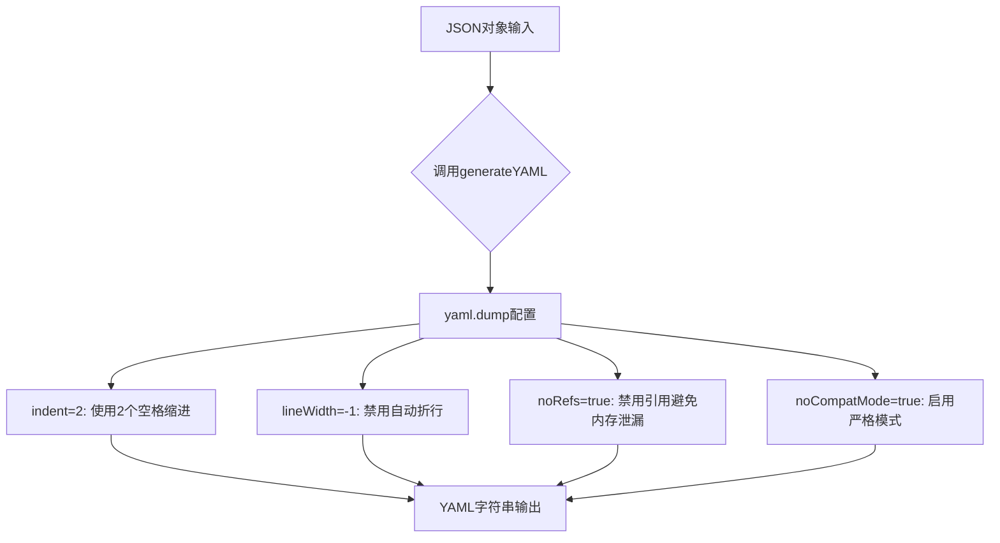
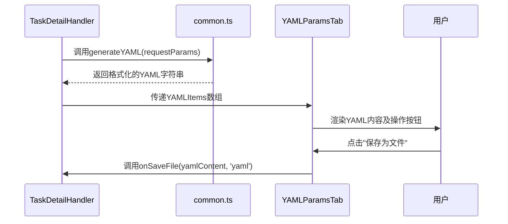

# YAML 格式生成

<cite>
**Referenced Files in This Document **   
- [common.ts](file://src/utils/common.ts)
- [YAMLParamsTab.tsx](file://src/components/tabs/YAMLParamsTab.tsx)
- [TaskDetailHandler.ts](file://src/handlers/pages/TaskDetailHandler.ts)
- [package.json](file://package.json)
</cite>

## 目录
1. [generateYAML 函数详解](#generateyaml-函数详解)
2. [js-yaml 库集成与配置](#js-yaml-库集成与配置)
3. [YAMLParamsTab 组件中的调用场景](#yamlparamstab-组件中的调用场景)
4. [输出样例对比分析](#输出样例对比分析)
5. [潜在风险与健壮性建议](#潜在风险与健壮性建议)
6. [用户体验价值](#用户体验价值)

## generateYAML 函数详解

`generateYAML` 函数是项目中负责将 JSON 对象转换为 YAML 字符串的核心工具函数，定义于 `src/utils/common.ts` 文件中。该函数接收任意类型的 JavaScript 对象作为输入参数，并利用 `js-yaml` 库的 `dump` 方法将其序列化为格式化的 YAML 字符串。

此函数在任务详情页面的数据处理流程中扮演关键角色，特别是在参数导出功能中，它确保了用户能够以标准、可读性强的 YAML 格式获取任务创建所需的完整配置信息。通过统一的转换逻辑，避免了手动拼接 YAML 字符串可能引入的语法错误和格式不一致问题。

**Section sources**
- [common.ts](file://src/utils/common.ts#L253-L260)

## js-yaml 库集成与配置

项目通过 npm 依赖管理明确引入了 `js-yaml@4.1.0` 版本，如 `package.json` 所示。`generateYAML` 函数对 `yaml.dump` 方法进行了精心配置，以满足生产环境下的安全性和一致性要求：



**Diagram sources **
- [common.ts](file://src/utils/common.ts#L253-L260)
- [package.json](file://package.json#L27)

### 配置项作用解析

- **`indent=2`**: 此配置确保输出的 YAML 文档使用两个空格进行层级缩进，极大地提升了人类阅读的可读性，符合业界通用的代码风格规范。
- **`lineWidth=-1`**: 将行宽限制设置为负值，明确禁用了 `js-yaml` 的自动文本折行功能。这对于包含长路径或命令的字段至关重要，能保证其内容完整性，避免被意外分割。
- **`noRefs=true`**: 关键的安全配置。它强制 `js-yaml` 在序列化时不使用 YAML 引用（`&anchor` 和 `*alias`）来表示重复结构。这有效防止了因循环引用或复杂对象图导致的内存泄漏风险，增强了函数的稳定性。
- **`noCompatMode=true`**: 启用严格模式，关闭了对过时 YAML 特性的兼容支持。这确保了生成的 YAML 符合现代标准，提高了不同系统间解析的一致性，减少了歧义。

**Section sources**
- [common.ts](file://src/utils/common.ts#L253-L260)
- [package.json](file://package.json#L27)

## YAMLParamsTab 组件中的调用场景

`generateYAML` 函数的实际应用主要体现在 `YAMLParamsTab` 组件中。该组件负责向用户展示以 YAML 格式呈现的任务参数。当用户访问任务详情页时，`TaskDetailHandler` 处理器会首先从后端 API 获取原始数据，经过格式化处理后，调用 `generateYAML` 函数将结构化的请求参数对象转换为 YAML 字符串。

随后，这个生成的 YAML 字符串作为 `text` 属性，被封装进一个 `YAMLItem` 对象，并传递给 `YAMLParamsTab` 组件进行渲染。用户界面提供了“一键复制”和“保存为文件”两个操作按钮，使得导出配置变得极为便捷。



**Diagram sources **
- [common.ts](file://src/utils/common.ts#L253-L260)
- [YAMLParamsTab.tsx](file://src/components/tabs/YAMLParamsTab.tsx#L0-L66)
- [TaskDetailHandler.ts](file://src/handlers/pages/TaskDetailHandler.ts#L0-L273)

**Section sources**
- [YAMLParamsTab.tsx](file://src/components/tabs/YAMLParamsTab.tsx#L0-L66)
- [TaskDetailHandler.ts](file://src/handlers/pages/TaskDetailHandler.ts#L0-L273)

## 输出样例对比分析

假设输入的 JSON 对象如下：
```json
{
  "name": "test-job",
  "jobFramework": "PyTorchJob",
  "queue": "gpu-pool",
  "jobSpec": {
    "image": "pytorch:v1.9",
    "resources": [
      { "name": "gpu", "quantity": 4 }
    ],
    "command": "python train.py --epochs 100"
  }
}
```

经 `generateYAML` 函数处理后，输出的 YAML 字符串为：
```yaml
name: test-job
jobFramework: PyTorchJob
queue: gpu-pool
jobSpec:
  image: pytorch:v1.9
  resources:
    - name: gpu
      quantity: 4
  command: python train.py --epochs 100
```

对比可见，JSON 的花括号 `{}` 和方括号 `[]` 被替换为基于缩进的层级结构，键值对间的冒号 `:` 得以保留，但整体格式更加简洁直观，特别适合用于配置文件。

## 潜在风险与健壮性建议

尽管当前实现已通过 `noRefs=true` 降低了部分风险，但仍存在潜在问题：`generateYAML` 函数直接调用 `yaml.dump` 而未包裹 `try-catch` 语句。如果传入的对象包含 `js-yaml` 无法序列化的类型（如 `undefined`、`Symbol` 或循环引用对象），函数将抛出运行时异常，可能导致调用链中断。

**建议增强方案**：
```typescript
export const generateYAML = (data: any): string => {
  try {
    return yaml.dump(data, {
      indent: 2,
      lineWidth: -1,
      noRefs: true,
      noCompatMode: true,
    });
  } catch (error) {
    console.error('YAML序列化失败:', error);
    return `# YAML生成失败: ${(error as Error).message}\n# 原始数据:\n${JSON.stringify(data, null, 2)}`;
  }
};
```
此改进能捕获序列化过程中的任何错误，返回一个带有错误信息的注释式 YAML，既保证了程序的健壮性，又为用户提供了调试线索。

**Section sources**
- [common.ts](file://src/utils/common.ts#L253-L260)

## 用户体验价值

`generateYAML` 函数在提升用户体验方面具有核心价值。它将复杂的、面向机器的 JSON 数据，转化为语义清晰、易于理解的 YAML 配置。这种转换不仅方便运维人员直接阅读和修改，也简化了自动化脚本的编写过程。通过提供标准化的参数导出功能，该函数显著降低了用户的认知负担和操作成本，是连接前端交互与后端配置的关键桥梁。