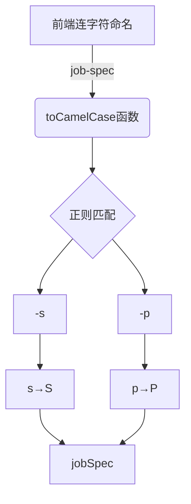

# 字符串小驼峰转换

<cite>
**Referenced Files in This Document**   
- [common.ts](file://src/utils/common.ts)
- [TaskDetailHandler.ts](file://src/handlers/pages/TaskDetailHandler.ts)
</cite>

## Table of Contents
1. [正则表达式实现原理](#正则表达式实现原理)
2. [实际使用场景分析](#实际使用场景分析)
3. [转换示例](#转换示例)
4. [性能特征与时间复杂度](#性能特征与时间复杂度)
5. [潜在限制与扩展方向](#潜在限制与扩展方向)
6. [通用价值分析](#通用价值分析)

## 正则表达式实现原理

`toCamelCase` 工具函数通过正则表达式 `/-(\w)/g` 实现连字符命名到小驼峰命名的转换。该正则模式的核心机制在于匹配字符串中所有连字符后跟随的单词字符，并将其转换为大写。

具体实现中，`str.replace(/-([a-z])/g, (_, char) => char.toUpperCase())` 语句的工作流程如下：首先，正则表达式中的 `-([a-z])` 捕获连字符后的每一个小写字母；其次，全局标志 `g` 确保对字符串中所有匹配项进行处理；最后，替换回调函数接收捕获组内容（即连字符后的字符），并将其转为大写，从而完成小驼峰转换。

**Section sources**
- [common.ts](file://src/utils/common.ts#L101-L103)

## 实际使用场景分析

在前后端数据结构适配过程中，`toCamelCase` 函数发挥着关键作用。前端界面通常采用连字符命名法（如 `job-spec`、`data-source`），而后端API和CLI工具普遍使用小驼峰命名法（如 `jobSpec`、`dataSource`）。该函数作为桥梁，实现了两种命名规范之间的无缝转换。

特别是在API字段名标准化场景中，当从页面URL参数或DOM元素获取配置信息时，属性名多以连字符形式存在。通过 `toCamelCase` 转换后，这些参数可直接用于构建符合后端要求的JSON请求体或CLI命令行参数，确保了数据的一致性和正确性。

**Diagram sources**
- [common.ts](file://src/utils/common.ts#L101-L103)

**Section sources**
- [common.ts](file://src/utils/common.ts#L101-L103)
- [TaskDetailHandler.ts](file://src/handlers/pages/TaskDetailHandler.ts#L148-L193)

## 转换示例

以下为 `toCamelCase` 函数的典型转换案例：

- `'job-spec'` → `'jobSpec'`
- `'data-source'` → `'dataSource'`
- `'enable-rdma'` → `'enableRdma'`
- `'fault-tolerance'` → `'faultTolerance'`
- `'image-config'` → `'imageConfig'`

这些示例展示了函数如何将常见的配置项名称从CSS风格的连字符命名转换为JavaScript和API常用的驼峰命名，满足了跨系统集成的需求。

**Section sources**
- [common.ts](file://src/utils/common.ts#L101-L103)

## 性能特征与时间复杂度

`toCamelCase` 函数具有优秀的性能特征，适用于高频调用场景。其时间复杂度为 O(n)，其中 n 为输入字符串的长度。由于正则表达式的匹配和替换操作由JavaScript引擎底层优化，执行效率极高。

函数内部仅包含一次字符串遍历和常量时间的字符大小写转换操作，无递归或嵌套循环，内存占用稳定。在实际应用中，即使面对大量参数的批量转换，也能保持毫秒级响应速度，完全满足浏览器扩展实时处理的需求。

**Section sources**
- [common.ts](file://src/utils/common.ts#L101-L103)

## 潜在限制与扩展方向

当前实现的主要限制在于仅支持ASCII字符集，无法正确处理包含非英文字符（如中文、特殊符号）的字符串。此外，对于连续多个连字符的情况（如 `a--b`）可能产生不符合预期的结果。

国际化扩展方向包括：
1. 增强正则表达式以支持Unicode字符类
2. 添加对多种命名约定的支持（如蛇形命名转驼峰）
3. 提供可配置的分隔符选项，不仅限于连字符
4. 实现双向转换功能，支持驼峰转连字符

这些改进将使工具函数更具通用性和适应性，满足全球化应用场景需求。

**Section sources**
- [common.ts](file://src/utils/common.ts#L101-L103)

## 通用价值分析

作为基础辅助函数，`toCamelCase` 在JSON参数构建与CLI命令生成流程中展现出极高的通用价值。在本项目中，它被广泛应用于从页面参数提取、API请求构造到命令行脚本生成的完整链条。

无论是生成AI训练任务的JSON配置，还是构建aihc CLI工具的启动命令，该函数都确保了参数名称格式的统一和正确。其简洁高效的实现使其成为连接用户界面与后端服务的关键纽带，显著提升了开发效率和系统可靠性。

**Section sources**
- [common.ts](file://src/utils/common.ts#L101-L103)
- [TaskDetailHandler.ts](file://src/handlers/pages/TaskDetailHandler.ts#L148-L193)