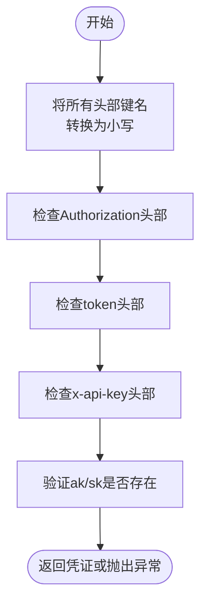
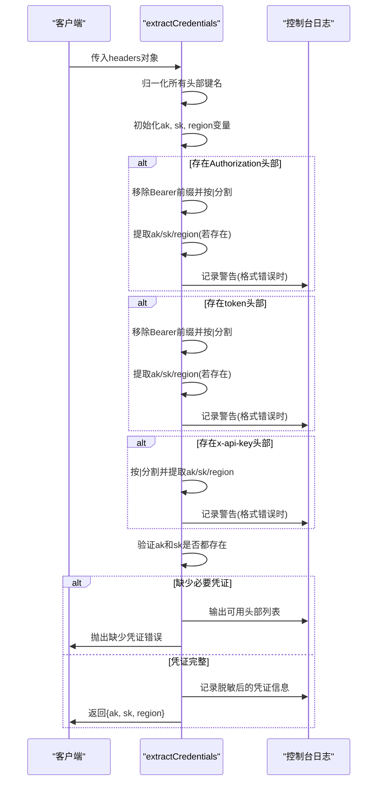

# 认证凭证提取

<cite>
**本文档中引用的文件**
- [common.ts](file://src/utils/common.ts)
- [index.ts](file://src/types/index.ts)
</cite>

## 目录
1. [简介](#简介)
2. [核心功能分析](#核心功能分析)
3. [大小写不敏感与归一化机制](#大小写不敏感与归一化机制)
4. [多头部认证格式解析逻辑](#多头部认证格式解析逻辑)
5. [优先级合并规则与默认region设置](#优先级合并规则与默认region设置)
6. [异常处理与降级策略](#异常处理与降级策略)
7. [边缘情况行为示例](#边缘情况行为示例)
8. [调试建议](#调试建议)
9. [在跨域请求与内容脚本中的桥梁作用](#在跨域请求与内容脚本中的桥梁作用)

## 简介
`extractCredentials` 函数是AIHCX浏览器扩展中的核心安全组件，负责从HTTP请求头中标准化提取访问密钥（ak）、秘密密钥（sk）和区域信息（region）。该函数设计用于处理多种认证方式，确保系统能够在不同场景下可靠地获取用户身份凭证。其主要职责包括：统一处理不同命名规范的认证头部、解析多种分隔符格式的凭证数据、实施合理的默认值策略以及提供清晰的错误反馈机制。

## 核心功能分析

`extractCredentials` 函数实现了从 `RequestHeaders` 接口定义的多种HTTP头部中提取认证信息的完整流程。函数接收一个包含各种可能认证信息的头部对象，并返回结构化的 `{ ak, sk, region }` 凭证对象。整个过程遵循先归一化、再解析、最后验证的原则，确保了输入源的多样性不会影响输出结果的一致性。

**Section sources**
- [common.ts](file://src/utils/common.ts#L19-L98)
- [index.ts](file://src/types/index.ts#L0-L10)

## 大小写不敏感与归一化机制

为解决HTTP头部名称大小写不一致的问题，`extractCredentials` 首先对所有传入的头部进行归一化处理。通过遍历原始头部对象，将每个键名转换为全小写形式并存入新的 `normalizedHeaders` 对象中。这一预处理步骤确保了后续逻辑无需关心 `Authorization`、`authorization` 或 `AUTHORIZATION` 等变体，从而实现了完全的大小写不敏感性。例如，无论前端传递的是 `X-API-Key` 还是 `x-api-key`，在归一化后都将统一以 `'x-api-key'` 的形式被处理。

**Diagram sources**
- [common.ts](file://src/utils/common.ts#L19-L30)

**Section sources**
- [common.ts](file://src/utils/common.ts#L19-L30)

## 多头部认证格式解析逻辑

函数支持三种主要的认证头部：`authorization`、`token` 和 `x-api-key`。对于前两者，会先移除可选的 `"Bearer "` 前缀，然后使用管道符 `|` 对值进行分割。预期的格式为 `ak|sk|region`，其中前两部分是必需的。`x-api-key` 头部则直接按 `|` 分割，不进行前缀处理。解析时采用“首次有效”原则，即如果某个字段（如ak）已在前面的头部中成功提取，则后续头部中的同名字段将被忽略，保证了优先级顺序。

**Diagram sources**
- [common.ts](file://src/utils/common.ts#L32-L70)

**Section sources**
- [common.ts](file://src/utils/common.ts#L32-L70)

## 优先级合并规则与默认region设置

当多个认证头部同时存在时，`extractCredentials` 采用顺序优先级策略。函数按照 `authorization` → `token` → `x-api-key` 的顺序依次处理，且使用 `||` 操作符进行赋值，这意味着一旦某个字段（如ak）被成功赋值，后续的赋值尝试将被短路跳过。这种设计既允许凭证分散在不同头部，又避免了潜在的冲突。对于 `region` 字段，函数设置了默认值 `'bj'`（北京），只有当所有头部均未提供region信息时才会使用此默认值，体现了对业务连续性的考量。

## 异常处理与降级策略

函数内置了完善的异常捕获机制。每个头部的解析过程都被包裹在 `try-catch` 块中，防止个别头部的解析错误导致整个函数崩溃。对于格式错误的情况（如分割后不足两部分），函数会输出警告日志但继续执行，体现了优雅降级的设计思想。最终的验证阶段会检查 `ak` 和 `sk` 是否都已成功提取，若任一缺失，则抛出明确的错误提示，并列出所有可用的头部供开发者排查问题。

## 边缘情况行为示例

以下是一些典型边缘情况的行为表现：
- **仅提供ak**: 输入 `authorization: "abc123"` 将触发格式警告，最终因缺少sk而抛出异常。
- **部分字段缺失**: 输入 `x-api-key: "abc123|def456"` 能成功提取ak和sk，region使用默认值'bj'。
- **格式错误**: 输入 `token: "abc123"` (单个值) 会记录警告，但如果其他头部提供了完整凭证，则整体仍能成功。
- **大小写混合**: 输入 `Authorization: "Bearer ABC|DEF"`, `SK: "xyz"` 能正确归一化并合并，最终ak="ABC", sk="xyz"。

## 调试建议

当凭证提取失败时，应首先检查浏览器控制台的输出日志。函数会在缺少凭证时打印所有可用的头部名称，这有助于确认前端是否正确发送了认证信息。其次，验证各头部的格式是否符合 `ak|sk|region` 的要求，特别注意是否有意外的空格或特殊字符。可以临时修改代码，在关键节点添加更详细的日志输出，追踪 `normalizedHeaders` 的内容和各字段的赋值过程。此外，确保没有其他中间件或代理修改了原始的HTTP头部。

## 在跨域请求与内容脚本中的桥梁作用

`extractCredentials` 函数在扩展的架构中扮演着关键的桥梁角色。它通常由后台脚本（background script）调用，用于处理来自弹出页面（popup）或内容脚本（content script）的消息。由于内容脚本运行在网页的上下文中，可以直接访问页面的请求头，而后台脚本则拥有发起跨域API请求的能力。`extractCredentials` 作为中间层，安全地解析并验证从内容脚本传递过来的认证信息，然后由后台脚本使用这些凭证向远程服务器发起经过授权的请求，从而实现了安全的跨域通信。

**Section sources**
- [common.ts](file://src/utils/common.ts#L19-L98)
- [chromeApi.ts](file://src/utils/chromeApi.ts#L76-L86)
- [index.ts](file://src/background/index.ts#L67-L121)