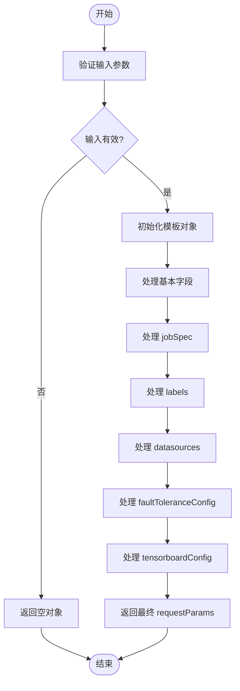
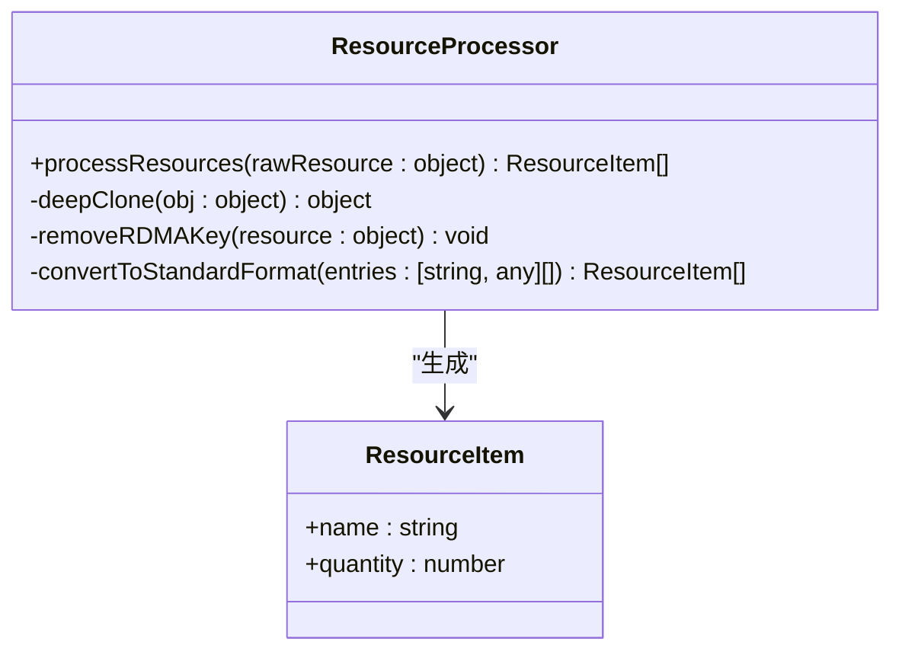

# 请求参数格式化

<cite>
**本文档引用的文件**
- [common.ts](file://src/utils/common.ts)
- [TaskDetailHandler.ts](file://src/handlers/pages/TaskDetailHandler.ts)
</cite>

## 目录
1. [简介](#简介)
2. [核心功能解析](#核心功能解析)
3. [jobSpec 结构映射规则](#jobspec-结构映射规则)
4. [资源字段处理机制](#资源字段处理机制)
5. [环境变量过滤策略](#环境变量过滤策略)
6. [标签与数据源重组逻辑](#标签与数据源重组逻辑)
7. [典型配置案例分析](#典型配置案例分析)
8. [调试技巧与验证方法](#调试技巧与验证方法)

## 简介
`formatRequestParams` 函数是 AIHCX-EXT 扩展中的关键工具函数，负责将用户输入的原始参数转换为符合 AIHC Job API 规范的标准化请求对象。该函数位于 `src/utils/common.ts` 文件中，通过一系列复杂的映射、过滤和重组操作，确保生成的 `requestParams` 对象能够正确描述机器学习任务的各项配置。

**Section sources**
- [common.ts](file://src/utils/common.ts#L106-L250)

## 核心功能解析
`formatRequestParams` 函数接收任意类型的输入参数，并首先进行类型检查。若输入无效，则返回空对象；否则，基于预设模板构建包含 jobSpec、labels、datasources 等复杂嵌套结构的初始 requestParams 对象。随后根据实际传入的参数值对各个字段进行条件性更新，实现从用户输入到 API 兼容格式的完整转换。



**Diagram sources**
- [common.ts](file://src/utils/common.ts#L106-L250)

**Section sources**
- [common.ts](file://src/utils/common.ts#L106-L250)

## jobSpec 结构映射规则
`jobSpec` 是任务规格的核心部分，其构建过程涉及多个子字段的精确映射：

- **镜像配置**：由 `params.jobSpec.Master.image` 和 `tag` 拼接而成，格式为 `${image}:${tag}`。
- **副本数量**：支持 Worker 和 Master 的联合计算，若存在 Worker 则总副本数为两者之和，否则仅使用 Master 副本数。
- **执行命令**：优先使用外部传入的 `command` 参数，若未提供则留空字符串。
- **主机网络**：根据 `hostNetwork` 参数决定是否启用主机网络模式。

这些映射规则确保了任务容器的基本运行环境被准确描述。

**Section sources**
- [common.ts](file://src/utils/common.ts#L106-L250)

## 资源字段处理机制
资源字段（resources）的处理采用了深度克隆与特定键删除的技术组合：

1. 使用 `JSON.parse(JSON.stringify(...))` 对 `params.jobSpec.Master.resource` 进行深度克隆，避免修改原始数据。
2. 显式检查并删除 `rdma/hca` 键，防止其出现在最终的 resources 数组中。
3. 将剩余资源条目转换为标准数组格式，每个元素包含 `name` 和 `quantity` 字段。

这种设计的背后技术动因在于：
- **隔离关注点**：`rdma/hca` 用于判断 RDMA 功能开关，但不应作为普通资源项提交给 API。
- **数据一致性**：通过深克隆保证输入数据不变性，提升函数的可预测性和测试友好性。
- **API 合规性**：确保输出结构严格遵循 AIHC Job API 的 schema 定义。



**Diagram sources**
- [common.ts](file://src/utils/common.ts#L106-L250)

**Section sources**
- [common.ts](file://src/utils/common.ts#L106-L250)

## 环境变量过滤策略
环境变量（envs）的处理包含严格的过滤机制，旨在排除可能影响任务隔离性的系统级变量：

- **过滤列表**：明确排除 `AIHC_JOB_NAME`, `AIHC_TENSORBOARD_LOG_PATH`, `MASTER`, `NCCL_DEBUG`, `NCCL_IB_DISABLE` 等五个特定名称的环境变量。
- **字符串化处理**：所有保留的环境变量值均通过 `String()` 强制转换为字符串类型，确保数据类型一致性。
- **条件构建**：仅当 `params.jobSpec.Master.env` 存在时才执行映射操作，避免空引用错误。

此过滤机制保障了用户自定义环境变量不会与平台内部变量冲突，增强了任务间的隔离性和安全性。

**Section sources**
- [common.ts](file://src/utils/common.ts#L106-L250)

## 标签与数据源重组逻辑
### 标签（labels）处理
- 排除键名为 `aijob.cce.baidubce.com/create-from-aihcp` 的特殊标签，防止其被传递至新任务。
- 将其余标签转换为 `{key, value}` 对象数组，且所有值均转为字符串。

### 数据源（datasources）处理
- 过滤掉类型为 `emptydir` 的数据源，因其通常用于临时存储且不适合跨任务复用。
- 为每个保留的数据源设置默认挂载路径 `/mnt/cluster` 和源路径 `/`。
- 保持 `type`, `name`, `sourcePath`, `mountPath` 四个核心字段的映射关系。

这种条件性重组逻辑确保了生成的任务配置既简洁又实用，去除了不必要的或潜在危险的配置项。

**Section sources**
- [common.ts](file://src/utils/common.ts#L106-L250)

## 典型配置案例分析
考虑以下典型任务配置场景：

```json
{
  "name": "llama-training",
  "queue": "gpu-pool",
  "jobFramework": "pytorch",
  "jobSpec": {
    "Master": {
      "image": "registry.baidubce.com/aihc-aiak/llama-train",
      "tag": "v1.0",
      "replicas": 1,
      "resource": {
        "baidu.com/a800_80g_cgpu": 8,
        "rdma/hca": true
      },
      "env": {
        "CUDA_VISIBLE_DEVICES": "0,1,2,3",
        "PYTHONPATH": "/app"
      }
    }
  },
  "datasource": [
    {"type": "pfs", "name": "data-pfs", "mountPath": "/data"},
    {"type": "emptydir", "name": "temp-dir"}
  ]
}
```

经过 `formatRequestParams` 处理后，`rdma/hca` 被移除但 `enableRDMA` 设为 `true`，`emptydir` 类型数据源被过滤，最终生成符合 API 要求的 requestParams 对象。

**Section sources**
- [common.ts](file://src/utils/common.ts#L106-L250)

## 调试技巧与验证方法
为验证 `formatRequestParams` 生成参数的正确性，建议采用以下调试技巧：

1. **日志追踪**：在调用前后打印输入输出，对比差异。
2. **单元测试**：针对边界情况（如空输入、缺失字段）编写测试用例。
3. **结构校验**：使用 JSON Schema 验证输出是否符合 API 文档定义。
4. **集成验证**：将生成的参数直接用于创建任务，观察实际行为。

此外，可通过浏览器开发者工具监控 `TaskDetailHandler` 中的日志输出，查看 `解析后的任务信息` 和 `requestParams` 的具体值，辅助定位问题。

**Section sources**
- [common.ts](file://src/utils/common.ts#L106-L250)
- [TaskDetailHandler.ts](file://src/handlers/pages/TaskDetailHandler.ts#L148-L193)