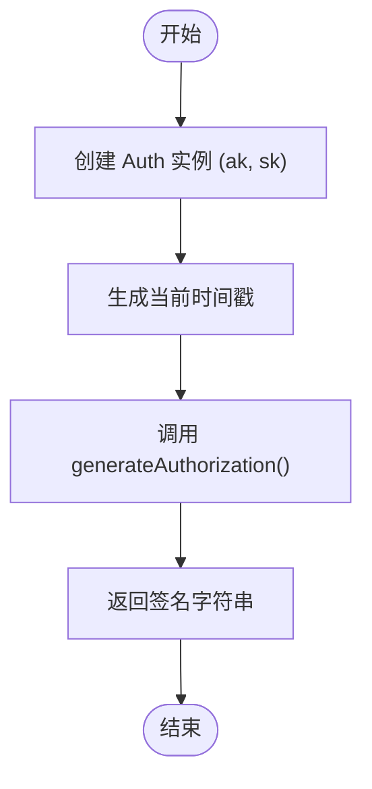
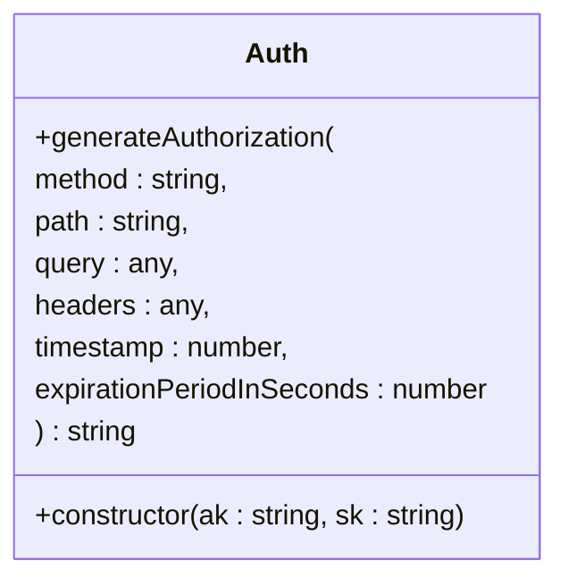
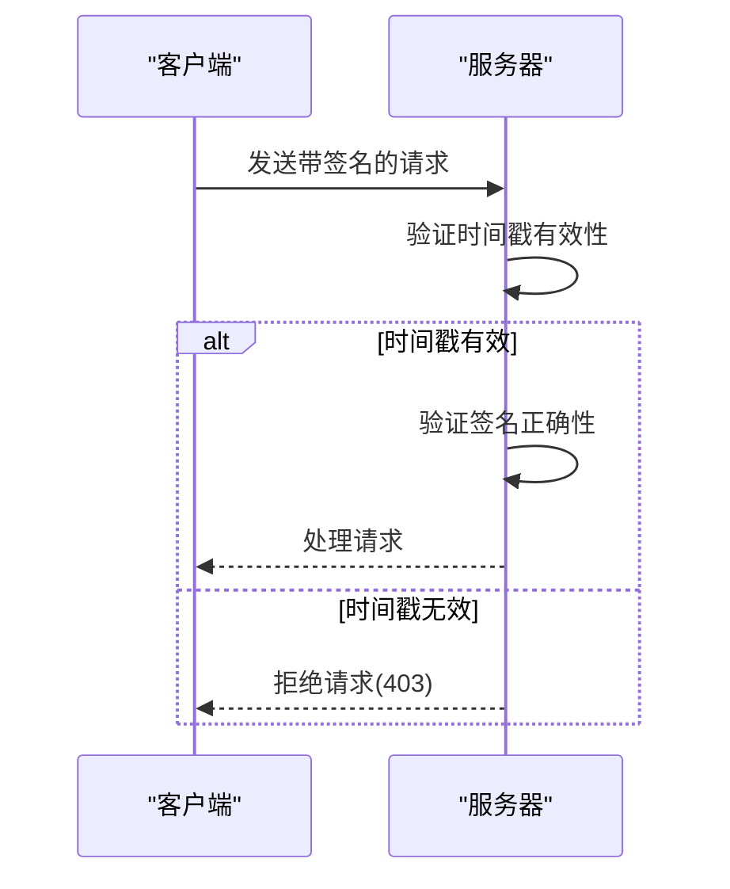
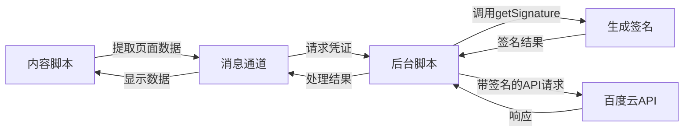

# 请求签名生成

<cite>
**Referenced Files in This Document **   
- [common.ts](file://src/utils/common.ts)
- [baiducloud.d.ts](file://src/types/baiducloud.d.ts)
- [aihcApi.ts](file://src/services/aihcApi.ts)
</cite>

## 目录
1. [核心功能概述](#核心功能概述)
2. [getSignature 函数实现分析](#getsignature-函数实现分析)
3. [Auth 类接口定义](#auth-类接口定义)
4. [签名参数作用详解](#签名参数作用详解)
5. [时间戳与过期周期安全设计](#时间戳与过期周期安全设计)
6. [实际调用示例](#实际调用示例)
7. [Chrome 扩展环境下的安全边界](#chrome-扩展环境下的安全边界)
8. [消息通信链路中的位置](#消息通信链路中的位置)
9. [常见错误排查方法](#常见错误排查方法)

## 核心功能概述

`getSignature` 函数是本扩展中用于生成百度云API请求签名的核心工具。它封装了对 `@baiducloud/sdk` 库中 `Auth` 类的调用，为所有需要认证的API请求提供符合百度云规范的授权凭证。该函数在扩展的后台服务、内容脚本和弹出窗口之间构成了统一的安全通信基础。

**Section sources**
- [common.ts](file://src/utils/common.ts#L4-L16)

## getSignature 函数实现分析

`getSignature` 函数通过实例化 `Auth` 类并调用其 `generateAuthorization` 方法来完成签名生成。函数内部自动处理时间戳生成和固定1800秒的过期周期设置，简化了上层调用逻辑。



**Diagram sources **
- [common.ts](file://src/utils/common.ts#L4-L16)

**Section sources**
- [common.ts](file://src/utils/common.ts#L4-L16)

## Auth 类接口定义

`Auth` 类来自 `@baiducloud/sdk` 库，提供了标准化的百度云请求签名能力。其类型定义明确了 `getSignature` 函数所依赖的外部接口契约。



**Diagram sources **
- [baiducloud.d.ts](file://src/types/baiducloud.d.ts#L1-L12)

**Section sources**
- [baiducloud.d.ts](file://src/types/baiducloud.d.ts#L1-L12)

## 签名参数作用详解

`getSignature` 函数接收六个关键参数，每个参数在签名过程中扮演特定角色：

| 参数 | 作用 | 来源 |
|------|------|------|
| ak | 访问密钥ID，标识请求发起者身份 | 用户凭证或请求头 |
| sk | 秘密访问密钥，用于签名计算的密钥材料 | 用户凭证或请求头 |
| method | HTTP方法（GET/POST等），参与签名计算 | API请求定义 |
| path | 请求路径，标识目标资源 | API请求定义 |
| query | 查询参数对象，需包含在签名中 | API请求参数 |
| headers | 请求头对象，部分头参与签名 | API请求配置 |

这些参数共同构成了签名算法的输入，确保请求的完整性和不可篡改性。

**Section sources**
- [common.ts](file://src/utils/common.ts#L4-L16)

## 时间戳与过期周期安全设计

`getSignature` 函数采用严格的安全设计原则：

1. **实时时间戳**：使用 `Date.now()` 获取毫秒级时间戳并转换为秒，确保每次请求都有唯一的时间标识。
2. **1800秒过期周期**：固定设置1800秒（30分钟）的有效期，平衡安全性与可用性。
3. **防重放攻击**：服务器会验证时间戳是否在有效期内，拒绝过期或未来时间的请求，防止请求被截获后重放。

这种设计既避免了因客户端时钟偏差导致的频繁失败，又有效限制了签名泄露后的可利用时间窗口。



**Diagram sources **
- [common.ts](file://src/utils/common.ts#L4-L16)

**Section sources**
- [common.ts](file://src/utils/common.ts#L4-L16)

## 实际调用示例

以下是 `getSignature` 在不同场景下的典型调用方式：

### 场景一：获取资源池列表
```typescript
const signature = getSignature(
  ak, 
  sk, 
  'GET', 
  '/api/aihc/aihc-service/v3/resourcepools', 
  { region: 'bj' }, 
  {}
);
```

### 场景二：提交任务请求
```typescript
const signature = getSignature(
  ak, 
  sk, 
  'POST', 
  '/api/cce/ai-service/v1/cluster/{clusterId}/aijobv3', 
  { queueID: 'queue-123' }, 
  { 'Content-Type': 'application/json' }
);
```

这些示例展示了如何根据具体API构造正确的签名参数。

**Section sources**
- [aihcApi.ts](file://src/services/aihcApi.ts#L51-L555)

## Chrome 扩展环境下的安全边界

在Chrome扩展环境中，敏感信息 `sk` 的处理遵循严格的安全边界：

1. **内存中处理**：`sk` 仅在内存中传递，不持久化存储于非安全区域。
2. **最小暴露原则**：`sk` 只在必要时解密并传递给 `getSignature`，完成后立即从临时变量清除。
3. **上下文隔离**：内容脚本与后台脚本通过安全的消息通道通信，避免直接共享敏感数据。

这种设计确保了即使内容脚本运行在不受信任的网页环境中，用户的 `sk` 也不会被恶意页面窃取。

**Section sources**
- [common.ts](file://src/utils/common.ts#L4-L16)
- [aihcApi.ts](file://src/services/aihcApi.ts#L51-L555)

## 消息通信链路中的位置

`getSignature` 函数位于扩展消息通信链路的关键位置：



该函数作为后台脚本的一部分，在接收到内容脚本的请求后生成签名，是安全通信链路的核心环节。

**Diagram sources **
- [aihcApi.ts](file://src/services/aihcApi.ts#L51-L555)
- [common.ts](file://src/utils/common.ts#L4-L16)

**Section sources**
- [aihcApi.ts](file://src/services/aihcApi.ts#L51-L555)
- [common.ts](file://src/utils/common.ts#L4-L16)

## 常见错误排查方法

### 时间偏差问题
当出现 `RequestTimeTooSkewed` 错误时：
1. 检查客户端系统时间是否准确
2. 确保网络延迟不会导致请求耗时过长
3. 考虑在签名生成前重新获取时间戳

### 权限不足问题
当出现 `AccessDenied` 错误时：
1. 验证 `ak/sk` 是否具有目标API的操作权限
2. 检查 `ak/sk` 是否已过期或被禁用
3. 确认请求的 `region` 参数是否正确

### 签名不匹配问题
当出现 `SignatureDoesNotMatch` 错误时：
1. 确保所有参与签名的参数（query、headers）都正确传递
2. 验证 `method` 和 `path` 是否与实际请求完全一致
3. 检查 `sk` 是否在传输过程中被意外修改

这些排查方法帮助开发者快速定位和解决常见的认证问题。

**Section sources**
- [common.ts](file://src/utils/common.ts#L4-L16)
- [aihcApi.ts](file://src/services/aihcApi.ts#L51-L555)