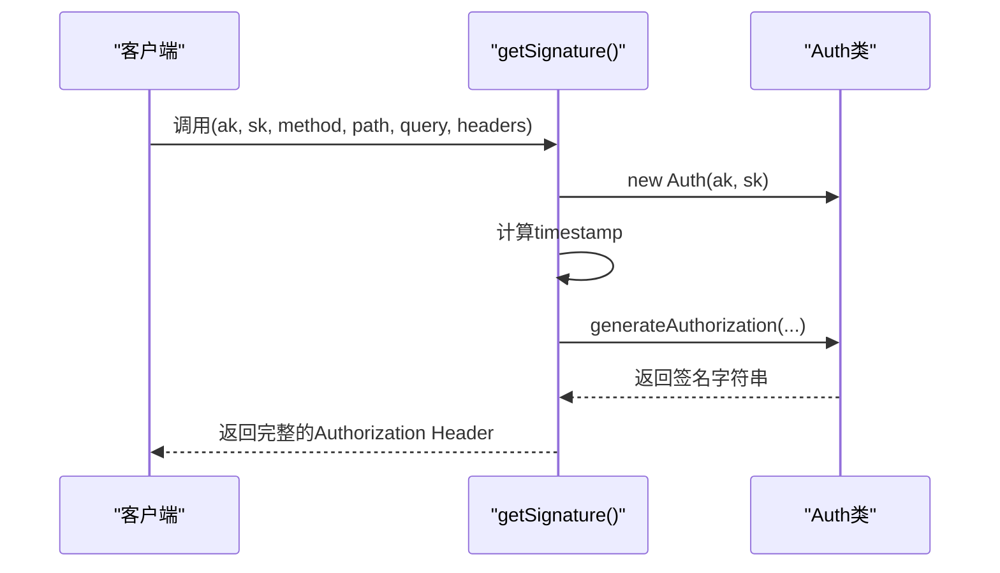
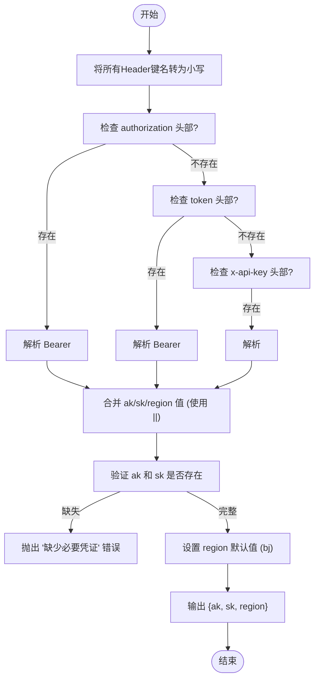

<cite>
**Referenced Files in This Document**
- [common.ts](file://src/utils/common.ts)
- [baiducloud.d.ts](file://src/types/baiducloud.d.ts)
- [index.ts](file://src/types/index.ts)
</cite>

## 目录
1. [通用工具函数](#通用工具函数)
2. [核心工具函数详解](#核心工具函数详解)
   1. [请求签名生成 (getSignature)](#请求签名生成-getsignature)
   2. [凭证提取与标准化 (extractCredentials)](#凭证提取与标准化-extractcredentials)
   3. [字符串格式转换 (toCamelCase)](#字符串格式转换-tocamelcase)
   4. [请求参数构建 (formatRequestParams)](#请求参数构建-formatrequestparams)
   5. [JSON转YAML序列化 (generateYAML)](#json转yaml序列化-generateyaml)
   6. [CLI命令动态生成 (generateCLICommand)](#cli命令动态生成-generateclicommand)

## 通用工具函数

本节系统化文档化 `common.ts` 文件中的所有核心工具函数。这些函数构成了AIHCX浏览器扩展的核心逻辑，负责处理从认证、数据格式化到命令生成的多种任务。

**Section sources**
- [common.ts](file://src/utils/common.ts#L0-L355)

## 核心工具函数详解

### 请求签名生成 (getSignature)

`getSignature` 函数是与百度云API进行安全通信的关键组件。它利用 `@baiducloud/sdk` 库中的 `Auth` 类来生成符合百度云规范的请求签名（Authorization Header）。

该函数的工作流程如下：
1.  **初始化认证对象**：使用传入的访问密钥（ak）和秘密密钥（sk）创建一个 `Auth` 实例。
2.  **准备时间戳**：获取当前时间的Unix时间戳（秒），用于确保请求的时效性。
3.  **设置过期时间**：定义签名的有效期为1800秒（30分钟）。
4.  **生成签名**：调用 `Auth` 对象的 `generateAuthorization` 方法，传入HTTP方法、请求路径、查询参数、请求头、时间戳和过期时间，最终返回一个标准的授权字符串。

此机制确保了所有发往AIHC API的请求都经过了正确的身份验证和防重放攻击保护。

**Diagram sources**
- [common.ts](file://src/utils/common.ts#L4-L16)
- [baiducloud.d.ts](file://src/types/baiducloud.d.ts#L1-L11)

**Section sources**
- [common.ts](file://src/utils/common.ts#L4-L16)
- [baiducloud.d.ts](file://src/types/baiducloud.d.ts#L1-L11)

### 凭证提取与标准化 (extractCredentials)

`extractCredentials` 函数负责从HTTP请求头中可靠地提取用户的身份凭证（ak/sk/region）。它设计得非常健壮，能够处理多种常见的认证头部，并解决了大小写不敏感和分隔符解析的问题。

其核心实现逻辑包括：
1.  **头部归一化**：首先遍历所有传入的请求头，将键名统一转换为小写，创建一个 `normalizedHeaders` 对象。这解决了HTTP头部大小写不一致的问题。
2.  **多源凭证提取**：函数按优先级顺序检查多个可能包含凭证的头部：
    *   **`authorization` 头部**：移除前缀 "Bearer " 后，以竖线 `|` 为分隔符拆分值。第一部分为ak，第二部分为sk，第三部分（可选）为region。
    *   **`token` 头部**：处理方式与 `authorization` 头部完全相同。
    *   **`x-api-key` 头部**：同样以 `|` 分隔符解析ak、sk和region。
3.  **合并与回退**：对于每个凭证字段（ak, sk, region），函数采用“或”操作（`||`）进行赋值。这意味着如果某个字段在高优先级头部中未找到，会尝试从低优先级头部中获取。例如，`ak = ak || parts[0]` 表示如果之前没有找到ak，则使用当前头部解析出的第一个部分。
4.  **默认值与验证**：`region` 字段如果没有在任何头部中指定，则默认为 `'bj'`。最后，函数会严格校验ak和sk是否都已成功提取，若缺少任一关键凭证，则抛出错误。

这种设计使得系统能够兼容不同来源和格式的认证信息，极大地提升了用户体验和系统的鲁棒性。

**Diagram sources**
- [common.ts](file://src/utils/common.ts#L19-L98)
- [index.ts](file://src/types/index.ts#L1-L10)

**Section sources**
- [common.ts](file://src/utils/common.ts#L19-L98)
- [index.ts](file://src/types/index.ts#L1-L10)

### 字符串格式转换 (toCamelCase)

`toCamelCase` 函数是一个简洁高效的字符串工具，用于将连字符分隔的字符串（如 `hello-world`）转换为小驼峰命名法（如 `helloWorld`）。

其实现原理基于JavaScript的正则表达式替换（`String.prototype.replace`）：
*   **正则模式 `/ -([a-z])/g`**:
    *   `-` 匹配连字符。
    *   `([a-z])` 是一个捕获组，匹配紧跟在连字符后的任意一个小写字母，并将其捕获。
    *   `g` 标志表示全局搜索，替换字符串中所有匹配的位置。
*   **替换函数 `(_, char) => char.toUpperCase()`**:
    *   该函数接收两个参数：第一个 `_` 是整个匹配的字符串（如 `-w`），我们忽略它；第二个 `char` 是捕获组的内容（如 `w`）。
    *   函数体将捕获到的小写字母 `char` 转换为大写，并作为替换结果。

通过这个巧妙的设计，函数能一次性处理字符串中所有的连字符组合，高效地完成格式转换。

**Section sources**
- [common.ts](file://src/utils/common.ts#L101-L103)

### 请求参数构建 (formatRequestParams)

`formatRequestParams` 函数是构建符合AIHC Job API规范的复杂请求体的核心引擎。它将用户提供的原始参数映射并填充到一个预定义的、结构化的 `requestParams` 对象中。

其主要功能和映射规则如下：
1.  **基础字段映射**：直接将输入参数中的 `name`, `queue`, `priority` 等字段复制到 `requestParams` 中，并提供默认值。
2.  **框架类型转换**：根据输入的 `jobFramework` 值（如 `pytorch`），将其转换为API期望的枚举值（如 `PyTorchJob`）。
3.  **`jobSpec` 结构构建**：
    *   **镜像**：将 `Master.image` 和 `Master.tag` 拼接成完整的镜像地址。
    *   **副本数**：综合计算Master和Worker的副本总数。
    *   **资源**：将 `Master.resource` 对象转换为包含 `name` 和 `quantity` 的数组，并过滤掉 `rdma/hca` 这类特殊资源项。
    *   **环境变量**：遍历 `Master.env` 对象，过滤掉特定的内部变量（如 `AIHC_JOB_NAME`），然后转换为API要求的数组格式。
    *   **RDMA**：根据 `Master.resource['rdma/hca']` 的存在与否来决定 `enableRDMA` 的布尔值。
4.  **`labels` 映射**：将输入的标签对象转换为键值对数组，并过滤掉特定的系统标签。
5.  **`datasources` 处理**：过滤掉类型为 `emptydir` 的数据源，并为每个有效数据源填充 `sourcePath` 和 `mountPath` 的默认值。
6.  **容错与TensorBoard配置**：根据输入条件，有条件地构建 `faultToleranceConfig` 和 `tensorboardConfig` 对象。

该函数通过深度处理和条件判断，确保了生成的请求体完全符合后端API的严格要求。

**Section sources**
- [common.ts](file://src/utils/common.ts#L106-L250)

### JSON转YAML序列化 (generateYAML)

`generateYAML` 函数利用 `js-yaml` 库，将一个JavaScript对象（JSON）安全、规范地转换为YAML格式的字符串。

该函数调用了 `yaml.dump` 方法，并设置了以下关键选项以保证输出质量：
*   **`indent: 2`**：使用2个空格进行缩进，保持YAML文件的可读性。
*   **`lineWidth: -1`**：禁用行宽限制，防止长字符串被自动折行，避免产生不必要的换行符。
*   **`noRefs: true`**：禁止使用YAML引用（`&` 和 `*`），简化输出，避免潜在的引用问题。
*   **`noCompatMode: true`**：关闭兼容模式，使用更现代和严格的YAML 1.2标准。

这些配置共同确保了生成的YAML字符串既美观又符合最佳实践，可以直接用于配置文件或CLI命令。

**Section sources**
- [common.ts](file://src/utils/common.ts#L253-L260)

### CLI命令动态生成 (generateCLICommand)

`generateCLICommand` 函数负责根据任务信息动态构建一个多行、带转义的 `aihc` CLI命令。它处理了复杂的参数顺序、条件添加和长命令的优雅展示。

其生成逻辑的关键点包括：
1.  **基础命令构建**：以 `aihc job create` 开头，添加必填的 `--name`, `--framework`, 和 `--image` 参数。
2.  **条件参数添加**：使用 `if` 语句判断，仅当参数存在且非默认值时才添加对应的CLI选项，例如 `--pool` 仅在队列不是 `default` 时添加。
3.  **循环参数处理**：对于资源（`--gpu`）和环境变量（`--env`）这类可能有多个的参数，使用 `forEach` 循环逐一添加。
4.  **复合参数处理**：对于容错相关的多个子参数，先在内存中构建一个数组 `ftArgs`，再用空格连接并包裹在引号内，通过 `--fault-tolerance-args` 一次性传递。
5.  **长命令处理**：对于过长的执行命令（`command`），函数会判断其长度。如果超过100个字符，则不会直接内联，而是提示用户将其保存为文件并使用 `--script-file` 参数，从而避免了命令行过长导致的问题。
6.  **格式化与转义**：整个命令使用反斜杠 `\` 进行多行连接，并使用 `$(printf "...")` 来安全地转义命令字符串中的特殊字符。

这一系列精心设计的步骤确保了生成的CLI命令不仅功能完整，而且格式正确、易于理解和使用。

**Section sources**
- [common.ts](file://src/utils/common.ts#L262-L355)