# 错误过滤机制

<cite>
**Referenced Files in This Document **   
- [errorFilter.ts](file://src/utils/errorFilter.ts)
</cite>

## 目录
1. [简介](#简介)
2. [核心设计与实现](#核心设计与实现)
3. [预定义过滤关键词分析](#预定义过滤关键词分析)
4. [运行时拦截逻辑](#运行时拦截逻辑)
5. [开发环境调试支持](#开发环境调试支持)
6. [自动初始化流程](#自动初始化流程)
7. [模块重要性与开发者体验](#模块重要性与开发者体验)

## 简介
`errorFilter` 模块是 AIHC 助手 Chrome 扩展中的关键工具，旨在提升开发者体验。该模块通过智能过滤由第三方脚本和 Monaco 编辑器加载过程引发的无关控制台警告与错误，有效减少控制台噪音。在非开发环境下，这些干扰信息被完全抑制；而在开发环境中，则保留标记以便于调试。

## 核心设计与实现

`errorFilter` 模块采用代理模式（Proxy Pattern）对浏览器原生 `console.warn` 和 `console.error` 方法进行包装，实现了运行时日志拦截。其核心思想是在不修改原有功能的前提下，动态增强控制台输出行为，从而实现选择性过滤。

该模块的设计遵循单一职责原则，专注于解决控制台日志污染问题。它通过定义两个独立的关键词列表——`WARNING_FILTERS` 和 `ERROR_FILTERS`，分别管理需要屏蔽的警告和错误类型。这种分离式设计提高了可维护性，使得未来扩展或调整过滤规则更加灵活。

**Section sources**
- [errorFilter.ts](file://src/utils/errorFilter.ts#L36-L84)

## 预定义过滤关键词分析

### 警告过滤关键词 (WARNING_FILTERS)
`WARNING_FILTERS` 数组包含了一系列特定字符串，用于识别并过滤常见的、非用户代码引起的控制台警告。这些关键词主要针对以下几类干扰源：

- **路由追踪相关**: 如 `'TrackRoute'`, `'Tracert before fns'`
- **UI组件框架日志**: 如 `'PermissionProvider.tsx'`, `'nested'`
- **事件处理日志**: 如 `'stop propagation'`, `'beforelog'`
- **Monaco编辑器加载失败**: 如 `'Loading "vs/css!vs/editor/editor.main" failed'`, `'Could not find https://code.bdstatic.com/npm/monaco-editor'`
- **脚本注入痕迹**: 如 `'Portal Assistant loaded'`, `'overrideMethod @ hook.js'`

当控制台输出的消息中包含上述任意关键词时，该警告将被判定为可过滤项。

### 错误过滤关键词 (ERROR_FILTERS)
`ERROR_FILTERS` 数组则专注于捕获扩展运行过程中可能出现的常见通信与上下文错误，主要包括：

- **跨域通信异常**: 如 `'Could not establish connection'`, `'Receiving end does not exist'`
- **Chrome API 异常**: 如 `'runtime.lastError'`, `'Extension context invalidated'`
- **资源加载失败**: 特别是 Monaco 编辑器静态资源缺失，如 `'Could not find https://code.bdstatic.com/npm/monaco-editor@0.28.1/min/vs/editor/editor.main.css'`
- **DOM 观察器异常**: 如 `'MutationObserver.observe.subtree'`

这些错误通常源于浏览器扩展生命周期或网络环境波动，并不代表用户应用存在缺陷。

**Section sources**
- [errorFilter.ts](file://src/utils/errorFilter.ts#L9-L21)
- [errorFilter.ts](file://src/utils/errorFilter.ts#L24-L33)

## 运行时拦截逻辑

```mermaid
flowchart TD
Start([开始: console.warn/console.error 调用]) --> Join["args.join(' ') 生成完整消息"]
Join --> CheckType{"判断方法类型"}
CheckType --> |warn| CheckWarning["检查是否匹配 WARNING_FILTERS"]
CheckType --> |error| CheckError["检查是否匹配 ERROR_FILTERS"]
CheckWarning --> ShouldFilterWarn{"shouldFilter = true?"}
CheckError --> ShouldFilterErr{"shouldFilter = true?"}
ShouldFilterWarn --> |是| IsDevWarn["isDevelopment?"]
ShouldFilterErr --> |是| IsDevErr["isDevelopment?"]
IsDevWarn --> |是| LogFilteredWarn["输出 '[已过滤警告]' + 原始参数"]
IsDevErr --> |是| LogFilteredErr["输出 '[已过滤错误]' + 原始参数"]
IsDevWarn --> |否| ReturnSilent["静默返回"]
IsDevErr --> |否| ReturnSilent
ShouldFilterWarn --> |否| LogOriginalWarn["调用 originalWarn(...args)"]
ShouldFilterErr --> |否| LogOriginalErr["调用 originalError(...args)"]
LogFilteredWarn --> End([结束])
LogFilteredErr --> End
ReturnSilent --> End
LogOriginalWarn --> End
LogOriginalErr --> End
```

**Diagram sources **
- [errorFilter.ts](file://src/utils/errorFilter.ts#L36-L84)

拦截逻辑的核心在于重写 `console.warn` 和 `console.error` 方法。模块首先保存原始方法引用，然后将其替换为自定义函数。新函数会将所有参数拼接成字符串，并使用 `Array.some()` 方法遍历对应的过滤数组，检查消息是否包含任一关键词。

一旦匹配成功，即认为该日志属于“噪音”，后续行为取决于当前环境模式。

## 开发环境调试支持

尽管模块的主要目标是抑制无关输出，但它充分考虑了开发者的调试需求。通过读取 `process.env.NODE_ENV` 环境变量判断是否处于开发模式（`isDevelopment = true`）。

在开发环境下，即使日志被过滤，系统仍会以特殊标记形式输出：
- 被过滤的警告前缀为 `[已过滤警告]`
- 被过滤的错误前缀为 `[已过滤错误]`

这一设计允许开发者清晰地看到哪些信息被拦截，便于确认过滤规则的有效性及排查潜在问题。而在生产环境中，这些输出则被完全静默，确保控制台干净整洁。

**Section sources**
- [errorFilter.ts](file://src/utils/errorFilter.ts#L36-L84)

## 自动初始化流程

**Diagram sources **
- [errorFilter.ts](file://src/utils/errorFilter.ts#L36-L84)

该模块采用立即执行模式，在文件被导入后自动调用 `initErrorFilter()` 函数完成初始化。此过程无需外部显式调用，保证了过滤功能的即时生效。初始化期间，模块完成以下操作：
1. 保存原始 `console.warn` 和 `console.error` 方法引用
2. 替换为带过滤逻辑的新实现
3. 输出启用提示，确认模块正常工作

## 模块重要性与开发者体验

`errorFilter` 模块对于提升开发者体验具有重要意义。现代 Web 应用常集成多种第三方库和工具（如 Monaco 编辑器），这些组件在加载或运行时可能产生大量无意义的警告和错误信息，严重干扰开发者对真实问题的判断。

通过精准识别并过滤这些噪音，该模块帮助开发者聚焦于真正相关的日志输出，显著降低了认知负担。同时，其环境感知能力确保了调试便利性与生产环境整洁性的平衡，体现了良好的工程实践。

此外，该模块的轻量级设计和自动初始化特性使其易于集成且无侵入性，是构建高质量浏览器扩展不可或缺的一部分。

**Section sources**
- [errorFilter.ts](file://src/utils/errorFilter.ts#L36-L84)