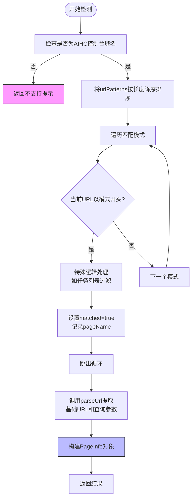

# 页面类型检测

<cite>
**本文档中引用的文件**  
- [pageDetection.ts](file://src/utils/pageDetection.ts)
- [index.ts](file://src/types/index.ts)
</cite>

## 目录
1. [简介](#简介)
2. [核心机制概述](#核心机制概述)
3. [URL模式映射表（urlPatterns）](#url模式映射表urlpatterns)
4. [页面类型检测流程（detectPageType）](#页面类型检测流程detectpagetype)
5. [URL解析逻辑（parseUrl）](#url解析逻辑parseurl)
6. [跨环境标签页信息获取（getCurrentTabInfo）](#跨环境标签页信息获取getcurrenttabinfo)
7. [实际匹配案例分析](#实际匹配案例分析)

## 简介
本模块 `pageDetection` 是 AIHC 助手扩展的核心功能之一，负责智能识别用户当前所在的百度百舸AIHC控制台的具体功能页面。通过精确匹配 URL 前缀与预定义语义名称的映射关系，并结合多层验证和兼容性处理，确保插件能够在不同执行环境下准确判断页面类型并返回结构化信息。

**Section sources**
- [pageDetection.ts](file://src/utils/pageDetection.ts#L1-L150)

## 核心机制概述
该模块主要由四个关键函数构成：`urlPatterns` 映射表、`detectPageType` 检测主函数、`parseUrl` 解析辅助函数以及 `getCurrentTabInfo` 跨环境适配函数。整体工作流为：首先确认域名合法性，然后基于长度优先原则进行 URL 模式匹配，接着提取路径与参数，最终统一返回标准化的 `PageInfo` 对象。



**Diagram sources**
- [pageDetection.ts](file://src/utils/pageDetection.ts#L29-L67)
- [pageDetection.ts](file://src/utils/pageDetection.ts#L70-L91)

## URL模式映射表（urlPatterns）
`urlPatterns` 是一个静态导出的对象，定义了 AIHC 控制台中各个功能页面的 URL 前缀与其对应中文语义名称之间的映射关系。所有键值对均以完整或部分 URL 作为键，页面功能描述作为值。

该设计允许系统通过简单的字符串前缀匹配来快速定位页面类型，同时支持包含特定查询参数的精细化区分（例如“全托管资源池列表”与“全托管队列列表”的 tab 参数差异）。

```typescript
export const urlPatterns = {
  'https://console.bce.baidu.com/aihc/resources': '自运维资源池列表',
  'https://console.bce.baidu.com/aihc/serverless/resource/list?tab=resourcePool': '全托管资源池列表',
  ...
};
```

**Section sources**
- [pageDetection.ts](file://src/utils/pageDetection.ts#L3-L26)

## 页面类型检测流程（detectPageType）
`detectPageType(url: string): PageInfo` 函数是整个模块的核心，其工作流程如下：

1. **域名验证**：调用 `isAIHCConsolePage(url)` 验证传入的 URL 是否属于 `https://console.bce.baidu.com/aihc` 域名下。若非此域名，则直接返回不支持提示。
2. **模式排序**：将 `urlPatterns` 的所有条目按键（URL 模式）长度进行降序排序，确保更具体、更长的模式优先匹配，避免短前缀误匹配。
3. **逐项匹配**：遍历排序后的模式数组，使用 `url.startsWith(pattern)` 判断当前 URL 是否以某模式开头。
4. **特殊处理**：对于“任务列表”页面，额外检查是否存在 `?clusters=all` 查询参数，若存在则视为无效匹配，防止错误识别。
5. **参数提取**：无论是否匹配成功，均调用 `parseUrl(url)` 提取基础 URL 和查询参数。
6. **结果构建**：根据匹配结果填充 `PageInfo` 对象并返回。

```mermaid
sequenceDiagram
participant User as "用户页面"
participant Detector as "detectPageType"
participant Parser as "parseUrl"
User->>Detector : 提供当前URL
Detector->>Detector : isAIHCConsolePage验证域名
alt 不在AIHC域名下
Detector-->>User : 返回不支持提示
else 在AIHC域名下
Detector->>Detector : 排序urlPatterns(长度降序)
loop 遍历每个pattern
Detector->>Detector : 检查url.startsWith(pattern)
alt 匹配成功
Detector->>Detector : 特殊逻辑处理(如任务列表)
Detector->>Detector : 设置matched=true, pageName=name
break 跳出循环
end
end
Detector->>Parser : 调用parseUrl提取params
Parser-->>Detector : 返回{url, params}
Detector-->>User : 返回PageInfo对象
end
```

**Diagram sources**
- [pageDetection.ts](file://src/utils/pageDetection.ts#L29-L67)

## URL解析逻辑（parseUrl）
`parseUrl(url: string)` 函数负责安全地解析输入的 URL 字符串，分离出基础 URL（origin + pathname）和查询参数（query parameters），并将其封装为标准格式。

其实现利用浏览器原生的 `URL` 构造函数进行解析，捕获可能的异常（如非法 URL），并在失败时返回默认空值。查询参数被转换为 `{ key: value }` 形式的普通对象，便于后续使用。

```mermaid
flowchart TB
A[输入URL字符串] --> B{尝试new URL()}
B --> |成功| C[获取searchParams]
C --> D[遍历entries()填充params对象]
D --> E[组合origin+pathname作为基础URL]
E --> F[返回{url, params}]
B --> |失败| G[打印错误日志]
G --> H[返回空url和空params]
style F fill:#aaf,stroke:#333
style H fill:#f96,stroke:#333
```

**Diagram sources**
- [pageDetection.ts](file://src/utils/pageDetection.ts#L70-L91)

## 跨环境标签页信息获取（getCurrentTabInfo）
`getCurrentTabInfo(): Promise<PageInfo>` 函数解决了 Chrome 扩展中 background script 与 content script 执行环境不同的问题，能够统一获取当前活动标签页的 `PageInfo`。

- **在 background script 中**：使用 `chrome.tabs.query` API 查询当前窗口的活动标签页，获取其 `url` 属性后调用 `detectPageType`。
- **在 content script 中**：直接访问 `window.location.href` 获取当前页面 URL 并调用 `detectPageType`。

该函数始终返回一个 Promise，保证调用方可以使用一致的异步方式处理结果，无需关心底层执行环境。

```mermaid
graph TD
A[调用getCurrentTabInfo] --> B{是否存在chrome.tabs?}
B --> |是(background)| C[chrome.tabs.query获取tabs]
C --> D{是否有tabs且非空?}
D --> |否| E[返回未找到标签页]
D --> |是| F[取tabs[0].url]
F --> G[调用detectPageType]
G --> H[resolve PageInfo]
B --> |否(content)| I[直接读取window.location.href]
I --> J[调用detectPageType]
J --> H
```

**Diagram sources**
- [pageDetection.ts](file://src/utils/pageDetection.ts#L99-L150)

## 实际匹配案例分析
以下是一些典型 URL 的匹配过程示例：

| 输入 URL | 匹配结果 (`pageName`) | 匹配依据 |
|--------|---------------------|---------|
| `https://console.bce.baidu.com/aihc/tasks` | 任务列表 | 精确匹配 `'https://console.bce.baidu.com/aihc/tasks'` |
| `https://console.bce.baidu.com/aihc/tasks?clusters=all` | 请在支持的AIHC功能页面使用 | 虽然前缀匹配“任务列表”，但因包含 `?clusters=all` 被特殊逻辑排除 |
| `https://console.bce.baidu.com/aihc/dataset/info?tab=versions&datasetId=123` | 数据集版本列表 | 匹配最长前缀 `'https://console.bce.baidu.com/aihc/dataset/info?tab=versions&'` |
| `https://console.bce.baidu.com/aihc/deployment/custom?serviceId=svc-abc` | 在线服务部署详情 | 匹配 `'https://console.bce.baidu.com/aihc/deployment/custom?'` |
| `https://www.baidu.com/` | 请在百舸AIHC控制台页面使用 | 域名验证失败 |

这些案例展示了系统如何通过精确的前缀匹配、长度优先排序和特殊业务逻辑处理，实现高准确率的页面识别。

**Section sources**
- [pageDetection.ts](file://src/utils/pageDetection.ts#L29-L67)
- [pageDetection.ts](file://src/utils/pageDetection.ts#L94-L96)