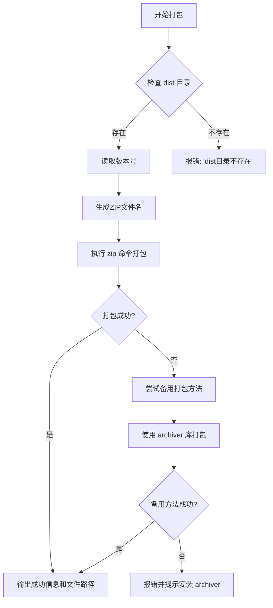
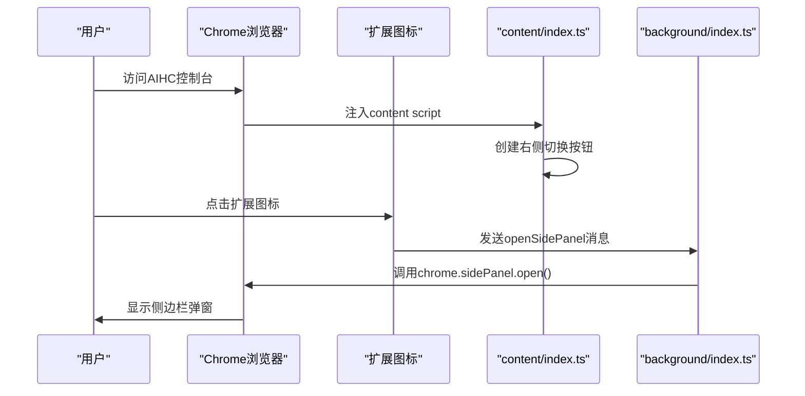
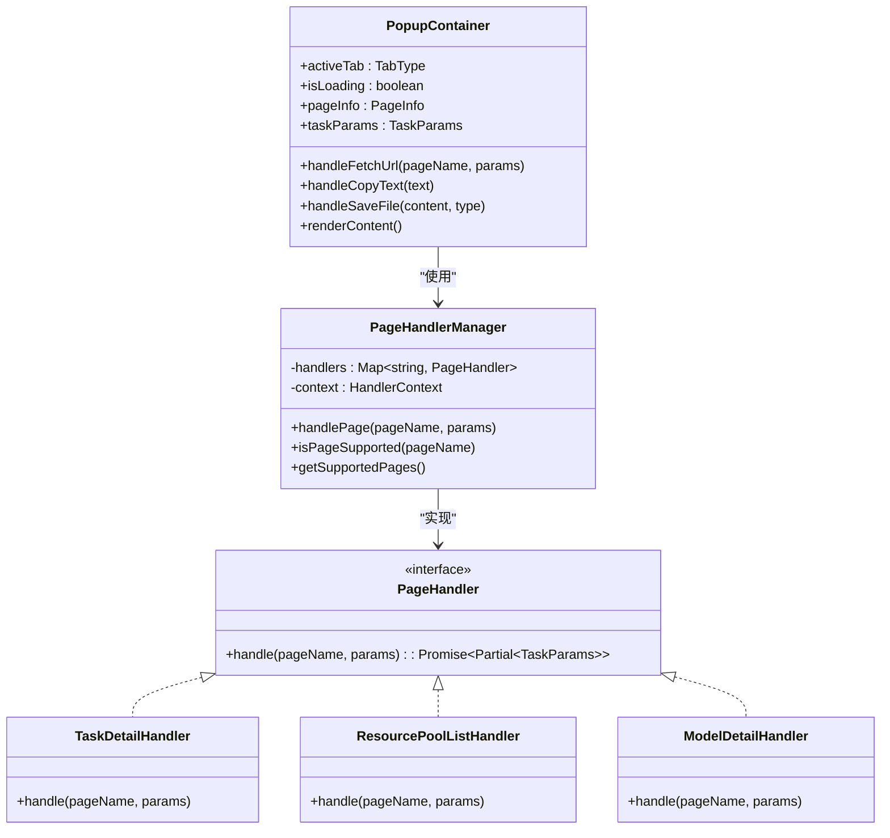

# 快速入门

<cite>
**本文档中引用的文件**
- [README.md](file://README.md)
- [package.json](file://package.json)
- [manifest.json](file://src/manifest.json)
- [vite.config.ts](file://vite.config.ts)
- [popup/main.tsx](file://src/popup/main.tsx)
- [background/index.ts](file://src/background/index.ts)
- [content/index.ts](file://src/content/index.ts)
- [components/PopupContainer.tsx](file://src/components/PopupContainer.tsx)
- [handlers/PageHandlerManager.ts](file://src/handlers/PageHandlerManager.ts)
- [scripts/package-extension.js](file://scripts/package-extension.js)
</cite>

## 目录
1. [简介](#简介)
2. [开发环境搭建](#开发环境搭建)
3. [依赖安装与项目启动](#依赖安装与项目启动)
4. [生产构建与打包发布](#生产构建与打包发布)
5. [在Chrome中加载扩展](#在chrome中加载扩展)
6. [基本使用示例](#基本使用示例)
7. [故障排查](#故障排查)

## 简介

AIHC助手是一款专为百舸AIHC控制台设计的浏览器扩展程序，旨在提升用户在AIHC平台上的操作效率。该扩展能够自动检测AIHC控制台页面，智能生成CLI命令、导出任务参数（支持JSON/YAML格式）、提供API文档链接，并集成了AI聊天功能。

本指南将详细介绍如何完成AIHCX-EXT的安装与初始配置流程，包括开发环境搭建、依赖安装、开发服务器启动、生产构建、打包发布以及在Chrome浏览器中的加载方法。同时提供基本使用示例，帮助新手快速上手。

**Section sources**
- [README.md](file://README.md#L1-L40)

## 开发环境搭建

### Node.js版本要求

AIHCX-EXT项目对Node.js版本有明确要求，以确保所有依赖包和构建工具能正常工作。

根据`package.json`文件中的定义，项目需要以下最低版本：
- **Node.js**: 16.x 或更高版本
- 推荐使用 **Node.js 18+** 版本以获得最佳兼容性和性能

您可以通过以下命令检查当前Node.js版本：

```bash
node --version
```

如果您的系统中未安装Node.js或版本过低，请访问[Node.js官方网站](https://nodejs.org/)下载并安装最新LTS版本。

**Section sources**
- [package.json](file://package.json#L1-L38)
- [README.md](file://README.md#L100-L105)

## 依赖安装与项目启动

### 安装依赖

在项目根目录下执行以下命令来安装所有必要的npm依赖包：

```bash
npm install
```

此命令会读取`package.json`文件中的`dependencies`和`devDependencies`字段，从npm仓库下载并安装所有指定的包。这些依赖包括React框架、TypeScript编译器、Vite构建工具以及其他开发和运行时所需的库。

**Section sources**
- [package.json](file://package.json#L1-L38)
- [README.md](file://README.md#L107-L110)

### 启动开发服务器

安装完依赖后，可以使用以下命令启动开发服务器：

```bash
npm run dev
```

该命令会执行`vite build --watch --mode development`，其作用是：
- 使用Vite构建工具进行项目构建
- 开启监听模式（--watch），当源代码文件发生变化时自动重新构建
- 设置为开发模式（--mode development），保留更多调试信息

启动成功后，Vite会在内存中创建一个开发服务器，您可以直接在浏览器中查看和调试扩展功能。

**Section sources**
- [package.json](file://package.json#L1-L38)
- [vite.config.ts](file://vite.config.ts#L1-L182)
- [README.md](file://README.md#L112-L115)

## 生产构建与打包发布

### 生产构建

当您准备发布扩展时，需要先进行生产环境的构建。执行以下命令：

```bash
npm run build
```

此命令会执行一系列操作：
1. 运行TypeScript编译器（tsc）进行类型检查和编译
2. 使用Vite进行生产模式构建（--mode production）
3. 执行`generate-icons`脚本复制图标文件到输出目录

构建完成后，所有编译后的文件将被输出到项目根目录下的`dist`文件夹中。

**Section sources**
- [package.json](file://package.json#L1-L38)
- [vite.config.ts](file://vite.config.ts#L1-L182)
- [README.md](file://README.md#L117-L120)

### 打包发布

构建完成后，可以将`dist`目录中的文件打包成一个ZIP压缩文件，以便于分发和上传到Chrome Web Store。执行以下命令：

```bash
npm run package
```

该命令会调用`scripts/package-extension.js`脚本，其主要功能包括：
- 检查`dist`目录是否存在
- 读取`package.json`中的版本号
- 生成带有版本号的ZIP文件名（如`aihc-helper-extension-v0.5.0.zip`）
- 使用系统`zip`命令或Node.js的`archiver`库创建压缩包
- 输出详细的打包日志和文件大小信息

打包完成后，您将在项目根目录下找到生成的ZIP文件。



**Diagram sources**
- [scripts/package-extension.js](file://scripts/package-extension.js#L1-L122)
- [package.json](file://package.json#L1-L38)

**Section sources**
- [scripts/package-extension.js](file://scripts/package-extension.js#L1-L122)
- [package.json](file://package.json#L1-L38)
- [README.md](file://README.md#L121-L123)

## 在Chrome中加载扩展

要测试或使用本地构建的扩展，需要将其加载到Chrome浏览器中。请按照以下步骤操作：

1. 打开Chrome浏览器，访问 `chrome://extensions/`
2. 开启右上角的"开发者模式"
3. 点击"加载已解压的扩展程序"按钮
4. 选择项目根目录下的 `dist` 文件夹

加载成功后，您应该能在浏览器工具栏看到AIHC助手的图标。点击图标即可打开扩展弹窗。

**Section sources**
- [README.md](file://README.md#L150-L157)
- [manifest.json](file://src/manifest.json#L1-L51)

## 基本使用示例

### 访问AIHC控制台

1. 登录百度云控制台，导航至[AIHC控制台](https://console.bce.baidu.com/aihc)
2. 浏览不同的功能页面，如任务列表、资源池详情、模型管理等

扩展会自动检测当前页面类型，并根据页面内容生成相应的信息。

### 触发扩展弹窗

您可以通过以下两种方式触发扩展弹窗：
- 点击浏览器工具栏中的AIHC助手图标
- 在AIHC控制台页面右侧会出现一个固定的"AIHC"切换按钮，点击该按钮可打开侧边栏



**Diagram sources**
- [src/popup/main.tsx](file://src/popup/main.tsx#L1-L11)
- [src/background/index.ts](file://src/background/index.ts#L1-L513)
- [src/content/index.ts](file://src/content/index.ts#L1-L938)

**Section sources**
- [src/popup/main.tsx](file://src/popup/main.tsx#L1-L11)
- [src/background/index.ts](file://src/background/index.ts#L1-L513)
- [src/content/index.ts](file://src/content/index.ts#L1-L938)

### 查看默认标签页内容

当您打开扩展弹窗后，界面会根据当前页面类型显示不同的标签页内容：

#### CLI命令标签页
- 显示与当前页面相关的aihc CLI命令
- 例如，在"任务详情"页面会显示`aihc job get <任务名> -p <资源池ID>`命令

#### 参数导出标签页
- **JSON参数**: 将页面参数导出为结构化的JSON格式
- **YAML参数**: 导出为人类可读的YAML配置文件

#### API文档标签页
- 提供与当前页面功能相关的API文档链接
- 显示请求示例，包括URL、Headers和Body参数

#### AI聊天标签页
- 集成AI对话功能，可咨询技术问题
- 根据当前页面上下文提供相关建议

这些功能由`PopupContainer`组件统一管理，通过`PageHandlerManager`协调各个页面处理器来获取特定页面的数据。



**Diagram sources**
- [src/components/PopupContainer.tsx](file://src/components/PopupContainer.tsx#L20-L566)
-