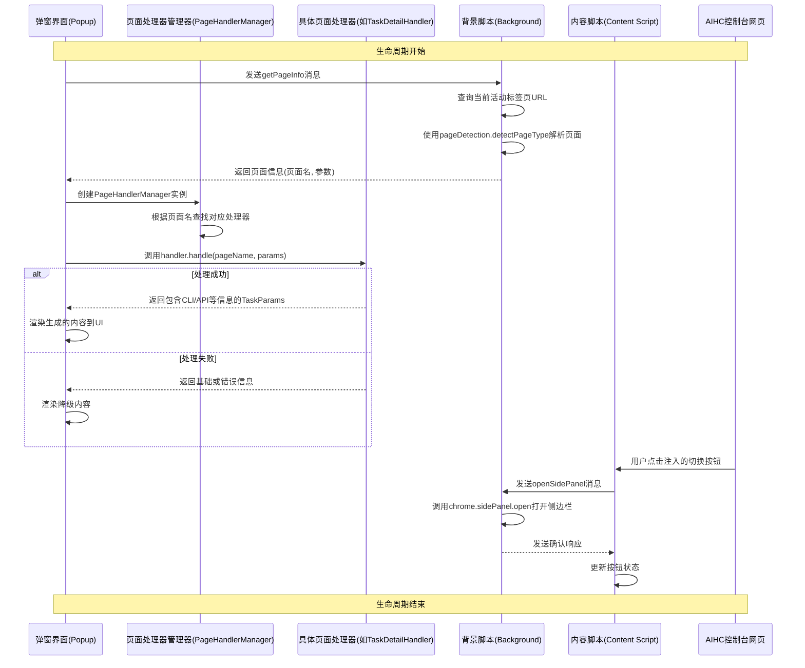

# 技术架构

<cite>
**本文档引用的文件**   
- [PageHandlerManager.ts](file://src/handlers/PageHandlerManager.ts)
- [BaseHandler.ts](file://src/handlers/BaseHandler.ts)
- [TaskDetailHandler.ts](file://src/handlers/pages/TaskDetailHandler.ts)
- [index.ts](file://src/background/index.ts)
- [index.ts](file://src/content/index.ts)
- [main.tsx](file://src/popup/main.tsx)
- [PopupContainer.tsx](file://src/components/PopupContainer.tsx)
- [types.ts](file://src/handlers/types.ts)
- [pageDetection.ts](file://src/utils/pageDetection.ts)
</cite>

## 目录
1. [系统通信机制与职责划分](#系统通信机制与职责划分)
2. [基于策略模式的页面处理架构](#基于策略模式的页面处理架构)
3. [组件间数据流图](#组件间数据流图)
4. [设计模式分析](#设计模式分析)

## 系统通信机制与职责划分

AIHCX-EXT 扩展采用典型的浏览器扩展三层架构，由背景脚本（Background Service Worker）、内容脚本（Content Script）和弹窗界面（Popup）三部分组成。这三者通过 Chrome 的 `chrome.runtime.sendMessage` 和 `chrome.runtime.onMessage` API 进行异步消息通信，实现功能解耦与职责分离。

- **背景脚本 (Background)**：作为系统的中央协调者，负责管理全局状态、持久化存储（如 `chrome.storage.local`）、监听浏览器事件（如图标点击 `chrome.action.onClicked`），并作为消息路由中心，转发来自 Popup 和 Content Script 的请求。
- **内容脚本 (Content Script)**：注入到目标网页（AIHC 控制台）中，负责检测当前页面类型、监听 DOM 变化，并在页面上注入 UI 元素（如右侧边缘切换按钮）。它直接与网页 DOM 交互，并将用户操作或页面信息通过消息发送给 Background。
- **弹窗界面 (Popup)**：提供用户交互入口，当用户点击扩展图标时显示。它初始化 `PageHandlerManager` 实例，根据从 Background 获取的当前标签页信息，调用相应的 `PageHandler` 来生成 CLI 命令、API 文档等辅助内容，并渲染到界面上。

三者之间的通信流程如下：
1.  **页面检测**：Popup 初始化时，向 Background 发送 `getPageInfo` 消息。
2.  **信息获取**：Background 收到消息后，查询当前活动标签页的 URL，并使用 `utils/pageDetection.ts` 中的 `detectPageType` 函数解析出页面名称和参数，然后将结果返回给 Popup。
3.  **内容生成**：Popup 根据返回的页面信息，通过 `PageHandlerManager` 调用对应的 `PageHandler` 实例来生成所需内容。
4.  **UI 交互**：当用户在 Content Script 注入的 UI 上进行操作（如点击切换按钮）时，Content Script 会向 Background 发送 `openSidePanel` 或 `updateSidebarState` 等消息，由 Background 执行相应操作。

**Section sources**
- [index.ts](file://src/background/index.ts)
- [index.ts](file://src/content/index.ts)
- [main.tsx](file://src/popup/main.tsx)

## 基于策略模式的页面处理架构

系统的核心是基于策略模式（Strategy Pattern）构建的页面处理架构，其核心组件为 `PageHandlerManager` 和 `BaseHandler`。

### PageHandlerManager

`PageHandlerManager` 是一个策略模式中的“上下文”（Context）角色，负责管理所有具体的策略对象（即 `PageHandler` 实现类）。它维护一个 `Map<string, PageHandler>`，以页面名称为键，`PageHandler` 实例为值。

在构造函数中，`initializeHandlers()` 方法会预注册所有支持的页面处理器，例如：

```typescript
this.handlers.set('任务详情', new TaskDetailHandler(this.context));
this.handlers.set('任务列表', new TaskListHandler(this.context));
// ... 其他页面处理器
```

`PageHandlerManager` 提供了以下关键方法：
- `handlePage(pageName: string, params: Record<string, string>)`: 核心方法。根据传入的 `pageName` 从 `handlers` 映射中查找对应的处理器实例，如果找到，则调用其实例的 `handle` 方法，并返回处理结果；若未找到，则发出警告并返回空对象。
- `isPageSupported(pageName: string)`: 检查指定页面是否被支持。
- `getSupportedPages()`: 返回所有支持的页面名称列表。

这种设计使得添加新页面支持变得非常简单，只需创建一个新的 `PageHandler` 实现类，并在 `PageHandlerManager` 中注册即可，无需修改现有逻辑，符合开闭原则。

### BaseHandler

`BaseHandler` 是一个抽象基类，实现了 `PageHandler` 接口，扮演了“策略”（Strategy）的通用接口角色。它定义了所有具体处理器必须实现的 `handle` 方法，并提供了两个公共接口供子类复用：

- `generateRequestExample(...)`: 一个受保护的方法，用于生成标准化的 API 请求示例。它通过委托给构造函数传入的 `HandlerContext` 来完成实际的生成工作，确保了请求格式的一致性。
- `createEmptyUpdate()`: 一个受保护的方法，用于创建一个空的 `Partial<TaskParams>` 对象，作为返回结果的初始模板。

所有具体的页面处理器（如 `TaskDetailHandler`, `DatasetsHandler`）都继承自 `BaseHandler`，并重写 `handle` 方法，以实现针对特定页面的业务逻辑。

**Section sources**
- [PageHandlerManager.ts](file://src/handlers/PageHandlerManager.ts)
- [BaseHandler.ts](file://src/handlers/BaseHandler.ts)
- [types.ts](file://src/handlers/types.ts)

## 组件间数据流图

下图展示了从页面检测到结果渲染的完整生命周期数据流。



**Diagram sources **
- [PageHandlerManager.ts](file://src/handlers/PageHandlerManager.ts)
- [BaseHandler.ts](file://src/handlers/BaseHandler.ts)
- [index.ts](file://src/background/index.ts)
- [index.ts](file://src/content/index.ts)
- [main.tsx](file://src/popup/main.tsx)
- [pageDetection.ts](file://src/utils/pageDetection.ts)

## 设计模式分析

AIHCX-EXT 在设计中巧妙地运用了多种设计模式，显著提升了代码的可维护性和扩展性。

### 单例模式 (Singleton)

虽然没有显式实现单例，但 `PageHandlerManager` 在 `PopupContainer` 中的使用方式体现了单例的思想。在整个 Popup 的生命周期内，通常只会创建一个 `PageHandlerManager` 实例来管理所有的页面处理器。这保证了处理器实例的唯一性和状态的一致性，避免了重复创建和资源浪费。

### 策略模式 (Strategy)

这是系统最核心的设计模式。`PageHandlerManager` 作为上下文，`PageHandler` 作为策略接口，而 `TaskDetailHandler`、`DatasetsHandler` 等则是具体的策略实现。这种模式的优点在于：
- **高内聚低耦合**：每个 `PageHandler` 只关注自己负责的页面逻辑，彼此独立。
- **易于扩展**：增加对新页面的支持，只需新增一个 `PageHandler` 子类并注册，完全符合开闭原则。
- **运行时选择**：可以在运行时根据不同的页面动态地选择和应用不同的算法（处理逻辑）。

### 观察者模式 (Observer)

Chrome 扩展的 `chrome.runtime.onMessage` 机制本身就是观察者模式的典型应用。`background/index.ts` 和 `content/index.ts` 中的 `onMessage.addListener` 是“观察者”，它们订阅了来自其他组件的消息。当 `chrome.runtime.sendMessage` 被调用时，相当于“主题”（Subject）发生了变化，所有注册的监听器都会收到通知并执行回调。这种松耦合的通信方式使得各组件可以独立开发和测试，极大地提高了系统的灵活性和可维护性。

综上所述，AIHCX-EXT 通过合理运用这些设计模式，构建了一个结构清晰、职责分明、易于维护和扩展的现代化浏览器扩展架构。

**Section sources**
- [PageHandlerManager.ts](file://src/handlers/PageHandlerManager.ts)
- [BaseHandler.ts](file://src/handlers/BaseHandler.ts)
- [index.ts](file://src/background/index.ts)
- [index.ts](file://src/content/index.ts)