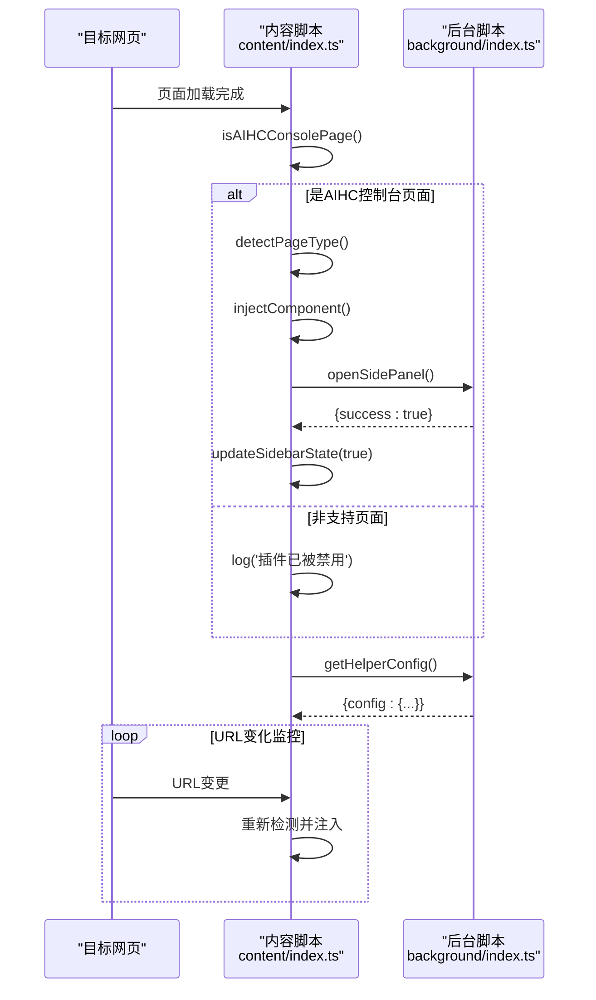
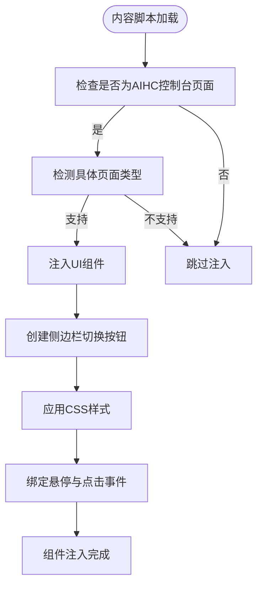
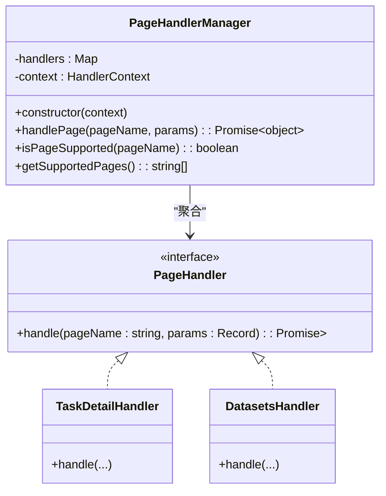
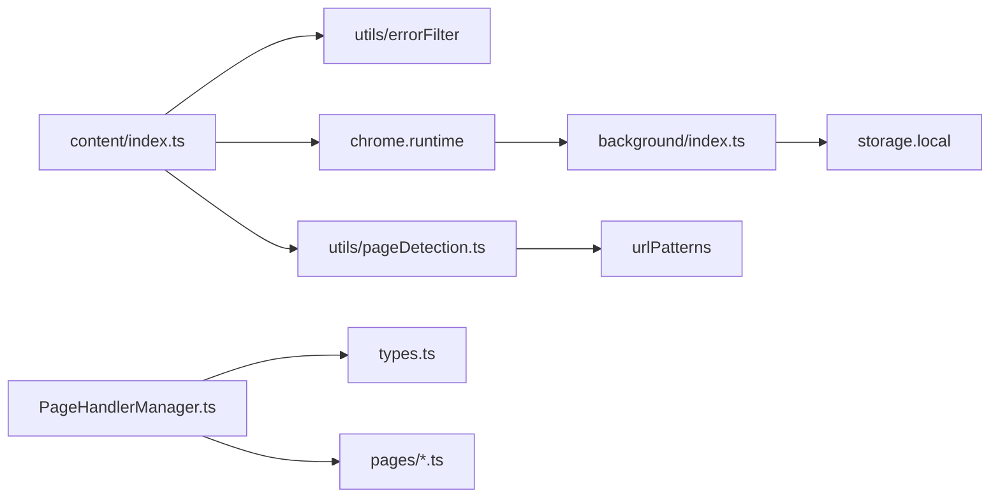

# 内容脚本与DOM注入

<cite>
**Referenced Files in This Document **   
- [index.ts](file://src/content/index.ts)
- [pageDetection.ts](file://src/utils/pageDetection.ts)
- [PageHandlerManager.ts](file://src/handlers/PageHandlerManager.ts)
- [style.css](file://src/content/style.css)
- [types.ts](file://src/handlers/types.ts)
- [index.ts](file://src/background/index.ts)
</cite>

## 目录
1. [简介](#简介)
2. [项目结构](#项目结构)
3. [核心组件](#核心组件)
4. [架构概述](#架构概述)
5. [详细组件分析](#详细组件分析)
6. [依赖分析](#依赖分析)
7. [性能考量](#性能考量)
8. [故障排除指南](#故障排除指南)
9. [结论](#结论)

## 简介
本文档深入探讨了AIHCX-EXT浏览器扩展中内容脚本（content script）的实现机制，重点分析其在百度云AIHC控制台环境下的DOM检测、页面类型识别及UI元素注入功能。文档将详细阐述`content/index.ts`如何利用`pageDetection`工具判断当前页面是否受支持，并动态注入侧边栏入口按钮等交互组件。同时，解释内容脚本如何捕获页面上下文信息并通过`chrome.runtime.sendMessage`向背景脚本传递初始请求，并接收服务响应以更新本地UI状态。此外，文档还将涵盖沙箱环境限制、跨域安全策略以及与主页面JavaScript隔离的设计考量。

## 项目结构
该扩展遵循典型的模块化前端项目结构，主要分为`background`（后台）、`content`（内容脚本）、`handlers`（处理器）、`components`（UI组件）和`utils`（工具函数）等目录。内容脚本的核心逻辑位于`src/content/`目录下，而页面检测和处理逻辑则分散在`src/utils/`和`src/handlers/`目录中。

```mermaid
graph TB
subgraph "核心模块"
content[content/index.ts]
style[style.css]
pageDetection[utils/pageDetection.ts]
handlerManager[handlers/PageHandlerManager.ts]
end
subgraph "其他模块"
background[background/index.ts]
components[components/]
types[types/]
end
content --> pageDetection : "调用"
content --> handlerManager : "间接通信"
content --> style : "应用样式"
handlerManager --> pageDetection : "使用"
background < --> content : "通过消息通信"
```

**Diagram sources **
- [index.ts](file://src/content/index.ts)
- [pageDetection.ts](file://src/utils/pageDetection.ts)
- [PageHandlerManager.ts](file://src/handlers/PageHandlerManager.ts)
- [style.css](file://src/content/style.css)

**Section sources**
- [index.ts](file://src/content/index.ts)
- [pageDetection.ts](file://src/utils/pageDetection.ts)
- [PageHandlerManager.ts](file://src/handlers/PageHandlerManager.ts)

## 核心组件
核心组件包括负责DOM操作和用户交互的内容脚本`content/index.ts`，用于精确识别页面类型的`utils/pageDetection.ts`，以及管理不同页面业务逻辑的`handlers/PageHandlerManager.ts`。这些组件协同工作，实现了对目标网页的智能检测和功能增强。

**Section sources**
- [index.ts](file://src/content/index.ts)
- [pageDetection.ts](file://src/utils/pageDetection.ts)
- [PageHandlerManager.ts](file://src/handlers/PageHandlerManager.ts)

## 架构概述
整个系统的架构基于Chrome扩展的典型分层模式：内容脚本运行在目标网页的上下文中，负责DOM注入和用户事件监听；后台脚本独立于任何特定页面，负责持久化数据、管理全局状态和协调跨标签页通信。两者通过`chrome.runtime.sendMessage`进行异步消息传递，确保了安全性与解耦。



**Diagram sources **
- [index.ts](file://src/content/index.ts)
- [pageDetection.ts](file://src/utils/pageDetection.ts)
- [index.ts](file://src/background/index.ts)

## 详细组件分析

### 内容脚本初始化与DOM注入分析
内容脚本在目标页面加载完成后立即执行，首先通过`isAIHCConsolePage()`检查当前URL是否属于百度云AIHC控制台域名。若确认是目标环境，则进一步调用`detectPageType()`进行精确的页面类型识别。

#### DOM注入与UI组件创建
一旦确认页面受支持，脚本会执行`injectComponent()`函数，其核心任务是创建一个固定在视口右侧边缘的切换按钮。该按钮的样式通过内联CSS或外部CSS文件（`style.css`）定义，确保其视觉效果不受目标页面原有样式的干扰。



**Diagram sources **
- [index.ts](file://src/content/index.ts)
- [style.css](file://src/content/style.css)

#### 事件绑定与动态行为
创建按钮后，脚本会为其绑定丰富的交互事件：
- `mouseenter` 和 `mouseleave`：实现悬停时的宽度扩展和阴影增强动画。
- `click`：点击事件触发`chrome.runtime.sendMessage({ action: 'openSidePanel' })`，向后台脚本发送打开侧边栏的请求。
- `mousedown` + `mouseup`：组合实现长按操作，用于弹出关闭对话框，提供“本次访问关闭”、“本页关闭”或“全部关闭”等多种选项。

**Section sources**
- [index.ts](file://src/content/index.ts)
- [style.css](file://src/content/style.css)

### 页面检测与处理机制分析
页面检测的核心在于`utils/pageDetection.ts`中的`detectPageType()`函数。它维护了一个`urlPatterns`映射表，将具体的URL路径模式与预定义的页面名称（如“任务列表”、“数据集详情”）关联起来。

#### 页面类型识别流程
```mermaid
flowchart TD
A[开始] --> B{URL.startsWith('https://console.bce.baidu.com/aihc')}
B --> |否| C[返回: 不支持]
B --> |是| D[按长度降序排序 urlPatterns]
D --> E[遍历排序后的模式]
E --> F{当前URL.startsWith(模式)?}
F --> |是| G{特殊规则检查?}
G --> |是| H[匹配失败, 跳出循环]
G --> |否| I[记录匹配的页面名称]
I --> J[解析URL参数]
J --> K[返回 PageInfo 对象]
F --> |否| E
```

此函数不仅判断页面是否受支持，还返回详细的`PageInfo`对象，包含`isSupported`标志、`pageName`（中文页面名）和从URL中解析出的`params`（查询参数），为后续的业务逻辑处理提供了关键上下文。

**Diagram sources **
- [pageDetection.ts](file://src/utils/pageDetection.ts)

#### 页面处理器管理
`PageHandlerManager`类作为所有页面处理器的中央调度器，通过`Map`结构将`pageName`（如“任务详情”）映射到具体的处理器实例（如`TaskDetailHandler`）。当需要根据页面类型执行特定逻辑时，`handlePage()`方法会查找并调用对应的处理器。



**Diagram sources **
- [PageHandlerManager.ts](file://src/handlers/PageHandlerManager.ts)
- [types.ts](file://src/handlers/types.ts)

**Section sources**
- [PageHandlerManager.ts](file://src/handlers/PageHandlerManager.ts)
- [types.ts](file://src/handlers/types.ts)

### 消息通信与状态同步分析
内容脚本与后台脚本之间的通信是整个扩展功能流畅运行的关键。

#### 向后台发送请求
内容脚本通过`chrome.runtime.sendMessage()`主动发起多种请求：
- `openSidePanel`: 请求后台脚本打开浏览器侧边栏。
- `getHelperConfig`: 获取用户的配置偏好（如是否启用图像高亮）。
- `getPageInfo`: 响应来自Popup或其他组件的请求，返回当前页面的标题、URL和图片列表等信息。

#### 接收后台指令
内容脚本通过注册`chrome.runtime.onMessage.addListener`来监听来自后台的消息：
- `updateConfig`: 当用户在设置页面更改配置时，后台会广播此消息，内容脚本收到后立即更新本地`config`变量并调整UI行为。
- `updateSidebarState`: 当侧边栏被打开或关闭时，后台会通知所有相关标签页的内容脚本，使其能够同步更新切换按钮的视觉状态（如颜色和文案）。

这种双向通信机制确保了用户界面的状态始终与后台的全局状态保持一致。

**Section sources**
- [index.ts](file://src/content/index.ts)
- [index.ts](file://src/background/index.ts)

## 依赖分析
内容脚本`content/index.ts`直接依赖于`utils/errorFilter`进行错误处理，并通过Chrome API与`background/index.ts`进行通信。`pageDetection.ts`作为独立的工具模块，被内容脚本和可能的其他模块（如Popup）所复用。`PageHandlerManager`及其下属的各个`Handler`类构成了一个复杂的依赖网络，它们共同依赖于`types.ts`中定义的接口。



**Diagram sources **
- [index.ts](file://src/content/index.ts)
- [pageDetection.ts](file://src/utils/pageDetection.ts)
- [PageHandlerManager.ts](file://src/handlers/PageHandlerManager.ts)
- [index.ts](file://src/background/index.ts)

**Section sources**
- [index.ts](file://src/content/index.ts)
- [pageDetection.ts](file://src/utils/pageDetection.ts)
- [PageHandlerManager.ts](file://src/handlers/PageHandlerManager.ts)
- [index.ts](file://src/background/index.ts)

## 性能考量
内容脚本的设计充分考虑了性能影响：
- **日志优化**：`log`函数通过`importantMessages`数组过滤，仅在发生关键事件或错误时输出日志，避免了生产环境中因频繁打印日志而导致的性能下降。
- **惰性注入**：组件的注入被延迟到`window.onload`事件之后，或通过`document.readyState`检查，确保不会阻塞页面的初始渲染。
- **高效选择器**：DOM操作使用高效的`getElementById`和`querySelector`，并尽量减少对`querySelectorAll`的调用频率。
- **内存泄漏防范**：在`MutationObserver`中监控URL变化时，虽然没有显式调用`disconnect()`，但其生命周期通常与页面标签页一致，风险较低。

## 故障排除指南
当遇到问题时，可参考以下常见情况：
- **按钮未出现**：检查当前页面URL是否在`urlPatterns`的白名单中，或是否被用户手动添加到了禁用列表。
- **侧边栏无法打开**：确认Chrome版本是否支持`sidePanel` API，或检查后台脚本是否存在权限错误。
- **配置未生效**：检查`chrome.storage.local`中`helperConfig`的存储值是否正确，并确认`updateConfig`消息是否成功送达。
- **长按无反应**：可能是由于页面上的其他脚本阻止了`mousedown`/`mouseup`事件冒泡。

**Section sources**
- [index.ts](file://src/content/index.ts)
- [index.ts](file://src/background/index.ts)

## 结论
该内容脚本实现了一个健壮且灵活的系统，能够精准地在百度云AIHC控制台中识别页面、注入UI组件并与后台服务进行高效通信。其设计体现了良好的模块化、关注点分离和对Chrome扩展API最佳实践的遵循。通过对DOM的谨慎操作和对消息通信的合理运用，该脚本能够在不影响目标页面性能的前提下，为用户提供强大的辅助功能。