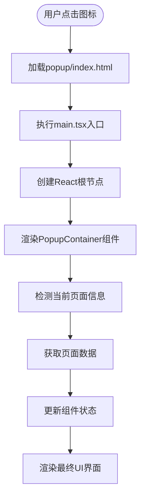
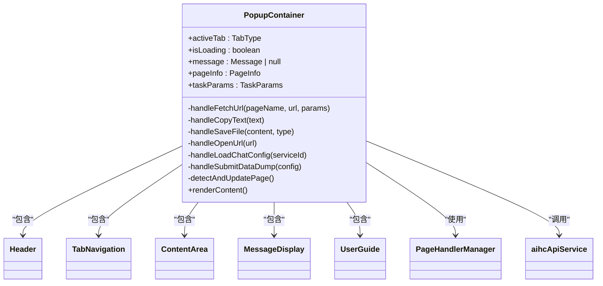
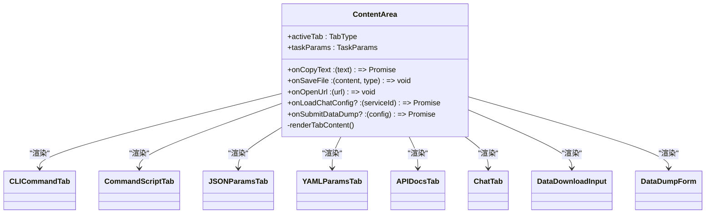
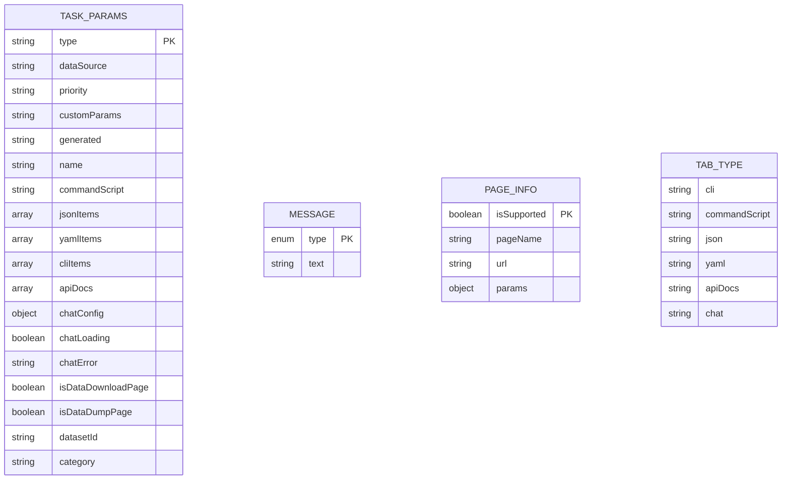
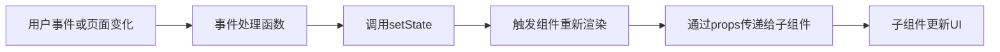
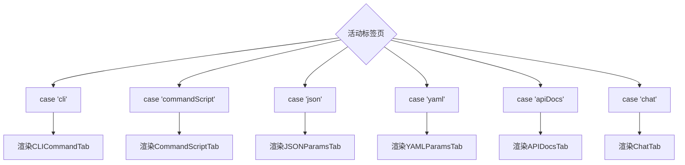
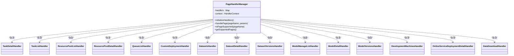
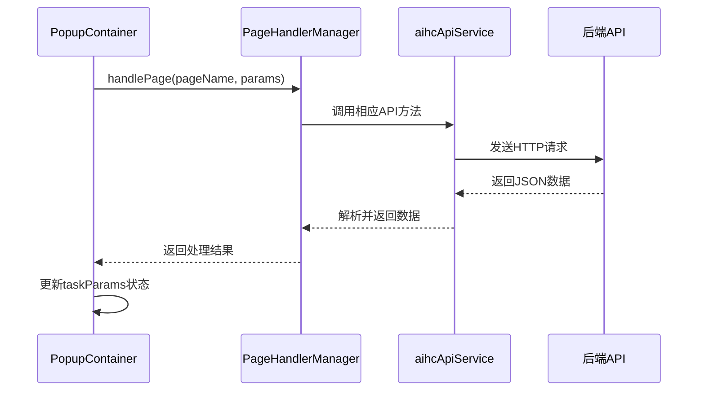
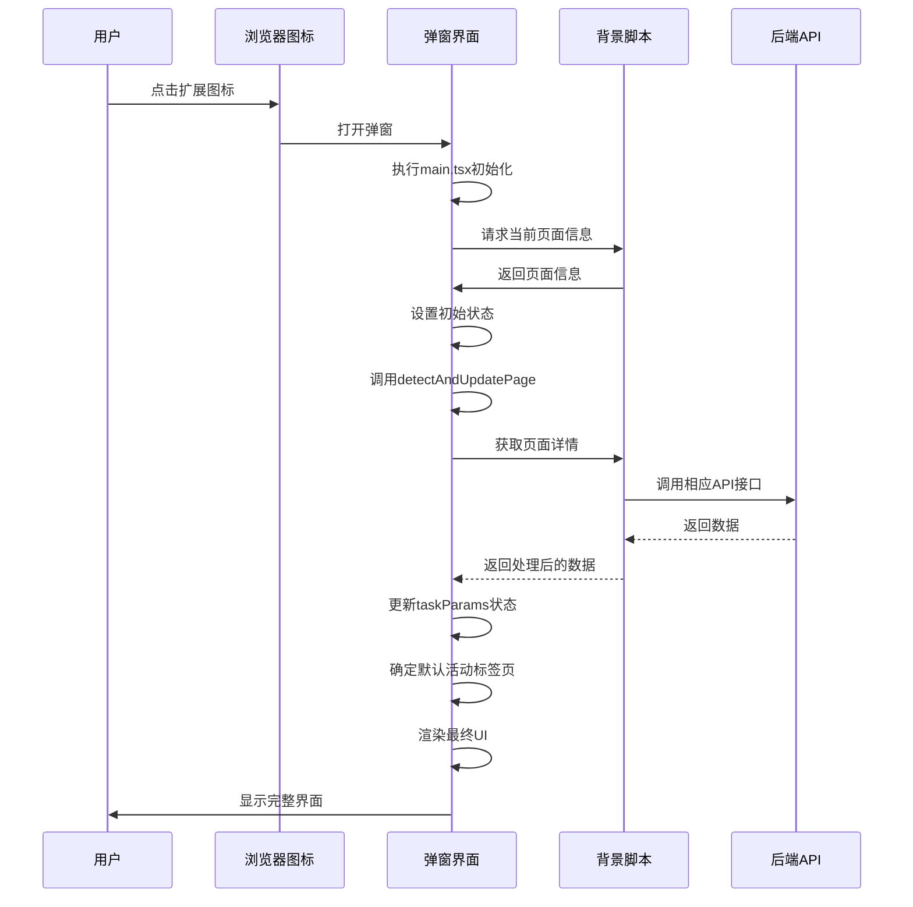

# 弹窗界面与用户交互

<cite>
**本文档引用文件**   
- [main.tsx](file://src/popup/main.tsx)
- [PopupContainer.tsx](file://src/components/PopupContainer.tsx)
- [TabNavigation.tsx](file://src/components/TabNavigation.tsx)
- [ContentArea.tsx](file://src/components/ContentArea.tsx)
- [CLICommandTab.tsx](file://src/components/tabs/CLICommandTab.tsx)
- [JSONParamsTab.tsx](file://src/components/tabs/JSONParamsTab.tsx)
- [types/index.ts](file://src/types/index.ts)
- [aihcApi.ts](file://src/services/aihcApi.ts)
</cite>

## 目录
1. [简介](#简介)
2. [启动流程分析](#启动流程分析)
3. [核心组件解析](#核心组件解析)
4. [UI状态管理机制](#ui状态管理机制)
5. [标签页导航与内容联动](#标签页导航与内容联动)
6. [后台通信与数据获取](#后台通信与数据获取)
7. [响应式布局与无障碍访问](#响应式布局与无障碍访问)
8. [完整交互流程](#完整交互流程)

## 简介
本技术文档详细阐述了AIHC助手扩展程序中弹窗界面的实现原理与交互逻辑。文档聚焦于从用户点击浏览器图标到界面完全渲染的全过程，深入分析`PopupContainer`组件如何初始化状态、协调各功能标签页的数据展示，以及`TabNavigation`和`ContentArea`组件如何实现动态内容渲染。同时涵盖UI状态管理、props传递模式、与背景脚本通信的封装接口调用示例，并强调响应式布局与无障碍访问的最佳实践。

## 启动流程分析



**Diagram sources**
- [main.tsx](file://src/popup/main.tsx#L1-L10)
- [PopupContainer.tsx](file://src/components/PopupContainer.tsx#L20-L566)

**Section sources**
- [main.tsx](file://src/popup/main.tsx#L1-L10)
- [PopupContainer.tsx](file://src/components/PopupContainer.tsx#L20-L566)

## 核心组件解析

### PopupContainer组件
作为整个弹窗界面的根组件，`PopupContainer`负责初始化所有状态并协调各个子组件的工作。它通过React Hooks管理多个状态变量，包括活动标签页、加载状态、消息提示和页面信息等。



**Diagram sources**
- [PopupContainer.tsx](file://src/components/PopupContainer.tsx#L20-L566)

**Section sources**
- [PopupContainer.tsx](file://src/components/PopupContainer.tsx#L20-L566)

### TabNavigation组件
`TabNavigation`组件实现了标签页的动态显示与切换功能。它根据当前页面类型和可用数据决定哪些标签页可见，并通过回调函数与父组件通信以更新活动标签状态。

```mermaid
classDiagram
class TabNavigation {
+activeTab : TabType
+onTabChange : (tab : TabType) => void
+taskParams : TaskParams
+pageName : string
-tabs : Array<{key, label, shortLabel, icon, condition}>
-visibleTabs : Filtered tabs
}
TabNavigation --> PopupContainer : "接收props并回调"
```

**Diagram sources**
- [TabNavigation.tsx](file://src/components/TabNavigation.tsx#L10-L88)

**Section sources**
- [TabNavigation.tsx](file://src/components/TabNavigation.tsx#L10-L88)

### ContentArea组件
`ContentArea`组件根据当前活动标签页动态渲染相应的内容区域。它充当路由中心的角色，将不同的标签页映射到对应的展示组件。



**Diagram sources**
- [ContentArea.tsx](file://src/components/ContentArea.tsx#L21-L114)

**Section sources**
- [ContentArea.tsx](file://src/components/ContentArea.tsx#L21-L114)

## UI状态管理机制

### 状态定义
组件使用TypeScript接口明确定义了各种状态结构：



**Diagram sources**
- [types/index.ts](file://src/types/index.ts#L1-L133)

**Section sources**
- [types/index.ts](file://src/types/index.ts#L1-L133)

### 状态流转
状态管理遵循单向数据流原则，确保数据流动清晰可预测：



## 标签页导航与内容联动

### 标签可见性控制
`TabNavigation`组件根据任务参数中的数据存在情况动态决定标签页的可见性：

| 标签页 | 显示条件 | 条件说明 |
|--------|----------|----------|
| CLI命令 | `taskParams.cliItems.length > 0` | 存在CLI命令项时显示 |
| 启动命令 | `!!taskParams.commandScript` | 存在启动命令脚本时显示 |
| JSON参数 | `taskParams.jsonItems.length > 0` | 存在JSON参数项时显示 |
| YAML参数 | `taskParams.yamlItems.length > 0` | 存在YAML参数项时显示 |
| API文档 | `taskParams.apiDocs.length > 0` | 存在API文档项时显示 |
| AI聊天 | `pageName === '在线服务部署详情' && !!taskParams.chatConfig` | 在特定页面且有聊天配置时显示 |

**Section sources**
- [TabNavigation.tsx](file://src/components/TabNavigation.tsx#L10-L88)

### 内容动态渲染
`ContentArea`组件通过switch语句实现标签页内容的动态渲染：



**Section sources**
- [ContentArea.tsx](file://src/components/ContentArea.tsx#L21-L114)

## 后台通信与数据获取

### 页面处理器管理器
系统使用`PageHandlerManager`统一管理不同页面的数据处理逻辑：



**Section sources**
- [PageHandlerManager.ts](file://src/handlers/PageHandlerManager.ts#L1-L94)

### API服务封装
`aihcApiService`提供了对后端API的封装调用：



**Diagram sources**
- [aihcApi.ts](file://src/services/aihcApi.ts#L1-L558)
- [PageHandlerManager.ts](file://src/handlers/PageHandlerManager.ts#L1-L94)
- [PopupContainer.tsx](file://src/components/PopupContainer.tsx#L20-L566)

## 响应式布局与无障碍访问

### 响应式设计
组件采用CSS Flexbox布局实现响应式设计，确保在不同屏幕尺寸下都能良好显示。主要特点包括：
- 固定高度的头部区域
- 可滚动的内容区域
- 自适应的标签按钮布局
- 移动设备友好的触摸目标大小

### 无障碍访问
系统遵循WCAG标准，提供良好的无障碍访问支持：
- 所有交互元素都有适当的aria标签
- 键盘导航支持
- 高对比度颜色方案
- 屏幕阅读器友好的语义化HTML结构
- 消息提示具有自动关闭功能

**Section sources**
- [Header.tsx](file://src/components/Header.tsx#L1-L19)
- [TabNavigation.tsx](file://src/components/TabNavigation.tsx#L10-L88)
- [ContentArea.tsx](file://src/components/ContentArea.tsx#L21-L114)

## 完整交互流程



**Diagram sources**
- [main.tsx](file://src/popup/main.tsx#L1-L10)
- [PopupContainer.tsx](file://src/components/PopupContainer.tsx#L20-L566)
- [PageHandlerManager.ts](file://src/handlers/PageHandlerManager.ts#L1-L94)
- [ai