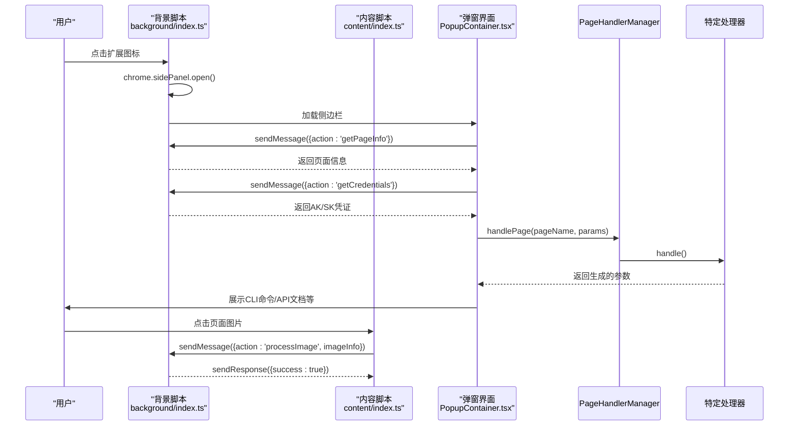
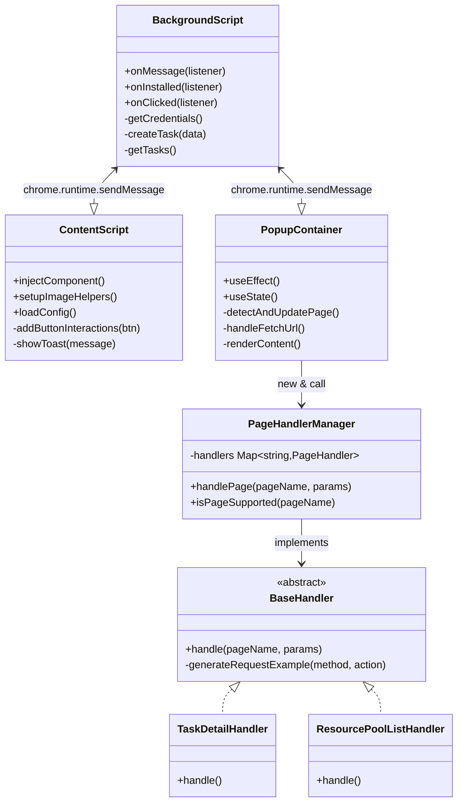

# 整体架构设计

<cite>
**本文档引用的文件**
- [manifest.json](file://src/manifest.json)
- [background/index.ts](file://src/background/index.ts)
- [content/index.ts](file://src/content/index.ts)
- [popup/main.tsx](file://src/popup/main.tsx)
- [components/PopupContainer.tsx](file://src/components/PopupContainer.tsx)
- [handlers/PageHandlerManager.ts](file://src/handlers/PageHandlerManager.ts)
- [handlers/BaseHandler.ts](file://src/handlers/BaseHandler.ts)
</cite>

## 目录
1. [系统上下文与模块职责](#系统上下文与模块职责)
2. [核心通信机制](#核心通信机制)
3. [完整数据流分析](#完整数据流分析)
4. [消息传递模式实现](#消息传递模式实现)
5. [系统上下文图](#系统上下文图)
6. [组件交互图](#组件交互图)
7. [安全边界与序列化限制](#安全边界与序列化限制)

## 系统上下文与模块职责

AIHCX-EXT 扩展采用典型的 Chrome 扩展三层架构，包含背景脚本（Background Script）、内容脚本（Content Script）和弹窗界面（Popup UI）三个核心模块，各模块在独立的执行上下文中运行，通过标准化的消息传递机制进行通信。

**背景脚本**作为扩展的中枢，负责管理全局状态、持久化存储和跨标签页协调。它通过 `chrome.runtime.onMessage` 监听来自其他模块的消息，并根据消息类型调用相应的处理函数。背景脚本还负责初始化扩展状态，在 `chrome.runtime.onInstalled` 事件中设置默认的本地存储配置。

**内容脚本**注入到目标网页（`console.bce.baidu.com`）中，与页面 DOM 直接交互。其主要职责包括：检测当前页面是否为支持的 AIHC 控制台页面、在页面边缘注入切换按钮、监听用户对图像的点击以采集信息，并将这些信息通过消息传递转发给背景脚本。内容脚本是连接用户操作与扩展功能的桥梁。

**弹窗界面**是一个基于 React 的侧边栏应用，为用户提供可视化的操作界面。它通过 `chrome.tabs.query` 和 `chrome.tabs.sendMessage` 获取当前活动标签页的信息，并利用 `PageHandlerManager` 根据不同的控制台页面类型调度相应的处理器来生成参数。弹窗界面是用户与扩展交互的主要入口。

**Section sources**
- [manifest.json](file://src/manifest.json#L1-L50)
- [background/index.ts](file://src/background/index.ts#L1-L513)
- [content/index.ts](file://src/content/index.ts#L1-L800)
- [popup/main.tsx](file://src/popup/main.tsx#L1-L11)
- [components/PopupContainer.tsx](file://src/components/PopupContainer.tsx#L1-L569)

## 核心通信机制

扩展的通信机制严格遵循 Chrome 扩展的安全模型，所有跨上下文通信均通过 `chrome.runtime.sendMessage` 和 `chrome.runtime.onMessage` API 完成。这种异步消息传递模式确保了各模块间的松耦合。

当用户点击浏览器工具栏上的扩展图标时，`manifest.json` 中定义的 `action` 事件被触发，背景脚本中的 `chrome.action.onClicked` 监听器捕获该事件，并调用 `chrome.sidePanel.open()` 打开侧边栏。这是一个从浏览器直接到背景脚本的事件流。

内容脚本与背景脚本之间的通信是双向的。内容脚本使用 `chrome.runtime.sendMessage({ action: 'getHelperConfig' })` 向背景脚本请求辅助功能的配置。背景脚本收到此消息后，从 `chrome.storage.local` 中读取配置并调用 `sendResponse` 将结果返回给内容脚本。反之，当用户在页面上点击一个高亮的图像时，内容脚本会发送 `processImage` 消息给背景脚本，由后者负责将图像信息保存到临时存储中。

弹窗界面与背景脚本的通信更为频繁。当侧边栏打开时，`PopupContainer` 组件会立即向背景脚本查询凭证 (`getCredentials`) 和任务列表 (`getTasks`)。更重要的是，弹窗界面通过 `openSidePanel` 消息来主动控制侧边栏的打开，这与浏览器图标的点击形成了统一的入口。

**Section sources**
- [background/index.ts](file://src/background/index.ts#L1-L513)
- [content/index.ts](file://src/content/index.ts#L1-L800)
- [components/PopupContainer.tsx](file://src/components/PopupContainer.tsx#L1-L569)

## 完整数据流分析

从用户点击扩展图标到最终结果展示的完整数据流如下：

1.  **入口触发**：用户点击扩展图标，触发 `chrome.action.onClicked` 事件。
2.  **侧边栏打开**：背景脚本执行 `chrome.sidePanel.open()`，加载 `popup/index.html`，启动弹窗界面。
3.  **页面信息采集**：弹窗界面的 `PopupContainer` 组件通过 `getCurrentTabInfo()` 函数获取当前标签页的 URL 和标题等基本信息。
4.  **处理器调度**：`PageHandlerManager` 根据解析出的页面名称（如“任务详情”、“资源池列表”）查找并实例化对应的 `PageHandler`（如 `TaskDetailHandler`）。
5.  **参数生成**：选中的处理器调用其 `handle` 方法，根据传入的 URL 参数（`params`）构造 API 请求示例，并可能发起额外的 `fetch` 调用来获取更详细的页面数据（如任务详情）。
6.  **结果聚合**：处理器返回一个包含 CLI 命令、JSON/YAML 参数、API 文档链接等信息的 `Partial<TaskParams>` 对象。
7.  **状态更新**：`PopupContainer` 接收结果并更新其内部状态（`setTaskParams`），触发 React 组件重新渲染。
8.  **结果展示**：`ContentArea` 组件根据最新的 `taskParams` 数据，将生成的参数和文档链接展示在侧边栏的相应标签页中。

在整个流程中，`PopupContainer` 还通过 `useEffect` 钩子监听浏览器标签页的更新和激活事件，确保当用户在不同 AIHC 页面间切换时，侧边栏能自动刷新并显示对应页面的参数。

**Section sources**
- [components/PopupContainer.tsx](file://src/components/PopupContainer.tsx#L1-L569)
- [handlers/PageHandlerManager.ts](file://src/handlers/PageHandlerManager.ts#L1-L95)
- [handlers/BaseHandler.ts](file://src/handlers/BaseHandler.ts#L1-L38)

## 消息传递模式实现

消息传递的核心实现在于 `chrome.runtime.sendMessage` 和 `chrome.runtime.onMessage` 的配合使用。`sendMessage` 是一个异步函数，用于发送消息；而 `onMessage` 是一个监听器，必须返回 `true` 以表明将进行异步响应。

在背景脚本中，`onMessage` 监听器根据 `message.action` 字段进行路由：
```typescript
chrome.runtime.onMessage.addListener((message, _sender, sendResponse) => {
  if (message.action === 'getCredentials') {
    getCredentials().then(sendResponse);
    return true; // 异步响应
  }
  // ... 其他消息处理
});
```
这里的关键是 `return true`，它告诉 Chrome 消息发送者不会立即得到响应，后续通过调用 `sendResponse` 来完成。例如，`getCredentials` 函数从 `chrome.storage.sync` 异步读取数据，一旦读取完成，Promise 的 `then` 回调就会执行 `sendResponse`。

内容脚本和弹窗界面则使用 `sendMessage` 发起请求：
```typescript
chrome.runtime.sendMessage({ action: 'getHelperConfig' }, (response) => {
  // 处理响应
});
```
这种模式确保了即使背景脚本需要执行耗时操作（如网络请求或存储读写），也不会阻塞消息发送方。

**Section sources**
- [background/index.ts](file://src/background/index.ts#L1-L513)
- [content/index.ts](file://src/content/index.ts#L1-L800)



**Diagram sources**
- [background/index.ts](file://src/background/index.ts#L1-L513)
- [content/index.ts](file://src/content/index.ts#L1-L800)
- [components/PopupContainer.tsx](file://src/components/PopupContainer.tsx#L1-L569)

## 系统上下文图

```mermaid
graph TD
A[用户] --> |点击图标| B(背景脚本)
A --> |点击图片| C(内容脚本)
A --> |查看参数| D(弹窗界面)
B < --> |消息通信| C
B < --> |消息通信| D
C < --> |DOM操作| E[百度智能云AIHC控制台]
D --> |React渲染| F[侧边栏UI]
B --> |读写| G[(chrome.storage)]
D --> |HTTP请求| H[AIHC API服务]
style A fill:#f9f,stroke:#333
style E fill:#bbf,stroke:#333,color:#fff
style F fill:#f96,stroke:#333,color:#fff
```

**Diagram sources**
- [manifest.json](file://src/manifest.json#L1-L50)
- [background/index.ts](file://src/background/index.ts#L1-L513)
- [content/index.ts](file://src/content/index.ts#L1-L800)
- [components/PopupContainer.tsx](file://src/components/PopupContainer.tsx#L1-L569)

## 组件交互图



**Diagram sources**
- [background/index.ts](file://src/background/index.ts#L1-L513)
- [content/index.ts](file://src/content/index.ts#L1-L800)
- [components/PopupContainer.tsx](file://src/components/PopupContainer.tsx#L1-L569)
- [handlers/PageHandlerManager.ts](file://src/handlers/PageHandlerManager.ts#L1-L95)
- [handlers/BaseHandler.ts](file://src/handlers/BaseHandler.ts#L1-L38)

## 安全边界与序列化限制

Chrome 扩展的沙箱机制为各模块划定了明确的安全边界。背景脚本拥有最高的权限，可以访问 `chrome.storage`、`chrome.tabs` 等敏感 API。内容脚本虽然能访问页面 DOM，但无法直接调用大多数 Chrome API，必须通过消息传递委托给背景脚本。弹窗界面则完全运行在自己的 iframe 中，与网页 DOM 隔离。

数据序列化方面，通过 `sendMessage` 传递的所有消息都必须是可结构化克隆的对象（structurally cloneable）。这意味着不能传递函数、Error 对象或 DOM 节点。在代码中，`pageInfo` 对象只包含字符串、数字和简单数组，确保了其可序列化性。同样，从 `fetch` 请求中获取的 JSON 数据在传递给弹窗界面前，也应避免包含循环引用或不可序列化的属性。

此外，`web_accessible_resources` 在 `manifest.json` 中明确定义了哪些资源可以被网页直接访问，防止了潜在的跨站脚本（XSS）攻击。所有敏感的业务逻辑和凭证都保留在背景脚本中，不暴露给内容脚本或网页环境。

**Section sources**
- [manifest.json](file://src/manifest.json#L1-L50)
- [background/index.ts](file://src/background/index.ts#L1-L513)
- [content/index.ts](file://src/content/index.ts#L1-L800)