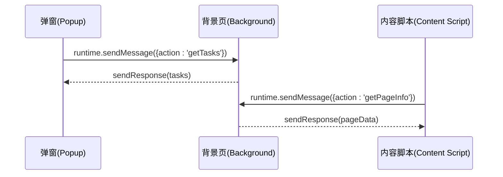
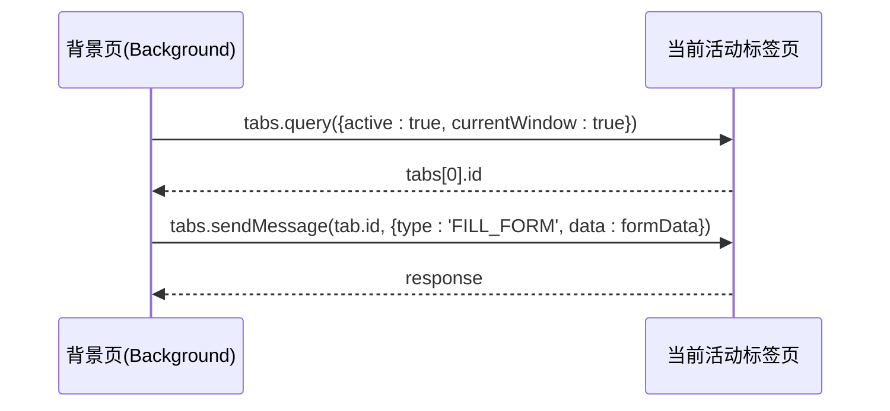
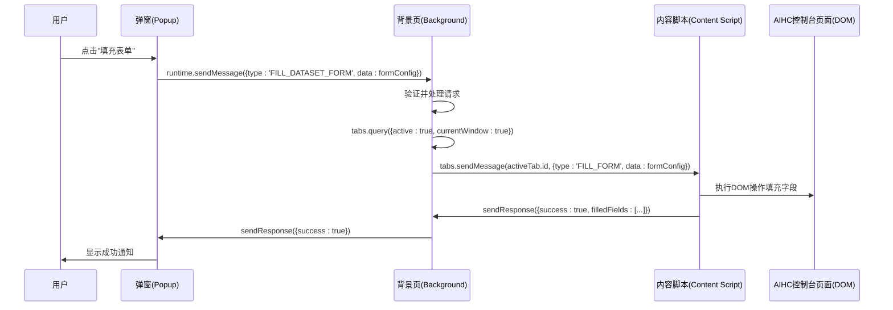

# 组件间通信机制

<cite>
**Referenced Files in This Document**   
- [chromeApi.ts](file://src/utils/chromeApi.ts)
- [index.ts](file://src/background/index.ts)
- [main.tsx](file://src/popup/main.tsx)
- [index.ts](file://src/content/index.ts)
</cite>

## 目录
1. [引言](#引言)
2. [三端架构与上下文模型](#三端架构与上下文模型)
3. [消息传递核心API](#消息传递核心api)
4. [典型通信场景时序分析](#典型通信场景时序分析)
5. [chromeApi.ts 通信封装机制](#chromeapits-通信封装机制)
6. [常见通信失败原因与调试策略](#常见通信失败原因与调试策略)
7. [总结](#总结)

## 引言

本专项文档系统性地解析了AIHCX浏览器扩展中基于Chrome Extension Messaging API的三端通信模型。该模型连接了扩展的三个核心执行环境：背景页（background）、内容脚本（content script）和弹窗（popup）。文档详细阐述了`chrome.runtime.sendMessage`与`chrome.tabs.sendMessage`在不同上下文间的交互路径，结合`chromeApi.ts`中的高级封装，揭示了如何抽象底层复杂性以提升代码可维护性。通过典型场景的时序图，本文将完整呈现“用户打开弹窗 → 请求当前页面数据 → 内容脚本采集 → 背景处理器生成结果 → 返回弹窗显示”的全链路通信过程，并提供实用的故障排查指南。

## 三端架构与上下文模型

AIHCX扩展采用经典的Chrome扩展三端分离架构，各组件运行在隔离的JavaScript上下文中，通过消息传递进行通信。

- **背景页 (Background)**: 持久化运行，负责管理全局状态、处理异步任务和协调跨标签页通信。
- **内容脚本 (Content Script)**: 注入到特定网页DOM中，直接访问和操作页面内容，是与用户界面交互的桥梁。
- **弹窗 (Popup)**: 用户点击扩展图标时短暂显示的UI界面，用于展示信息和接收用户指令。

这三者无法直接共享变量或调用函数，必须依赖Chrome提供的Messaging API进行异步消息交换。

**Section sources**
- [index.ts](file://src/background/index.ts)
- [main.tsx](file://src/popup/main.tsx)
- [index.ts](file://src/content/index.ts)

## 消息传递核心API

### chrome.runtime.sendMessage

此API用于在任意扩展上下文（background, popup, content script）之间发送消息。它不指定目标标签页，而是由Chrome路由到合适的监听器。



**Diagram sources**
- [index.ts](file://src/background/index.ts#L100-L150)
- [main.tsx](file://src/popup/main.tsx)
- [index.ts](file://src/content/index.ts#L500-L520)

### chrome.tabs.sendMessage

此API用于从background或popup向**特定标签页**的内容脚本发送消息。必须指定`tabId`作为目标。



**Diagram sources**
- [index.ts](file://src/background/index.ts#L280-L300)
- [index.ts](file://src/content/index.ts#L600-L650)

## 典型通信场景时序分析

以下时序图展示了用户请求填充表单的完整通信流程：



**Diagram sources**
- [index.ts](file://src/background/index.ts#L270-L310)
- [index.ts](file://src/content/index.ts#L600-L690)
- [main.tsx](file://src/popup/main.tsx)

**Section sources**
- [index.ts](file://src/background/index.ts#L270-L310)
- [index.ts](file://src/content/index.ts#L600-L690)

## chromeApi.ts 通信封装机制

`chromeApi.ts`文件对底层Chrome API进行了优雅的Promise封装，极大地提升了代码的可读性和健壮性。

### 核心封装模式

该文件将回调式API转换为基于Promise的异步函数，统一了错误处理逻辑。

```typescript
// 原始Chrome API (回调地狱)
chrome.runtime.sendMessage(message, (response) => {
  if (chrome.runtime.lastError) {
    handleError();
  } else {
    handleSuccess(response);
  }
});

// 封装后 (清晰的Promise链)
const response = await runtime.sendMessage(message);
if (response) {
  // 处理响应
}
```

### 关键封装函数

| 函数名 | 功能描述 | 错误处理策略 |
|-------|--------|-----------|
| `runtime.sendMessage` | 发送运行时消息 | 静默捕获`lastError`，返回`null` |
| `storage.sync.get/set` | 同步存储读写 | Promise包装原生回调 |
| `getCredentials` | 获取API凭证 | 组合`storage.sync.get`逻辑 |
| `saveHelperConfig` | 保存辅助功能配置 | 组合`storage.local.set`逻辑 |

这种封装使得业务逻辑代码无需关心底层通信细节和错误处理，只需关注功能实现。

**Section sources**
- [chromeApi.ts](file://src/utils/chromeApi.ts#L20-L130)

## 常见通信失败原因与调试策略

### 常见失败原因

1.  **上下文失效**: 扩展更新或重载导致内容脚本上下文失效，表现为`Extension context invalidated`错误。
2.  **消息格式错误**: 发送的消息对象缺少必要的`action`或`type`字段，导致监听器无法识别。
3.  **目标不存在**: 使用`tabs.sendMessage`时，目标标签页的内容脚本未加载或已卸载。
4.  **权限不足**: manifest.json中未声明`"activeTab"`或`"tabs"`等必要权限。
5.  **异步处理不当**: 在`onMessage`监听器中忘记返回`true`以保持响应通道开放。

### 调试策略

1.  **启用开发日志**: 在`content/index.ts`中设置`isDevelopment = true`，查看详细的`log()`输出。
2.  **检查Chrome开发者工具**:
    - **弹窗**: 检查`popup.html`的Console和Sources面板。
    - **背景页**: 在`chrome://extensions`中找到扩展，点击“背景页”链接。
    - **内容脚本**: 在目标页面按F12，切换到正确的框架（通常是`<extension>`）。
3.  **验证消息流**: 在`background/index.ts`的`onMessage`监听器中添加`console.log('收到消息:', message)`来追踪所有入站消息。
4.  **使用`safeChromeCall`**: 如`content/index.ts`所示，使用安全包装器来优雅地处理上下文失效问题。
5.  **检查Manifest权限**: 确认`manifest.json`包含了`"permissions": ["activeTab", "storage", "sidePanel"]`等必要项。

**Section sources**
- [index.ts](file://src/background/index.ts#L100-L150)
- [index.ts](file://src/content/index.ts#L20-L50)
- [chromeApi.ts](file://src/utils/chromeApi.ts#L20-L40)

## 总结

AIHCX扩展的三端通信模型建立在Chrome Messaging API之上，通过`chrome.runtime.sendMessage`实现全局广播和点对点通信，通过`chrome.tabs.sendMessage`实现精确的标签页控制。`chromeApi.ts`文件通过Promise封装和统一的错误处理，有效降低了通信逻辑的复杂度，使上层业务代码更加简洁和可靠。理解这一通信机制对于维护和扩展AIHCX的功能至关重要。当遇到通信问题时，应系统性地检查上下文状态、消息格式、权限配置和异步处理逻辑，并利用Chrome开发者工具进行端到端的调试。