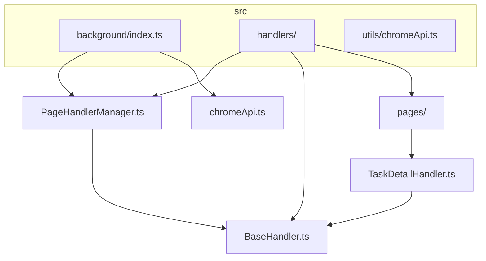
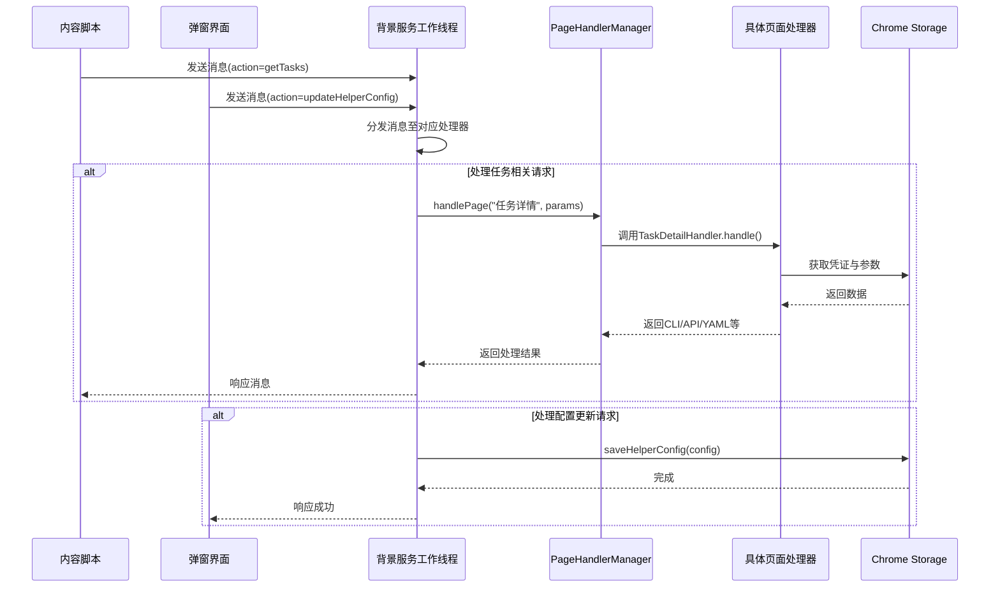
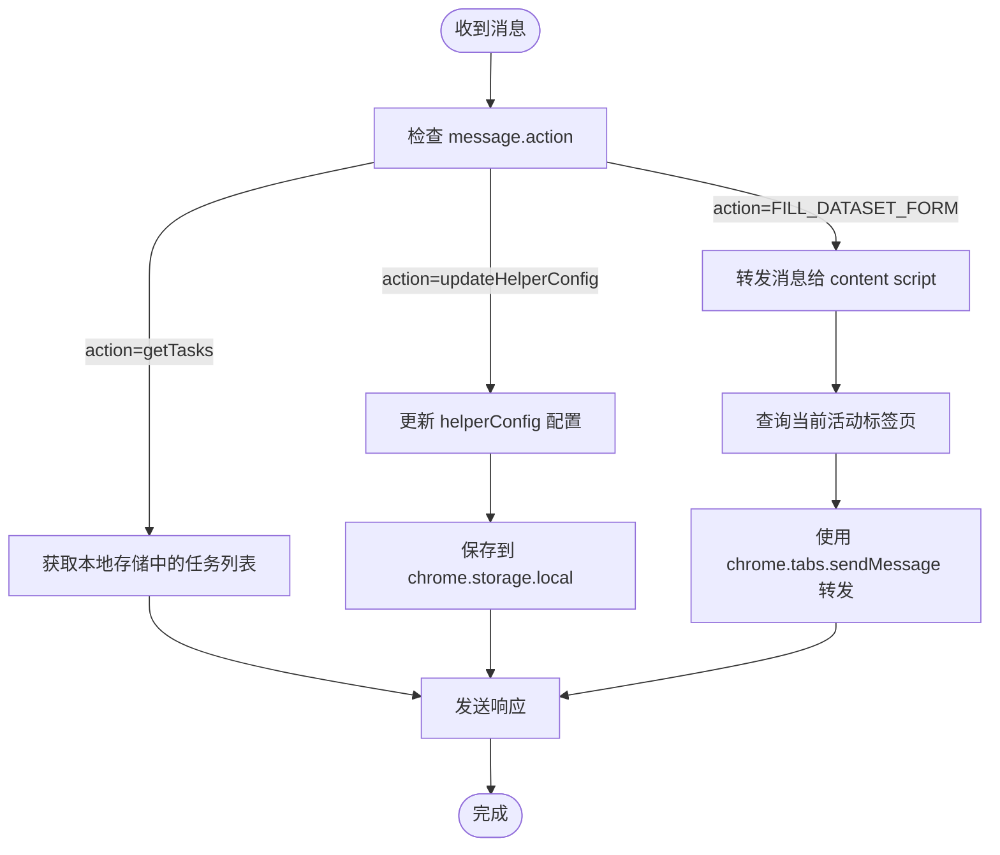
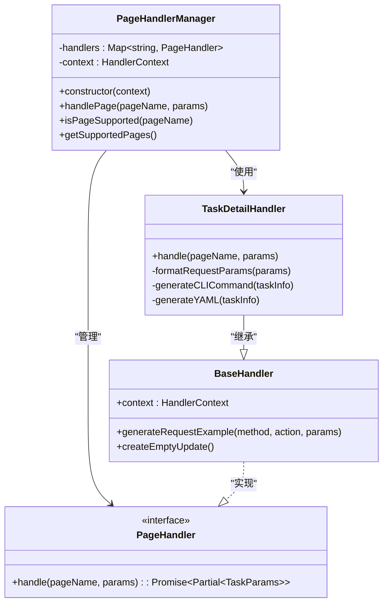
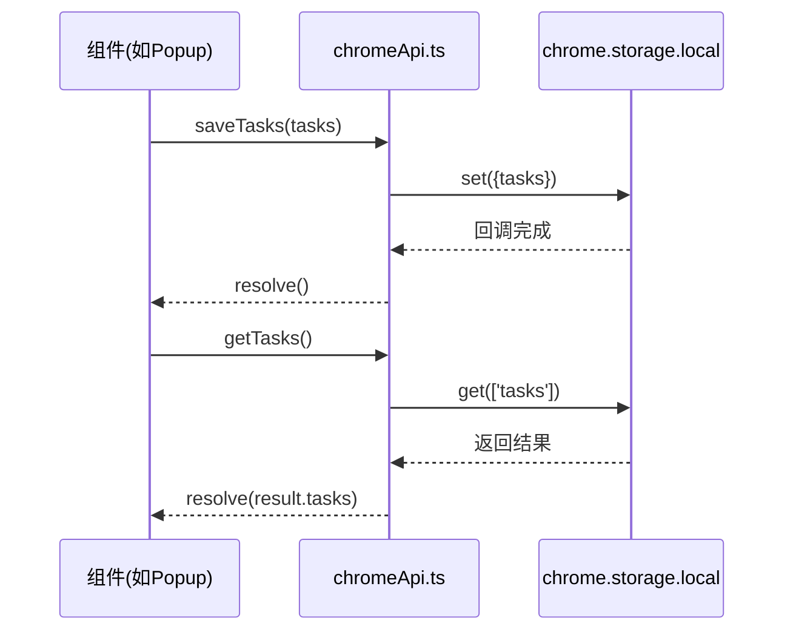
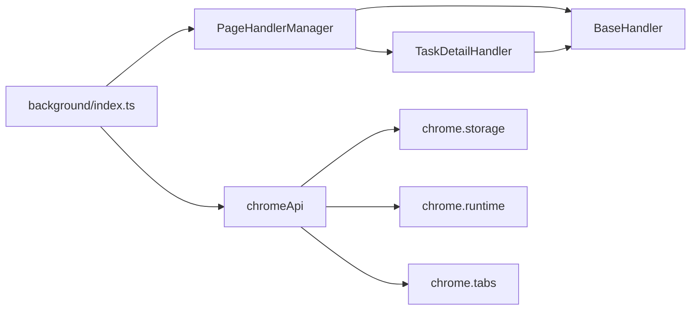

# 背景服务工作线程

<cite>
**Referenced Files in This Document**  
- [background/index.ts](file://src/background/index.ts)
- [handlers/PageHandlerManager.ts](file://src/handlers/PageHandlerManager.ts)
- [handlers/BaseHandler.ts](file://src/handlers/BaseHandler.ts)
- [handlers/pages/TaskDetailHandler.ts](file://src/handlers/pages/TaskDetailHandler.ts)
- [utils/chromeApi.ts](file://src/utils/chromeApi.ts)
</cite>

## 目录
1. [简介](#简介)
2. [项目结构](#项目结构)
3. [核心组件](#核心组件)
4. [架构概述](#架构概述)
5. [详细组件分析](#详细组件分析)
6. [依赖分析](#依赖分析)
7. [性能考虑](#性能考虑)
8. [故障排除指南](#故障排除指南)
9. [结论](#结论)

## 简介

AIHCX-EXT 扩展的背景服务工作线程（Background Service Worker）是整个扩展的核心控制中心，负责协调内容脚本、弹窗界面与后端逻辑之间的通信。该工作线程实现了消息监听、页面处理器调度、持久化存储管理以及跨标签页状态同步等关键功能。

作为浏览器扩展的长期运行进程，背景服务工作线程在扩展安装时初始化，并在整个浏览器会话期间持续运行。它通过 `chrome.runtime.onMessage` 监听来自不同来源的消息请求，利用 `PageHandlerManager` 动态调用相应的页面处理器进行数据解析和命令生成，最终将结果返回给请求方。

本文档深入分析其生命周期管理、错误恢复机制及与 Chrome Storage API 的集成方式，揭示其如何高效地支撑 AIHCX-EXT 的各项功能。

## 项目结构

**Diagram sources**  
- [background/index.ts](file://src/background/index.ts)
- [handlers/PageHandlerManager.ts](file://src/handlers/PageHandlerManager.ts)
- [handlers/BaseHandler.ts](file://src/handlers/BaseHandler.ts)
- [handlers/pages/TaskDetailHandler.ts](file://src/handlers/pages/TaskDetailHandler.ts)
- [utils/chromeApi.ts](file://src/utils/chromeApi.ts)

**Section sources**  
- [background/index.ts](file://src/background/index.ts)
- [handlers/index.ts](file://src/handlers/index.ts)

## 核心组件

背景服务工作线程的核心由以下几个关键组件构成：

- **消息监听器**：通过 `chrome.runtime.onMessage` 注册全局消息监听，接收来自弹窗或内容脚本的各类请求。
- **页面处理器管理器**（PageHandlerManager）：集中管理和调度所有页面处理器，根据页面名称动态选择合适的处理器实例。
- **基础处理器类**（BaseHandler）：为所有具体页面处理器提供统一接口和通用方法，确保行为一致性。
- **持久化存储服务**：封装对 `chrome.storage.local` 和 `chrome.storage.sync` 的访问，实现任务数据、用户配置等信息的可靠存储。

这些组件协同工作，构成了一个可扩展且易于维护的后台处理框架。

**Section sources**  
- [background/index.ts](file://src/background/index.ts#L0-L513)
- [handlers/PageHandlerManager.ts](file://src/handlers/PageHandlerManager.ts#L0-L95)
- [handlers/BaseHandler.ts](file://src/handlers/BaseHandler.ts#L0-L38)

## 架构概述

**Diagram sources**  
- [background/index.ts](file://src/background/index.ts#L0-L513)
- [handlers/PageHandlerManager.ts](file://src/handlers/PageHandlerManager.ts#L62-L78)
- [handlers/BaseHandler.ts](file://src/handlers/BaseHandler.ts#L10-L15)
- [utils/chromeApi.ts](file://src/utils/chromeApi.ts#L20-L35)

## 详细组件分析

### 消息监听与分发机制

背景服务工作线程通过注册 `chrome.runtime.onMessage` 事件监听器来接收来自扩展各部分的消息。该机制支持异步响应，允许长时间运行的操作不会阻塞主线程。

当接收到消息后，系统根据 `message.action` 字段判断操作类型，并调用相应的方法进行处理。对于需要页面特定逻辑的请求（如数据解析），则交由 `PageHandlerManager` 进行进一步分发。

#### 消息监听流程图

**Diagram sources**  
- [background/index.ts](file://src/background/index.ts#L50-L150)

**Section sources**  
- [background/index.ts](file://src/background/index.ts#L50-L200)

### 页面处理器管理器

`PageHandlerManager` 是扩展中所有页面处理器的中央调度器。它在构造时初始化一个包含所有已知页面处理器的映射表，并提供统一的接口来处理不同类型的页面请求。

#### 类关系图

**Diagram sources**  
- [handlers/PageHandlerManager.ts](file://src/handlers/PageHandlerManager.ts#L1-L95)
- [handlers/BaseHandler.ts](file://src/handlers/BaseHandler.ts#L1-L38)
- [handlers/pages/TaskDetailHandler.ts](file://src/handlers/pages/TaskDetailHandler.ts#L1-L274)

**Section sources**  
- [handlers/PageHandlerManager.ts](file://src/handlers/PageHandlerManager.ts#L1-L95)
- [handlers/BaseHandler.ts](file://src/handlers/BaseHandler.ts#L1-L38)

### 持久化存储集成

扩展使用 Chrome 提供的两种存储机制：`sync` 存储用于同步用户凭证等跨设备共享的数据；`local` 存储用于保存任务列表、临时图像数据等本地状态。

`utils/chromeApi.ts` 文件封装了对这些 API 的异步访问，提供了更简洁的 Promise 接口，避免回调地狱并增强错误处理能力。

#### 存储操作序列图

**Diagram sources**  
- [utils/chromeApi.ts](file://src/utils/chromeApi.ts#L40-L132)

**Section sources**  
- [utils/chromeApi.ts](file://src/utils/chromeApi.ts#L1-L133)

## 依赖分析

**Diagram sources**  
- [background/index.ts](file://src/background/index.ts)
- [handlers/PageHandlerManager.ts](file://src/handlers/PageHandlerManager.ts)
- [utils/chromeApi.ts](file://src/utils/chromeApi.ts)

**Section sources**  
- [background/index.ts](file://src/background/index.ts)
- [handlers/index.ts](file://src/handlers/index.ts)
- [utils/chromeApi.ts](file://src/utils/chromeApi.ts)

## 性能考虑

背景服务工作线程的设计充分考虑了性能与稳定性：
- 所有 I/O 操作均采用异步模式，防止阻塞事件循环；
- 对外部 API 调用设置了超时机制（如 `TaskDetailHandler` 中的 10 秒超时），避免无限等待；
- 使用 `Promise` 封装 Chrome 回调 API，提升代码可读性与错误处理能力；
- 在消息处理中合理使用 `return true` 表示异步响应，确保长耗时操作也能正确返回结果。

此外，通过模块化设计将职责分离，使得每个处理器专注于单一页面类型的处理逻辑，提升了系统的可维护性与扩展性。

## 故障排除指南

常见问题及其解决方案如下：

| 问题现象 | 可能原因 | 解决方案 |
|--------|--------|--------|
| 消息无响应 | 未正确返回 `true` 导致无法异步响应 | 检查 `onMessage` 监听器是否在异步操作