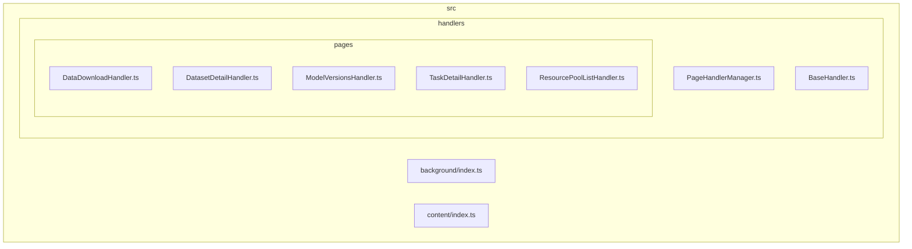
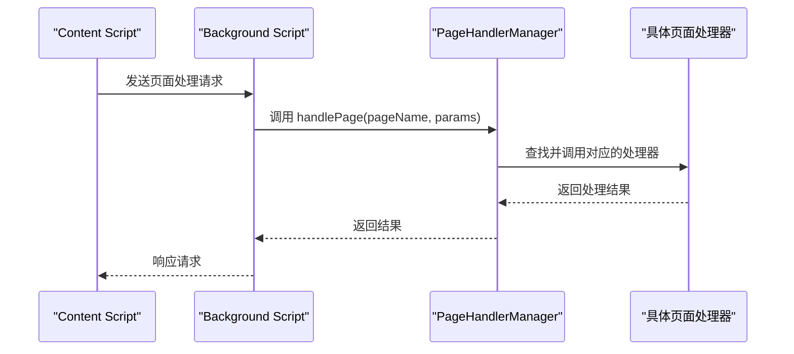
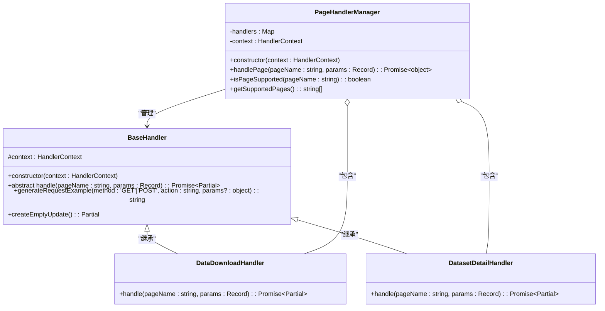
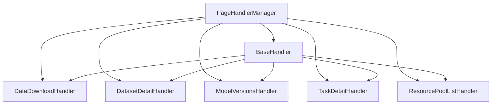

# 单例模式应用

<cite>
**Referenced Files in This Document**   
- [PageHandlerManager.ts](file://src/handlers/PageHandlerManager.ts)
- [BaseHandler.ts](file://src/handlers/BaseHandler.ts)
- [index.ts](file://src/background/index.ts)
- [index.ts](file://src/content/index.ts)
</cite>

## 目录
1. [引言](#引言)
2. [项目结构](#项目结构)
3. [核心组件](#核心组件)
4. [架构概述](#架构概述)
5. [详细组件分析](#详细组件分析)
6. [依赖关系分析](#依赖关系分析)
7. [性能考量](#性能考量)
8. [故障排除指南](#故障排除指南)
9. [结论](#结论)

## 引言

`PageHandlerManager` 是 Chrome 扩展 AIHCX-EXT 中的核心管理器类，采用单例模式设计，负责统一管理和调度所有页面处理器实例。该管理器在整个扩展生命周期内保持唯一性，确保状态一致性与资源高效利用。本文档深入分析其在背景服务工作线程中的初始化机制、模块级单例实现原理，以及在不同执行上下文（如 popup 和 content script）中安全访问该实例的方法，并探讨潜在的内存泄漏防范措施。

## 项目结构

本项目遵循典型的 Chrome 扩展结构，主要功能模块集中在 `src` 目录下。`handlers` 子目录专门存放页面处理逻辑，其中 `PageHandlerManager.ts` 作为中央协调者，通过导入并实例化各个具体的页面处理器（位于 `pages` 子目录），实现了对多种控制台页面的支持。

**Diagram sources**
- [PageHandlerManager.ts](file://src/handlers/PageHandlerManager.ts)
- [BaseHandler.ts](file://src/handlers/BaseHandler.ts)

**Section sources**
- [PageHandlerManager.ts](file://src/handlers/PageHandlerManager.ts)
- [BaseHandler.ts](file://src/handlers/BaseHandler.ts)

## 核心组件

`PageHandlerManager` 类是系统的核心组件，它封装了所有页面处理器的创建、注册和调用逻辑。通过一个私有的 `Map` 结构存储所有已注册的处理器实例，对外提供统一的 `handlePage` 接口来处理不同页面的数据请求。这种设计不仅降低了客户端代码的复杂度，也便于未来扩展新的页面类型。

**Section sources**
- [PageHandlerManager.ts](file://src/handlers/PageHandlerManager.ts#L21-L93)

## 架构概述

`PageHandlerManager` 在整个扩展架构中扮演着“指挥中心”的角色。它运行于后台脚本（background script）环境中，由 `background/index.ts` 初始化。当内容脚本（content script）检测到特定页面时，会通过消息通信机制向后台发送请求，后台再通过 `PageHandlerManager` 调用相应的处理器进行数据处理。

**Diagram sources**
- [PageHandlerManager.ts](file://src/handlers/PageHandlerManager.ts#L70-L88)
- [index.ts](file://src/background/index.ts)
- [index.ts](file://src/content/index.ts)

## 详细组件分析

### PageHandlerManager 分析

`PageHandlerManager` 的设计体现了典型的单例模式思想。虽然代码中未显式实现单例的构造函数保护或静态实例属性，但其使用方式保证了全局唯一性：它仅在后台脚本的顶层作用域被创建一次，并作为依赖注入到需要它的任何地方。

#### 类图

**Diagram sources**
- [PageHandlerManager.ts](file://src/handlers/PageHandlerManager.ts#L21-L93)
- [BaseHandler.ts](file://src/handlers/BaseHandler.ts#L3-L36)

**Section sources**
- [PageHandlerManager.ts](file://src/handlers/PageHandlerManager.ts#L21-L93)
- [BaseHandler.ts](file://src/handlers/BaseHandler.ts#L3-L36)

## 依赖关系分析

`PageHandlerManager` 与系统其他部分存在紧密的依赖关系。它直接依赖于所有具体的页面处理器（如 `DataDownloadHandler`, `DatasetDetailHandler` 等），这些处理器均继承自 `BaseHandler` 抽象类，确保了接口的一致性。同时，`PageHandlerManager` 的实例化需要一个 `HandlerContext` 对象，该对象可能包含了生成 API 请求示例等通用功能。

**Diagram sources**
- [PageHandlerManager.ts](file://src/handlers/PageHandlerManager.ts#L1-L93)
- [BaseHandler.ts](file://src/handlers/BaseHandler.ts#L1-L37)

**Section sources**
- [PageHandlerManager.ts](file://src/handlers/PageHandlerManager.ts#L1-L93)
- [BaseHandler.ts](file://src/handlers/BaseHandler.ts#L1-L37)

## 性能考量

将 `PageHandlerManager` 设计为单例并在后台脚本中常驻，带来了显著的性能优势。所有处理器实例在扩展启动时一次性初始化，避免了重复创建和销毁对象的开销。由于后台脚本的生命周期长于单个页面，这使得处理器的状态可以跨页面导航保持，提高了响应速度。然而，这也要求开发者必须谨慎管理处理器内部的状态，防止因长期持有引用而导致内存泄漏。

## 故障排除指南

若发现页面处理功能失效，首先应检查 `PageHandlerManager` 是否正确初始化。确认后台脚本是否正常运行，并查看控制台日志中是否有 `[PageHandlerManager] 未找到页面处理器` 的警告信息，这通常意味着请求的 `pageName` 与注册的名称不匹配。此外，需确保 `HandlerContext` 对象被正确传递给所有处理器，否则 `generateRequestExample` 等方法可能会失败。

**Section sources**
- [PageHandlerManager.ts](file://src/handlers/PageHandlerManager.ts#L73-L75)
- [BaseHandler.ts](file://src/handlers/BaseHandler.ts#L15-L20)

## 结论

`PageHandlerManager` 通过在后台脚本中作为单一实例存在，成功实现了对所有页面处理器的集中管理。这种设计充分利用了 Chrome 扩展的多进程架构，确保了状态一致性和资源的高效利用。尽管其实现依赖于外部代码的约定而非严格的单例模式语法，但在当前架构下是合理且有效的。未来可考虑在 `PageHandlerManager` 内部显式实现单例模式，以增强其健壮性和可维护性。