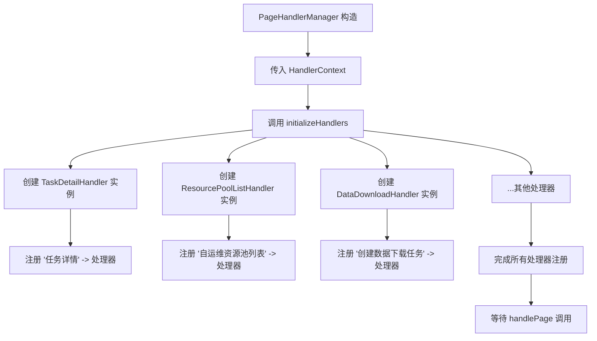
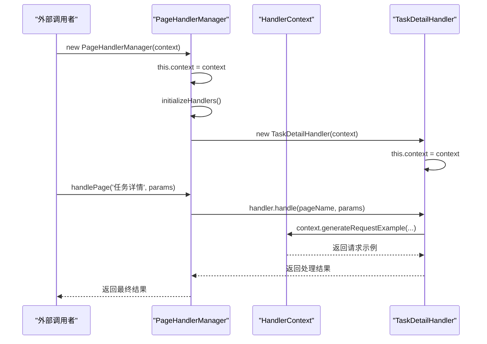
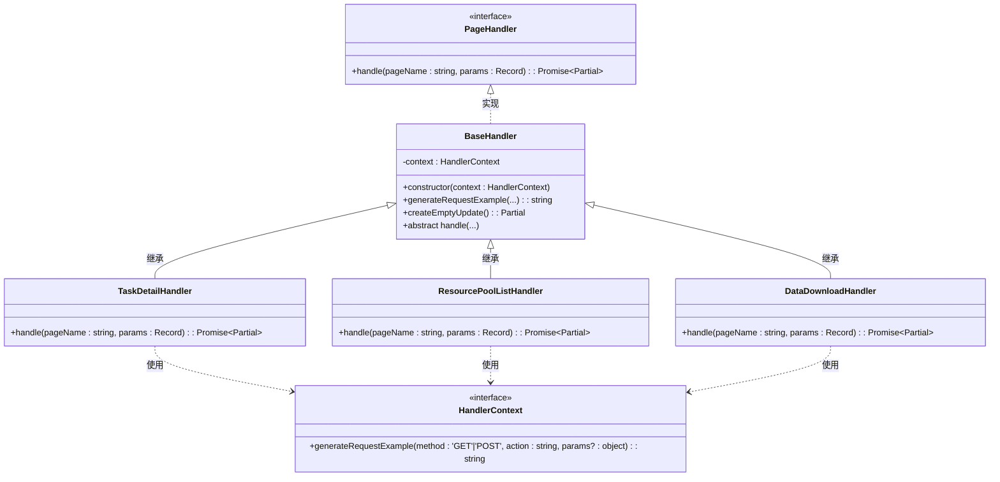

# 工厂模式初始化

<cite>
**Referenced Files in This Document **  
- [PageHandlerManager.ts](file://src/handlers/PageHandlerManager.ts)
- [types.ts](file://src/handlers/types.ts)
- [BaseHandler.ts](file://src/handlers/BaseHandler.ts)
- [TaskDetailHandler.ts](file://src/handlers/pages/TaskDetailHandler.ts)
- [ResourcePoolListHandler.ts](file://src/handlers/pages/ResourcePoolListHandler.ts)
- [DataDownloadHandler.ts](file://src/handlers/pages/DataDownloadHandler.ts)
</cite>

## 目录
1. [引言](#引言)
2. [核心组件分析](#核心组件分析)
3. [工厂模式实现机制](#工厂模式实现机制)
4. [依赖注入与上下文传递](#依赖注入与上下文传递)
5. [类结构与继承关系](#类结构与继承关系)
6. [注册流程与支持页面](#注册流程与支持页面)
7. [可扩展性与配置驱动展望](#可扩展性与配置驱动展望)
8. [结论](#结论)

## 引言

`PageHandlerManager` 类在浏览器扩展中扮演着中央协调者的角色，负责根据当前页面类型动态选择并执行相应的数据处理逻辑。其构造函数中的 `initializeHandlers` 方法体现了典型的工厂模式应用，通过集中化地创建和注册各类 `PageHandler` 实例，实现了对象创建过程的封装与解耦。该设计不仅简化了依赖管理，提高了代码的可测试性，还为未来实现配置驱动的动态处理器加载奠定了基础。

## 核心组件分析

本系统围绕 `PageHandlerManager` 构建了一套模块化的页面处理架构。`PageHandlerManager` 作为核心管理者，维护一个映射表，将预定义的页面名称与对应的处理器实例关联起来。每个具体的页面处理器（如 `TaskDetailHandler`、`ResourcePoolListHandler` 等）都实现了统一的 `PageHandler` 接口，确保了行为的一致性。这种设计使得新增或修改页面处理逻辑变得非常灵活，只需实现新的处理器类并在管理器中注册即可，无需改动核心调度逻辑。

**Section sources**
- [PageHandlerManager.ts](file://src/handlers/PageHandlerManager.ts#L1-L95)
- [types.ts](file://src/handlers/types.ts#L1-L20)

## 工厂模式实现机制

`PageHandlerManager` 的 `initializeHandlers` 方法是工厂模式的具体体现。该方法在管理器实例化时被调用，其职责是预先创建所有已知页面类型的处理器对象，并将其存储在内部的 `Map` 结构中。

**Diagram sources **
- [PageHandlerManager.ts](file://src/handlers/PageHandlerManager.ts#L30-L57)

**Section sources**
- [PageHandlerManager.ts](file://src/handlers/PageHandlerManager.ts#L30-L57)

此方法通过一系列 `this.handlers.set()` 调用，将字符串形式的页面名称（如 `'任务详情'`）与新创建的处理器实例（如 `new TaskDetailHandler(this.context)`）进行绑定。这种方式将对象的创建和使用分离，客户端代码（即 `handlePage` 方法）只需提供页面名称，由管理器负责查找并返回正确的处理器，完全不需要了解具体是哪个类被实例化。这正是工厂模式的核心优势——封装对象创建细节，降低系统耦合度。

## 依赖注入与上下文传递

`PageHandlerManager` 及其所有子处理器均采用了构造函数注入的方式接收依赖。`PageHandlerManager` 的构造函数接受一个 `HandlerContext` 对象，并将其传递给每一个新创建的处理器实例。

**Diagram sources **
- [PageHandlerManager.ts](file://src/handlers/PageHandlerManager.ts#L25-L30)
- [BaseHandler.ts](file://src/handlers/BaseHandler.ts#L7-L15)
- [TaskDetailHandler.ts](file://src/handlers/pages/TaskDetailHandler.ts#L7-L272)

**Section sources**
- [PageHandlerManager.ts](file://src/handlers/PageHandlerManager.ts#L25-L30)
- [BaseHandler.ts](file://src/handlers/BaseHandler.ts#L7-L15)

`HandlerContext` 接口定义了一个 `generateRequestExample` 方法，该方法被各个处理器用于生成API请求示例。通过将这个共享的上下文作为依赖项注入，确保了所有处理器都能以一致且安全的方式访问这一功能，而无需直接引用全局状态或单例。这种依赖注入机制极大地增强了代码的灵活性和可测试性：在单元测试中，可以轻松地为 `HandlerContext` 提供一个模拟（mock）实现，从而隔离测试每个处理器的业务逻辑。

## 类结构与继承关系

系统的类层次结构清晰，遵循了良好的面向对象设计原则。`BaseHandler` 是一个抽象基类，它实现了 `PageHandler` 接口，并提供了通用的辅助方法（如 `generateRequestExample` 和 `createEmptyUpdate`）。所有具体的页面处理器都继承自 `BaseHandler`，从而复用了这些公共功能，并强制实现了核心的 `handle` 方法。

**Diagram sources **
- [types.ts](file://src/handlers/types.ts#L1-L20)
- [BaseHandler.ts](file://src/handlers/BaseHandler.ts#L1-L38)
- [TaskDetailHandler.ts](file://src/handlers/pages/TaskDetailHandler.ts#L7-L272)
- [ResourcePoolListHandler.ts](file://src/handlers/pages/ResourcePoolListHandler.ts#L7-L34)
- [DataDownloadHandler.ts](file://src/handlers/pages/DataDownloadHandler.ts#L7-L41)

**Section sources**
- [types.ts](file://src/handlers/types.ts#L1-L20)
- [BaseHandler.ts](file://src/handlers/BaseHandler.ts#L1-L38)

## 注册流程与支持页面

`initializeHandlers` 方法的注册流程具有明确的组织性。代码通过注释将处理器分为“任务相关”、“资源池相关”、“队列相关”和“其他”等类别，提高了可读性和可维护性。值得注意的是，同一个处理器类（如 `ResourcePoolListHandler` 和 `DataDownloadHandler`）可以被多次实例化并注册到不同的页面名称下，这表明这些处理器能够根据运行时参数（如URL中的 `pageName`）来调整其行为。

例如，`'自运维资源池列表'` 和 `'全托管资源池列表'` 都使用 `ResourcePoolListHandler` 实例，但该处理器会根据传入的 `pageName` 参数判断具体的资源池类型，并生成相应的CLI命令和API文档。同样，`DataDownloadHandler` 被用于 `'创建数据下载任务'` 和 `'数据下载任务详情'` 两个页面，通过检查 `pageName` 来决定是否显示输入框还是数据转储表单。

## 可扩展性与配置驱动展望

当前的工厂模式实现是静态的，所有处理器都在编译时硬编码注册。然而，这种设计为未来的动态扩展提供了良好的基础。理论上，可以将页面名称与处理器类名的映射关系移至一个外部配置文件（如JSON）中。`initializeHandlers` 方法可以读取该配置，然后利用TypeScript的反射或动态导入机制来按需创建处理器实例。这种方式将使系统更加灵活，允许在不重新编译代码的情况下添加新的页面处理能力，真正实现插件化架构。

## 结论

`PageHandlerManager` 中的 `initializeHandlers` 方法通过应用工厂模式，成功地将页面处理器的创建与使用解耦。结合TypeScript的构造函数依赖注入，该设计实现了高内聚、低耦合的代码结构，显著提升了系统的可维护性和可测试性。其清晰的类继承体系和集中的注册机制，不仅保证了代码的一致性，也为未来的功能扩展和架构演进（如配置驱动、动态加载）铺平了道路。