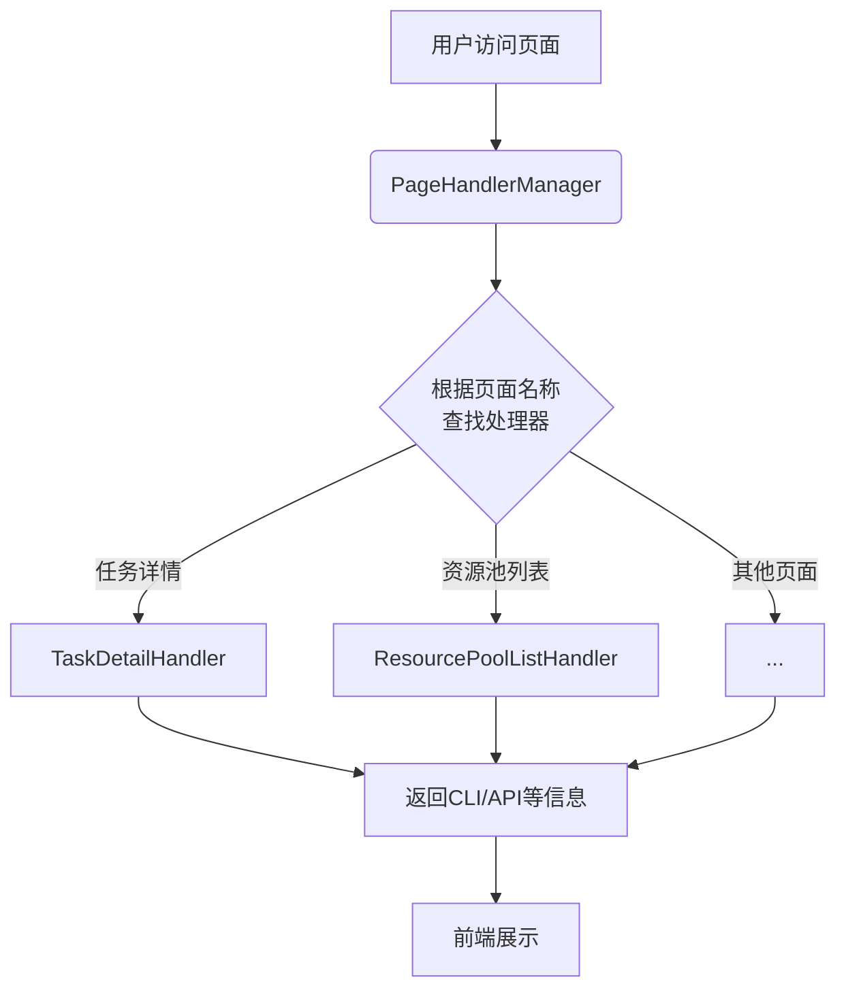
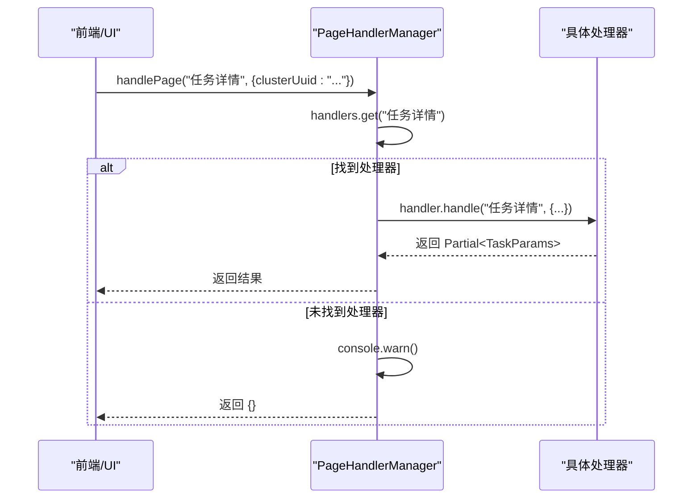

# 策略模式实现

<cite>
**Referenced Files in This Document **   
- [PageHandlerManager.ts](file://src/handlers/PageHandlerManager.ts)
- [BaseHandler.ts](file://src/handlers/BaseHandler.ts)
- [types.ts](file://src/handlers/types.ts)
- [TaskDetailHandler.ts](file://src/handlers/pages/TaskDetailHandler.ts)
- [ResourcePoolListHandler.ts](file://src/handlers/pages/ResourcePoolListHandler.ts)
</cite>

## 目录
1. [引言](#引言)
2. [核心架构概览](#核心架构概览)
3. [策略模式核心组件分析](#策略模式核心组件分析)
4. [处理器注册与分发机制](#处理器注册与分发机制)
5. [具体处理器实现分析](#具体处理器实现分析)
6. [类型安全与错误处理](#类型安全与错误处理)
7. [扩展新页面处理器的流程](#扩展新页面处理器的流程)
8. [最佳实践建议](#最佳实践建议)
9. [总结](#总结)

## 引言

本文档深入解析AIHCX-EXT扩展程序中`PageHandlerManager`如何基于策略模式（Strategy Pattern）实现对不同AIHC控制台页面的动态处理与分发。该设计通过定义统一的接口规范，将各个页面的具体业务逻辑解耦到独立的处理器类中，从而实现了高度的可扩展性和维护性。文档将详细阐述抽象基类、具体处理器以及管理器之间的协作关系，并提供新增自定义处理器的标准流程。

## 核心架构概览

系统采用经典的策略模式来应对AIHC控制台多样化的页面需求。其核心思想是将“算法”（即处理特定页面的逻辑）封装成独立的对象（处理器），并在运行时根据上下文（页面名称）动态选择合适的算法执行。



**Diagram sources**
- [PageHandlerManager.ts](file://src/handlers/PageHandlerManager.ts#L21-L93)
- [TaskDetailHandler.ts](file://src/handlers/pages/TaskDetailHandler.ts#L7-L272)
- [ResourcePoolListHandler.ts](file://src/handlers/pages/ResourcePoolListHandler.ts#L7-L34)

**Section sources**
- [PageHandlerManager.ts](file://src/handlers/PageHandlerManager.ts#L1-L94)
- [BaseHandler.ts](file://src/handlers/BaseHandler.ts#L1-L37)

## 策略模式核心组件分析

### BaseHandler 抽象基类

`BaseHandler` 是所有具体页面处理器的抽象基类，它定义了统一的接口规范和共享的辅助功能。

#### 统一接口规范
`BaseHandler` 实现了 `PageHandler` 接口，强制要求所有子类必须实现 `handle` 方法。该方法接收页面名称和URL参数，返回一个包含CLI命令、API文档等信息的部分 `TaskParams` 对象。
```typescript
abstract handle(pageName: string, params: Record<string, string>): Promise<Partial<TaskParams>>;
```

#### 共享功能
`BaseHandler` 提供了两个关键的受保护方法，供子类复用：
- `generateRequestExample`: 用于生成标准的API请求示例。
- `createEmptyUpdate`: 返回一个初始化的空 `TaskParams` 对象，确保返回值结构的一致性。

**Section sources**
- [BaseHandler.ts](file://src/handlers/BaseHandler.ts#L3-L36)
- [types.ts](file://src/handlers/types.ts#L3-L19)

### PageHandler 接口契约

`PageHandler` 接口位于 `types.ts` 文件中，是整个策略模式的契约核心。它规定了所有处理器必须遵循的行为，保证了 `PageHandlerManager` 可以以统一的方式调用任何具体的处理器。

**Section sources**
- [types.ts](file://src/handlers/types.ts#L3-L19)

## 处理器注册与分发机制

`PageHandlerManager` 是策略模式的“上下文”角色，负责管理所有可用的处理器并根据条件进行分发。

### 处理器注册 (`initializeHandlers`)
在 `PageHandlerManager` 的构造函数中，会调用 `initializeHandlers` 方法。该方法使用一个 `Map<string, PageHandler>` 来存储页面名称与处理器实例的映射关系。例如：
```typescript
this.handlers.set('任务详情', new TaskDetailHandler(this.context));
this.handlers.set('资源池列表', new ResourcePoolListHandler(this.context));
```
这种设计使得添加新页面支持变得非常简单，只需在此处增加一行映射即可。

### 动态分发 (`handlePage`)
`handlePage` 方法是分发的核心。它接收当前页面的名称，从 `Map` 中查找对应的处理器实例。如果找到，则调用其实现的 `handle` 方法；如果未找到，则记录警告并返回空对象，保证了系统的健壮性。



**Diagram sources**
- [PageHandlerManager.ts](file://src/handlers/PageHandlerManager.ts#L62-L78)
- [BaseHandler.ts](file://src/handlers/BaseHandler.ts#L10-L12)

**Section sources**
- [PageHandlerManager.ts](file://src/handlers/PageHandlerManager.ts#L40-L60)
- [PageHandlerManager.ts](file://src/handlers/PageHandlerManager.ts#L62-L78)

## 具体处理器实现分析

### TaskDetailHandler 实现细节

`TaskDetailHandler` 负责处理“任务详情”页面。其 `handle` 方法展示了复杂的业务逻辑：
1.  **参数校验**: 检查 `clusterUuid` 和 `k8sName` 等必要参数。
2.  **API调用**: 使用 `fetch` 请求后端API获取原始任务数据。
3.  **数据解析与转换**: 将API返回的JSON数据解析并格式化为创建新任务所需的参数。
4.  **内容生成**: 基于格式化后的参数，生成CLI命令、YAML配置和JSON参数等多种形式的内容。
5.  **错误降级**: 在捕获异常后，返回一个包含基础信息的降级结果，确保用户体验不完全中断。

**Section sources**
- [TaskDetailHandler.ts](file://src/handlers/pages/TaskDetailHandler.ts#L10-L272)

### ResourcePoolListHandler 实现细节

`ResourcePoolListHandler` 展示了更简洁的逻辑，但也体现了策略模式的灵活性。它通过检查传入的 `pageName` 参数来区分“自运维”和“全托管”两种资源池类型，并相应地调整返回的CLI命令和API请求参数，实现了代码复用。

**Section sources**
- [ResourcePoolListHandler.ts](file://src/handlers/pages/ResourcePoolListHandler.ts#L10-L34)

## 类型安全与运行时错误处理

该设计在类型安全和错误处理方面表现出色：

### 类型安全
- **接口驱动**: 通过 `PageHandler` 接口，编译器可以确保所有处理器都实现了正确的 `handle` 方法签名。
- **泛型与Promise**: `handle` 方法返回 `Promise<Partial<TaskParams>>`，明确了异步操作和返回值的结构，便于调用方处理。

### 运行时错误处理
- **防御性编程**: `PageHandlerManager.handlePage` 方法首先检查处理器是否存在，避免了调用 `null` 或 `undefined` 的风险。
- **异常捕获**: 在 `try-catch` 块中执行处理器的 `handle` 方法，防止单个处理器的错误导致整个扩展崩溃。
- **优雅降级**: 当发生错误时，系统会返回一个有意义的基础响应，而不是抛出未处理的异常。

**Section sources**
- [PageHandlerManager.ts](file://src/handlers/PageHandlerManager.ts#L65-L77)
- [TaskDetailHandler.ts](file://src/handlers/pages/TaskDetailHandler.ts#L45-L272)

## 扩展新页面处理器的流程

要为