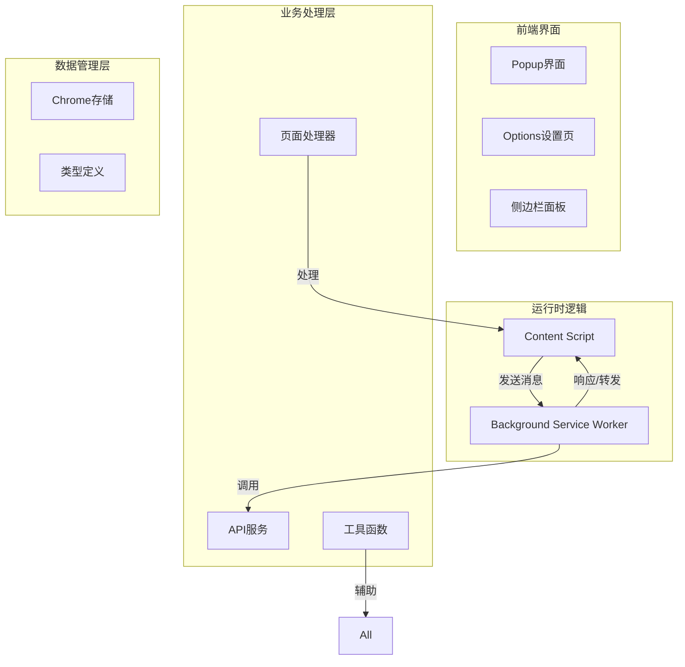
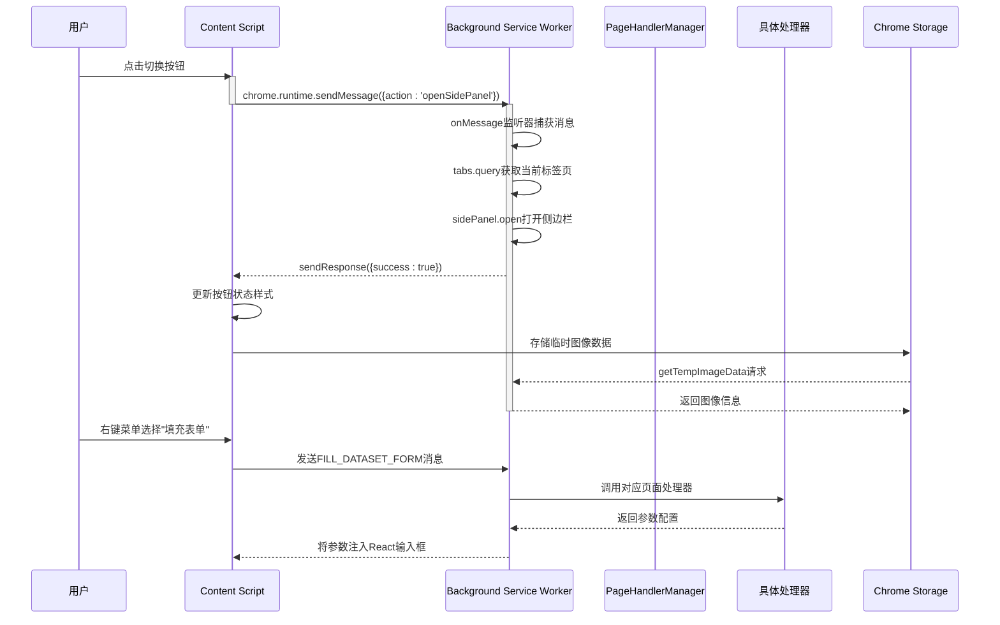
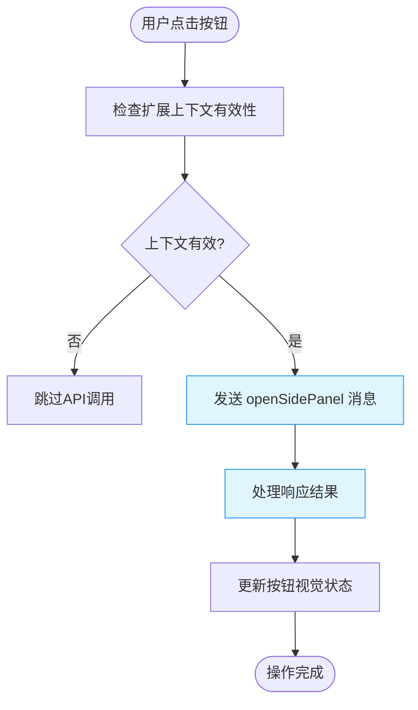
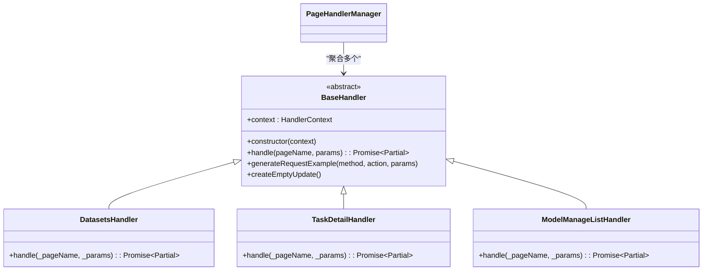
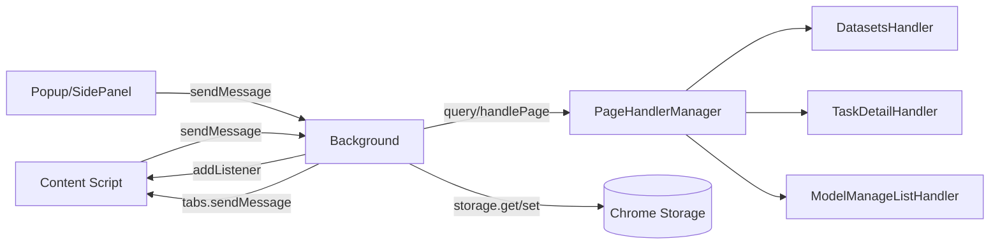

# 观察者模式集成

<cite>
**Referenced Files in This Document**   
- [content/index.ts](file://src/content/index.ts)
- [background/index.ts](file://src/background/index.ts)
- [PageHandlerManager.ts](file://src/handlers/PageHandlerManager.ts)
- [chromeApi.ts](file://src/utils/chromeApi.ts)
- [DatasetsHandler.ts](file://src/handlers/pages/DatasetsHandler.ts)
- [BaseHandler.ts](file://src/handlers/BaseHandler.ts)
</cite>

## 目录
1. [引言](#引言)
2. [项目结构](#项目结构)
3. [核心组件](#核心组件)
4. [架构概览](#架构概览)
5. [详细组件分析](#详细组件分析)
6. [依赖分析](#依赖分析)
7. [性能考量](#性能考量)
8. [故障排除指南](#故障排除指南)
9. [结论](#结论)

## 引言
本文档旨在阐述Chrome扩展中观察者模式的实现机制，重点分析内容脚本（content script）与后台服务工作线程（background service worker）之间的消息通信系统。通过解析`chrome.runtime.sendMessage`和`chrome.runtime.onMessage.addListener`的使用方式，揭示其如何构建松耦合、高内聚的跨上下文交互体系。

## 项目结构
该AIHCX浏览器扩展采用模块化TypeScript架构，主要分为以下几个功能区域：



**Diagram sources**
- [src/content/index.ts](file://src/content/index.ts)
- [src/background/index.ts](file://src/background/index.ts)
- [src/handlers/PageHandlerManager.ts](file://src/handlers/PageHandlerManager.ts)

**Section sources**
- [src/content/index.ts](file://src/content/index.ts)
- [src/background/index.ts](file://src/background/index.ts)
- [src/handlers/PageHandlerManager.ts](file://src/handlers/PageHandlerManager.ts)

## 核心组件
系统的核心在于基于Chrome Runtime API的消息传递机制，实现了典型的观察者模式。内容脚本作为事件发布者，在检测到页面状态变化时主动发出通知；后台服务工作线程作为事件订阅者，通过监听器接收并响应这些事件。

这种设计使得UI层与业务逻辑层完全解耦，任何一方的变更都不会直接影响另一方的实现细节，极大提升了系统的可维护性和扩展性。

**Section sources**
- [src/content/index.ts](file://src/content/index.ts#L0-L938)
- [src/background/index.ts](file://src/background/index.ts#L0-L513)

## 架构概览
整个消息通信流程遵循清晰的单向数据流原则，从用户交互触发开始，经过多层抽象处理，最终完成状态更新或外部请求。



**Diagram sources**
- [src/content/index.ts](file://src/content/index.ts#L0-L938)
- [src/background/index.ts](file://src/background/index.ts#L0-L513)
- [src/handlers/PageHandlerManager.ts](file://src/handlers/PageHandlerManager.ts#L0-L95)

## 详细组件分析

### 内容脚本分析
内容脚本是驻留在网页DOM中的JavaScript代码，负责监控页面状态并与用户进行直接交互。

#### 消息发送机制
当用户点击插件提供的浮动按钮时，内容脚本会立即通过`chrome.runtime.sendMessage`向后台发送指令：



**Diagram sources**
- [src/content/index.ts](file://src/content/index.ts#L0-L938)

**Section sources**
- [src/content/index.ts](file://src/content/index.ts#L0-L938)

### 后台服务工作线程分析
后台服务工作线程是整个扩展的中枢神经，负责协调所有跨上下文的操作。

#### 消息监听与分发
后台脚本通过注册全局的`onMessage.addListener`来统一处理来自各个来源的消息请求：

```mermaid
classDiagram
class MessageListener {
+onMessage~(message, sender, sendResponse)~
}
class ActionRouter {
-getCredentials()
-generateParams()
-createTask()
-getTasks()
-updateHelperConfig()
-processImage()
-addImageToTask()
}
class StorageManager {
+sync~{get,set}~
+local~{get,set}~
}
class SidePanelController {
+open~(windowId)~
+close~()~
}
MessageListener --> ActionRouter : "路由 action"
ActionRouter --> StorageManager : "读写配置"
ActionRouter --> SidePanelController : "控制UI"
ActionRouter --> PageHandlerManager : "处理页面数据"
```

**Diagram sources**
- [src/background/index.ts](file://src/background/index.ts#L0-L513)

**Section sources**
- [src/background/index.ts](file://src/background/index.ts#L0-L513)

### 页面处理器分析
页面处理器模块体现了职责分离的设计思想，每个具体处理器只关注特定页面的数据提取逻辑。

#### 继承关系与多态实现
所有处理器都继承自`BaseHandler`抽象基类，并实现统一的`handle`接口：



**Diagram sources**
- [src/handlers/BaseHandler.ts](file://src/handlers/BaseHandler.ts#L3-L36)
- [src/handlers/pages/DatasetsHandler.ts](file://src/handlers/pages/DatasetsHandler.ts#L8-L19)

**Section sources**
- [src/handlers/BaseHandler.ts](file://src/handlers/BaseHandler.ts#L3-L36)
- [src/handlers/pages/DatasetsHandler.ts](file://src/handlers/pages/DatasetsHandler.ts#L8-L19)

## 依赖分析
各模块之间通过明确定义的接口进行通信，避免了紧耦合的问题。



**Diagram sources**
- [src/content/index.ts](file://src/content/index.ts)
- [src/background/index.ts](file://src/background/index.ts)
- [src/handlers/PageHandlerManager.ts](file://src/handlers/PageHandlerManager.ts)
- [src/handlers/pages/DatasetsHandler.ts](file://src/handlers/pages/DatasetsHandler.ts)

**Section sources**
- [src/content/index.ts](file://src/content/index.ts)
- [src/background/index.ts](file://src/background/index.ts)
- [src/handlers/PageHandlerManager.ts](file://src/handlers/PageHandlerManager.ts)

## 性能考量
为确保用户体验流畅，系统在多个层面进行了优化：

1. **异步非阻塞**：所有Chrome API调用均采用Promise封装，防止主线程卡顿
2. **批量操作**：对存储读写进行合并，减少I/O次数
3. **懒加载**：仅在需要时才注入UI组件
4. **错误静默处理**：避免因单个失败导致整体崩溃
5. **资源清理**：及时移除不再需要的事件监听器和DOM元素

此外，通过将复杂逻辑下沉至后台线程执行，保证了内容脚本的轻量化，使其能够快速响应用户操作。

## 故障排除指南
开发者在调试过程中可能遇到以下常见问题及解决方案：

**Section sources**
- [src/utils/chromeApi.ts](file://src/utils/chromeApi.ts#L0-L133)
- [src/background/index-simple.ts](file://src/background/index-simple.ts#L0-L59)

### 消息无法送达
- 检查`manifest.json`中声明的权限是否包含`"activeTab"`或具体主机权限
- 确认目标页面已正确加载内容脚本
- 验证消息对象格式是否符合预期结构
- 使用`chrome.runtime.lastError`检查是否存在传输错误

### 响应超时
- 确保在异步操作中返回`true`以保持消息通道开放
- 避免在监听器中执行耗时同步任务
- 设置合理的超时机制并在必要时提供降级方案

### 上下文失效
- 在调用前使用`isExtensionContextValid()`检查环境状态
- 对关键操作添加try-catch防护
- 实现优雅降级策略，如本地缓存fallback

## 结论
本系统通过Chrome Runtime消息系统成功实现了观察者模式，构建了一个高度模块化且易于维护的浏览器扩展架构。内容脚本与后台服务工作线程之间的松耦合通信机制，不仅提高了代码的可测试性与可扩展性，也为未来功能迭代提供了坚实基础。建议后续开发中继续遵循这一设计范式，确保新功能也能无缝集成到现有体系之中。