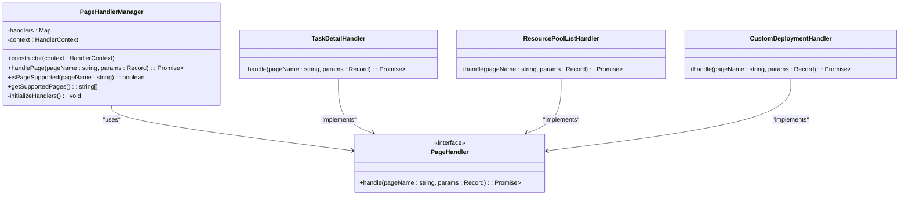
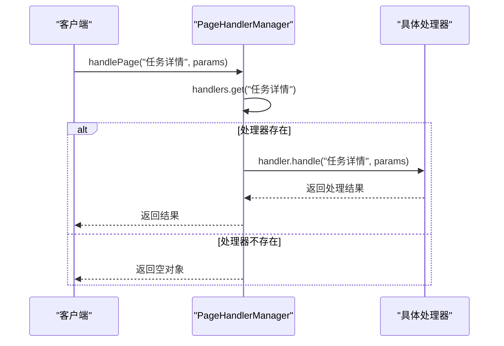
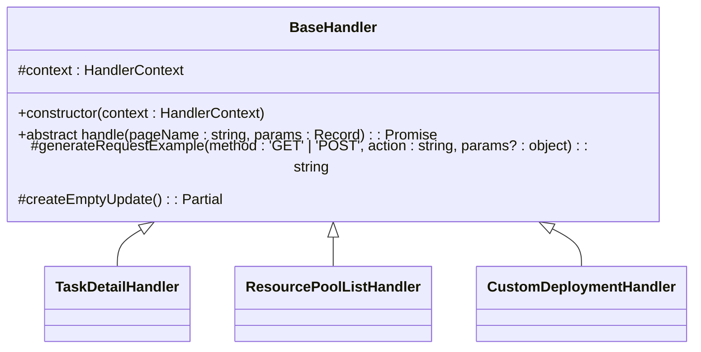
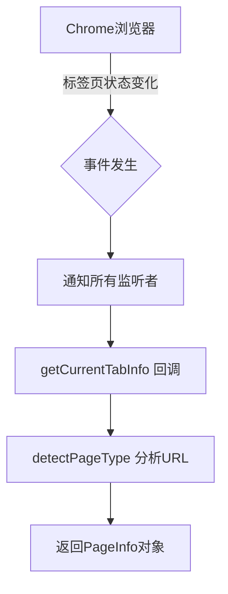

# 设计模式应用

<cite>
**Referenced Files in This Document**   
- [PageHandlerManager.ts](file://src/handlers/PageHandlerManager.ts)
- [BaseHandler.ts](file://src/handlers/BaseHandler.ts)
- [types.ts](file://src/handlers/types.ts)
- [TaskDetailHandler.ts](file://src/handlers/pages/TaskDetailHandler.ts)
- [ResourcePoolListHandler.ts](file://src/handlers/pages/ResourcePoolListHandler.ts)
- [CustomDeploymentHandler.ts](file://src/handlers/pages/CustomDeploymentHandler.ts)
- [pageDetection.ts](file://src/utils/pageDetection.ts)
</cite>

## 目录
1. [引言](#引言)
2. [核心设计模式分析](#核心设计模式分析)
3. [策略模式与动态分发](#策略模式与动态分发)
4. [抽象基类与统一接口](#抽象基类与统一接口)
5. [单例模式的应用](#单例模式的应用)
6. [观察者模式的体现](#观察者模式的体现)
7. [系统质量属性提升](#系统质量属性提升)
8. [扩展实践指南](#扩展实践指南)

## 引言

AIHCX-EXT 扩展程序通过精心设计的架构模式实现了对百度百舸AIHC控制台多类型页面的智能支持。本文档深入剖析其核心设计模式，包括策略模式、抽象基类、单例模式和观察者模式的应用，揭示这些模式如何协同工作以构建一个可扩展、可维护且测试友好的系统。

## 核心设计模式分析

AIHCX-EXT 的架构设计体现了多种经典设计模式的综合运用，形成了清晰的职责分离和灵活的扩展机制。系统通过 `PageHandlerManager` 统一管理各类页面处理器，每个处理器继承自 `BaseHandler` 抽象基类，确保了接口的一致性。这种设计不仅提升了代码的组织性，也为未来的功能扩展提供了标准化路径。

**Section sources**
- [PageHandlerManager.ts](file://src/handlers/PageHandlerManager.ts#L1-L94)
- [BaseHandler.ts](file://src/handlers/BaseHandler.ts#L1-L37)

## 策略模式与动态分发

### PageHandlerManager 的策略实现

`PageHandlerManager` 类是策略模式的核心实现，它通过维护一个映射表（Map）将不同的页面名称与对应的处理器实例进行关联，实现了运行时的动态分发处理。

**Diagram sources**
- [PageHandlerManager.ts](file://src/handlers/PageHandlerManager.ts#L21-L93)
- [types.ts](file://src/handlers/types.ts#L1-L19)

#### 动态注册机制

在 `initializeHandlers` 方法中，系统预定义了所有支持的页面类型及其对应的处理器实例。这种集中式注册方式使得页面支持列表一目了然，便于维护和审计。

#### 请求分发流程

`handlePage` 方法是策略模式的执行入口。当接收到页面处理请求时，系统首先根据页面名称从映射表中查找对应的处理器实例。如果找到，则调用该实例的 `handle` 方法进行具体处理；否则返回空结果并记录警告信息。这种"查找-委托"的模式完全符合策略模式的精髓。

**Diagram sources**
- [PageHandlerManager.ts](file://src/handlers/PageHandlerManager.ts#L62-L78)

**Section sources**
- [PageHandlerManager.ts](file://src/handlers/PageHandlerManager.ts#L40-L60)

## 抽象基类与统一接口

### BaseHandler 的规范作用

`BaseHandler` 作为所有页面处理器的抽象基类，定义了统一的接口规范和共享的功能实现，是模板方法模式和依赖倒置原则的典型应用。

**Diagram sources**
- [BaseHandler.ts](file://src/handlers/BaseHandler.ts#L3-L36)

#### 抽象方法约束

`BaseHandler` 定义了一个抽象的 `handle` 方法，强制所有子类必须实现具体的页面处理逻辑。这确保了即使是最简单的处理器也遵循相同的调用契约，为系统的稳定性和可预测性提供了保障。

#### 模板方法与共享功能

基类提供了两个关键的受保护方法：`generateRequestExample` 和 `createEmptyUpdate`。前者封装了请求示例的生成逻辑，后者创建了标准的更新对象结构。这些共享功能避免了代码重复，同时保证了输出格式的一致性。

**Section sources**
- [BaseHandler.ts](file://src/handlers/BaseHandler.ts#L15-L36)

## 单例模式的应用

虽然 `PageHandlerManager` 本身未显式实现单例模式，但其使用方式体现了单例的思想。在整个应用生命周期中，通常只需要一个 `PageHandlerManager` 实例来协调所有页面处理器。通过依赖注入的方式将 `HandlerContext` 传递给管理器和所有处理器，确保了上下文信息的一致性和全局唯一性。

这种设计避免了全局状态的滥用，同时通过构造函数注入实现了松耦合。如果需要严格的单例保证，可以通过工厂方法或模块级导出轻松实现。

## 观察者模式的体现

### Chrome 消息系统的集成

AIHCX-EXT 通过 Chrome 扩展的通信机制体现了观察者模式。`pageDetection.ts` 文件中的 `getCurrentTabInfo` 函数利用 `chrome.tabs.query` API 注册了一个回调函数，当标签页状态发生变化时，Chrome 浏览器会通知该回调。

**Diagram sources**
- [pageDetection.ts](file://src/utils/pageDetection.ts#L120-L150)

#### 事件驱动架构

这种基于事件的通信模式使得扩展程序能够响应用户的导航行为，实时检测当前页面类型，并据此激活相应的功能。观察者模式的使用解耦了页面检测逻辑与UI展示逻辑，提高了系统的响应性和灵活性。

**Section sources**
- [pageDetection.ts](file://src/utils/pageDetection.ts#L1-L150)

## 系统质量属性提升

### 可扩展性

策略模式的设计使得新增页面处理器变得极其简单。开发者只需创建一个新的处理器类，继承 `BaseHandler` 并实现 `handle` 方法，然后在 `PageHandlerManager` 的初始化方法中添加一行注册代码即可。这种开闭原则的遵守极大地降低了扩展成本。

### 可维护性

抽象基类的使用确保了代码的高度一致性。所有处理器都遵循相同的接口和结构，使得代码审查、调试和重构变得更加容易。集中式的处理器注册表也方便了功能的启用/禁用和优先级调整。

### 测试友好性

依赖注入和接口抽象为单元测试提供了便利。可以轻松地为 `HandlerContext` 创建模拟对象（mock），并对各个处理器进行隔离测试。`PageHandlerManager` 的 `handlePage` 方法也可以独立测试其路由逻辑，而无需实际执行页面处理。

## 扩展实践指南

### 新增页面处理器的最佳路径

1. **创建新处理器类**：在 `src/handlers/pages/` 目录下创建新的处理器文件，如 `NewPageHandler.ts`。
2. **继承基类**：新类应继承 `BaseHandler` 并实现 `handle` 方法。
3. **实现业务逻辑**：在 `handle` 方法中编写针对特定页面的处理逻辑，可充分利用基类提供的辅助方法。
4. **注册处理器**：在 `PageHandlerManager` 的 `initializeHandlers` 方法中，使用 `this.handlers.set('页面名称', new NewPageHandler(this.context))` 进行注册。
5. **添加URL匹配**：在 `src/utils/pageDetection.ts` 的 `urlPatterns` 映射表中添加新的URL模式。

通过遵循这一标准化流程，团队成员可以快速上手开发，确保代码质量和架构一致性。