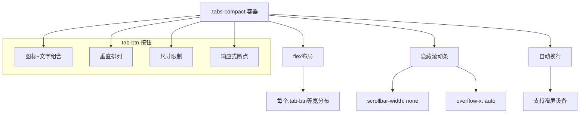
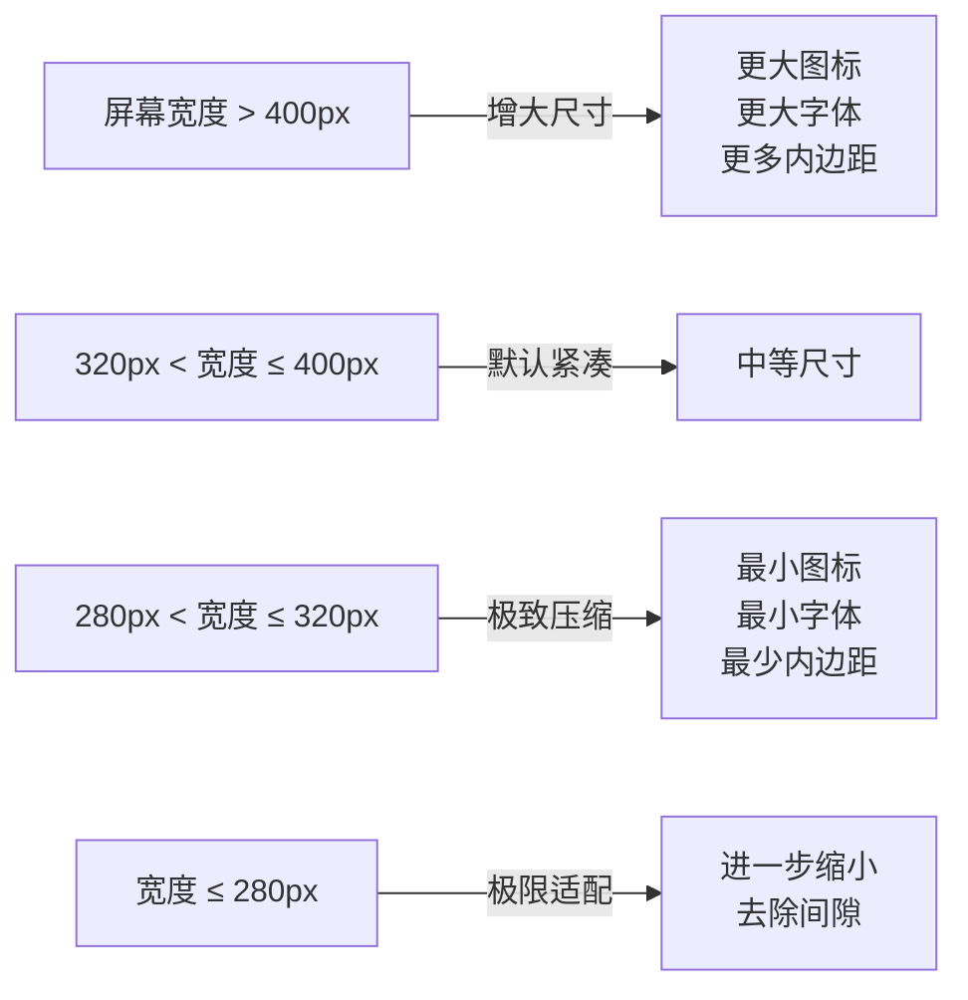
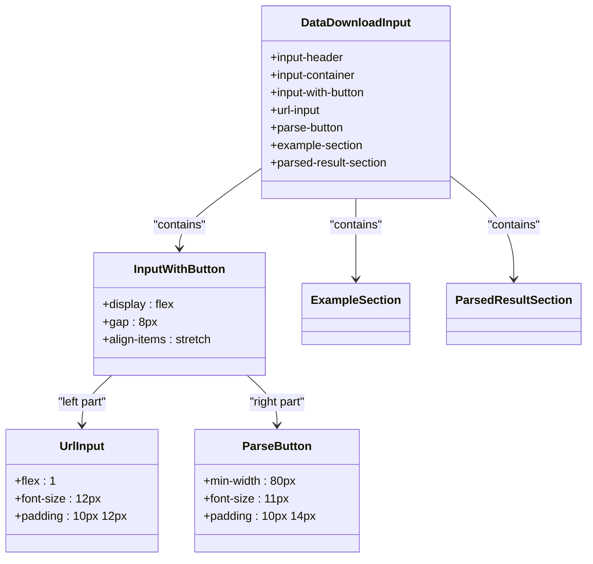
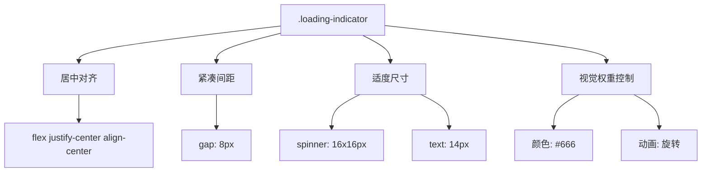

# 侧边栏适配样式

<cite>
**Referenced Files in This Document**
- [sidebar.css](file://src/popup/sidebar.css)
- [popup.css](file://src/styles/popup.css)
- [DataDownloadInput.tsx](file://src/components/DataDownloadInput.tsx)
- [LoadingIndicator.tsx](file://src/components/LoadingIndicator.tsx)
- [TabNavigation.tsx](file://src/components/TabNavigation.tsx)
</cite>

## 目录
1. [简介](#简介)
2. [核心组件分析](#核心组件分析)
3. [标签导航紧凑布局](#标签导航紧凑布局)
4. [小宽度容器可用性设计](#小宽度容器可用性设计)
5. [数据输入组件重构](#数据输入组件重构)
6. [加载指示器空间优化](#加载指示器空间优化)

## 简介
本文档深入剖析 `sidebar.css` 文件为适配浏览器侧边栏环境所做的特殊样式优化。通过对比标准弹窗样式，详细说明了在有限空间内如何维持良好用户体验的设计考量，包括样式优先级控制、紧凑布局设计、响应式断点调整以及组件重构策略。

## 核心组件分析

`sidebar.css` 文件针对浏览器侧边栏的狭窄空间特性进行了全面的样式优化，主要体现在对关键UI组件的精细化调整上。与标准弹窗样式相比，侧边栏版本通过减小内边距、压缩字体大小和简化视觉元素来适应更小的显示区域。

该文件中的所有CSS规则均使用 `!important` 声明，确保其样式优先级高于其他可能存在的全局或组件级样式。这种强制覆盖机制对于在复杂的浏览器扩展环境中保持样式一致性至关重要，特别是在与其他网页内容共存时能有效防止样式冲突。

**Section sources**
- [sidebar.css](file://src/popup/sidebar.css#L1-L1696)
- [popup.css](file://src/styles/popup.css#L1-L1537)

## 标签导航紧凑布局

### `.tabs-compact` 标签导航设计

`.tabs-compact` 类实现了专为侧边栏优化的标签页导航系统，采用水平滚动的紧凑布局模式，以应对侧边栏宽度受限的问题。



**Diagram sources**
- [sidebar.css](file://src/popup/sidebar.css#L180-L270)
- [TabNavigation.tsx](file://src/components/TabNavigation.tsx#L10-L88)

#### 图标文字组合与尺寸限制

每个 `.tab-btn` 按钮采用图标与文字的垂直组合布局，通过 `flex-direction: column` 实现。这种设计在横向空间紧张的情况下仍能保持良好的可读性。

按钮设置了严格的尺寸限制：
- 最小宽度：45px
- 最大宽度：75px
- 内边距：6px 3px
- 字体大小：11px（图标）和10px（文本）

这些约束确保了即使在最窄的侧边栏中也能容纳多个标签页，同时避免单个标签占用过多空间。

#### 响应式断点调整策略

通过媒体查询实现多级响应式调整：



具体断点策略如下：
- **≥400px**: 使用较大的尺寸（最小宽度60px，图标18px，文本11px）
- **≤320px**: 进一步压缩（最小宽度38px，图标14px，文本9px）
- **≤280px**: 极限压缩（最小宽度35px，文本8px）

这种渐进式的降级策略确保了从桌面到移动设备的各种场景下都能提供可用的用户体验。

**Section sources**
- [sidebar.css](file://src/popup/sidebar.css#L180-L270)
- [TabNavigation.tsx](file://src/components/TabNavigation.tsx#L10-L88)

## 小宽度容器可用性设计

在小宽度容器中维持可用性是 `sidebar.css` 的核心设计目标之一。通过对字体、内边距和滚动行为的精细控制，确保了在狭窄的侧边栏环境中依然具备良好的交互体验。

### 字体大小缩减

所有文本元素都进行了系统性的字号下调：
- 主标题从20px降至18px
- 段落文本从14px降至12px
- 表单标签从14px降至12px
- 按钮文本从14px降至11px

这种层级化的缩放保持了视觉层次感的同时，显著减少了垂直空间占用。

### 内边距压缩

内边距（padding）和外边距（margin）被大幅压缩：
- `.data-download-input` 的padding从24px降至20px 16px
- 输入组间距从16px降至14px
- 解析结果区域的padding从20px降至14px

这种"去留白"的设计哲学最大化利用了宝贵的显示空间。

### 滚动条隐藏处理

为了提升视觉整洁度并释放更多可用空间，`.tabs-compact` 容器采用了滚动条隐藏技术：

```css
.tabs-compact {
    overflow-x: auto;
    scrollbar-width: none; /* Firefox */
    -ms-overflow-style: none; /* IE and Edge */
}

.tabs-compact::-webkit-scrollbar {
    display: none; /* Chrome, Safari and Opera */
}
```

这一技术使得标签栏可以在不显示丑陋滚动条的情况下进行水平滑动，既保持了功能完整性又提升了美观度。

**Section sources**
- [sidebar.css](file://src/popup/sidebar.css#L1-L1696)

## 数据输入组件重构

### `.data-download-input` 布局重构

`DataDownloadInput` 组件在侧边栏环境中的布局经历了深度重构，以适应有限的水平空间。



**Diagram sources**
- [sidebar.css](file://src/popup/sidebar.css#L1-L100)
- [DataDownloadInput.tsx](file://src/components/DataDownloadInput.tsx#L19-L366)

#### 输入框与按钮组合布局

原版中较宽的输入框和按钮组合被重新平衡：
- 输入框（`.url-input`）的内边距从14px 16px压缩至10px 12px
- 解析按钮（`.parse-button`）的最小宽度固定为80px，防止在窄屏下过小
- 两者之间的间隙从12px减少到8px

这种调整确保了即使在极窄的侧边栏中，输入框仍能获得足够的输入空间，同时按钮保持可点击性。

#### 示例按钮优化

示例按钮（`.example-button`）也进行了相应优化：
- 内边距从16px降至12px
- 字体大小从13px降至11px
- 图标尺寸从32x32px降至28x28px

这些变化使整个示例区域更加紧凑，能够在有限空间内展示更多示例。

**Section sources**
- [sidebar.css](file://src/popup/sidebar.css#L1-L100)
- [DataDownloadInput.tsx](file://src/components/DataDownloadInput.tsx#L19-L366)

## 加载指示器空间优化

### `.loading-indicator` 空间优化方案

加载指示器组件经过专门优化，以在不干扰主要内容的前提下提供清晰的加载状态反馈。



**Diagram sources**
- [sidebar.css](file://src/popup/sidebar.css#L500-L520)
- [LoadingIndicator.tsx](file://src/components/LoadingIndicator.tsx#L2-L9)

#### 视觉元素精简

相较于标准版本，侧边栏中的加载指示器进行了以下优化：
- 整体内边距从20px降至无额外内边距
- 间距（gap）从12px压缩至8px
- 加载动画尺寸从20x20px缩小至16x16px
- 文本大小保持14px但采用更紧凑的布局

这些调整使得加载状态提示既明显可见又不会过度占据宝贵的空间资源。

#### 用户体验考量

尽管进行了空间压缩，但仍保留了足够的视觉反馈：
- 动画效果依然流畅（1s旋转周期）
- 颜色对比度适中（深灰色）
- 文字提示清晰（"正在加载..."）

这种平衡确保了用户能够明确感知到系统状态，而不会因过度简化而导致困惑。

**Section sources**
- [sidebar.css](file://src/popup/sidebar.css#L500-L520)
- [LoadingIndicator.tsx](file://src/components/LoadingIndicator.tsx#L2-L9)