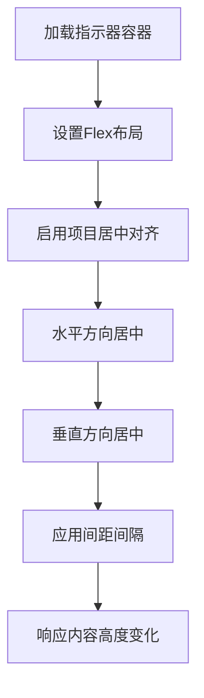
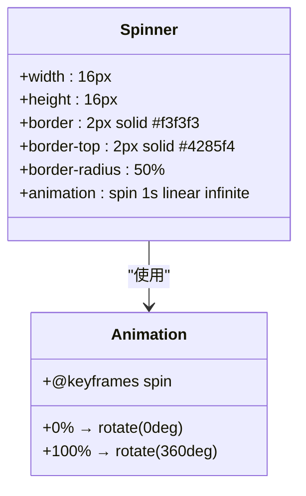
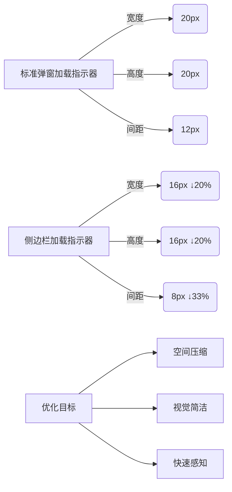

# 加载指示器优化

<cite>
**Referenced Files in This Document **   
- [LoadingIndicator.tsx](file://src/components/LoadingIndicator.tsx)
- [sidebar.css](file://src/popup/sidebar.css)
- [popup.css](file://src/styles/popup.css)
</cite>

## 目录
1. [简介](#简介)
2. [核心组件分析](#核心组件分析)
3. [侧边栏轻量化设计](#侧边栏轻量化设计)
4. [加载动画实现机制](#加载动画实现机制)
5. [视觉平衡与尺寸策略](#视觉平衡与尺寸策略)
6. [与标准弹窗模式对比](#与标准弹窗模式对比)
7. [自定义扩展建议](#自定义扩展建议)

## 简介
本文档详细说明了`.loading-indicator`组件在侧边栏有限空间内的轻量化设计策略。通过解析其布局机制、动画实现和视觉优化，展示如何在紧凑界面中保持良好的用户体验。

## 核心组件分析

`LoadingIndicator`组件采用简洁的函数式组件结构，通过JSX返回一个包含旋转动画和文本提示的容器。该组件的核心职责是提供视觉反馈，表明系统正在处理请求或加载数据。

```tsx
const LoadingIndicator: React.FC = () => {
  return (
    <div className="loading-indicator">
      <div className="loading-spinner"></div>
      <span>正在加载...</span>
    </div>
  );
};
```

**Section sources**
- [LoadingIndicator.tsx](file://src/components/LoadingIndicator.tsx#L2-L9)

## 侧边栏轻量化设计

### Flex居中布局机制
侧边栏版本的加载指示器采用`flex`布局实现内容居中，确保在动态内容高度变化时仍能保持视觉中心位置。

```css
.loading-indicator {
    display: flex !important;
    align-items: center !important;
    justify-content: center !important;
    gap: 8px !important;
    padding: 20px !important;
}
```

这种布局方式具有以下优势：
- `align-items: center`确保垂直居中对齐
- `justify-content: center`实现水平居中分布
- `gap: 8px`提供适当的间距，避免元素过于拥挤
- 响应式特性使其能够适应不同屏幕尺寸和内容变化

**Diagram sources **
- [sidebar.css](file://src/popup/sidebar.css#L727-L730)



**Section sources**
- [sidebar.css](file://src/popup/sidebar.css#L727-L736)

## 加载动画实现机制

### CSS旋转动画技术
加载动画通过CSS边框技巧实现，利用`border-top`色差配合`transform`旋转创建持续转动效果。

```css
.loading-spinner {
    width: 16px !important;
    height: 16px !important;
    border: 2px solid #f3f3f3 !important;
    border-top: 2px solid #4285f4 !important;
    border-radius: 50% !important;
    animation: spin 1s linear infinite !important;
}

@keyframes spin {
    0% { transform: rotate(0deg); }
    100% { transform: rotate(360deg); }
}
```

关键技术要点：
- 使用圆形边框（`border-radius: 50%`）创建完美圆环
- 设置四周边框为浅灰色，仅顶部边框为蓝色形成视觉差异
- 通过`animation`属性调用`spin`关键帧动画
- `transform: rotate()`实现平滑的360度连续旋转

**Diagram sources **
- [sidebar.css](file://src/popup/sidebar.css#L737-L745)



**Section sources**
- [sidebar.css](file://src/popup/sidebar.css#L737-L745)

## 视觉平衡与尺寸策略

### 16px尺寸与边距影响
侧边栏版本采用16px的紧凑尺寸设计，相较于标准模式的20px有所缩减，这一决策基于多方面考量：

| 属性 | 侧边栏模式 | 标准弹窗模式 |
|------|------------|--------------|
| 宽度/高度 | 16px | 20px |
| 间距(gap) | 8px | 12px |
| 内边距(padding) | 20px | 20px |
| 字体大小 | 14px | 14px |

较小的尺寸带来以下优势：
- 更好地适应侧边栏的狭窄空间限制
- 减少视觉干扰，突出主要内容区域
- 维持整体界面的轻盈感和现代感
- 在小屏幕上保持清晰可辨识度

**Diagram sources **
- [sidebar.css](file://src/popup/sidebar.css#L737-L738)
- [popup.css](file://src/styles/popup.css#L535-L536)

**Section sources**
- [sidebar.css](file://src/popup/sidebar.css#L737-L738)
- [popup.css](file://src/styles/popup.css#L535-L536)

## 与标准弹窗模式对比

### 空间压缩与视觉简洁性优化
侧边栏版本相比标准弹窗模式进行了显著的空间优化和视觉简化：



主要差异体现在：
- 尺寸缩小20%，从20px降至16px
- 元素间距减少33%，从12px调整为8px
- 保持相同的内边距以维持呼吸空间
- 文本提示保持一致的可读性

这些调整使得组件更适合嵌入到功能密集的侧边栏环境中，同时保持足够的可见性和识别度。

**Diagram sources **
- [sidebar.css](file://src/popup/sidebar.css#L727-L745)
- [popup.css](file://src/styles/popup.css#L527-L545)

**Section sources**
- [sidebar.css](file://src/popup/sidebar.css#L727-L745)
- [popup.css](file://src/styles/popup.css#L527-L545)

## 自定义扩展建议

### 动画样式扩展方案
开发者可根据需求对加载动画进行个性化定制，以下是一些推荐的扩展方向：

#### 颜色主题适配
```css
/* 暗色主题 */
.loading-spinner.dark {
    border-top-color: #ffffff;
}

/* 成功状态 */
.loading-spinner.success {
    border-top-color: #28a745;
}

/* 警告状态 */
.loading-spinner.warning {
    border-top-color: #ffc107;
}
```

#### 速度控制
```css
/* 快速加载 */
.loading-spinner.fast {
    animation-duration: 0.6s;
}

/* 缓慢加载 */
.loading-spinner.slow {
    animation-duration: 1.5s;
}
```

#### 形状变化
```css
/* 方形旋转 */
.loading-spinner.square {
    border-radius: 0;
}

/* 半圆进度 */
.loading-spinner.half-circle {
    border-bottom-color: transparent;
    border-right-color: transparent;
}
```

这些扩展建议允许在不破坏现有布局的前提下，灵活调整加载指示器的外观和行为，满足多样化的UI需求。

**Section sources**
- [sidebar.css](file://src/popup/sidebar.css#L737-L745)