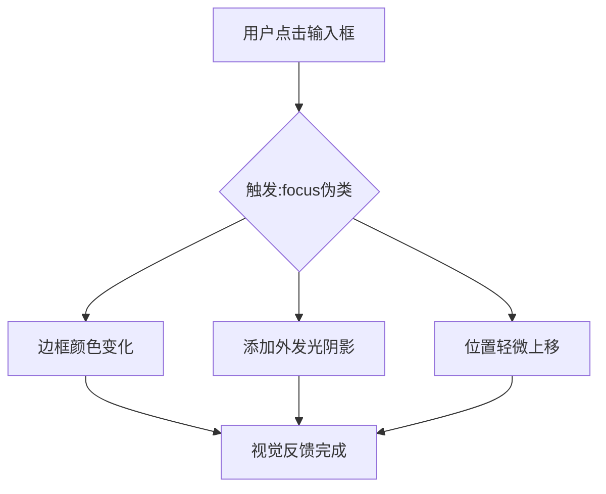
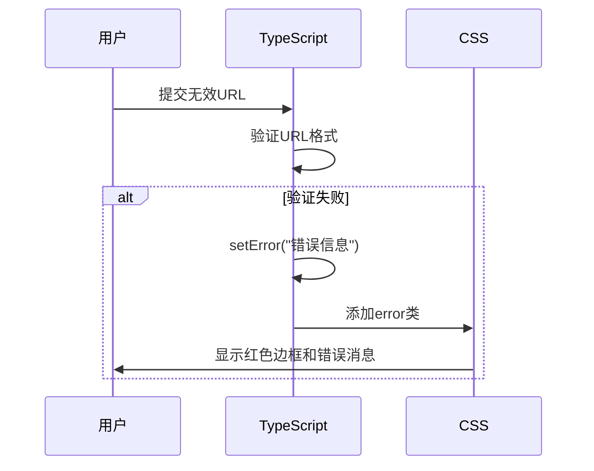

# URL输入框交互样式

<cite>
**Referenced Files in This Document **   
- [DataDownloadInput.tsx](file://src/components/DataDownloadInput.tsx)
- [popup.css](file://src/styles/popup.css)
- [sidebar.css](file://src/popup/sidebar.css)
</cite>

## 目录
1. [简介](#简介)
2. [核心组件分析](#核心组件分析)
3. [焦点状态动效实现](#焦点状态动效实现)
4. [错误提示机制](#错误提示机制)
5. [加载动画实现原理](#加载动画实现原理)
6. [组件状态管理逻辑](#组件状态管理逻辑)
7. [CSS与TypeScript协同机制](#css与typescript协同机制)

## 简介
本文档全面阐述了AIHCX扩展程序中URL输入框的交互样式实现机制。重点分析了`:focus`焦点状态动效、`.error`错误提示状态的红色边框与提示文字显示机制，以及加载过程中background-gradient流动动画的实现原理。通过结合组件状态管理逻辑，说明CSS与TypeScript如何协同工作以优化用户体验。

## 核心组件分析

该功能主要由`DataDownloadInput`组件实现，该组件提供了一个用于输入HuggingFace数据集或模型地址的表单界面，并具备自动解析和填充功能。组件包含URL输入框、解析按钮、示例地址列表和解析结果显示区域等元素。

**Section sources**
- [DataDownloadInput.tsx](file://src/components/DataDownloadInput.tsx#L19-L366)

## 焦点状态动效实现

当用户点击URL输入框时，触发`:focus`伪类选择器，激活焦点状态动效。该动效通过CSS transition属性实现平滑过渡效果，具体表现为：

1. 边框颜色从默认的`#e1e5e9`变为蓝色`#007bff`
2. 添加外发光阴影效果，使用`rgba(0, 123, 255, 0.15)`颜色值
3. 输入框轻微上移1像素，创造"浮起"的视觉效果

这些视觉变化共同构成了一个直观的焦点反馈，帮助用户明确当前操作的输入区域。



**Diagram sources **
- [popup.css](file://src/styles/popup.css#L80-L85)
- [sidebar.css](file://src/popup/sidebar.css#L100-L105)

## 错误提示机制

错误提示机制通过TypeScript状态管理和CSS类名绑定协同实现。当用户输入无效URL或未输入内容时，系统会设置错误状态，触发相应的视觉反馈。

在TypeScript层面，组件维护一个`error`状态变量，初始为空字符串。当验证失败时，通过`setError()`函数设置具体的错误信息。在渲染阶段，根据`error`状态的值动态为输入框添加`error` CSS类。

在CSS层面，`.url-input.error`选择器定义了错误状态的样式：
- 边框颜色变为红色`#dc3545`
- 添加红色调的外发光阴影`rgba(220, 53, 69, 0.15)`
- 显示下方的错误消息区域，包含错误图标和具体错误文本



**Diagram sources **
- [DataDownloadInput.tsx](file://src/components/DataDownloadInput.tsx#L158-L164)
- [popup.css](file://src/styles/popup.css#L86-L88)
- [popup.css](file://src/styles/popup.css#L150-L157)

## 加载动画实现原理

加载过程中的背景渐变流动动画利用CSS `animation`与`@keyframes`特性实现。当解析过程启动时，输入框进入加载状态，触发特殊的视觉反馈。

实现原理如下：
1. 定义`@keyframes loadingGradient`关键帧动画，控制背景位置从200%移动到-200%
2. 应用线性渐变背景，包含三种颜色段：白色、浅黄色和白色
3. 设置背景大小为200%宽度，创建双倍长度的渐变图案
4. 通过持续的背景位置变化，产生流动的视觉效果

动画配置参数：
- 动画时长：2秒
- 动画函数：ease-in-out
- 播放次数：无限循环

```mermaid
flowchart LR
A[定义@keyframes] --> B[设置渐变背景]
B --> C[调整背景尺寸]
C --> D[启动位置动画]
D --> E[产生流动效果]
```

**Diagram sources **
- [popup.css](file://src/styles/popup.css#L89-L97)
- [popup.css](file://src/styles/popup.css#L140-L145)
- [sidebar.css](file://src/popup/sidebar.css#L106-L111)

## 组件状态管理逻辑

组件采用React Hooks进行状态管理，维护多个相关状态变量以协调UI表现：

- `url`: 存储用户输入的URL字符串
- `isLoading`: 布尔值，表示是否处于解析加载状态
- `error`: 字符串，存储当前错误信息（空字符串表示无错误）
- `parsedResult`: 对象，存储成功解析后的结果数据

这些状态通过事件处理器相互关联：
- `onChange`事件更新`url`状态
- `handleParseUrl`函数处理解析逻辑，同时更新`isLoading`、`error`和`parsedResult`状态
- `handleKeyPress`监听回车键，触发解析操作

状态变化直接驱动UI更新，实现了数据与视图的双向绑定。

**Section sources**
- [DataDownloadInput.tsx](file://src/components/DataDownloadInput.tsx#L22-L36)

## CSS与TypeScript协同机制

CSS与TypeScript通过状态驱动的类名绑定机制紧密协作，共同实现丰富的用户体验。这种协同模式遵循"单一数据源"原则，确保UI状态的一致性。

TypeScript作为逻辑控制器，负责：
1. 处理用户输入和业务逻辑
2. 维护组件状态
3. 根据状态计算应应用的CSS类名

CSS作为样式定义者，负责：
1. 定义各种状态下的视觉表现
2. 实现动画和过渡效果
3. 响应类名变化并应用相应样式

两者通过JSX中的模板字符串语法连接：
```jsx
className={`url-input ${error ? 'error' : ''} ${isLoading ? 'loading' : ''}`}
```

这种分离关注点的设计模式使得样式修改无需改动业务逻辑，提高了代码的可维护性和可扩展性。

**Section sources**
- [DataDownloadInput.tsx](file://src/components/DataDownloadInput.tsx#L224)
- [popup.css](file://src/styles/popup.css#L79-L97)