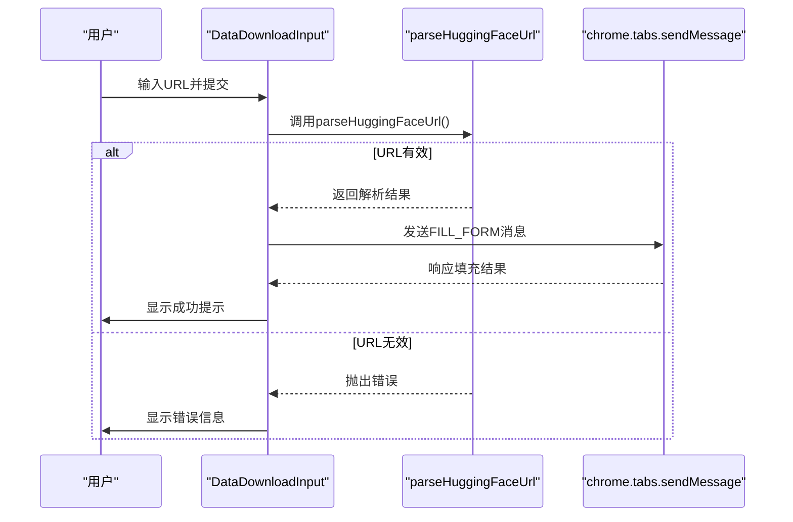
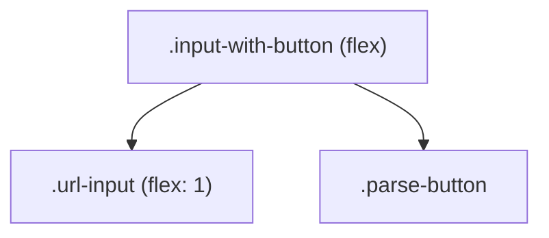
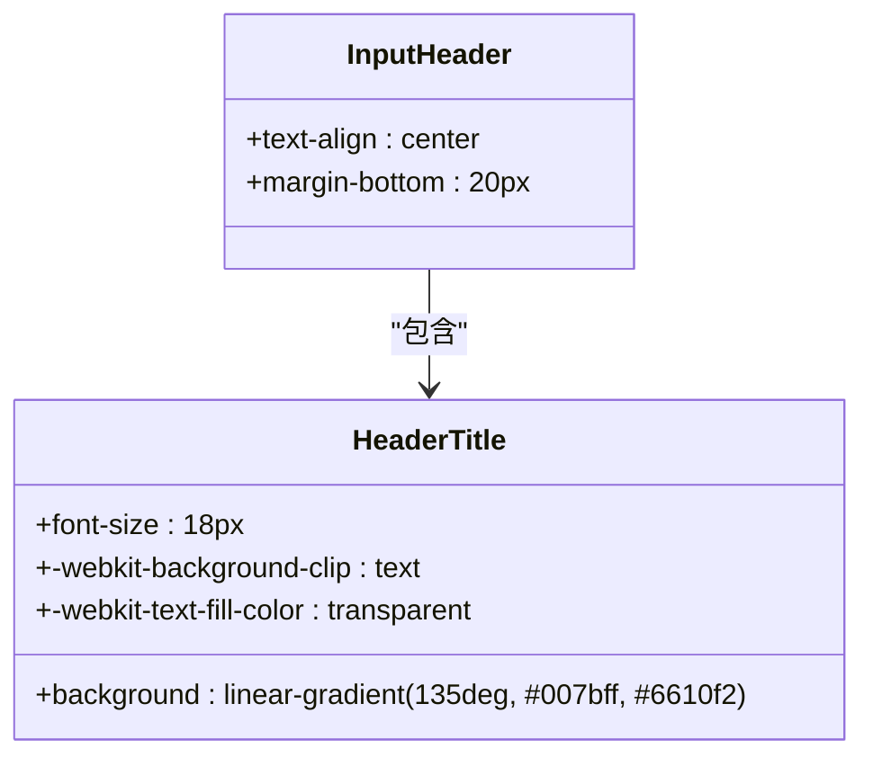
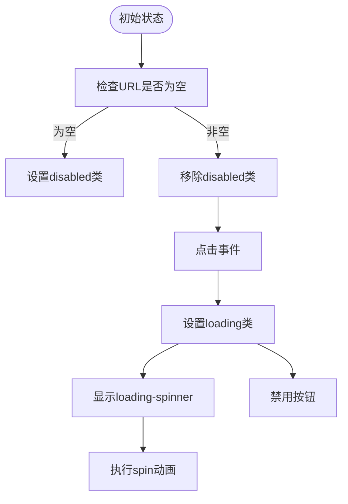
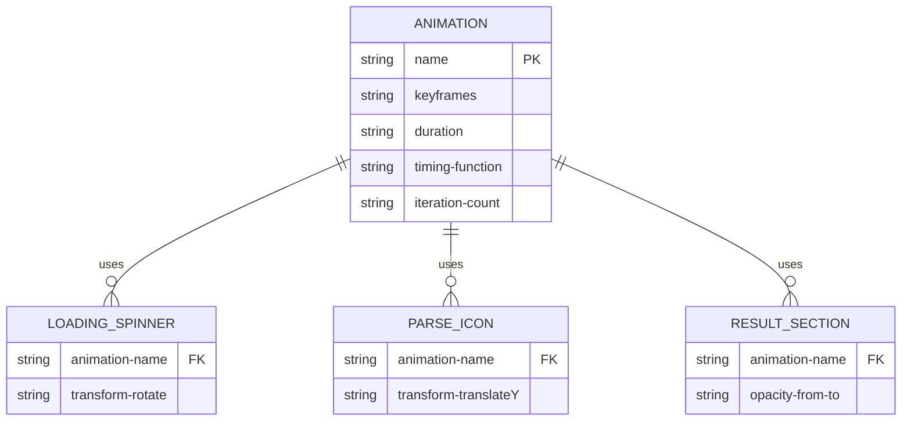
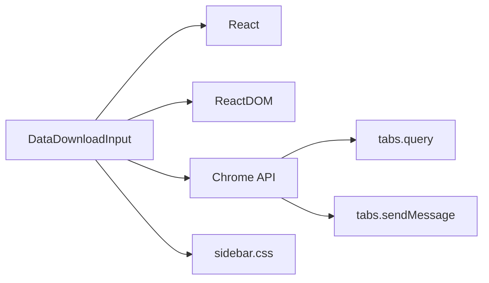

# 数据下载输入组件样式

<cite>
**Referenced Files in This Document **  
- [DataDownloadInput.tsx](file://src/components/DataDownloadInput.tsx)
- [sidebar.css](file://src/popup/sidebar.css)
</cite>

## 目录
1. [简介](#简介)
2. [项目结构](#项目结构)
3. [核心组件](#核心组件)
4. [架构概览](#架构概览)
5. [详细组件分析](#详细组件分析)
6. [依赖分析](#依赖分析)
7. [性能考虑](#性能考虑)
8. [故障排除指南](#故障排除指南)
9. [结论](#结论)

## 简介
本文件全面解析 `.data-download-input` 组件在侧边栏环境中的UI设计与交互优化。涵盖 `.input-header` 标题区域的渐变文字效果与居中布局，`.input-group` 表单组的垂直间距与标签样式，以及 `.input-with-button` 组合输入框的flex弹性布局实现。重点描述 `.url-input` 输入框的焦点动效、错误状态提示和加载动画（含background-gradient流动效果），`.parse-button` 按钮的渐变背景、阴影与禁用状态处理，以及 `.parse-icon` 图标的弹跳动画（bounce）实现方式。

## 项目结构
该组件位于 `src/components/` 目录下，作为独立的React函数式组件实现，并通过CSS模块化的方式进行样式管理。其样式定义主要集中在 `src/popup/sidebar.css` 文件中，专为侧边栏模式进行了视觉优化。

```mermaid
graph TD
subgraph "Components"
DataDownloadInput["DataDownloadInput.tsx"]
end
subgraph "Styles"
SidebarCSS["sidebar.css"]
end
DataDownloadInput --> SidebarCSS : "使用样式"
```

**Diagram sources **  
- [DataDownloadInput.tsx](file://src/components/DataDownloadInput.tsx)
- [sidebar.css](file://src/popup/sidebar.css)

**Section sources**  
- [DataDownloadInput.tsx](file://src/components/DataDownloadInput.tsx)
- [sidebar.css](file://src/popup/sidebar.css)

## 核心组件
`DataDownloadInput` 是一个功能完整的表单输入组件，用于解析HuggingFace数据集或模型URL并自动填充目标页面表单。它结合了状态管理、URL解析逻辑、浏览器消息通信机制及丰富的用户反馈提示。

**Section sources**  
- [DataDownloadInput.tsx](file://src/components/DataDownloadInput.tsx#L1-L369)

## 架构概览
该组件采用典型的React函数式组件架构，包含多个状态变量（url, isLoading, error, parsedResult）来驱动UI变化。整体流程包括：用户输入URL → 按Enter键或点击按钮触发解析 → 验证URL格式 → 解析为结构化数据 → 发送消息至content script填充表单 → 显示结果或错误信息。



**Diagram sources **  
- [DataDownloadInput.tsx](file://src/components/DataDownloadInput.tsx#L19-L366)

## 详细组件分析

### UI结构与布局分析
组件由四个主要部分构成：标题区、输入区、示例区和结果展示区。各部分通过合理的间距与视觉层次组织，确保良好的可读性与操作流畅性。

#### 输入容器布局
使用Flexbox实现 `.input-with-button` 的水平排列，保证输入框与按钮在同一行且高度对齐。`gap: 8px` 提供适当的间隔，`align-items: stretch` 确保子元素垂直拉伸填满容器。



**Diagram sources **  
- [sidebar.css](file://src/popup/sidebar.css#L100-L110)

#### 标题区域设计
`.input-header` 区域采用居中对齐，配合渐变色文字增强视觉吸引力。`h3` 元素使用 `-webkit-background-clip: text` 实现文本裁剪渐变效果，提升品牌识别度。



**Diagram sources **  
- [sidebar.css](file://src/popup/sidebar.css#L20-L35)

### 交互状态与动效实现

#### 输入框状态管理
`.url-input` 支持三种状态：正常、错误、加载中。每种状态通过CSS类控制外观：
- 正常状态：灰色边框，白色背景
- 错误状态：红色边框，浅红背景，警示阴影
- 加载状态：黄色边框，动态背景渐变动画

```mermaid
stateDiagram-v2
[*] --> Normal
Normal --> Error : "验证失败"
Normal --> Loading : "开始解析"
Loading --> Normal : "解析完成"
Loading --> Error : "解析失败"
Error --> Normal : "重新输入"
state Normal {
border-color : #e1e5e9
background : white
}
state Error {
border-color : #dc3545
box-shadow : red-glow
}
state Loading {
border-color : #ffc107
animation : loadingGradient
}
```

**Diagram sources **  
- [sidebar.css](file://src/popup/sidebar.css#L112-L144)

#### 按钮交互逻辑
`.parse-button` 按钮根据是否可点击分为三种状态：
- 可用状态：蓝色渐变背景，悬停时加深并上移产生浮起效果
- 禁用状态：灰色背景，无交互反馈
- 加载状态：黄色渐变背景，显示旋转加载图标



**Diagram sources **  
- [sidebar.css](file://src/popup/sidebar.css#L146-L188)

#### 动画效果实现
组件内嵌多种CSS动画以增强用户体验：
- `.loading-spinner`：通过 `border-top` 旋转实现加载指示器
- `.parse-icon`：应用 `bounce` 关键帧动画实现火箭图标弹跳效果
- `.parsed-result-section`：使用 `slideInUp` 动画平滑呈现解析结果



**Diagram sources **  
- [sidebar.css](file://src/popup/sidebar.css#L189-L218)

## 依赖分析
该组件依赖于Chrome扩展API（`chrome.tabs.query`, `chrome.tabs.sendMessage`）实现跨上下文通信，无需外部库即可完成核心功能。样式方面完全依赖本地CSS文件，未引入第三方UI框架。



**Diagram sources **  
- [DataDownloadInput.tsx](file://src/components/DataDownloadInput.tsx#L1)
- [sidebar.css](file://src/popup/sidebar.css#L1)

**Section sources**  
- [DataDownloadInput.tsx](file://src/components/DataDownloadInput.tsx#L1-L369)
- [sidebar.css](file://src/popup/sidebar.css#L1-L799)

## 性能考虑
组件在设计时充分考虑了性能因素：
- 使用 `useState` 进行局部状态管理，避免不必要的重渲染
- CSS动画均基于 `transform` 和 `opacity`，利用GPU加速
- 输入框绑定 `onKeyPress` 事件而非 `onChange` 频繁触发
- 错误提示与加载状态通过类名切换而非DOM重建

尽管如此，在高频率解析场景下仍建议添加防抖机制以防连续请求。

## 故障排除指南
当自动填充失败时，系统会提供详细的错误信息与手动填充指导。常见问题包括：
- 当前标签页无法获取：检查浏览器权限设置
- content script未注入：确认目标页面支持脚本注入
- URL格式错误：确保符合 `https://huggingface.co/...` 格式

系统还提供了复制到剪贴板的手动填充代码片段，便于开发者调试。

**Section sources**  
- [DataDownloadInput.tsx](file://src/components/DataDownloadInput.tsx#L250-L300)

## 结论
`DataDownloadInput` 组件展示了现代前端开发中UI/UX设计与功能实现的完美结合。通过精心设计的CSS样式、流畅的动画过渡和健壮的错误处理机制，为用户提供直观高效的交互体验。其模块化结构也便于后续维护与功能扩展。