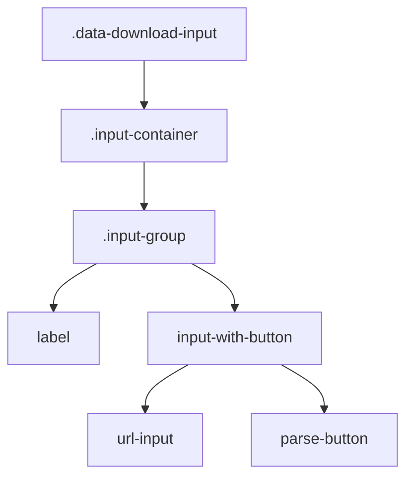
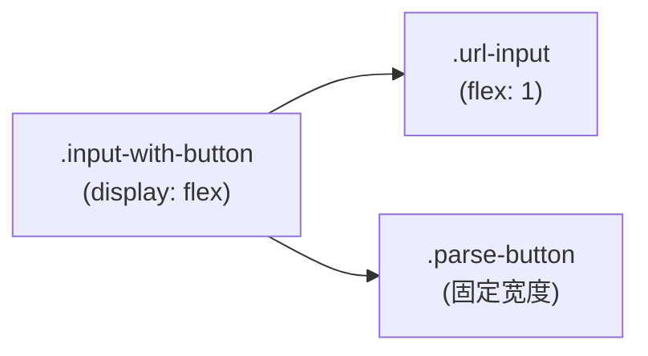

# 表单组布局样式

<cite>
**本文档引用的文件**
- [DataDownloadInput.tsx](file://src/components/DataDownloadInput.tsx)
- [popup.css](file://src/styles/popup.css)
- [sidebar.css](file://src/popup/sidebar.css)
</cite>

## 目录
1. [简介](#简介)
2. [核心样式结构](#核心样式结构)
3. [标签与字体样式](#标签与字体样式)
4. [输入框与按钮布局](#输入框与按钮布局)
5. [Flex布局应用](#flex布局应用)
6. [响应式间距调整](#响应式间距调整)
7. [与其他组件的一致性](#与其他组件的一致性)

## 简介
`input-group` 是 AIHCX 扩展中用于组织表单输入元素的核心 UI 结构，主要应用于 `DataDownloadInput` 组件。该结构通过 CSS 样式实现了清晰的视觉层次、一致的交互体验和良好的响应式表现。其设计目标是为用户提供直观的数据输入界面，并确保在不同屏幕尺寸下保持可用性和美观性。

**Section sources**
- [DataDownloadInput.tsx](file://src/components/DataDownloadInput.tsx#L233-L266)

## 核心样式结构
`.input-group` 类是构成表单输入区域的基础容器，它包裹了 `<label>` 和输入控件（如 `<input>` 或组合控件）。其主要作用是提供垂直方向上的外边距（`margin-bottom`），以确保各个输入项之间有足够的空间分隔，避免视觉上的拥挤。

**Diagram sources**
- [popup.css](file://src/styles/popup.css#L39-L40)
- [DataDownloadInput.tsx](file://src/components/DataDownloadInput.tsx#L238-L239)

## 标签与字体样式
`.input-group label` 定义了输入字段的标签样式，具有以下特点：
- **显示模式**: `display: block`，使其独占一行。
- **外边距**: `margin-bottom: 8px`，在标签和输入框之间创建垂直间距。
- **字体大小**: `14px`，保证了足够的可读性。
- **字体粗细**: `600`，比常规文本更突出，强调其作为标签的角色。
- **颜色**: `#495057`，一种深灰色，提供了良好的对比度，同时不会过于刺眼。

这些样式共同作用，使标签清晰可辨，用户能轻松地将标签与其对应的输入框关联起来。

**Section sources**
- [popup.css](file://src/styles/popup.css#L43-L49)

## 输入框与按钮布局
为了实现输入框和解析按钮的水平排列，使用了 `.input-with-button` 这个嵌套容器。该容器采用 Flexbox 布局 (`display: flex`)，并设置了 `gap: 12px` 来控制子元素之间的间距。

- **输入框 (.url-input)**:
  - 使用 `flex: 1` 属性，使其占据剩余的所有可用空间。
  - 具有圆角边框 (`border-radius: 8px`) 和内边距 (`padding: 14px 16px`)，提升了点击区域和视觉美感。
- **按钮 (.parse-button)**:
  - 保持固定宽度，不随容器伸缩。
  - 同样具有圆角和内边距，与输入框风格统一。

这种布局确保了即使在较窄的屏幕上，按钮也能完整显示，而输入框则尽可能地利用空间。

**Diagram sources**
- [popup.css](file://src/styles/popup.css#L51-L52)
- [popup.css](file://src/styles/popup.css#L60-L65)

## Flex布局应用
Flexbox 是实现此组件布局的关键技术。`.input-with-button` 的 `display: flex` 使得其子元素（输入框和按钮）能够沿主轴（水平方向）排列。`align-items: stretch` 确保了两个子元素的高度会拉伸到与容器相同，从而实现完美的垂直对齐。

此外，`gap: 12px` 提供了一种现代且简洁的方式来管理子元素间的间距，相比传统的 `margin` 更加方便和可靠。整个 `.input-group` 结构本身也体现了组件化的设计思想，可以被复用在其他需要类似布局的地方。

**Section sources**
- [popup.css](file://src/styles/popup.css#L51-L54)

## 响应式间距调整
该组件的样式充分考虑了响应式设计。虽然核心的 `input-group` 结构没有直接的媒体查询，但其父级组件和整体设计遵循了响应式原则。

例如，在侧边栏模式下，`sidebar.css` 文件中的样式会覆盖默认的 `popup.css` 样式，通过减小 `padding`、`font-size` 和 `margin` 等属性值，来适应更狭窄的空间。这表明 `margin` 和 `padding` 的调整是通过条件加载不同的 CSS 文件或使用更具体的 CSS 规则来实现的，而不是依赖单一文件内的复杂媒体查询。

这种设计策略保证了组件在弹出窗口和侧边栏两种不同形态下都能提供最佳的用户体验。

**Section sources**
- [sidebar.css](file://src/popup/sidebar.css#L0-L49)
- [popup.css](file://src/styles/popup.css#L39-L49)

## 与其他组件的一致性
`input-group` 的设计语言与项目中的其他组件保持高度一致。例如：
- **颜色方案**: 使用了与按钮、标题相同的渐变色和品牌蓝色 (`#007bff`)。
- **圆角半径**: 输入框和按钮的 `border-radius` 值与其他 UI 元素（如示例按钮、结果卡片）相匹配。
- **阴影效果**: `box-shadow` 的使用方式与 `.data-download-input` 容器等组件一致，营造出统一的立体感。

这种一致性确保了整个扩展的 UI 风格和谐统一，降低了用户的认知负担，提升了产品的专业形象。

**Section sources**
- [popup.css](file://src/styles/popup.css#L15-L20)
- [popup.css](file://src/styles/popup.css#L60-L65)