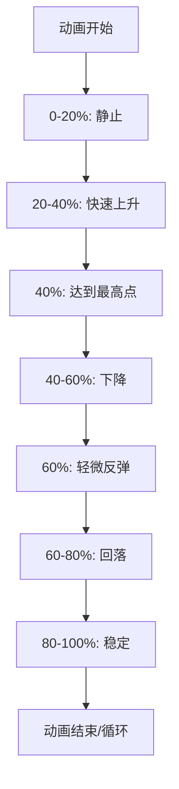

# 解析图标动画效果

<cite>
**Referenced Files in This Document**   
- [DataDownloadInput.tsx](file://src/components/DataDownloadInput.tsx)
- [popup.css](file://src/styles/popup.css)
- [sidebar.css](file://src/popup/sidebar.css)
</cite>

## 目录
1. [简介](#简介)
2. [核心实现分析](#核心实现分析)
3. [关键帧定义与动画配置](#关键帧定义与动画配置)
4. [交互反馈机制](#交互反馈机制)
5. [性能优化考量](#性能优化考量)

## 简介
本文档详细解析 `.parse-icon` 图标在用户点击"解析填充"按钮时的 `bounce` 弹跳动画实现方式。该动画通过 CSS 关键帧和动画属性配置，为用户提供直观的视觉反馈，增强交互感知体验。

## 核心实现分析

`.parse-icon` 动画主要应用于数据下载输入组件中的解析按钮图标，当用户点击解析按钮后触发视觉反馈动画。该实现结合了 React 组件状态管理和 CSS 动画技术，确保在异步解析过程中提供流畅的用户体验。

**Section sources**
- [DataDownloadInput.tsx](file://src/components/DataDownloadInput.tsx#L19-L366)

## 关键帧定义与动画配置

### 动画关键帧定义
`@keyframes bounce` 定义了弹跳动画的核心运动轨迹，通过多个时间点的垂直位移变化模拟真实世界的弹性效果：

```css
@keyframes bounce {
  0%, 20%, 50%, 80%, 100% { transform: translateY(0); }
  40% { transform: translateY(-3px); }
  60% { transform: translateY(-1px); }
}
```

此关键帧序列创建了一个自然的弹跳节奏：从起始位置下落（0%），快速上升至最高点（40%），轻微回弹（60%），最终稳定在原始位置（100%）。

### 动画属性配置
动画通过以下 CSS 属性进行配置：
- **持续时间**：2秒完整周期，确保动画足够明显但不拖沓
- **缓动函数**：`ease-in-out`，提供平滑的加速和减速效果
- **播放次数**：`infinite`，实现无限循环播放
- **应用元素**：`.parse-icon` 类选择器

在不同设备环境下，动画参数会进行响应式调整，例如在侧边栏模式中使用稍小的位移幅度以适应紧凑布局。



**Diagram sources**
- [popup.css](file://src/styles/popup.css#L157-L164)
- [sidebar.css](file://src/popup/sidebar.css#L146-L154)

## 交互反馈机制

### 触发条件
动画在以下条件下被激活：
1. 用户点击"解析填充"按钮
2. 输入框包含有效URL地址
3. 组件进入加载状态（`isLoading: true`）

### 状态管理
React 组件通过 `useState` 钩子管理加载状态，当 `isLoading` 状态变为 `true` 时，解析按钮的类名会动态添加 `loading` 状态，从而触发动画样式。

### 视觉层次设计
动画与其他视觉反馈元素协同工作：
- **颜色变化**：按钮背景色变为黄色表示处理中
- **文字提示**："解析填充"变为"解析中..."
- **旋转加载器**：与弹跳图标并列显示旋转动画
- **禁用状态**：防止重复提交

这种多层次的反馈系统确保用户能够清晰地理解当前操作状态。

**Section sources**
- [DataDownloadInput.tsx](file://src/components/DataDownloadInput.tsx#L19-L366)
- [popup.css](file://src/styles/popup.css#L157-L164)

## 性能优化考量

### 轻量化设计
该动画采用纯 CSS 实现而非 JavaScript 动画库，具有以下性能优势：

| 优化方面 | 具体措施 |
|---------|---------|
| 渲染性能 | 使用 `transform` 属性而非 `top`/`margin`，避免重排 |
| 内存占用 | 无额外JavaScript依赖，减少内存消耗 |
| 合成效率 | 浏览器可在合成线程处理动画，提高帧率 |
| 缓存友好 | CSS 规则可被浏览器高效缓存 |

### 动画复杂度控制
- **关键帧数量**：仅定义必要的时间点，减少计算开销
- **属性选择**：仅动画 `translateY` 单一属性，最小化渲染成本
- **硬件加速**：`transform` 属性自动触发GPU加速
- **资源占用**：动画不影响主线程执行异步解析任务

### 响应式适配
针对不同设备环境提供差异化实现：
- **桌面端**：完整2秒循环，3px最大位移
- **移动端**：缩短动画周期，减小位移幅度
- **低性能设备**：可通过媒体查询降级为简单静态指示

这些优化确保动画在各种设备上都能流畅运行，同时保持核心功能的可用性。

**Section sources**
- [popup.css](file://src/styles/popup.css#L157-L164)
- [sidebar.css](file://src/popup/sidebar.css#L146-L154)