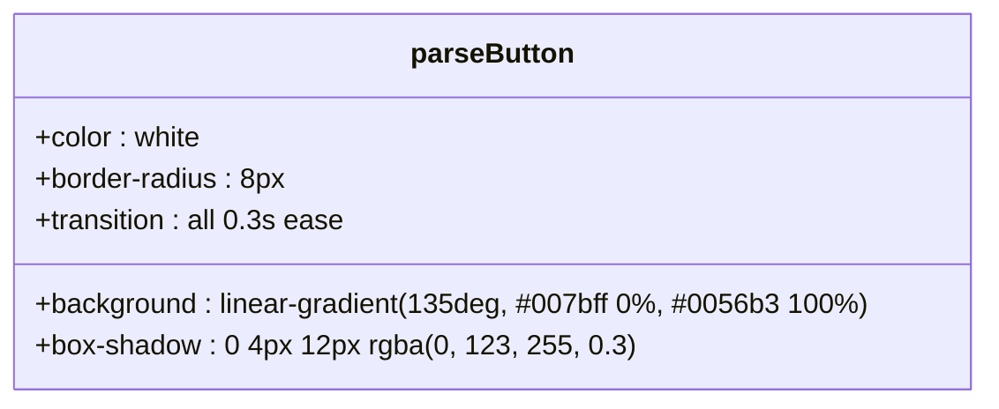
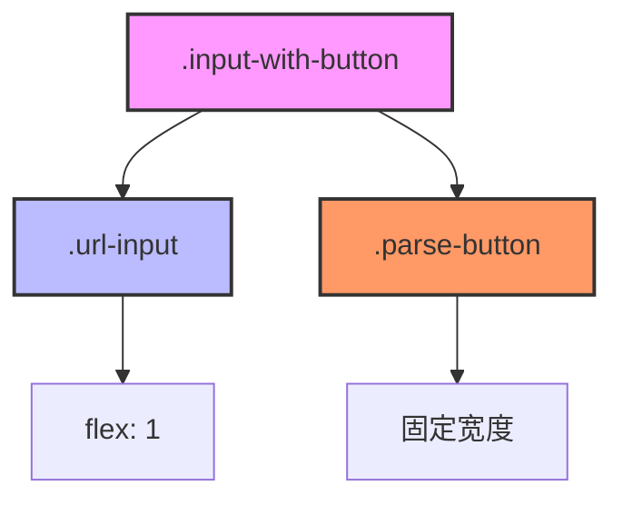
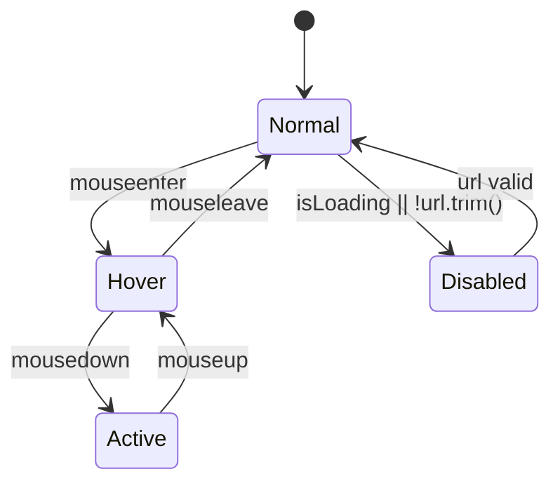

# 解析按钮视觉样式

<cite>
**Referenced Files in This Document**   
- [DataDownloadInput.tsx](file://src/components/DataDownloadInput.tsx)
- [popup.css](file://src/styles/popup.css)
</cite>

## Table of Contents
1. [解析按钮视觉样式](#解析按钮视觉样式)
2. [核心组件分析](#核心组件分析)
3. [样式实现细节](#样式实现细节)
4. [布局与对齐机制](#布局与对齐机制)
5. [状态管理与交互效果](#状态管理与交互效果)

## 核心组件分析

`parse-button` 按钮是 `DataDownloadInput` 组件中的关键交互元素，位于输入框右侧，用于触发HuggingFace URL的解析和表单自动填充功能。该按钮通过弹性布局与父级 `.input-with-button` 容器紧密结合，确保在不同屏幕尺寸和内容长度下都能保持良好的视觉对齐。

**Section sources**
- [DataDownloadInput.tsx](file://src/components/DataDownloadInput.tsx#L19-L366)

## 样式实现细节

### 渐变背景色设计
`parse-button` 采用线性渐变作为背景色，创建了现代且富有层次感的视觉效果。其渐变方向为135度对角线，从左上角的蓝色（#007bff）过渡到右下角的深蓝色（#0056b3），这种色彩搭配不仅符合专业软件工具的设计语言，还增强了按钮的立体感和点击欲望。

**Diagram sources **
- [popup.css](file://src/styles/popup.css#L100-L110)

### 盒子阴影悬浮效果
当用户将鼠标悬停在按钮上时，会触发动态的盒子阴影效果。正常状态下，按钮具有适度的阴影（0 4px 12px rgba(0, 123, 255, 0.3)），以提供轻微的浮起感。在悬停状态时，阴影强度增加至（0 6px 16px rgba(0, 123, 255, 0.4)），同时按钮向上微移2像素，共同营造出明显的"按下前兆"反馈，增强用户的交互信心。

### 过渡动画配置
所有视觉变化均通过CSS过渡属性平滑处理，设置了0.3秒的缓动时间（ease）。这包括背景色、阴影、位置变换等属性的变化，确保用户界面的动态效果既灵敏又不突兀，提供了流畅的用户体验。

## 布局与对齐机制

### 弹性布局关系
`parse-button` 与其相邻的输入框共同置于一个名为 `.input-with-button` 的弹性容器中。该容器采用flex布局，通过gap属性设置12px的间距，确保按钮与输入框之间有适当的呼吸空间。这种布局方式使得两个元素能够作为一个整体单元进行管理，同时保持各自的独立性。

**Diagram sources **
- [popup.css](file://src/styles/popup.css#L70-L80)
- [DataDownloadInput.tsx](file://src/components/DataDownloadInput.tsx#L200-L210)

### 内容长度适应性
为了应对不同长度的按钮文本内容，`.parse-button` 设置了white-space: nowrap属性，防止文本换行破坏按钮形状。同时，通过display: flex和align-items: center的组合，确保内部图标和文字始终垂直居中，无论内容如何变化都能保持美观的对齐效果。

## 状态管理与交互效果

### 禁用状态处理
当按钮处于禁用状态（`:disabled`）时，系统应用了特殊的视觉处理。背景色变为灰色调（#6c757d），光标显示为not-allowed，并且移除了所有悬停效果。透明度虽未直接调整，但通过颜色变暗实现了类似的视觉灰化效果，明确向用户传达当前不可操作的状态。

**Diagram sources **
- [popup.css](file://src/styles/popup.css#L130-L150)
- [DataDownloadInput.tsx](file://src/components/DataDownloadInput.tsx#L205-L210)

### 加载状态视觉反馈
在解析过程中，按钮进入加载状态，此时背景色变为黄色渐变（#ffc107 到 #e0a800），并显示旋转的加载图标。这种鲜明的颜色变化立即吸引用户注意，表明系统正在处理请求，有效减少了用户的不确定感和重复点击的可能性。

### 整体设计系统一致性
`parse-button` 的设计严格遵循项目整体的设计系统规范。其圆角半径（8px）、字体大小（14px）、内边距（14px 20px）等参数与其他界面元素保持一致，确保了跨组件的视觉统一性。色彩方案采用主品牌蓝色系，强化了产品的品牌识别度。