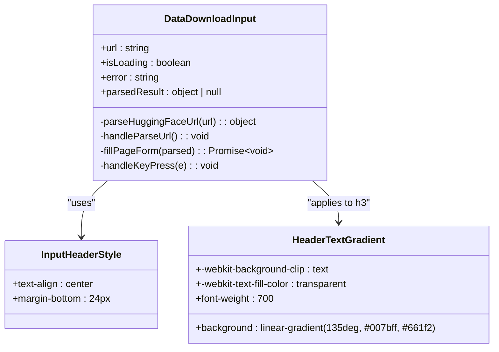

# 输入区域标题样式

<cite>
**Referenced Files in This Document**   
- [DataDownloadInput.tsx](file://src/components/DataDownloadInput.tsx)
- [popup.css](file://src/styles/popup.css)
</cite>

## 目录
1. [输入区域标题样式](#输入区域标题样式)
2. [核心组件分析](#核心组件分析)
3. [CSS实现细节](#css实现细节)
4. [视觉识别度与用户体验](#视觉识别度与用户体验)
5. [深色模式兼容性](#深色模式兼容性)

## 核心组件分析

`.input-header` 类是 `data-download-input` 组件中的关键视觉元素，用于标识数据下载功能的入口。该类应用于包含标题和描述文本的容器 `
` 元素，其结构在 `DataDownloadInput.tsx` 文件中定义。

该组件通过 React 的 JSX 语法构建用户界面，`.input-header` 容器内包含一个 `<h3>` 标题标签和一个 `
` 段落标签，分别用于展示主标题“🤗 HuggingFace自动填充”和功能描述“输入HuggingFace数据集或模型地址，自动解析并填充页面表单”。这种结构清晰地划分了信息层级，提升了内容的可读性和组织性。

**Section sources**
- [DataDownloadInput.tsx](file://src/components/DataDownloadInput.tsx#L19-L366)

## CSS实现细节

`.input-header` 类的样式定义位于 `popup.css` 文件中，其实现结合了多种现代 CSS 技术来创建引人注目的视觉效果。

### 文字渐变效果
标题文字采用了线性渐变（`linear-gradient`）技术，通过 `-webkit-background-clip: text` 和 `-webkit-text-fill-color: transparent` 属性将背景图像裁剪为文字形状，并使文字本身透明，从而让背后的渐变色透过文字显示出来。具体的渐变方向为135度，颜色从 `#007bff`（蓝色）过渡到 `#6610f2`（紫色），创造出一种动态且富有科技感的视觉焦点。

### 文本对齐与字体加粗
为了确保标题居中对齐，父级 `.input-header` 容器使用了 `text-align: center` 属性。同时，标题 `<h3>` 元素应用了 `font-weight: 700` 来实现字体加粗，使其在视觉上更加突出和权威。

### 垂直间距控制
`.input-header` 容器通过设置 `margin-bottom: 24px` 来控制其与下方表单元素之间的垂直间距。这个间距值经过精心设计，既保证了足够的呼吸空间以避免视觉拥挤，又维持了整体布局的紧凑性，确保了良好的视觉流。

**Diagram sources**
- [DataDownloadInput.tsx](file://src/components/DataDownloadInput.tsx#L19-L366)
- [popup.css](file://src/styles/popup.css#L18-L36)

**Section sources**
- [DataDownloadInput.tsx](file://src/components/DataDownloadInput.tsx#L19-L366)
- [popup.css](file://src/styles/popup.css#L18-L36)

## 视觉识别度与用户体验

`.input-header` 的样式设计显著提升了用户对数据下载功能的视觉识别度。醒目的渐变文字作为第一视觉焦点，立即吸引了用户的注意力，使其能够快速定位到核心功能区域。这种设计不仅美观，而且符合现代 Web 应用的审美趋势，有助于建立专业和可靠的品牌形象。

结合表情符号“🤗”，标题传达出一种友好和欢迎的氛围，降低了用户使用技术工具的心理门槛。清晰的功能描述文本则提供了必要的上下文信息，帮助用户理解该功能的具体用途，减少了认知负荷。整体布局的中心对称性进一步增强了视觉平衡感，使整个输入区域看起来更加整洁和有序。

## 深色模式兼容性

当前的 `.input-header` 样式主要针对浅色背景进行了优化。在深色模式下，现有的蓝色到紫色渐变可能无法提供足够的对比度，导致文字可读性下降。为了确保在深色模式下的可读性，建议采用以下策略：

1.  **引入 CSS 变量**：定义一组主题变量（如 `--primary-gradient-start`, `--primary-gradient-end`），并在不同主题下赋予不同的颜色值。
2.  **使用 `prefers-color-scheme` 媒体查询**：根据用户的系统偏好，动态切换渐变颜色。例如，在深色模式下，可以使用更亮的色调（如青色到洋红色）或调整渐变的亮度和饱和度。
3.  **增强对比度**：确保即使在最极端的深色背景下，文字与背景的对比度也符合 WCAG 2.1 的 AA 级标准。

虽然目前的实现尚未包含这些深色模式适配逻辑，但其模块化的 CSS 结构为未来的扩展提供了良好的基础。