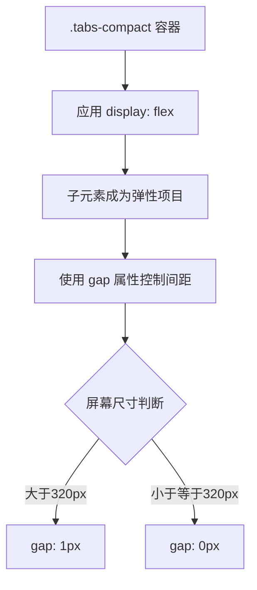
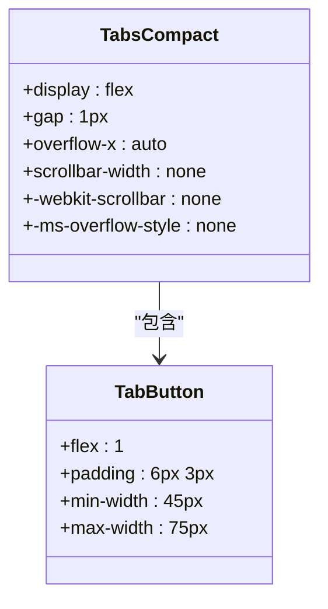

# Flex布局与间距控制

<cite>
**Referenced Files in This Document**   
- [sidebar.css](file://src/popup/sidebar.css)
- [popup.css](file://src/styles/popup.css)
- [TabNavigation.tsx](file://src/components/TabNavigation.tsx)
</cite>

## Table of Contents
1. [水平布局机制](#水平布局机制)
2. [标签页间距控制](#标签页间距控制)
3. [空间均分策略](#空间均分策略)
4. [横向滚动处理](#横向滚动处理)
5. [滚动条视觉优化](#滚动条视觉优化)

## 水平布局机制

`.tabs-compact` 类通过 `display: flex` 实现了高效的水平布局机制。该容器作为弹性盒子（flex container），其子元素（即各个标签页按钮）自动成为弹性项目（flex items），沿主轴（水平方向）依次排列。

这种布局方式具有以下优势：
- **响应式适应**：容器能够根据内容自动调整布局，无需固定宽度设置
- **简化对齐**：通过 flex 属性即可实现复杂的对齐和分布效果
- **流式特性**：当容器尺寸变化时，子元素能智能地重新排列

**Section sources**
- [sidebar.css](file://src/popup/sidebar.css#L76-L80)
- [popup.css](file://src/styles/popup.css#L290-L294)

## 标签页间距控制

`.tabs-compact` 类使用 `gap` 属性精确控制标签页之间的间距。在不同屏幕尺寸下，系统采用响应式设计策略：

- **常规模式**：设置 `gap: 1px`，在标签页之间创建细微的视觉分隔
- **小屏适配**：在宽度小于 320px 和 280px 的设备上，`gap` 值调整为 0px，以最大化可用空间

这种精细化的间距控制确保了用户界面在各种设备上的视觉一致性和可用性，同时避免了元素间的拥挤或过度分离。

**Diagram sources**
- [sidebar.css](file://src/popup/sidebar.css#L76-L77)
- [sidebar.css](file://src/popup/sidebar.css#L280-L283)

**Section sources**
- [sidebar.css](file://src/popup/sidebar.css#L76-L77)
- [sidebar.css](file://src/popup/sidebar.css#L280-L283)

## 空间均分策略

每个标签页按钮（`.tab-btn`）通过 `flex: 1` 属性实现了容器空间的均分。这一属性是 `flex-grow: 1`、`flex-shrink: 1` 和 `flex-basis: 0%` 的简写形式，其工作原理如下：

- **flex-grow: 1**：允许项目放大以填充剩余空间
- **flex-shrink: 1**：允许项目缩小以适应容器
- **flex-basis: 0%**：将项目的初始主轴尺寸设为零，使所有空间完全由 flex-grow 分配

这种配置确保了无论可见标签页数量如何变化，每个标签页都能获得相等的水平空间分配，从而保持界面的平衡和美观。

**Section sources**
- [sidebar.css](file://src/popup/sidebar.css#L90-L91)

## 横向滚动处理

当标签页数量较多导致内容超出容器宽度时，`.tabs-compact` 类通过 `overflow-x: auto` 启用横向滚动能力。这一特性的工作机制包括：

- **水平溢出检测**：当子元素总宽度超过容器宽度时触发滚动
- **平滑滚动体验**：支持鼠标滚轮、触摸滑动等多种交互方式
- **无障碍访问**：确保键盘用户也能导航到所有标签页

此功能保证了即使在极端情况下（如大量标签页同时存在），所有内容仍然可访问，而不会被截断或隐藏。

**Section sources**
- [sidebar.css](file://src/popup/sidebar.css#L79-L80)

## 滚动条视觉优化

为了在启用横向滚动的同时保持界面的视觉整洁性，`.tabs-compact` 类采用了跨浏览器兼容的滚动条隐藏技术：

- **标准属性**：`scrollbar-width: none` 针对 Firefox 浏览器
- **WebKit前缀**：`-webkit-scrollbar { display: none }` 针对 Chrome、Safari 等基于 WebKit 的浏览器
- **IE/Edge兼容**：`-ms-overflow-style: none` 针对旧版 Edge 和 Internet Explorer

这种多层兼容方案确保了在所有主流浏览器中，滚动条都被有效隐藏，同时保留了完整的滚动功能，实现了"隐形滚动"的用户体验。

**Diagram sources**
- [sidebar.css](file://src/popup/sidebar.css#L76-L84)
- [sidebar.css](file://src/popup/sidebar.css#L90-L91)

**Section sources**
- [sidebar.css](file://src/popup/sidebar.css#L80-L84)