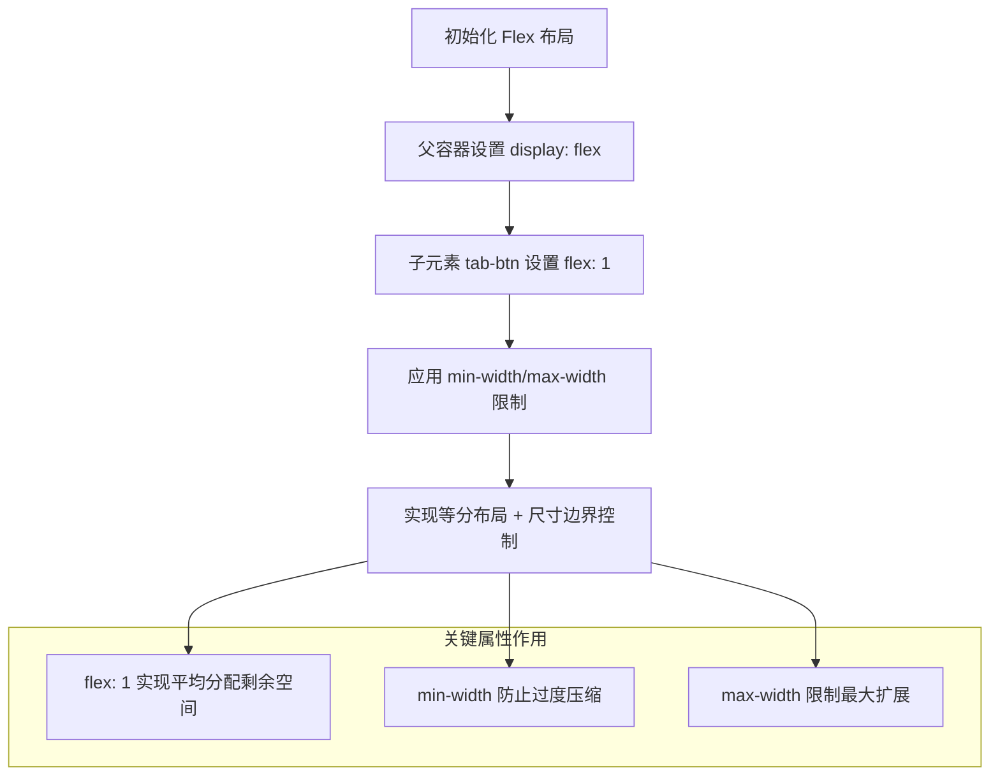
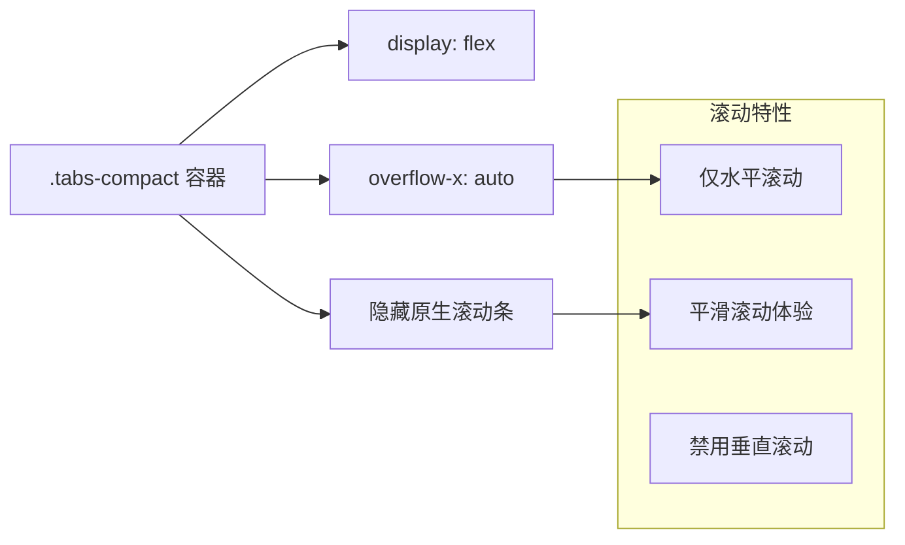

# 标签按钮响应式调整

<cite>
**Referenced Files in This Document**  
- [TabNavigation.tsx](file://src/components/TabNavigation.tsx)
- [sidebar.css](file://src/popup/sidebar.css)
</cite>

## 目录
1. [简介](#简介)
2. [窄屏适配策略](#窄屏适配策略)
3. [宽屏增强策略](#宽屏增强策略)
4. [弹性布局与尺寸约束协同机制](#弹性布局与尺寸约束协同机制)
5. [容器滚动处理逻辑](#容器滚动处理逻辑)
6. [设备尺寸对照表](#设备尺寸对照表示例)

## 简介
本文档深入分析 `.tab-btn` 在不同屏幕尺寸下的响应式适配策略。通过 `@media` 查询，系统在窄屏（≤320px 及 280px）下优化空间利用，在宽屏（≥400px）时提升用户体验。同时解析了 `flex: 1` 与 `min-width/max-width` 的协同工作机制，以及 `.tabs-compact` 容器的横向滚动逻辑。

**Section sources**
- [TabNavigation.tsx](file://src/components/TabNavigation.tsx#L1-L90)
- [sidebar.css](file://src/popup/sidebar.css#L448-L560)

## 窄屏适配策略

在极小屏幕设备上，标签按钮通过减小各项尺寸参数来适应有限的空间：

- **尺寸压缩**：当屏幕宽度 ≤320px 时，`min-width` 从默认值 45px 减至 38px，`max-width` 从 75px 减至 45px；在更极端的 280px 屏幕下进一步缩减至 35px 和 40px。
- **内边距调整**：`padding` 由标准的 `6px 3px` 调整为 `4px 1px`（320px 情况），并在 280px 下进一步减少到 `3px 1px`，以节省垂直空间。
- **字体缩小**：`.tab-text` 字体大小从 10px 降至 9px（320px）和 8px（280px），确保文本内容能在紧凑区域内完整显示。

这种渐进式的降级策略保证了即使在最小型号的移动设备上，标签栏仍能保持功能性与可读性。

**Section sources**
- [sidebar.css](file://src/popup/sidebar.css#L512-L536)

## 宽屏增强策略

针对大屏设备，系统采用增强策略提升交互体验：

- **扩大可点击区域**：当屏幕宽度 ≥400px 时，`min-width` 提升至 60px，`max-width` 增加到 90px，显著增大用户触控目标面积。
- **增加内边距**：`padding` 从 `6px 3px` 扩展为 `8px 6px`，提供更舒适的点击反馈。
- **提升视觉层级**：图标尺寸从 16px 增至 18px，文字大小从 10px 升至 11px，强化视觉识别度。

这些调整充分利用富余空间，提高可用性和美观度，符合大屏设备的操作习惯。

**Section sources**
- [sidebar.css](file://src/popup/sidebar.css#L537-L560)

## 弹性布局与尺寸约束协同机制

`.tab-btn` 的响应式行为依赖于 `flex: 1` 与 `min-width/max-width` 的精密配合：

**Diagram sources**
- [sidebar.css](file://src/popup/sidebar.css#L462-L465)

该机制确保所有可见标签均匀占据容器空间的同时，避免因内容过长或过短导致的布局失衡。`flex: 1` 提供基础的弹性分配能力，而 `min-width` 和 `max-width` 则作为安全边界，防止极端情况下的视觉异常。

**Section sources**
- [sidebar.css](file://src/popup/sidebar.css#L462-L465)

## 容器滚动处理逻辑

`.tabs-compact` 容器通过以下 CSS 规则实现智能滚动：

**Diagram sources**
- [sidebar.css](file://src/popup/sidebar.css#L448-L458)

具体实现包括：
- `overflow-x: auto` 允许内容超出时横向滚动
- `-webkit-scrollbar { display: none }` 隐藏浏览器默认滚动条，保持界面整洁
- `scrollbar-width: none` 和 `-ms-overflow-style: none` 兼容 Firefox 与 IE/Edge

这一设计既解决了多标签可能超出屏幕的问题，又维持了简洁的视觉风格。

**Section sources**
- [sidebar.css](file://src/popup/sidebar.css#L448-L458)

## 设备尺寸对照表示例

| 设备类型 | 屏幕宽度 (px) | min-width (px) | max-width (px) | padding | 字体大小 (px) |
|---------|---------------|----------------|----------------|--------|----------------|
| 极小屏手机 | ≤280 | 35 | 40 | 3px 1px | 8 |
| 小屏手机 | ≤320 | 38 | 45 | 4px 1px | 9 |
| 默认样式 | 321–399 | 45 | 75 | 6px 3px | 10 |
| 中大屏手机 | ≥400 | 60 | 90 | 8px 6px | 11 |

此表格总结了不同断点下的样式变化，体现了系统的精细化响应式设计。

**Section sources**
- [sidebar.css](file://src/popup/sidebar.css#L512-L560)