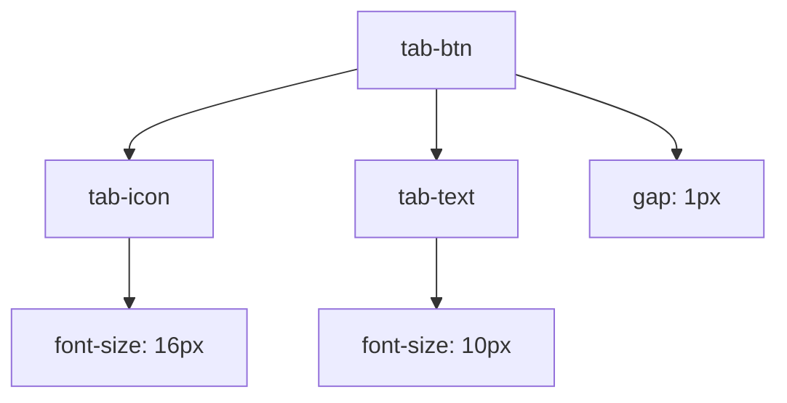

# 标签按钮视觉设计

<cite>
**Referenced Files in This Document **   
- [TabNavigation.tsx](file://src/components/TabNavigation.tsx)
- [sidebar.css](file://src/popup/sidebar.css)
</cite>

## 目录
1. [简介](#简介)  
2. [核心样式分析](#核心样式分析)  
3. [布局结构解析](#布局结构解析)  
4. [响应式设计考量](#响应式设计考量)

## 简介
本文档深入解析AIHCX扩展程序中标签按钮（`.tab-btn`）的视觉设计实现。该组件作为侧边栏导航的核心交互元素，通过精心设计的CSS样式实现了清晰的信息层级、良好的可读性以及跨设备的适应性。文档将重点分析其尺寸约束、排版逻辑及布局机制。

## 核心样式分析

`.tab-btn`类定义了标签按钮的基础视觉特征，其样式设定遵循紧凑型界面的设计原则，在有限空间内最大化信息传达效率。

### 尺寸与间距控制
按钮采用弹性布局中的等分伸缩（`flex: 1`），确保在容器内均匀分布。通过`min-width: 45px`和`max-width: 75px`的设定，既保证了小屏下的最小可点击区域，又防止大屏下按钮过度拉伸影响美观。`padding: 6px 3px`提供了适中的内边距，在密集排列时仍能保持舒适的触控体验。

### 字体与文本处理
字体大小统一设置为`11px`，配合`white-space: nowrap`属性有效防止文本换行，这对于短标签如"CLI"、"JSON"至关重要，避免了因换行导致的图标与文字错位问题。同时，`text-overflow: ellipsis`结合`overflow: hidden`为潜在的长文本提供了优雅的截断方案。

**Section sources**
- [sidebar.css](file://src/popup/sidebar.css#L462-L496)

## 布局结构解析

标签按钮采用垂直堆叠的布局模式，通过`flex-direction: column`实现图标与文字的上下排列，优化了垂直空间利用率。

### 图标-文字组合机制

**Diagram sources **
- [sidebar.css](file://src/popup/sidebar.css#L483-L490)

#### 垂直对齐策略
- **图标层**：`.tab-icon`使用`16px`字号确保视觉重量，`line-height: 1`消除行高干扰
- **文字层**：`.tab-text`采用稍小的`10px`字号，`line-height: 1.2`保证基线对齐
- **间距控制**：`gap: 1px`在图标与文字间创建微妙的呼吸空间，避免视觉粘连

这种分层设计使用户能快速通过图标识别功能类别，再通过文字确认具体含义，符合认知心理学中的"先整体后细节"感知规律。

### 状态反馈设计
激活状态通过多重视觉线索强化：
- 底部蓝色实线（`border-bottom: 3px solid #4285f4`）
- 文字颜色变为品牌蓝（`color: #4285f4`）
- 轻微背景色填充（`background: rgba(66, 133, 244, 0.08)`）
- 字重提升至`600`

悬停效果则通过`transform: translateY(-1px)`创造轻微的"浮起"动效，增强交互的物理感。

**Section sources**
- [sidebar.css](file://src/popup/sidebar.css#L497-L504)
- [TabNavigation.tsx](file://src/components/TabNavigation.tsx#L70-L76)

## 响应式设计考量

系统针对不同屏幕尺寸实施了精细化的响应式策略：

### 断点适配逻辑
| 屏幕宽度 | 最小宽度 | 最大宽度 | 内边距 | 图标大小 | 文字大小 |
|---------|---------|---------|-------|--------|--------|
| < 320px | 38px | 45px | 4px 1px | 14px | 9px |
| < 280px | 35px | 40px | 3px 1px | - | 8px |
| ≥ 400px | 60px | 90px | 8px 6px | 18px | 11px |

这种渐进增强的设计确保了从超小屏到桌面端的连续体验。特别值得注意的是，当屏幕宽度超过400px时，系统会显著增加按钮尺寸和文字层级，充分利用富余空间提升可读性。

### 容器协调机制
`.tabs-compact`容器通过`gap: 1px`维持按钮间的紧密联系，同时`overflow-x: auto`配合`scrollbar-width: none`实现了隐藏滚动条的横向滑动功能，解决了标签数量动态变化时的布局溢出问题。

**Section sources**
- [sidebar.css](file://src/popup/sidebar.css#L516-L560)