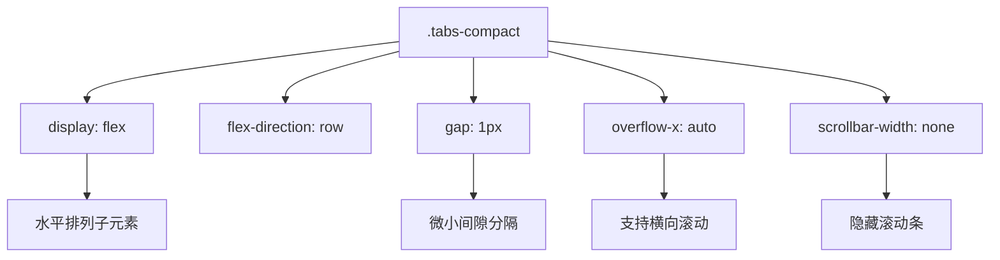
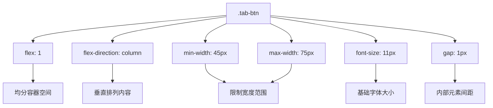
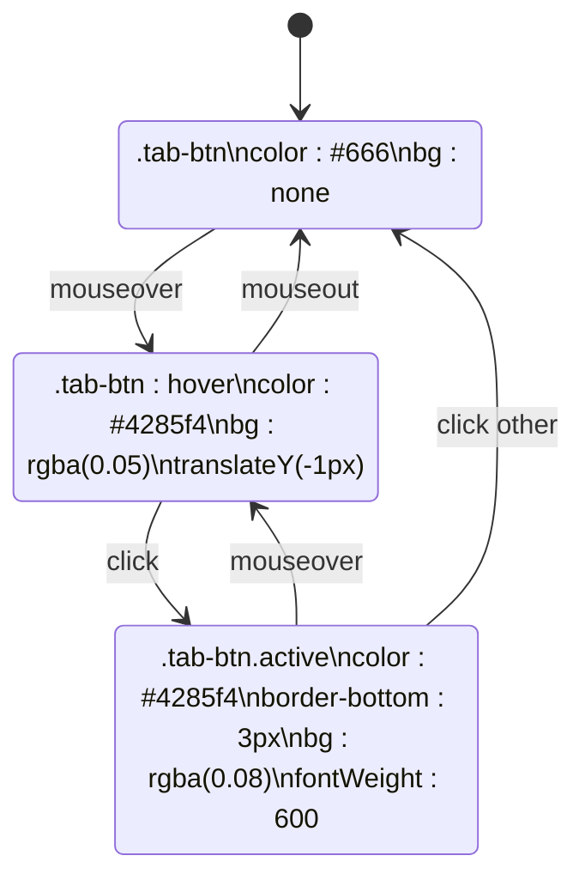

# 紧凑型标签页设计

<cite>
**Referenced Files in This Document **   
- [TabNavigation.tsx](file://src/components/TabNavigation.tsx)
- [sidebar.css](file://src/popup/sidebar.css)
</cite>

## 目录
1. [简介](#简介)
2. [核心组件分析](#核心组件分析)
3. [布局与间距控制](#布局与间距控制)
4. [按钮样式与尺寸策略](#按钮样式与尺寸策略)
5. [状态视觉反馈](#状态视觉反馈)
6. [响应式断点调整](#响应式断点调整)

## 简介
本文档深入剖析 `.tabs-compact` 类实现的紧凑型标签导航机制。该设计通过灵活的 CSS 布局和精细的响应式控制，在小屏幕设备上优化空间利用率，确保极端窄屏下的可用性。

**Section sources**
- [TabNavigation.tsx](file://src/components/TabNavigation.tsx#L10-L88)

## 核心组件分析
紧凑型标签导航的核心由 `TabNavigation` 组件驱动，该组件根据任务参数动态生成可见的标签项，并通过 `tabs-compact` 容器类进行布局管理。每个标签按钮（`.tab-btn`）包含图标和简短文本，支持条件渲染以适应不同页面场景。

```mermaid
classDiagram
class TabNavigation {
+activeTab : TabType
+onTabChange(tab : TabType) : void
+taskParams : TaskParams
+pageName : string
-tabs : Array{key, label, shortLabel, icon, condition}
-visibleTabs : Array{...}
+render() : JSX.Element
}
class TabButton {
+key : string
+className : string
+onClick() : void
+title : string
}
TabNavigation --> TabButton : "renders"
```

**Diagram sources **
- [TabNavigation.tsx](file://src/components/TabNavigation.tsx#L10-L88)

**Section sources**
- [TabNavigation.tsx](file://src/components/TabNavigation.tsx#L10-L88)

## 布局与间距控制
`.tabs-compact` 类采用 Flexbox 布局实现水平排列的标签导航，通过 `gap` 属性精确控制标签间的间距。在主视图中设置为 `1px` 间隙，确保视觉分隔的同时最大化利用有限空间。

容器还启用了横向滚动（`overflow-x: auto`），并隐藏了默认滚动条，允许用户在标签数量较多时滑动查看所有选项，提升窄屏体验。



**Diagram sources **
- [sidebar.css](file://src/popup/sidebar.css#L448-L458)

**Section sources**
- [sidebar.css](file://src/popup/sidebar.css#L448-L458)

## 按钮样式与尺寸策略
`.tab-btn` 类定义了标签按钮的外观与行为特征。采用垂直排列的图标与文字布局（`flex-direction: column`），优化小屏空间使用效率。

通过 `min-width` 和 `max-width` 限制按钮尺寸范围，防止在不同屏幕宽度下出现过度拉伸或压缩。字体大小分级策略根据不同断点动态调整，确保可读性：

- 默认：图标 16px，文本 10px
- ≥400px：图标 18px，文本 11px
- ≤320px：图标 14px，文本 9px
- ≤280px：图标 14px，文本 8px



**Diagram sources **
- [sidebar.css](file://src/popup/sidebar.css#L462-L496)

**Section sources**
- [sidebar.css](file://src/popup/sidebar.css#L462-L496)

## 状态视觉反馈
### 激活状态
当标签处于激活状态（`.active`）时，应用以下视觉变化：
- 文字颜色变为蓝色 (#4285f4)
- 底部边框显示同色实线 (3px)
- 背景色变为浅蓝透明层 (rgba(66, 133, 244, 0.08))
- 字体加粗 (font-weight: 600)

### 悬停动效
鼠标悬停时提供即时视觉反馈：
- 文字颜色渐变为蓝色
- 背景色变为更浅的蓝色透明层 (rgba(66, 133, 244, 0.05))
- 整体轻微上移 (transform: translateY(-1px))，营造“浮起”感
- 过渡动画持续 0.2 秒，平滑自然



**Diagram sources **
- [sidebar.css](file://src/popup/sidebar.css#L497-L504)

**Section sources**
- [sidebar.css](file://src/popup/sidebar.css#L497-L504)

## 响应式断点调整
系统通过媒体查询在不同屏幕宽度下动态调整标签样式，确保极端窄屏下的可用性：

| 断点 | 最小宽度 | 最大宽度 | 内边距 | 图标大小 | 文本大小 |
|------|----------|----------|--------|----------|----------|
| <280px | 35px | 40px | 3px 1px | 14px | 8px |
| 280–320px | 38px | 45px | 4px 1px | 14px | 9px |
| >400px | 60px | 90px | 8px 6px | 18px | 11px |

这种分级策略保证了在最小 280px 宽度的设备上仍能清晰辨认标签内容，同时在较大屏幕上提供更舒适的交互体验。

```mermaid
erDiagram
BREAKPOINT_280 :: {
min_width: 35px
max_width: 40px
padding: "3px 1px"
font_size: 8px
}
BREAKPOINT_320 :: {
min_width: 38px
max_width: 45px
padding: "4px 1px"
font_size: 9px
}
BREAKPOINT_400 :: {
min_width: 60px
max_width: 90px
padding: "8px 6px"
font_size: 11px
}
BREAKPOINT_280 }o--o{ BREAKPOINT_320 : "连续过渡"
BREAKPOINT_320 }o--o{ BREAKPOINT_400 : "连续过渡"
```

**Diagram sources **
- [sidebar.css](file://src/popup/sidebar.css#L511-L560)

**Section sources**
- [sidebar.css](file://src/popup/sidebar.css#L511-L560)