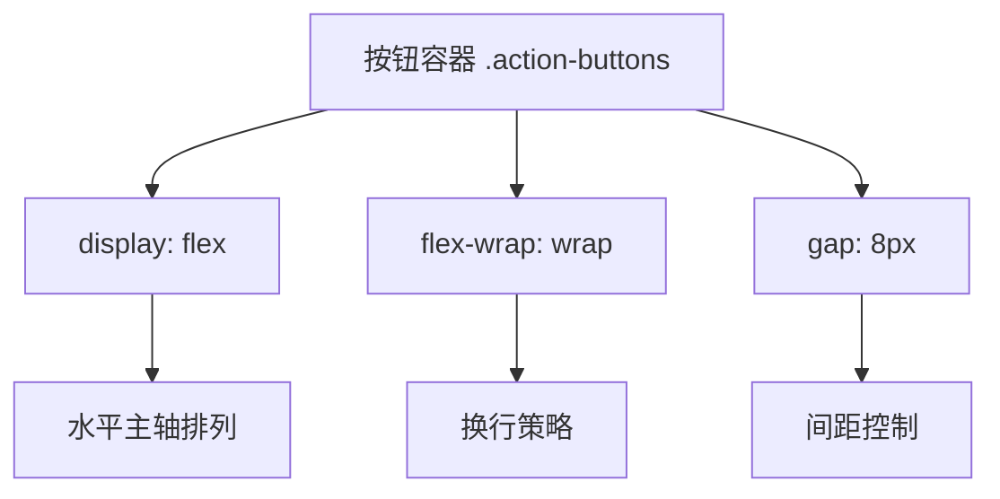
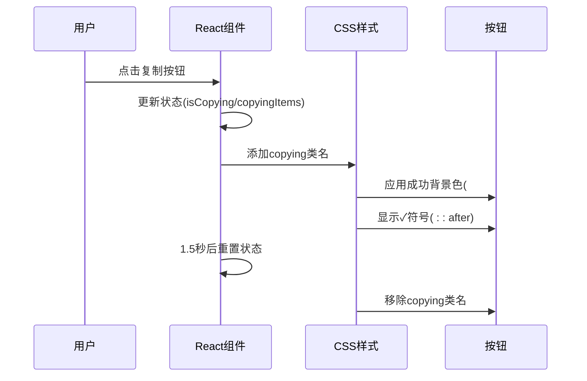

# 操作按钮组交互设计

<cite>
**本文档引用文件**
- [popup.css](file://src/styles/popup.css)
- [CommandScriptTab.tsx](file://src/components/tabs/CommandScriptTab.tsx)
- [JSONParamsTab.tsx](file://src/components/tabs/JSONParamsTab.tsx)
- [YAMLParamsTab.tsx](file://src/components/tabs/YAMLParamsTab.tsx)
</cite>

## 目录
1. [简介](#简介)
2. [操作按钮组Flex布局实现](#操作按钮组flex布局实现)
3. [复制按钮状态反馈机制](#复制按钮状态反馈机制)
4. [用户体验优化策略](#用户体验优化策略)
5. [结论](#结论)

## 简介
本项目中的操作按钮组（`.action-buttons`）采用现代化的CSS Flex布局与React状态管理，为用户提供直观、响应式的交互体验。按钮组主要出现在结果展示区域，包含"一键复制"和"保存为文件"等操作功能，通过精心设计的视觉反馈提升可用性。

## 操作按钮组flex布局实现

### 布局结构与容器定义
操作按钮组使用Flexbox布局实现灵活的排列与对齐。按钮容器通过`display: flex`启用弹性布局，并设置`gap: 8px`定义按钮间的固定间距，确保视觉上的均衡分布。

**图示来源**
- [popup.css](file://src/styles/popup.css#L678-L750)

**本节来源**
- [popup.css](file://src/styles/popup.css#L678-L750)

### 换行策略与响应式设计
通过`flex-wrap: wrap`属性，当容器空间不足时，按钮会自动换行到下一行显示，避免在小屏幕设备上出现溢出问题。这种设计确保了在不同屏幕尺寸下的良好适应性。

### 对齐规则与间距控制
按钮组采用默认的`flex-start`对齐方式，从左到右依次排列。`gap`属性替代传统的margin方法，提供更精确的间距控制，避免外边距折叠问题，使布局更加稳定可靠。

## 复制按钮状态反馈机制

### copying状态实现原理
复制按钮的状态反馈通过React组件状态与CSS类名联动实现。当用户点击复制按钮时，组件状态更新并添加`copying`类名，触发相应的视觉变化。

**图示来源**
- [CommandScriptTab.tsx](file://src/components/tabs/CommandScriptTab.tsx#L13-L13)
- [popup.css](file://src/styles/popup.css#L690-L710)

**本节来源**
- [CommandScriptTab.tsx](file://src/components/tabs/CommandScriptTab.tsx#L13-L55)
- [JSONParamsTab.tsx](file://src/components/tabs/JSONParamsTab.tsx#L18-L66)
- [YAMLParamsTab.tsx](file://src/components/tabs/YAMLParamsTab.tsx#L18-L66)
- [popup.css](file://src/styles/popup.css#L690-L710)

### ::after伪元素'✓'动画效果
复制成功后的对勾符号通过CSS `::after`伪元素实现，结合关键帧动画创造生动的视觉反馈：

- **内容插入**: `content: '✓'` 在按钮文本后插入对勾符号
- **动画效果**: 使用`checkmarkPulse`关键帧动画，实现从无到有、轻微放大再恢复的脉冲效果
- **时间控制**: 动画持续0.5秒，与背景色变化协调配合

该设计避免了DOM元素的频繁增减，提升了性能表现。

## 用户体验优化策略

### 禁用状态处理
按钮的禁用状态通过`:disabled`伪类进行样式控制，呈现灰色背景、禁止光标和移除阴影效果，明确传达不可操作状态，防止用户误触。

### 点击反馈设计
提供多层次的点击反馈：
- **悬停效果**: 背景色变深，轻微上移，增加阴影
- **激活效果**: 按钮下沉，阴影减弱，模拟物理按压感
- **成功反馈**: 颜色变为绿色，显示对勾，轻微放大动画

### 无障碍访问支持
虽然当前实现未显式包含ARIA属性，但基础的语义化HTML按钮元素提供了基本的可访问性。建议未来版本可添加`aria-label`、`aria-live`等属性，进一步提升屏幕阅读器用户的体验。

**本节来源**
- [popup.css](file://src/styles/popup.css#L678-L750)
- [CommandScriptTab.tsx](file://src/components/tabs/CommandScriptTab.tsx#L13-L55)

## 结论
操作按钮组的设计体现了现代Web应用中UI/UX的最佳实践：通过Flexbox实现灵活布局，利用CSS动画与React状态管理创建流畅的交互反馈。复制按钮的`copying`状态机制特别出色，通过简单的类名切换实现了复杂而愉悦的用户体验。未来可进一步增强无障碍支持，使产品更具包容性。