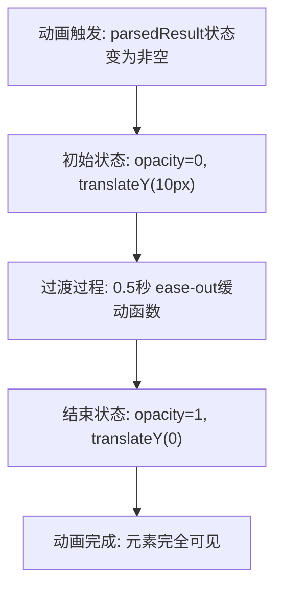

# 解析结果区块样式

<cite>
**Referenced Files in This Document **   
- [DataDownloadInput.tsx](file://src/components/DataDownloadInput.tsx)
- [sidebar.css](file://src/popup/sidebar.css)
- [popup.css](file://src/styles/popup.css)
</cite>

## Table of Contents
1. [设计原理与视觉反馈](#设计原理与视觉反馈)
2. [核心样式属性分析](#核心样式属性分析)
3. [slideInUp动画实现机制](#slideinup动画实现机制)
4. [性能影响评估](#性能影响评估)
5. [低端设备优化建议](#低端设备优化建议)

## 设计原理与视觉反馈

`.parsed-result-section` 类的设计旨在通过多层次的视觉元素强化用户对成功解析操作的认知体验。该样式区域作为数据解析完成后的反馈容器，其设计融合了色彩心理学、渐变美学和动效反馈三大原则。

在用户成功提交HuggingFace地址并完成解析后，系统会渲染此区块以展示解析出的关键信息，包括创建内容类型、名称、存储路径等。这种即时且明确的视觉反馈有效解决了用户对于操作是否成功的不确定性，符合人机交互中的"响应性"原则。

该组件通过绿色边框和渐变背景建立强烈的正向情感关联，利用人类对绿色普遍认知为"成功"的心理预期，增强用户的信任感和满意度。同时，圆角矩形的柔和边界减少了界面的机械感，营造出友好、现代的视觉氛围。

**Section sources**
- [DataDownloadInput.tsx](file://src/components/DataDownloadInput.tsx#L324-L351)
- [sidebar.css](file://src/popup/sidebar.css#L280-L297)
- [popup.css](file://src/styles/popup.css#L302-L310)

## 核心样式属性分析

### 绿色边框与渐变背景
`.parsed-result-section` 采用 `border: 2px solid #28a745 !important;` 定义鲜明的绿色边框，其中 `#28a745` 是Bootstrap框架中标准的成功状态色，具有高辨识度。背景使用 `background: linear-gradient(135deg, #e8f5e8 0%, #f0f9f0 100%) !important;` 创建从浅绿到更浅绿的线性渐变，营造出立体感和深度感，避免平面化带来的单调。

### 圆角半径
通过 `border-radius: 8px !important;`（侧边栏模式）或 `border-radius: 12px !important;`（弹窗模式）设置圆角，既保持了现代UI设计趋势，又确保了足够的可点击区域。不同模式下的半径差异体现了响应式设计思想，适应不同显示环境的视觉需求。

### 内边距与布局
区块内设置了适当的 `padding: 14px !important;`（紧凑模式）至 `20px`（标准模式），确保内容与边界的呼吸空间。内部采用CSS Grid布局（`.result-grid`）组织各项解析结果，保证在不同屏幕尺寸下都能保持良好的可读性和对齐性。

**Section sources**
- [sidebar.css](file://src/popup/sidebar.css#L280-L286)
- [popup.css](file://src/styles/popup.css#L302-L310)

## slideInUp动画实现机制



**Diagram sources **
- [sidebar.css](file://src/popup/sidebar.css#L298-L306)
- [popup.css](file://src/styles/popup.css#L311-L319)

`@keyframes slideInUp` 关键帧动画定义了一个优雅的入场效果：

```css
@keyframes slideInUp {
  from {
    opacity: 0;
    transform: translateY(10px);
  }
  to {
    opacity: 1;
    transform: translateY(0);
  }
}
```

该动画应用于 `.parsed-result-section` 的 `animation: slideInUp 0.5s ease-out !important;` 属性中，具有以下特性：
- **持续时间**: 0.5秒，足够明显但不拖沓
- **缓动函数**: `ease-out`，开始快结束慢，符合自然运动规律
- **变换属性**: 结合透明度变化和垂直位移，创造从下方滑入的立体感

在侧边栏模式中，起始位移为 `translateY(10px)`，而在标准弹窗模式中为 `translateY(20px)`，体现了不同上下文环境下的动效强度调整。

**Section sources**
- [sidebar.css](file://src/popup/sidebar.css#L298-L306)
- [popup.css](file://src/styles/popup.css#L311-L319)

## 性能影响评估

`slideInUp` 动画的性能表现主要受以下因素影响：

1. **硬件加速**: 使用 `transform` 和 `opacity` 属性触发GPU加速，相比直接修改 `top` 或 `margin-top` 更高效，因为这些属性不会引起重排（reflow）和重绘（repaint）。

2. **复合层创建**: 浏览器会为应用了 `transform` 的元素创建独立的合成层，减少对其他页面元素的影响，提升动画流畅度。

3. **内存占用**: 动画本身不产生显著内存开销，但由于需要维护额外的渲染层，可能轻微增加显存使用。

4. **FPS稳定性**: 在现代设备上通常能维持60fps，但在复杂页面环境中可能出现丢帧现象，特别是在同时运行多个动画时。

5. **首次绘制延迟**: 动画的存在可能导致关键内容的首次有效绘制（First Meaningful Paint）略微延迟，因为浏览器需要准备动画相关的渲染资源。

**Section sources**
- [sidebar.css](file://src/popup/sidebar.css#L298-L306)
- [popup.css](file://src/styles/popup.css#L311-L319)

## 低端设备优化建议

针对低端移动设备或旧款浏览器的性能优化策略：

### 1. 条件性启用动画
```css
/* 建议实现：基于prefers-reduced-motion媒体查询 */
@media (prefers-reduced-motion: reduce) {
  .data-download-input .parsed-result-section {
    animation: none !important;
    opacity: 1 !important;
    transform: translateY(0) !important;
  }
}
```

### 2. 简化动画参数
将动画持续时间从 `0.5s` 减少到 `0.3s`，降低用户等待感知，同时减少CPU/GPU负载。

### 3. 替代方案
提供纯CSS淡入效果替代滑动动画：
```css
@keyframes fadeIn {
  from { opacity: 0; }
  to { opacity: 1; }
}
```

### 4. JavaScript控制
通过JavaScript检测设备性能指标，动态决定是否应用动画：
```javascript
// 建议实现逻辑
if (isLowEndDevice()) {
  element.classList.add('no-animation');
}
```

### 5. 预加载优化
确保CSS文件尽早加载，避免FOUC（Flash of Unstyled Content）现象，可通过预连接和预加载提示实现。

### 6. 减少强制同步布局
避免在动画期间读取布局属性（如offsetHeight），防止触发强制重排，保持动画流畅。

这些建议可在不影响核心功能的前提下，显著提升在资源受限设备上的用户体验。

**Section sources**
- [sidebar.css](file://src/popup/sidebar.css#L298-L306)
- [popup.css](file://src/styles/popup.css#L311-L319)