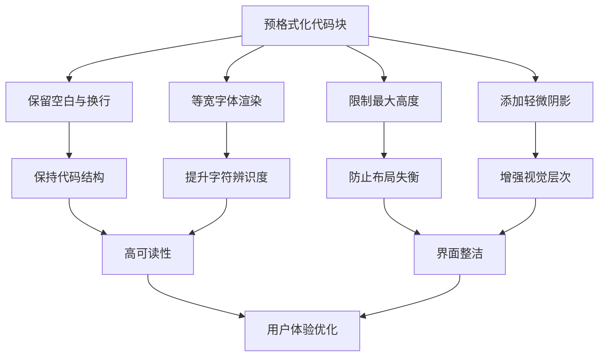

# 预格式化代码块样式

<cite>
**Referenced Files in This Document **  
- [sidebar.css](file://src/popup/sidebar.css)
</cite>

## 目录
1. [简介](#简介)  
2. [核心样式配置](#核心样式配置)  
3. [可读性与界面整洁度的平衡](#可读性与界面整洁度的平衡)  
4. [滚动行为与性能优化](#滚动行为与性能优化)  
5. [结论](#结论)

## 简介
本文档深入剖析了预格式化代码块（`pre` 元素）在侧边栏界面中的样式设计，重点分析其如何通过 `white-space` 处理、字体族选择、滚动机制、最大高度限制及阴影效果等手段，在确保长代码内容可读性的同时维持整体界面的整洁美观。特别强调了水平溢出自动滚动与硬件加速等性能优化措施的应用。

## 核心样式配置

### white-space 处理
`pre` 元素采用 `white-space: pre-wrap !important;` 设置，保留原始文本中的空白字符和换行符，同时允许内容在容器边界处自动换行。这一设置既保持了代码结构的完整性，又避免了因超长行导致的布局破坏或横向滚动条频繁出现。

### 字体族选择
使用 `'SF Mono', 'Monaco', 'Consolas', 'Liberation Mono', 'Courier New', monospace` 作为字体栈，优先选用现代操作系统中常见的等宽字体，确保代码显示清晰且具有一致的字符宽度，提升阅读体验。

### 最大高度限制
通过 `max-height: 400px !important;` 对代码块设置了明确的最大高度，防止过长的内容占据过多屏幕空间，影响其他界面元素的可见性。

### 阴影效果
应用 `box-shadow: 0 1px 3px rgba(0, 0, 0, 0.1) !important;` 添加轻微的投影，使代码块从背景中微微凸起，增强视觉层次感。悬停时阴影加深至 `0 2px 4px rgba(0, 0, 0, 0.05)`，提供直观的交互反馈。

**Section sources**
- [sidebar.css](file://src/popup/sidebar.css#L607-L647)

## 可读性与界面整洁度的平衡

**Diagram sources **
- [sidebar.css](file://src/popup/sidebar.css#L607-L647)

该样式方案巧妙地在可读性与界面整洁之间取得平衡：
- **可读性保障**：通过 `pre-wrap` 和专业等宽字体，确保代码逻辑清晰呈现。
- **整洁度维护**：利用 `max-height` 和 `overflow-y: auto` 控制垂直尺寸，结合圆角边框与浅色边框线，使代码块外观规整统一。

## 滚动行为与性能优化

### 水平滚动行为
当代码行超出容器宽度时，`overflow-x: auto !important;` 启用水平滚动条，用户可通过拖动查看完整内容。此设计避免了强制换行对代码语义的干扰。

### 垂直滚动控制
配合 `max-height` 使用 `overflow-y: auto !important;`，为超过限定高度的代码内容提供垂直滚动能力，保证所有信息均可访问。

### 性能优化措施
虽然当前实现未显式声明 `transform` 或 `will-change` 属性以触发硬件加速，但现代浏览器通常会对带有 `overflow` 的容器进行优化。未来可考虑添加 `transform: translateZ(0);` 或 `will-change: scroll-position;` 进一步提升滚动流畅度，尤其在处理大型代码片段时有效防止页面卡顿。

**Section sources**
- [sidebar.css](file://src/popup/sidebar.css#L607-L647)

## 结论
通过对 `pre` 元素的精细化样式配置，系统成功实现了长代码内容的高效展示。`white-space: pre-wrap` 与等宽字体保障了基础可读性；`max-height` 与双轴滚动机制维护了界面秩序；细微的阴影变化则提升了整体质感。尽管当前实现已能满足基本需求，为进一步优化复杂场景下的响应性能，建议探索硬件加速技术的应用，从而全面杜绝潜在的页面卡顿问题。