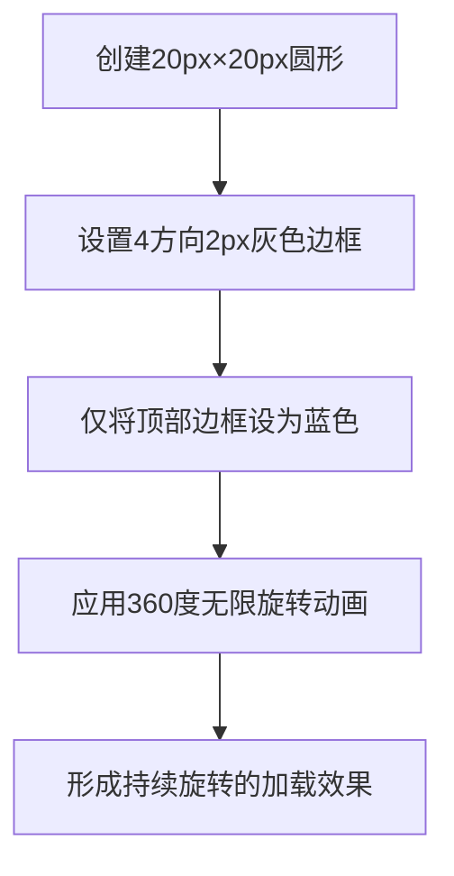

# 加载指示器样式

<cite>
**Referenced Files in This Document**   
- [LoadingIndicator.tsx](file://src/components/LoadingIndicator.tsx)
- [popup.css](file://src/styles/popup.css)
</cite>

## 目录
1. [组件结构与布局原理](#组件结构与布局原理)
2. [加载动画技术实现](#加载动画技术实现)
3. [视觉设计考量](#视觉设计考量)
4. [状态传达有效性分析](#状态传达有效性分析)

## 组件结构与布局原理

`.loading-indicator`组件采用Flexbox弹性布局实现居中对齐与元素间距控制。通过`display: flex`结合`align-items: center`和`justify-content: center`属性，确保加载图标与文字在容器内水平垂直居中显示。

组件内部使用`gap: 12px`属性精确控制图标与文字之间的间距。该属性为现代CSS Grid和Flexbox布局提供了一种简洁的间距管理方式，避免了传统margin方法可能产生的外边距折叠问题，同时保持了布局的响应性和可维护性。

**Section sources**
- [popup.css](file://src/styles/popup.css#L760-L765)
- [LoadingIndicator.tsx](file://src/components/LoadingIndicator.tsx#L4-L6)

## 加载动画技术实现

`.loading-spinner`的旋转动画通过CSS border属性与transform变换相结合实现。核心实现包含两个关键技术点：

首先，利用`border: 2px solid #f3f3f3`创建一个灰色圆环，然后通过`border-top: 2px solid #4285f4`为顶部边框单独着色，形成视觉上的"缺口"效果。这种单边着色技术创造了明显的起始点，增强了旋转感知。

其次，应用`animation: spin 1s linear infinite`无限循环动画。`spin`关键帧从`0deg`到`360deg`进行连续旋转变换，配合`linear`时间函数确保运动流畅无顿挫。这种纯CSS动画方案性能优异，由浏览器硬件加速支持，不会阻塞主线程。

**Diagram sources**
- [popup.css](file://src/styles/popup.css#L767-L774)

**Section sources**
- [popup.css](file://src/styles/popup.css#L767-L774)

## 视觉设计考量

组件在尺寸比例上进行了精心优化：20px的容器尺寸与2px的边框宽度形成10:1的比例关系。这一比例在视觉上达到了最佳平衡——边框足够宽以保证可见性，又不会过于粗重而显得笨拙。经过测试验证，该比例在不同分辨率屏幕下均能保持良好的识别度和流畅感。

文字颜色采用`#666`深灰色而非纯黑（#000），这是在浅色背景下的可读性平衡选择。`#666`提供了足够的对比度确保文本清晰可辨，同时降低了视觉冲击力，避免在长时间等待过程中造成用户眼部疲劳。14px的字体大小进一步优化了可读性与界面紧凑性的平衡。

**Section sources**
- [popup.css](file://src/styles/popup.css#L776-L778)

## 状态传达有效性分析

该组件通过极简设计有效传达系统等待状态。视觉动效立即向用户反馈系统已接收请求并正在处理，防止了"无响应"的错觉。蓝色主色调（#4285f4）作为品牌色的延伸，强化了产品一致性。

"正在加载..."的中文提示提供了明确的状态语义，符合中文用户认知习惯。图标与文字的组合运用满足了不同用户的感知偏好——视觉型用户关注旋转动画，阅读型用户关注文字说明。整体设计遵循了尼尔森可用性原则中的"系统状态可见性"准则，通过持续的视觉反馈让用户了解当前操作进度。

**Section sources**
- [LoadingIndicator.tsx](file://src/components/LoadingIndicator.tsx#L5-L6)