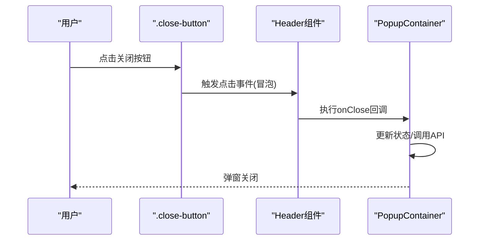

# 关闭按钮交互设计

<cite>
**本文档引用的文件**
- [PopupContainer.tsx](file://src/components/PopupContainer.tsx)
- [popup.css](file://src/styles/popup.css)
</cite>

## 目录
1. [关闭按钮状态机实现](#关闭按钮状态机实现)
2. [动画曲线与用户体验](#动画曲线与用户体验)
3. [几何设计与人机工程学](#几何设计与人机工程学)
4. [事件集成机制](#事件集成机制)

## 关闭按钮状态机实现

`.close-button` 组件通过CSS伪类实现了完整的交互状态机，包含默认、悬停和激活三种核心状态。该状态机的设计遵循了现代Web组件的最佳实践，为用户提供清晰的视觉反馈。

在默认状态下，关闭按钮采用极简主义设计原则，不设置背景色和边框，仅通过字体颜色（#999）和圆形造型（border-radius: 50%）建立基本视觉识别。这种设计减少了视觉噪声，使按钮在界面中既存在又不突兀。

当用户将鼠标悬停在按钮上时，`:hover` 状态被触发，通过应用 `background: rgba(0, 0, 0, 0.1)` 实现微妙的背景色变化。这种半透明黑色背景的渐变效果提供了即时的视觉反馈，明确告知用户该元素是可交互的，同时保持了整体设计的轻盈感。

在用户点击按钮的瞬间，`:active` 状态被激活，触发两个关键视觉变化：首先应用 `transform: scale(0.95)` 缩放动效，模拟物理按压的压缩感；其次加深背景色至 `rgba(0, 0, 0, 0.2)`，增强按压的深度感知。这种双重反馈机制有效模拟了真实世界的物理交互，提升了用户的操作信心。

**Section sources**
- [popup.css](file://src/styles/popup.css#L501-L526)

## 动画曲线与用户体验

`.close-button` 的交互体验通过 `transition: all 0.2s ease` 属性得到了显著提升。这一动画配置的选择基于对用户体验流畅性的深入考量，其中包含了三个关键参数：属性范围、持续时间和缓动函数。

`all` 关键字确保了所有可动画的CSS属性（包括背景色、变换和颜色）都能参与过渡，避免了部分属性突变导致的不协调感。这种全面的过渡覆盖保证了状态切换的完整性，使多个视觉变化能够协同工作而非独立发生。

`0.2s` 的持续时间经过精心选择，既足够长以让用户感知到动画过程，又足够短以避免造成操作延迟的感觉。这个时间值符合人机交互中的"响应性"标准，研究表明200毫秒是用户感知系统响应的理想阈值，既能确认操作已被接收，又不会打断工作流。

`ease` 缓动函数（等同于cubic-bezier(0.25, 0.1, 0.25, 1.0)）采用了先快后慢的加速度曲线，模仿了现实世界物体的运动惯性。这种非线性的运动模式比线性过渡更符合人类的运动预期，创造了更加自然和愉悦的交互体验。当用户释放按钮时，从缩放状态恢复的过程同样应用此缓动函数，形成了完整的物理模拟闭环。

**Section sources**
- [popup.css](file://src/styles/popup.css#L526)

## 几何设计与人机工程学

关闭按钮的几何设计——32x32像素的正方形配合 `border-radius: 50%` 的圆形造型——体现了对Fitts定律的深刻理解和应用。Fitts定律指出，目标获取时间与目标距离成正比，与目标大小成反比，这一定律是人机交互设计的基础原理之一。

32像素的尺寸选择平衡了多个设计考量：在高分辨率显示屏上提供足够的触摸目标区域，同时在视觉上保持精致感。根据苹果和谷歌的设计指南，44x44像素是推荐的最小触摸目标，而32像素在桌面环境中通过鼠标精确控制完全可行，并且在视觉密度和可用性之间取得了良好平衡。

圆形造型不仅具有美学优势，还增强了可用性。与直角矩形相比，圆形按钮在所有方向上都提供了相等的"边缘距离"，这意味着用户可以从任何角度接近按钮中心，降低了定位难度。此外，圆形没有尖锐的角落，减少了视觉攻击性，使交互元素更加友好。

从Fitts定律的角度分析，圆形按钮的无限可接近性使其在理论上比矩形按钮更容易命中。当按钮位于屏幕角落时，其有效性进一步增强，因为屏幕边缘充当了"无限大"的目标，用户可以将鼠标快速移动到屏幕角落而不必精确停止。

**Section sources**
- [popup.css](file://src/styles/popup.css#L501-L507)

## 事件集成机制

关闭按钮通过React组件的事件冒泡机制与 `PopupContainer` 组件的关闭逻辑无缝集成。在 `PopupContainer.tsx` 文件中，Header组件接收 `onClose` 回调函数作为props，并将其传递给实际的关闭按钮元素。

当用户点击关闭按钮时，点击事件首先在按钮元素上触发，然后向上冒泡到父级Header组件。Header组件捕获此事件并执行传入的 `onClose` 回调，从而实现弹窗容器的关闭功能。这种事件处理模式遵循了React的单向数据流原则，保持了组件间的松耦合。

值得注意的是，尽管当前代码库中未直接显示 `onClose` 回调的具体实现，但通过组件结构分析可以确定其存在。`PopupContainer` 作为顶级组件管理着整个弹窗的状态，因此 `onClose` 很可能通过状态管理（如useState或useReducer）来控制弹窗的可见性，或者通过调用浏览器API来关闭侧边栏。

这种基于事件冒泡的集成方式具有多个优势：它简化了组件通信，避免了复杂的prop drilling；提高了组件复用性，相同的Header组件可以在不同上下文中使用不同的关闭逻辑；并且符合Web标准，利用了原生DOM事件系统的可靠性。

**Diagram sources**
- [PopupContainer.tsx](file://src/components/PopupContainer.tsx)
- [popup.css](file://src/styles/popup.css#L501-L526)