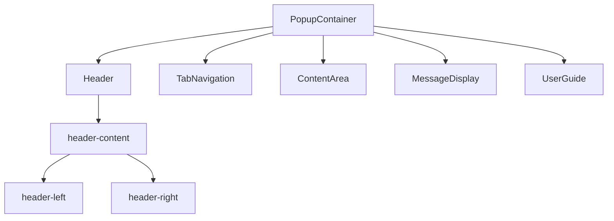
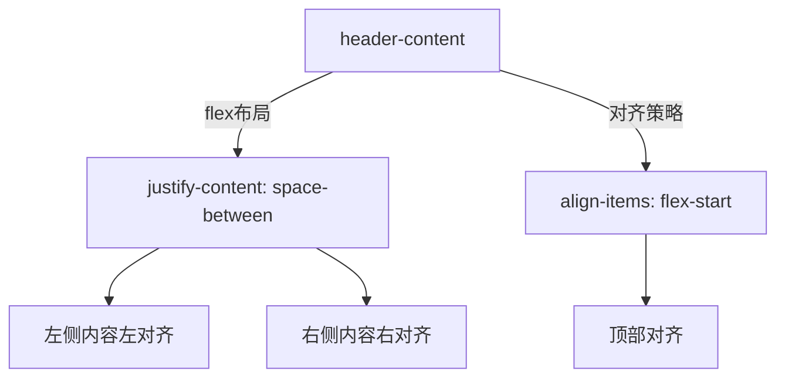
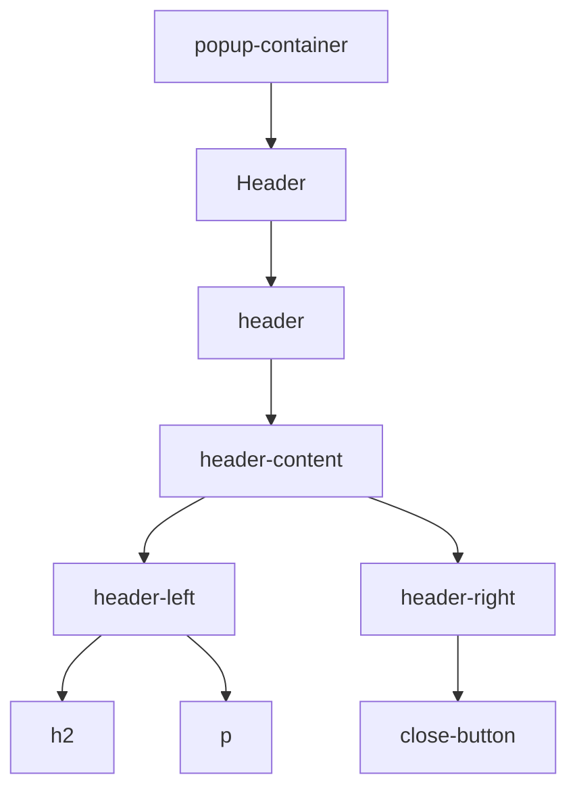

# 头部布局结构

<cite>
**本文档中引用的文件**
- [Header.tsx](file://src/components/Header.tsx)
- [PopupContainer.tsx](file://src/components/PopupContainer.tsx)
- [popup.css](file://src/styles/popup.css)
</cite>

## 目录
1. [项目结构](#项目结构)
2. [核心组件分析](#核心组件分析)
3. [头部容器布局机制](#头部容器布局机制)
4. [响应式设计与自适应行为](#响应式设计与自适应行为)
5. [DOM结构与组件嵌套关系](#dom结构与组件嵌套关系)
6. [未来功能扩展支持](#未来功能扩展支持)

## 项目结构

本项目的前端组件采用模块化组织方式，主要功能集中在`src/components`目录下。其中，`Header.tsx`负责定义头部区域的UI结构，`PopupContainer.tsx`作为主容器管理整体布局和状态，而样式定义则分散在`src/styles/popup.css`等CSS文件中。

**图示来源**
- [PopupContainer.tsx](file://src/components/PopupContainer.tsx#L20-L566)
- [Header.tsx](file://src/components/Header.tsx#L6-L17)

**节源**
- [PopupContainer.tsx](file://src/components/PopupContainer.tsx#L20-L566)
- [Header.tsx](file://src/components/Header.tsx#L6-L17)

## 核心组件分析

头部布局的核心由`Header`组件实现，该组件接收`pageName`属性用于动态渲染当前页面标题。其内部通过`.header-content`容器使用Flex布局进行子元素排布，左侧承载标题信息，右侧预留交互控件空间。

**节源**
- [Header.tsx](file://src/components/Header.tsx#L6-L17)

## 头部容器布局机制

`.header-content`容器采用Flex布局，关键CSS属性如下：

- `display: flex`：启用弹性盒模型
- `justify-content: space-between`：实现主轴方向上的空间均分，使`.header-left`与`.header-right`分别贴合容器两端
- `align-items: flex-start`：确保交叉轴对齐方式为顶部对齐，避免内容垂直居中导致的高度不一致问题

这种布局策略保证了标题与操作按钮之间的水平分离，并维持了顶部基准线的一致性。

**图示来源**
- [popup.css](file://src/styles/popup.css#L463-L475)

**节源**
- [popup.css](file://src/styles/popup.css#L463-L475)

### 子容器职责划分

#### 左侧容器（.header-left）
- 承载层级标题（h2标签）
- 显示辅助说明文本（p标签）
- 使用`flex: 1`占据剩余空间，保障标题区域的可扩展性

#### 右侧容器（.header-right）
- 专用于放置关闭按钮等交互控件
- 设置`flex-shrink: 0`防止在空间不足时被压缩
- 通过`margin-left: 16px`保持与左侧的内容间距

**节源**
- [popup.css](file://src/styles/popup.css#L477-L484)

## 响应式设计与自适应行为

为适应不同屏幕尺寸，布局采用了以下弹性策略：

- `.header-left`使用`flex: 1`，使其能够根据可用空间自动调整宽度
- `.header-right`设置`flex-shrink: 0`，确保操作按钮区域不会因空间压缩而消失
- 结合`min-width`与`gap`属性，在小屏设备上仍能保持基本可读性和操作性

这些属性共同作用，使得头部在窄屏环境下优先保证操作区域完整，同时允许标题区域适度收缩。

**节源**
- [popup.css](file://src/styles/popup.css#L477-L484)

## DOM结构与组件嵌套关系

实际DOM结构呈现为多层嵌套模式：

`PopupContainer`作为根组件引入`Header`，形成清晰的父子级联关系。这种结构便于状态传递和样式继承。

**图示来源**
- [PopupContainer.tsx](file://src/components/PopupContainer.tsx#L20-L566)
- [Header.tsx](file://src/components/Header.tsx#L6-L17)

**节源**
- [PopupContainer.tsx](file://src/components/PopupContainer.tsx#L20-L566)
- [Header.tsx](file://src/components/Header.tsx#L6-L17)

## 未来功能扩展支持

当前布局模式具备良好的可扩展性：
- 可在`.header-right`轻松添加新控件（如帮助按钮、设置图标）
- `.header-left`支持嵌套更多元化的标题结构（如面包屑导航）
- Flex布局天然支持动态插入或隐藏子元素而不破坏整体结构

此设计为后续功能迭代提供了灵活的基础架构。

**节源**
- [Header.tsx](file://src/components/Header.tsx#L6-L17)
- [popup.css](file://src/styles/popup.css#L463-L484)