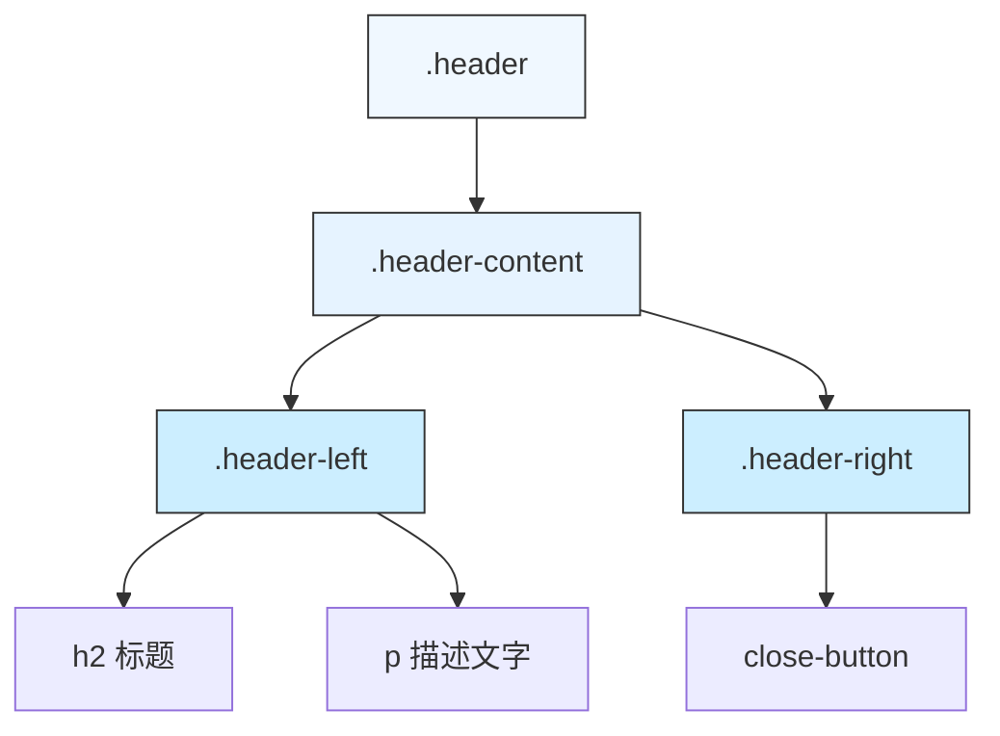

# 头部样式

<cite>
**本文档中引用的文件**   
- [Header.tsx](file://src/components/Header.tsx)
- [popup.css](file://src/styles/popup.css)
</cite>

## 目录
1. [头部容器结构与布局策略](#头部容器结构与布局策略)
2. [.header-content中的flex布局空间分配机制](#header-content中的flex布局空间分配机制)
3. .header-left与.header-right子类的空间占用分析
4. h1与h2标题层级的视觉权重差异及其信息架构意义
5. close-button的交互反馈设计与用户体验优化

## 头部容器结构与布局策略

头部区域采用多层嵌套结构实现清晰的内容组织和灵活的布局控制。最外层的`.header`容器通过设置`margin-bottom: 16px`与其他内容形成适当的垂直间距，确保界面呼吸感。其内部包含一个`.header-content`容器，该容器作为flex布局的主轴容器，负责协调左右两侧内容的空间分配。

在React组件层面，`Header`组件接收`pageName`属性，并将其动态渲染为`<h2>`标题元素，同时附带固定的提示文本"切换Tab按钮可以查看对应内容"。这种设计实现了头部内容的可配置性，使不同页面能够复用同一组件而展示不同的标题信息。

**本节来源**
- [Header.tsx](file://src/components/Header.tsx#L2-L17)
- [popup.css](file://src/styles/popup.css#L459)

## .header-content中的flex布局空间分配机制

`.header-content`类应用了关键的Flexbox布局属性组合：`display: flex`、`justify-content: space-between`和`align-items: flex-start`。这一组合实现了高效且响应式的空间分配策略。

`justify-content: space-between`确保了主轴（水平方向）上的空间被最大化利用，将可用空间均匀分布在子元素之间，使得左侧内容紧贴左边缘，右侧内容紧贴右边缘，中间的空白区域被自动拉伸填充。这在需要左右对齐元素时尤为有效，如导航栏或页眉设计。

`align-items: flex-start`则控制交叉轴（垂直方向）的对齐方式，使所有子元素沿容器顶部对齐。这保证了即使左右两侧内容高度不一致，它们的顶部也会保持在同一水平线上，维持了视觉上的整齐划一。这种组合特别适合于包含不同高度元素（如图标、文本、按钮等）的复杂头部设计。

**图示来源**
- [Header.tsx](file://src/components/Header.tsx#L6-L17)
- [popup.css](file://src/styles/popup.css#L463)

**本节来源**
- [popup.css](file://src/styles/popup.css#L463-L467)

## .header-left与.header-right子类的空间占用分析

`.header-left`和`.header-right`两个子类通过不同的flex属性设置，实现了精确的空间控制策略。`.header-left`设置了`flex: 1`，这意味着它将占据除`.header-right`所需空间之外的所有剩余空间。这种设置确保了主要内容（如页面标题和描述）能够充分利用可用宽度，特别是在屏幕尺寸变化时仍能保持良好的可读性和布局平衡。

相比之下，`.header-right`设置了`flex-shrink: 0`并添加了`margin-left: 16px`的外边距。`flex-shrink: 0`防止该元素在空间不足时被压缩，保证了其内部内容（如关闭按钮）始终以完整尺寸显示。`margin-left`则创建了一个固定的间隔，避免左右两部分内容过于拥挤，提升了整体的视觉舒适度。

这种设计模式体现了现代Web开发中常见的"主次分明"原则：主要信息区域具有弹性，次要操作区域保持固定，从而在各种设备上都能提供一致且优质的用户体验。

**本节来源**
- [popup.css](file://src/styles/popup.css#L469-L473)

## h1与h2标题层级的视觉权重差异及其信息架构意义

尽管当前实现中使用的是`<h2>`标签，但样式文件中同时定义了`.header h1`和`.header h2`的样式规则，表明系统支持多级标题的视觉区分。`h1`的字体大小为20px，而`h2`为18px，两者均采用`font-weight: 600`的半粗体，确保了足够的视觉重量。

这种字号差异构建了一个清晰的视觉层次结构，帮助用户快速识别页面的主要标题（h1）和次级标题（h2）。较大的h1通常用于最重要的页面名称或品牌标识，较小的h2则适用于当前视图或功能模块的名称。颜色统一使用`#333`的深灰色，既保证了良好的可读性，又不会过于刺眼。

从信息架构的角度看，这种层级划分有助于用户建立心理模型，理解当前所处的位置以及各部分信息的重要性排序。即使在复杂的单页应用中，恰当的标题层级也能显著提升用户的导航效率和认知体验。

**本节来源**
- [popup.css](file://src/styles/popup.css#L478-L486)
- [Header.tsx](file://src/components/Header.tsx#L10)

## close-button的交互反馈设计与用户体验优化

`.close-button`的设计充分考虑了用户交互的微细节，通过多种状态变化提供即时的视觉反馈。基础样式采用无背景、无边框的圆形按钮，`border-radius: 50%`配合`width: 32px`和`height: 32px`创建了一个完美的圆形点击区域，符合Fitts定律，易于点击。

在`:hover`状态下，按钮背景变为`rgba(0, 0, 0, 0.1)`的浅灰色，同时文字颜色变深至`#666`。这种微妙的颜色变化向用户明确指示了该元素的可交互性，降低了误操作的可能性。

更进一步，在`:active`（按下）状态下，除了背景色加深至`rgba(0, 0, 0, 0.2)`外，还应用了`transform: scale(0.95)`的缩放动效。这个微小的"内陷"效果模拟了物理按钮被按下的感觉，提供了触觉般的反馈，增强了界面的拟物化体验。`transition: all 0.2s ease`确保了这些状态变化平滑过渡，避免了突兀的视觉跳跃。

这些精心设计的微交互共同作用，不仅提升了界面的专业感和精致度，更重要的是通过即时反馈增强了用户的控制感和操作信心，是优秀用户体验设计的典范。

**本节来源**
- [popup.css](file://src/styles/popup.css#L496-L504)