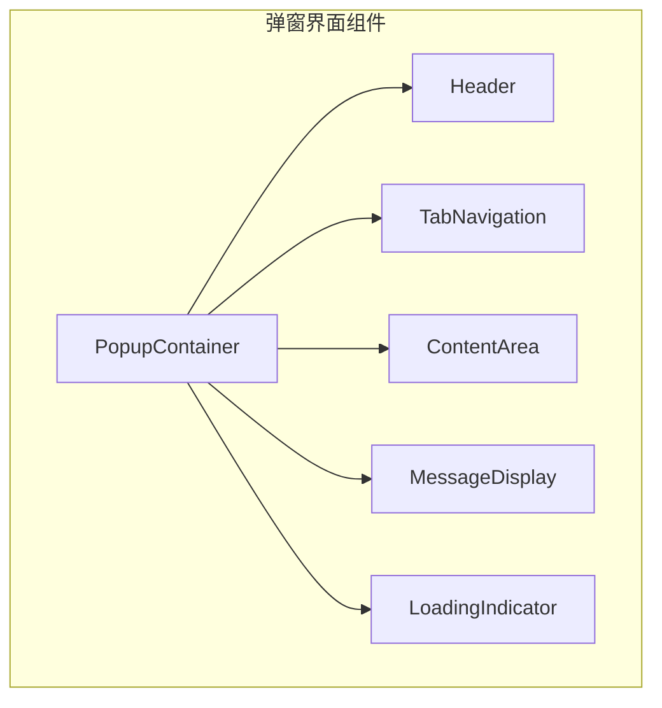
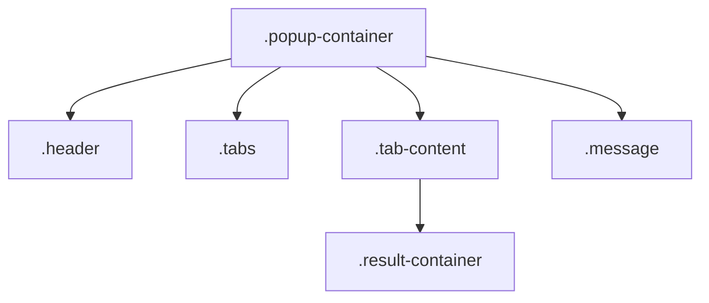
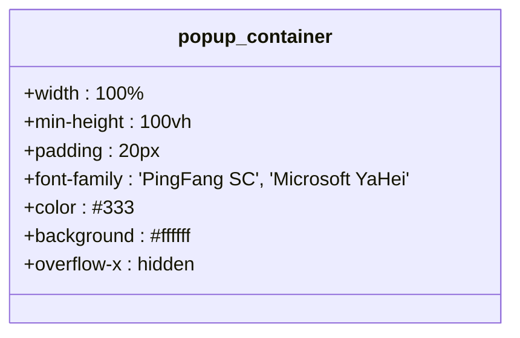
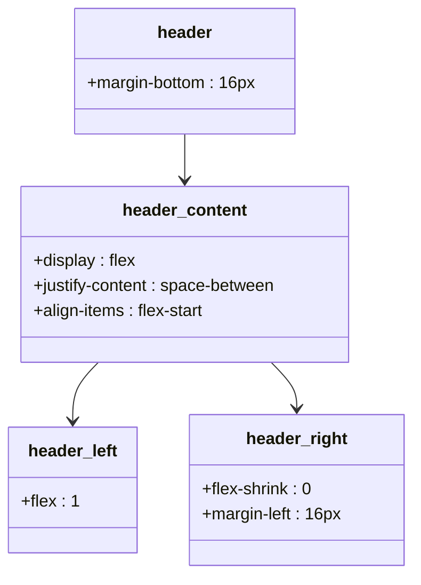
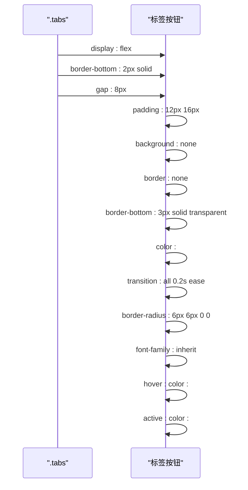
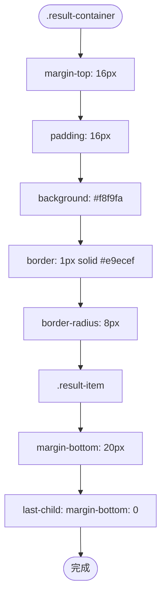
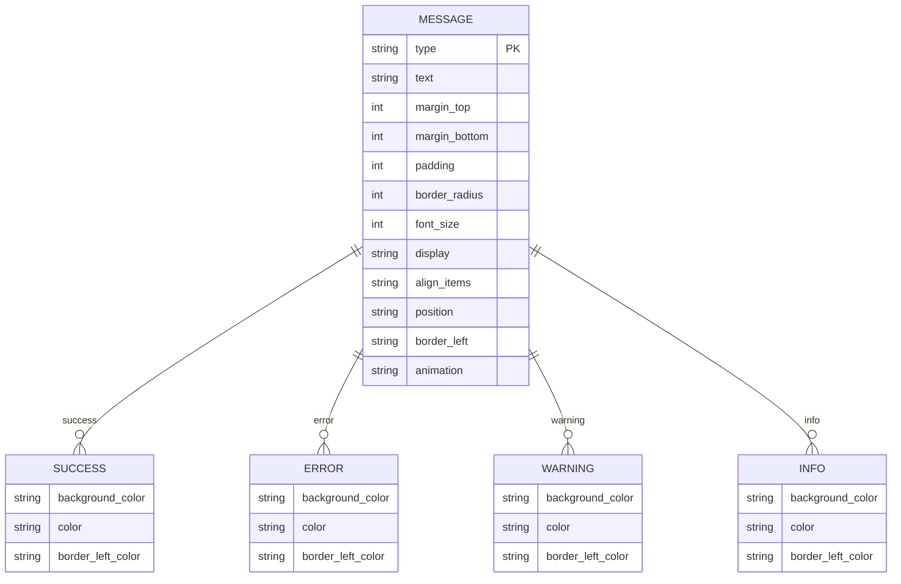
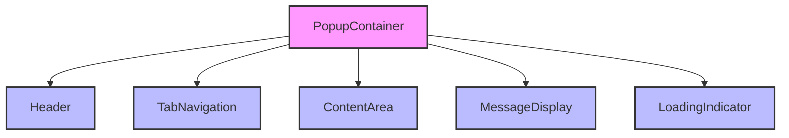

# 弹窗界面样式

<cite>
**本文档中引用的文件**
- [popup.css](file://src/styles/popup.css)
- [PopupContainer.tsx](file://src/components/PopupContainer.tsx)
- [Header.tsx](file://src/components/Header.tsx)
- [TabNavigation.tsx](file://src/components/TabNavigation.tsx)
- [MessageDisplay.tsx](file://src/components/MessageDisplay.tsx)
- [LoadingIndicator.tsx](file://src/components/LoadingIndicator.tsx)
</cite>

## 目录
1. [简介](#简介)
2. [项目结构](#项目结构)
3. [核心组件](#核心组件)
4. [架构概述](#架构概述)
5. [详细组件分析](#详细组件分析)
6. [依赖分析](#依赖分析)
7. [性能考虑](#性能考虑)
8. [故障排除指南](#故障排除指南)
9. [结论](#结论)

## 简介
本文档详细分析了AIHC助手扩展程序中弹窗界面的CSS样式架构，重点说明`.popup-container`容器的整体布局与响应式设计策略。文档解释了`.header`、`.tabs`、`.tab-content`等核心组件的样式实现机制，以及它们如何协同构建清晰的视觉层次。同时阐述了`.result-container`和`.message`组件的设计原则，包括色彩搭配、间距规范和交互反馈效果。此外，还描述了加载动画、按钮状态变化（如:hover、:active）及复制成功动效的技术实现，并结合代码示例说明CSS变量使用情况、浏览器兼容性处理方案，最后提供自定义主题扩展建议。

## 项目结构
本项目的弹窗界面样式主要由`popup.css`文件定义，该文件位于`src/styles/`目录下。弹窗界面的React组件结构遵循典型的前端架构模式，包含容器组件、头部组件、标签导航组件、内容区域组件、消息显示组件和加载指示器组件。这些组件通过合理的CSS类名组织在一起，形成了一个功能完整且美观的用户界面。

**图源**
- [PopupContainer.tsx](file://src/components/PopupContainer.tsx)
- [Header.tsx](file://src/components/Header.tsx)
- [TabNavigation.tsx](file://src/components/TabNavigation.tsx)

**节源**
- [popup.css](file://src/styles/popup.css)
- [PopupContainer.tsx](file://src/components/PopupContainer.tsx)

## 核心组件
弹窗界面的核心组件包括`.popup-container`作为最外层容器，`.header`用于显示页面标题信息，`.tabs`实现标签页导航功能，`.result-container`展示主要内容结果，以及`.message`组件用于显示系统消息。这些组件通过精心设计的CSS样式相互配合，共同构建了一个现代化、响应式的用户界面。

**节源**
- [popup.css](file://src/styles/popup.css)
- [PopupContainer.tsx](file://src/components/PopupContainer.tsx)

## 架构概述
弹窗界面采用基于Flexbox和Grid的现代CSS布局技术，实现了灵活且响应式的界面设计。整体架构以`.popup-container`为根容器，内部按逻辑分层组织：顶部是`.header`，中间是`.tabs`导航，下面是`.tab-content`内容区域，底部可能有`.message`提示。这种分层架构确保了界面在不同屏幕尺寸下的良好表现。

**图源**
- [popup.css](file://src/styles/popup.css)

**节源**
- [popup.css](file://src/styles/popup.css)

## 详细组件分析
### .popup-container 容器分析
`.popup-container`是整个弹窗界面的最外层容器，采用百分百宽度和最小100vh高度的设计，确保在各种设备上都能完整显示内容。容器设置了20px的内边距，使用PingFang SC和Microsoft YaHei作为优先字体，保证了在不同操作系统上的文字显示效果。背景色为纯白色，文本颜色为深灰色，提供了良好的可读性。

**图源**
- [popup.css](file://src/styles/popup.css#L447-L453)

**节源**
- [popup.css](file://src/styles/popup.css#L447-L453)
- [PopupContainer.tsx](file://src/components/PopupContainer.tsx)

### .header 头部组件分析
`.header`组件负责显示当前页面的标题信息，通过`.header-content`的flex布局实现了左右两部分的合理分布。左侧`.header-left`占据剩余空间，显示页面名称；右侧可以放置关闭按钮等操作元素。标题使用18px字号的h2标签，副标题使用14px字号的p标签，形成了清晰的视觉层次。

**图源**
- [popup.css](file://src/styles/popup.css#L455-L474)

**节源**
- [popup.css](file://src/styles/popup.css#L455-L474)
- [Header.tsx](file://src/components/Header.tsx)

### .tabs 标签导航分析
`.tabs`组件实现了标签页导航功能，使用flex布局将各个标签按钮水平排列。每个标签按钮都有统一的样式，包括12px的内边距、无背景色、透明边框和6px的圆角。当鼠标悬停时，标签会变为蓝色并有轻微的背景高亮；当处于激活状态时，底部边框会变为蓝色，形成明显的选中标识。

**图源**
- [popup.css](file://src/styles/popup.css#L513-L533)

**节源**
- [popup.css](file://src/styles/popup.css#L513-L533)
- [TabNavigation.tsx](file://src/components/TabNavigation.tsx)

### .result-container 结果容器分析
`.result-container`组件用于展示主要内容结果，具有16px的外边距和内边距，背景色为浅灰色，边框为1px的浅灰色实线，圆角为8px。容器内的`.result-item`项目之间有20px的垂直间距，最后一个项目没有下边距。这种设计使得内容区域既独立又连贯，提高了信息的可读性。

**图源**
- [popup.css](file://src/styles/popup.css#L589-L596)

**节源**
- [popup.css](file://src/styles/popup.css#L589-L596)

### .message 消息组件分析
`.message`组件用于显示系统消息，支持多种类型（success、error、warning、info），每种类型有不同的颜色方案。消息组件具有16px的外边距、12px的内边距、6px的圆角和左侧4px的彩色边框。通过slideInDown动画实现平滑的出现效果，提升了用户体验。

**图源**
- [popup.css](file://src/styles/popup.css#L698-L750)

**节源**
- [popup.css](file://src/styles/popup.css#L698-L750)
- [MessageDisplay.tsx](file://src/components/MessageDisplay.tsx)

## 依赖分析
弹窗界面的样式实现依赖于多个CSS特性，包括Flexbox布局、CSS过渡动画、媒体查询响应式设计等。从组件角度看，`PopupContainer`组件依赖于`Header`、`TabNavigation`、`ContentArea`、`MessageDisplay`和`LoadingIndicator`等多个子组件，这些组件通过props传递数据和回调函数进行通信。

**图源**
- [PopupContainer.tsx](file://src/components/PopupContainer.tsx)
- [popup.css](file://src/styles/popup.css)

**节源**
- [PopupContainer.tsx](file://src/components/PopupContainer.tsx)
- [popup.css](file://src/styles/popup.css)

## 性能考虑
弹窗界面的CSS设计充分考虑了性能因素。首先，避免了复杂的嵌套选择器，减少了CSS解析时间；其次，使用了硬件加速的transform属性而非top/left进行位移动画，提高了动画流畅度；再次，通过合理的transition设置，避免了不必要的重绘和回流；最后，响应式设计采用了移动优先的策略，在小屏幕上提供简洁的布局，在大屏幕上才展开更多内容。

## 故障排除指南
当遇到弹窗界面显示异常时，可以从以下几个方面进行排查：检查CSS文件是否正确加载，确认类名拼写是否正确，验证JavaScript组件是否正常渲染，查看浏览器控制台是否有错误信息。对于样式问题，可以使用浏览器开发者工具逐级检查元素的盒模型、计算样式和继承关系，定位具体的问题所在。

**节源**
- [popup.css](file://src/styles/popup.css)
- [PopupContainer.tsx](file://src/components/PopupContainer.tsx)

## 结论
通过对`popup.css`文件的详细分析，我们可以看到AIHC助手扩展程序的弹窗界面采用了现代化的CSS技术和合理的组件化设计。整体布局清晰，视觉层次分明，交互反馈及时，响应式设计完善。通过`.popup-container`、`.header`、`.tabs`、`.result-container`和`.message`等核心组件的协同工作，构建了一个功能强大且用户体验良好的界面。未来可以通过引入CSS变量进一步提升样式的可维护性和主题